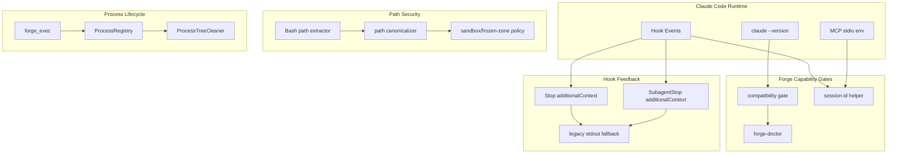

# 设计文档：Claude Code 2.1.163 基础设施加固

## 概述

本设计把 Claude Code v2.1.163 changelog 中与 Forge 基础设施相关的能力转化为六条工程防线：

1. **版本能力门禁**：在 plugin manifest、SessionStart bootstrap、`forge-doctor`、兼容性文档中统一声明和校验 Claude Code 版本能力。
2. **Stop 上下文反馈**：将当前 Stop hook 的 stdout 提醒升级为可选 `hookSpecificOutput.additionalContext` 输出，让 Claude 能继续处理未完成动作。
3. **插件健康诊断**：扩展 `forge-doctor`，让用户可以本地诊断 plugin/hook/bin/MCP/command 的实际启用状态。
4. **Session id 一致性**：建立 session id helper 和测试夹具，统一 hook/Bash/MCP 的 session namespace。
5. **路径等价表达防绕过**：为 sandbox/frozen-zone 引入受控 canonicalization 和 Bash path extraction，覆盖 `$HOME`、`~`、symlink、subshell/backtick 等表达。
6. **后台进程回收**：把 MCP `forge_exec` 命令执行接入现有 process-tree/process-registry 能力，防止后台 shell 导致挂死或遗留进程。

设计原则：

- **能力探测优先于假设**：凡是依赖 Claude Code 平台能力的行为，都必须有版本或 feature gate。
- **Hook 诊断不等于 hook error**：普通流程提醒使用 additional context 或 stdout，exit code 维持 0。
- **安全路径解析 fail closed**：高风险路径无法可靠解析时阻断并给诊断。
- **复用现有基础设施**：进程清理复用 `src/process-tree-cleaner.ts` / `src/process-registry.ts`，不再造清理器。
- **测试先行**：所有新增能力先以 contract/property tests 描述，再实现。

## 当前状态

### 已有能力

- Plugin manifest 存在于 `.claude-plugin/plugin.json`，包含 name/version/workflows/userConfig。
- Hook 配置集中在 `hooks/hooks.json`，已覆盖 SessionStart、UserPromptSubmit、PreToolUse、PostToolUse、Stop、PreCompact/PostCompact 等事件。
- `docs/claude-code-compatibility.md` 已有 Claude Code feature matrix，当前最低版本为 v2.1.153。
- `scripts/bootstrap-check.mjs` 已在 SessionStart 中做初始化提示和 cmux doctor。
- `.claude-plugin/bin/forge-doctor` 已能检查 `.forge/`、config、settings、hook script、MCP source、git branch。
- `src/mcp/server.ts` 已处理 SIGTERM/SIGINT/stdin EOF 并在 5 秒后强制退出。
- `src/mcp/tools/forge-exec.ts` 已有 timeout、deny pattern 和输出 trimming。
- `src/sandbox-policy.ts` / `src/sandbox-phased.ts` 已覆盖基本路径 normalize 和 deny/allow 匹配。
- `src/process-tree-cleaner.ts` 已提供 `getDescendants`、`killProcessTree`、`killProcessGroup`。

### 缺口

- 版本要求停留在文档层，没有 hard gate，也没有 v2.1.163 新能力声明。
- Stop hook 输出仍以 shell inline `echo` 为主，不能通过 structured additional context 指导 Claude 继续 turn。
- `forge-doctor` 没有检查 plugin enabled/commands/bin/MCP smoke/version consistency。
- session id 使用分散：部分脚本仍使用 `CLAUDE_SESSION_ID`，MCP cache/session namespace 缺少统一 helper。
- Bash/path 权限检查对 `$HOME`、`~`、symlink、quoted path、subshell/backtick 缺少统一解析和测试。
- `forge_exec` 通过 `/bin/sh -c` 执行，timeout 不一定回收 shell 创建的后台子进程。

## 架构



## 组件与接口

### 1. Compatibility Gate

新增或扩展模块：`src/compatibility.ts`

```typescript
export interface ClaudeVersionRange {
  minimum: string;
  maximum?: string;
  verifiedLatest: string;
}

export type VersionVerdict = "pass" | "warn" | "fail" | "unknown";

export interface ClaudeVersionCheck {
  currentVersion: string | null;
  minimumVersion: string;
  maximumVersion?: string;
  verifiedLatest: string;
  verdict: VersionVerdict;
  reason: string;
  fixHint?: string;
}

export function parseClaudeVersion(output: string): string | null;
export function compareSemver(a: string, b: string): -1 | 0 | 1;
export function checkClaudeVersion(current: string | null, range: ClaudeVersionRange): ClaudeVersionCheck;
```

使用点：

- `scripts/bootstrap-check.mjs` 调用 node wrapper 做 SessionStart 检查。
- `.claude-plugin/bin/forge-doctor` 输出文本和 JSON 诊断。
- `docs/claude-code-compatibility.md` 由常量或手工文档同步。

设计决策：

- `minimum` 至少为 2.1.163，因为本规格显式依赖 Stop/SubagentStop additionalContext 与 resume session id 修复。
- `maximum` 可先作为 warn 上限，不阻断高版本，避免阻碍用户升级。
- semver 比较必须按 numeric tuple，支持前缀文本中的版本提取。

### 2. Stop Context Hook

新增脚本：`scripts/stop-additional-context.mjs`

```typescript
interface StopContextInput {
  cwd: string;
  session_id?: string;
  hook_event_name: "Stop" | "SubagentStop";
  agent_id?: string;
  agent_type?: string;
}

interface StopContextDecision {
  shouldEmit: boolean;
  reason: "missing_verification" | "incomplete_tasks" | "auto_advance_gap" | "subagent_failure" | "none";
  additionalContext?: string;
}

export function buildStopContext(input: StopContextInput, state: ForgeStateSnapshot): StopContextDecision;
```

输出格式：

```json
{
  "hookSpecificOutput": {
    "additionalContext": "..."
  }
}
```

兼容策略：

- 如果 version gate 显示不支持 additionalContext，脚本输出 legacy stdout 文本或静默，保持 exit 0。
- additionalContext 限制在 4KB 内，超长时保留 phase、task、required command、next action、关键路径。

Hook 配置调整：

- Stop 事件新增或替换 inline shell 提醒为 `args: ["node", "scripts/stop-additional-context.mjs"]`。
- SubagentStop 事件新增同脚本，依靠 stdin `hook_event_name` 和 `agent_id` 区分。

### 3. Plugin Health Doctor

扩展 `.claude-plugin/bin/forge-doctor`，必要时提取为 `scripts/forge-doctor.mjs` 以降低 shell 复杂度。

```typescript
type HealthStatus = "pass" | "warn" | "fail";

interface HealthCheckItem {
  id: string;
  label: string;
  status: HealthStatus;
  message: string;
  fixHint?: string;
}

interface DoctorReport {
  version: ClaudeVersionCheck;
  plugin: HealthCheckItem[];
  hooks: HealthCheckItem[];
  commands: HealthCheckItem[];
  bin: HealthCheckItem[];
  mcp: HealthCheckItem[];
}
```

检查项：

- manifest：`.claude-plugin/plugin.json` 可解析、name 为 forge、version 与 `package.json` 一致。
- commands：`commands/forge.md` 存在且包含 `/forge` 入口。
- hooks：`hooks/hooks.json` 可解析且包含关键事件。
- bin：`.claude-plugin/bin/forge-doctor`、`forge-status`、`forge-restate` 存在且 `--help` 成功。
- MCP：`dist/src/mcp/server.js` 优先，否则 `src/mcp/server.ts` source 存在；在 dist 存在时做 stdio smoke。
- plugin enabled：本地无法完全自动证明时，输出 soft diagnostic，提示用户用 Claude `/plugin list --enabled` 核对。

### 4. Session Id Helper

新增模块：`src/session-id.ts` 与脚本侧轻量 helper。

```typescript
export interface SessionIdSources {
  hookSessionId?: string;
  envClaudeCodeSessionId?: string;
  envLegacyClaudeSessionId?: string;
  processPid: number;
}

export interface ResolvedSessionId {
  value: string;
  source: "hook" | "CLAUDE_CODE_SESSION_ID" | "CLAUDE_SESSION_ID" | "pid-fallback";
  consistent: boolean;
  mismatch?: string[];
}

export function resolveSessionId(sources: SessionIdSources): ResolvedSessionId;
export function sessionScopedKey(prefix: string, session: ResolvedSessionId): string;
```

使用点：

- deprecation notice locks。
- MCP read cache namespace。
- cmux mirror session tracking diagnostics。
- hook stdin router diagnostics。

原则：

- 优先 hook stdin `session_id`，其次 `CLAUDE_CODE_SESSION_ID`，再其次 legacy `CLAUDE_SESSION_ID`。
- 多来源不一致时不静默覆盖，诊断为 warn。
- 缺失时 fallback 到 `pid-${process.pid}`，避免所有进程共享 `unknown`。

### 5. Path Equivalence Guard

新增模块：`src/path-equivalence.ts`

```typescript
export interface PathCanonicalizeOptions {
  cwd: string;
  homeDir: string;
  resolveSymlink?: (path: string) => string | null;
}

export interface CanonicalPathResult {
  raw: string;
  normalized: string;
  realpath?: string;
  highRiskUnresolved: boolean;
}

export function canonicalizePathExpression(raw: string, options: PathCanonicalizeOptions): CanonicalPathResult;
export function extractPathExpressionsFromBash(command: string): string[];
export function pathsEquivalent(a: CanonicalPathResult, b: CanonicalPathResult): boolean;
```

解析范围：

- `~`、`~/x`
- `$HOME/x`、`${HOME}/x`
- quoted string 内路径
- 相对路径和绝对路径
- 简单 subshell/backtick 中的路径字面量，例如 `$(echo ~/.forge/config.md)` 不执行，只提取字面量信号

安全策略：

- 不执行 shell，不展开任意变量。
- 白名单只允许 HOME/PWD 这类可控变量。
- symlink 通过注入 `resolveSymlink`，生产用 `realpathSync.native`，测试用 fake resolver。
- 对包含 `.forge/config.md`、`.forge/specs/`、`.forge/plans/` 等高风险片段但无法解析的表达 fail closed。

接入点：

- `src/sandbox-policy.ts` / `src/sandbox-phased.ts`。
- frozen-zone hook 脚本或 TypeScript hook。
- `src/mcp/tools/forge-exec.ts` deny command matching。

### 6. MCP Executor Process Reaping

扩展 `src/mcp/tools/forge-exec.ts`：

```typescript
export interface ExecTrackedOptions {
  cwd?: string;
  timeoutMs: number;
  reapGraceMs: number;
}

export interface ExecTrackedResult {
  stdout: string;
  stderr: string;
  exitCode: number;
  timedOut: boolean;
  reapedPids: number[];
  reapErrors: string[];
}

export function execCommandTracked(command: string, options: ExecTrackedOptions): Promise<ExecTrackedResult>;
```

执行模型：

1. 使用 `spawn('/bin/sh', ['-c', command], { detached: true })` 创建独立 process group。
2. 记录 root pid/pgid 到 `ProcessRegistry`。
3. 收集 stdout/stderr，保留原有 trimming 策略。
4. 正常 shell exit 后等待短暂 grace period，检查 root process group/descendants 是否仍有后台进程。
5. 对残留后台进程执行 SIGTERM → grace → SIGKILL。
6. timeout 时直接清理整个 process group，并返回 `timedOut: true`。
7. MCP server shutdown 时调用 registry cleanup。

风险控制：

- detached process group 只用于 executor 自己创建的 shell，避免误杀外部进程。
- 非零退出时保留完整 stdout/stderr，reap 摘要追加在末尾或单独字段中，不覆盖错误输出。

## 数据模型

### Version Capability Matrix

```json
{
  "minimum": "2.1.163",
  "verifiedLatest": "2.1.163",
  "features": {
    "managedVersionSettings": "2.1.163",
    "stopAdditionalContext": "2.1.163",
    "resumeSessionIdConsistency": "2.1.163",
    "hookIfBashExpansionFix": "2.1.163"
  }
}
```

### Doctor JSON

```json
{
  "version": {
    "currentVersion": "2.1.163",
    "minimumVersion": "2.1.163",
    "maximumVersion": null,
    "verdict": "pass"
  },
  "plugin": [
    { "id": "manifest", "status": "pass", "message": "plugin.json parsed" }
  ]
}
```

### Hook Additional Context JSON

```json
{
  "hookSpecificOutput": {
    "additionalContext": "Forge phase=build is active. Verification evidence is missing. Run npm run check before claiming completion, then continue to /forge review."
  }
}
```

## 错误处理

| 场景 | 行为 |
|------|------|
| `claude --version` 不存在 | doctor 输出 unknown + fixHint；bootstrap soft diagnostic |
| plugin manifest JSON 损坏 | doctor fail，指出路径和 parse error |
| hooks JSON 损坏 | doctor fail，阻断 health pass，但不修改文件 |
| additionalContext 不支持 | Stop hook 回退 stdout，exit 0 |
| additionalContext 内容过长 | 截断并保留关键路径/命令/phase |
| session id 多来源不一致 | warn，优先 hook source，记录 mismatch |
| Bash path 解析不可靠且命中高风险片段 | fail closed，输出 deny reason |
| MCP executor cleanup 失败 | 返回完整命令输出 + reapErrors，server stderr 记录诊断 |

## 测试策略

### Property Tests

- semver 比较满足传递性、反对称性和 numeric ordering。
- path canonicalization 对等价输入产生相同 canonical result。
- Bash path extractor 对 quoted/variable/subshell/backtick 输入不抛错且不执行 shell。
- session id resolver 在任意缺失/冲突组合下返回非空 scoped key。
- process reaping 对任意子进程树 mock 保持 leaf-to-root 或 process-group cleanup 边界。

### Contract Tests

- `hooks/hooks.json` 包含 Stop/SubagentStop additional context hook。
- Stop hook JSON schema 合法。
- `forge-doctor --json` schema 稳定。
- compatibility docs 包含 v2.1.163 新能力。
- dist sync 检查保持通过。

### Integration Tests

- MCP server stdin EOF 时清理 running command。
- `forge_exec` 执行 `sh -c 'sleep 999 & echo done'` 后不遗留子进程。
- `forge-doctor` 在临时项目中输出 plugin health。
- resume session id fixture 中 hook/Bash/MCP 三者 namespace 一致。

## 非目标

- 不复制 Claude Code 原生 `/plugin list` 实现；Forge 只做自身 plugin health 诊断。
- 不替代 Claude Code 原生权限系统；Forge 只保护自己的 sandbox/frozen-zone 和 MCP executor deny 规则。
- 不改变 Forge 三层路由和 TDD 铁律。
- 不在本规格中实现 UI 或桌面端功能。
- 不为 Windows OneDrive 等 Claude 客户端问题做 Forge 专项兼容，除非现有 Forge 测试暴露问题。

