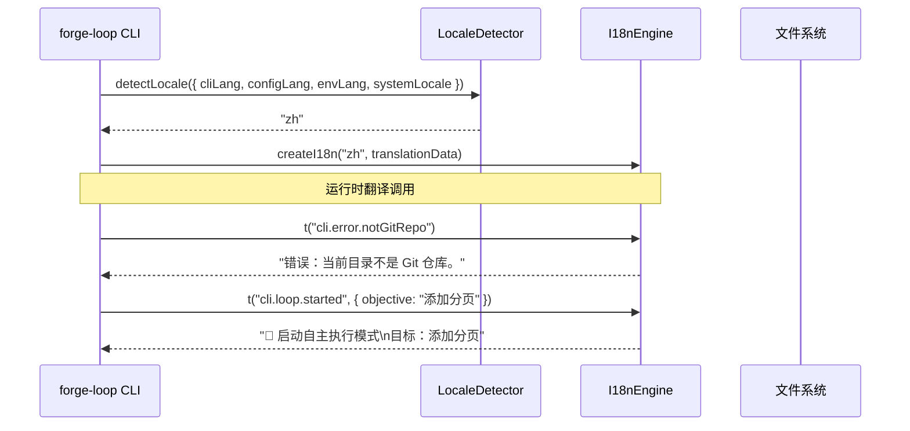
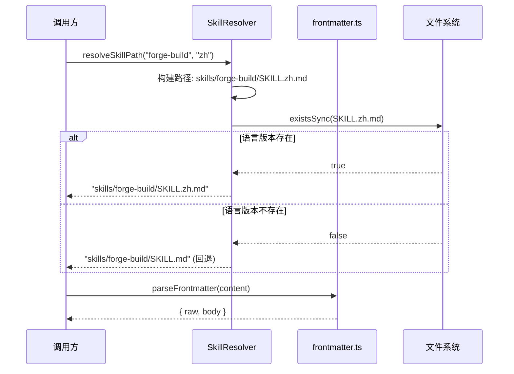
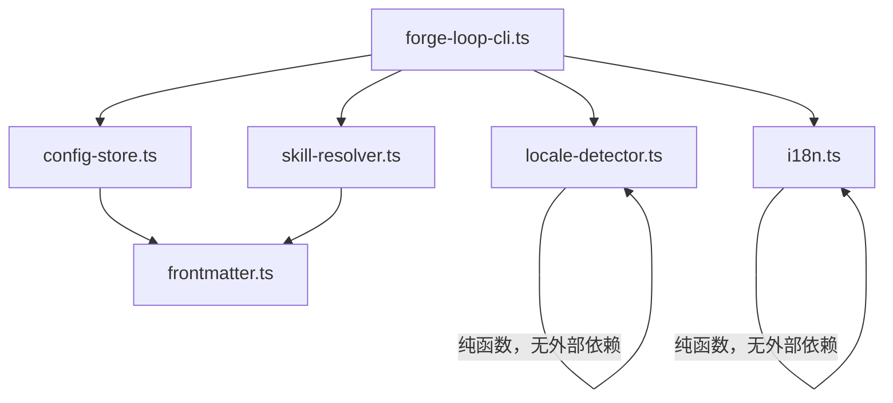

# 设计文档：国际化（i18n）支持

## Overview

本设计为 Forge 项目实现轻量级国际化框架，支持中文（zh）和英文（en）的运行时语言切换。框架遵循项目现有的纯函数设计模式，不引入外部 i18n 依赖，通过 JSON 翻译文件、语言环境检测、字符串插值和 SKILL 文档多语言解析四个核心模块协同工作。

### 设计目标

1. **纯函数核心**：所有翻译查找、语言检测、字符串插值逻辑均为纯函数，无副作用，便于属性测试
2. **零新依赖**：使用自定义轻量实现，不引入 i18next 等外部库
3. **向后兼容**：未配置语言时默认英文，现有 CLI 行为不变
4. **渐进式迁移**：先建立框架，再逐步替换硬编码字符串

### 核心原则

**翻译是数据，不是逻辑。** 翻译文件是纯数据（JSON），翻译查找是纯函数（输入 → 输出），语言检测是纯函数（多源输入 → 单一 locale）。所有 I/O（文件读取、环境变量访问）集中在薄薄的适配层，核心逻辑完全可测试。

## Architecture

### 高层架构

```
┌─────────────────────────────────────────────────────────┐
│                    用户入口                               │
│  forge-loop CLI (--lang 选项)  │  .forge/config.md (持久化)│
├─────────────────────────────────────────────────────────┤
│                   适配层（I/O 边界）                      │
│  loadTranslationFile()  │  readConfigLang()  │  系统 env  │
├─────────────────────────────────────────────────────────┤
│                   纯函数核心层                            │
│  I18nEngine  │  LocaleDetector  │  Interpolator          │
│  (翻译查找)   │  (优先级解析)     │  (字符串插值)          │
├─────────────────────────────────────────────────────────┤
│                   数据层                                  │
│  locales/zh.json  │  locales/en.json  │  SKILL.{locale}.md│
└─────────────────────────────────────────────────────────┘
```

### 模块交互流程



### SKILL 文档解析流程



## Components and Interfaces

### 1. I18nEngine 模块 (`src/i18n.ts`)

**职责**：翻译查找、字符串插值、回退链处理。所有函数均为纯函数。

```typescript
// ---------------------------------------------------------------------------
// 类型定义
// ---------------------------------------------------------------------------

/** 翻译数据：嵌套的字符串键值映射 */
type TranslationData = { [key: string]: string | TranslationData };

/** 已加载的多语言翻译集合 */
interface TranslationStore {
  [locale: string]: TranslationData;
}

/** 翻译函数的配置 */
interface I18nConfig {
  /** 当前语言 */
  locale: string;
  /** 默认回退语言 */
  defaultLocale: string;
  /** 翻译数据 */
  translations: TranslationStore;
}

// ---------------------------------------------------------------------------
// 公开 API（纯函数）
// ---------------------------------------------------------------------------

/**
 * 通过点分隔路径在嵌套对象中查找值。
 *
 * @param data - 嵌套的翻译数据对象
 * @param keyPath - 点分隔的键路径，如 "cli.error.notGitRepo"
 * @returns 找到的字符串值，或 null（路径无效时）
 */
function lookupKey(data: TranslationData, keyPath: string): string | null;

/**
 * 字符串插值：将 {paramName} 占位符替换为 params 中对应的值。
 * 缺少的参数保留原始占位符文本。
 *
 * @param template - 包含 {placeholder} 的模板字符串
 * @param params - 键值对参数
 * @returns 替换后的字符串
 */
function interpolate(template: string, params: Record<string, string>): string;

/**
 * 核心翻译函数。按回退链查找翻译：
 * 1. 当前 locale 的翻译
 * 2. 默认 locale (en) 的翻译
 * 3. 返回 key 本身
 *
 * 如果找到的翻译包含占位符且提供了 params，执行插值。
 *
 * @param config - I18n 配置（locale、defaultLocale、translations）
 * @param key - 点分隔的语言键
 * @param params - 可选的插值参数
 * @returns 翻译后的字符串
 */
function translate(config: I18nConfig, key: string, params?: Record<string, string>): string;

/**
 * 验证翻译数据结构：所有叶节点必须是字符串。
 *
 * @param data - 待验证的翻译数据
 * @returns 验证结果，包含错误路径列表
 */
function validateTranslationData(data: unknown): { valid: boolean; errors: string[] };

/**
 * 解析 JSON 字符串为翻译数据，验证格式。
 *
 * @param jsonString - JSON 格式的翻译文件内容
 * @param filePath - 文件路径（用于错误信息）
 * @returns 解析后的翻译数据
 * @throws 包含文件路径和错误原因的描述性错误
 */
function parseTranslationFile(jsonString: string, filePath: string): TranslationData;
```

**设计决策**：
- `translate()` 接受完整的 `I18nConfig` 而非依赖模块级状态，保证纯函数特性
- `lookupKey()` 独立导出，便于单独测试点分隔路径解析
- `interpolate()` 独立导出，便于单独测试字符串插值
- 回退链在 `translate()` 内部实现，顺序固定：当前 locale → 默认 locale → key 本身

### 2. LocaleDetector 模块 (`src/locale-detector.ts`)

**职责**：从多个来源检测当前语言，按优先级解析。纯函数实现。

```typescript
// ---------------------------------------------------------------------------
// 类型定义
// ---------------------------------------------------------------------------

/** 语言检测的输入来源 */
interface LocaleSources {
  /** CLI --lang 参数值 */
  cliLang?: string;
  /** .forge/config.md 中的 lang 字段 */
  configLang?: string;
  /** FORGE_LANG 环境变量 */
  envLang?: string;
  /** 系统 locale（LANG / LC_ALL 环境变量） */
  systemLocale?: string;
}

/** 语言检测结果 */
interface LocaleResult {
  /** 最终确定的语言代码 */
  locale: string;
  /** 语言来源说明 */
  source: "cli" | "config" | "env" | "system" | "default";
  /** 是否产生了警告（如不支持的语言回退） */
  warning?: string;
}

/** 已支持的语言列表 */
type SupportedLocales = ReadonlySet<string>;

// ---------------------------------------------------------------------------
// 公开 API（纯函数）
// ---------------------------------------------------------------------------

/**
 * 将带区域标识的 locale 规范化为基础语言代码。
 * 例如：zh_CN.UTF-8 → zh, en_US → en, ja → ja
 *
 * @param rawLocale - 原始 locale 字符串
 * @returns 基础语言代码
 */
function normalizeLocale(rawLocale: string): string;

/**
 * 按优先级链检测当前语言。
 * 优先级（从高到低）：CLI --lang > config lang > FORGE_LANG > 系统 locale > 默认 en
 *
 * @param sources - 各来源的 locale 值
 * @param supported - 已支持的语言集合
 * @param defaultLocale - 默认语言（通常为 "en"）
 * @returns 检测结果，包含最终 locale 和来源
 */
function detectLocale(
  sources: LocaleSources,
  supported: SupportedLocales,
  defaultLocale?: string,
): LocaleResult;
```

**设计决策**：
- `normalizeLocale()` 独立导出，处理 `zh_CN.UTF-8` → `zh` 的转换
- `detectLocale()` 接受所有来源作为参数，不直接访问 `process.env`，保证纯函数
- 环境变量读取在调用方（CLI 入口）完成，传入 `LocaleSources`
- 不支持的语言回退到默认值并在 `LocaleResult.warning` 中记录

### 3. SkillResolver 模块 (`src/skill-resolver.ts`)

**职责**：根据当前语言解析 SKILL.md 文件路径，支持回退。

```typescript
// ---------------------------------------------------------------------------
// 类型定义
// ---------------------------------------------------------------------------

/** SKILL 文件解析结果 */
interface SkillResolution {
  /** 解析后的文件路径 */
  filePath: string;
  /** 是否使用了回退（locale 版本不存在） */
  isFallback: boolean;
  /** 使用的语言 */
  resolvedLocale: string;
}

// ---------------------------------------------------------------------------
// 公开 API
// ---------------------------------------------------------------------------

/**
 * 构建 SKILL 文件的候选路径列表。
 * 纯函数：给定技能名和 locale，返回按优先级排列的候选路径。
 *
 * @param skillName - 技能目录名（如 "forge-build"）
 * @param locale - 当前语言代码
 * @param defaultLocale - 默认语言代码
 * @returns 候选路径列表，按优先级排列
 */
function buildSkillCandidates(
  skillName: string,
  locale: string,
  defaultLocale: string,
): string[];

/**
 * 从候选路径列表中选择第一个存在的文件。
 * 纯函数：接受候选路径和存在性检查函数。
 *
 * @param candidates - 候选路径列表
 * @param existsCheck - 文件存在性检查函数（注入依赖）
 * @returns 解析结果
 */
function resolveSkillFile(
  candidates: string[],
  existsCheck: (path: string) => boolean,
): SkillResolution;

/**
 * 验证 SKILL 文件的 frontmatter name 字段与目录名一致。
 *
 * @param frontmatterName - frontmatter 中的 name 字段值
 * @param directoryName - 技能目录名
 * @returns 是否一致
 */
function validateSkillName(frontmatterName: string, directoryName: string): boolean;
```

**设计决策**：
- 文件命名约定：`SKILL.md`（默认语言）、`SKILL.{locale}.md`（其他语言）
- `resolveSkillFile()` 通过注入 `existsCheck` 函数解耦文件系统，保持纯函数
- `buildSkillCandidates()` 返回候选路径列表，调用方负责实际的文件存在性检查
- 当 locale 等于 defaultLocale 时，候选列表只包含 `SKILL.md`

### 4. ConfigStore 模块 (`src/config-store.ts`)

**职责**：读写 `.forge/config.md` 中的语言偏好。复用 `frontmatter.ts` 的解析能力。

```typescript
// ---------------------------------------------------------------------------
// 类型定义
// ---------------------------------------------------------------------------

/** 配置文件内容 */
interface ConfigContent {
  /** 原始文件内容 */
  raw: string;
  /** 解析出的 lang 字段 */
  lang: string | null;
}

// ---------------------------------------------------------------------------
// 公开 API（纯函数）
// ---------------------------------------------------------------------------

/**
 * 从 config.md 内容中提取 lang 字段。
 * 复用 frontmatter.ts 的 parseFrontmatter + extractStringField。
 *
 * @param content - config.md 文件内容
 * @returns lang 字段值，或 null
 */
function extractConfigLang(content: string): string | null;

/**
 * 将 lang 字段写入 config.md 内容，保留其他字段不变。
 * 如果 lang 字段已存在则更新，不存在则添加。
 *
 * @param content - 现有 config.md 内容（可为空字符串）
 * @param lang - 要写入的语言代码
 * @returns 更新后的 config.md 内容
 */
function writeConfigLang(content: string, lang: string): string;

/**
 * 生成默认的 config.md 内容。
 *
 * @param lang - 语言代码
 * @returns 包含 frontmatter 的默认配置内容
 */
function buildDefaultConfig(lang: string): string;
```

**设计决策**：
- 复用 `src/frontmatter.ts` 的 `parseFrontmatter()`、`extractStringField()` 进行解析
- `writeConfigLang()` 是纯函数：接受旧内容，返回新内容，不执行文件 I/O
- 文件读写由调用方（CLI 入口或适配层）负责
- 空内容输入时，`writeConfigLang()` 创建完整的 frontmatter 结构

### 5. CLI 集成 (`src/forge-loop-cli.ts` 修改)

**职责**：在现有 CLI 中添加 `--lang` 选项，集成 i18n 模块。

```typescript
// 新增 CLI 选项
program.option("--lang <locale>", "Set display language (zh|en)");

// 新增验证逻辑
const SUPPORTED_LOCALES: ReadonlySet<string> = new Set(["zh", "en"]);

// 在 action 回调中：
// 1. 验证 --lang 值
// 2. 调用 detectLocale() 确定语言
// 3. 加载翻译文件
// 4. 创建 I18nConfig
// 5. 将 t() 函数传递给需要输出用户可见字符串的模块
```

**设计决策**：
- `--lang` 为可选参数，不影响现有选项
- 无效 `--lang` 值时抛出 `CliError`，输出有效语言列表
- 翻译文件在 CLI 启动时一次性加载，通过 `I18nConfig` 传递给下游模块
- 不修改现有函数签名——通过在调用点使用 `t()` 替换硬编码字符串

### 模块依赖关系



## Data Models

### 翻译文件格式 (`locales/{locale}.json`)

```json
{
  "cli": {
    "error": {
      "notGitRepo": "Error: Current directory is not a Git repository.",
      "dirtyWorkTree": "Error: Working tree is not clean. Commit or stash changes before running, or use --worktree.",
      "invalidTier": "Error: Invalid --tier value \"{tier}\". Valid options: {validOptions}",
      "invalidLang": "Error: Invalid --lang value \"{lang}\". Valid options: {validOptions}",
      "noForgeDir": "Error: --tier, --type, --phase, and --nature require a .forge/ directory. Run `forge init` first.",
      "invalidWorktreeSource": "Error: Cannot create a worktree from a forge/ branch. Switch to main or another non-forge branch first.",
      "branchNotFound": "Error: Branch \"{branch}\" does not exist. Cannot resume."
    },
    "warning": {
      "activeTask": "Warning: StatusFile has an active task in phase \"{phase}\". Starting a new loop may overwrite in-progress state.",
      "hooksProtection": "hooks protection missing: hooks/hooks.json not found",
      "unsupportedLocale": "Warning: Unsupported locale \"{locale}\", falling back to \"{fallback}\"."
    },
    "loop": {
      "started": "Resuming run {runId} on branch {branch} from iteration {iteration}"
    }
  }
}
```

**格式约束**：
- 所有叶节点必须是字符串
- 占位符使用 `{paramName}` 语法
- 键路径使用点分隔（如 `cli.error.notGitRepo`）
- 文件编码为 UTF-8

### 配置文件格式 (`.forge/config.md`)

```yaml
---
lang: "zh"
restatement_interval: 3
---

# Forge 配置

项目级别的 Forge 配置。
```

### SKILL 文件命名约定

| 文件 | 说明 |
|------|------|
| `skills/forge-build/SKILL.md` | 默认语言版本（中文，当前项目默认） |
| `skills/forge-build/SKILL.en.md` | 英文版本 |
| `skills/forge-build/SKILL.zh.md` | 中文版本（可选，当默认不是中文时使用） |

### LocaleSources 数据流

```
CLI --lang "zh"          ──┐
                           │
.forge/config.md lang: zh ─┤
                           ├──→ detectLocale() ──→ LocaleResult { locale: "zh", source: "cli" }
FORGE_LANG=zh             ─┤
                           │
LANG=zh_CN.UTF-8          ─┘
```

优先级从高到低：`cliLang` > `configLang` > `envLang` > `systemLocale` > `"en"`

## Correctness Properties

*A property is a characteristic or behavior that should hold true across all valid executions of a system — essentially, a formal statement about what the system should do. Properties serve as the bridge between human-readable specifications and machine-verifiable correctness guarantees.*

### Property 1: 翻译数据 JSON 往返一致性

*For any* valid translation data object (nested object with string leaf values), serializing it to JSON and parsing it back shall produce a deeply equal object.

**Validates: Requirements 1.5**

### Property 2: 点分隔路径查找正确性

*For any* valid nested translation data object and any dot-separated key path that corresponds to a string leaf value in that object, `lookupKey()` shall return that exact string value. For any key path that does not correspond to a string leaf, `lookupKey()` shall return null.

**Validates: Requirements 1.2, 4.1**

### Property 3: 翻译回退链完整性

*For any* I18nConfig, key string, current locale, and default locale: if the key exists in the current locale's translations, `translate()` shall return that value; else if the key exists in the default locale's translations, `translate()` shall return the default locale's value; else `translate()` shall return the key itself.

**Validates: Requirements 4.3, 4.4**

### Property 4: 字符串插值完备性

*For any* template string containing `{placeholder}` patterns and any params object, `interpolate()` shall replace every placeholder whose key exists in params with the corresponding value, and shall preserve every placeholder whose key does not exist in params unchanged.

**Validates: Requirements 4.2, 4.5**

### Property 5: 语言优先级解析正确性

*For any* combination of present/absent locale sources (cliLang, configLang, envLang, systemLocale) where at least one source contains a supported locale, `detectLocale()` shall return the value from the highest-priority source that is both present and supported. When no source contains a supported locale, it shall return the default locale.

**Validates: Requirements 2.1, 2.2**

### Property 6: Locale 规范化幂等性

*For any* raw locale string, `normalizeLocale()` shall extract the base language code (stripping region, encoding, and variant suffixes). Applying `normalizeLocale()` twice shall produce the same result as applying it once (idempotent).

**Validates: Requirements 2.4**

### Property 7: 不支持的语言回退

*For any* locale string that is not in the supported locales set, `detectLocale()` shall return the default locale ("en") and include a warning in the result.

**Validates: Requirements 2.3**

### Property 8: SKILL 文件解析与回退

*For any* skill name and locale, `buildSkillCandidates()` shall return a candidate list where the locale-specific path (`SKILL.{locale}.md`) appears before the default path (`SKILL.md`). `resolveSkillFile()` shall return the first candidate that exists; if none exist, it shall fall back to the default `SKILL.md` path.

**Validates: Requirements 5.1, 5.2**

### Property 9: Config lang 字段往返与字段保留

*For any* valid config.md content containing arbitrary frontmatter fields and any valid locale string, writing the lang field via `writeConfigLang()` then extracting via `extractConfigLang()` shall return the written locale. All other frontmatter fields present in the original content shall be preserved unchanged.

**Validates: Requirements 6.1, 6.4**

## Error Handling

### 错误分类

| 错误类型 | 触发条件 | 处理策略 |
|---------|---------|---------|
| `CliError` (无效 --lang) | `--lang` 值不在支持列表中 | 输出有效语言列表，退出码 1 |
| 翻译文件不存在 | `locales/{locale}.json` 文件缺失 | 抛出包含文件路径的描述性错误 |
| 翻译文件格式无效 | JSON 解析失败或结构不符合要求 | 抛出包含文件路径和解析错误的描述性错误 |
| 不支持的语言 | 检测到的 locale 不在支持列表中 | 输出警告，回退到默认语言 en |
| Config 文件不存在 | `.forge/config.md` 缺失 | 创建默认配置文件 |
| Config 文件无 lang 字段 | frontmatter 中无 lang | 正常工作，回退到下一优先级来源 |
| SKILL 文件缺失 | locale 版本和默认版本均不存在 | 返回默认 SKILL.md 路径（由调用方处理文件不存在） |

### 错误信息国际化

错误信息本身也通过 i18n 系统翻译。但在 i18n 系统初始化失败时（如翻译文件加载失败），使用硬编码的英文错误信息作为最终回退：

```typescript
// 翻译系统初始化失败时的回退
const BOOTSTRAP_ERRORS = {
  fileNotFound: (path: string) => `i18n: Translation file not found: ${path}`,
  invalidJson: (path: string, err: string) => `i18n: Invalid JSON in ${path}: ${err}`,
} as const;
```

### 边界情况

| 场景 | 处理方式 |
|------|---------|
| 空字符串作为 key | `translate()` 返回空字符串 |
| key 路径中包含连续点号（如 `a..b`） | `lookupKey()` 返回 null（空段无法匹配） |
| 翻译值为空字符串 | 正常返回空字符串（空字符串是有效翻译） |
| params 为空对象 | `interpolate()` 返回原始模板（无占位符被替换） |
| 模板无占位符 | `interpolate()` 返回原始字符串 |
| locale 为空字符串 | `normalizeLocale()` 返回空字符串，`detectLocale()` 跳过该来源 |
| config.md 无 frontmatter | `extractConfigLang()` 返回 null |
| config.md 内容为空 | `writeConfigLang()` 创建完整的 frontmatter 结构 |

## Testing Strategy

### 测试框架

- **单元测试**：Vitest
- **属性测试**：fast-check（项目已有依赖，版本 4.7.0）
- **测试文件命名**：`test/<module>.property.test.ts`（属性测试）、`test/<module>.test.ts`（单元测试）

### 属性测试（Property-Based Testing）

本特性的核心模块均为纯函数，非常适合属性测试。每个 Correctness Property 对应一个属性测试，使用 fast-check 生成随机输入。

**配置要求**：
- 每个属性测试最少 100 次迭代（推荐 200 次）
- 每个测试必须引用设计文档中的 Property 编号
- 标签格式：`Feature: i18n-support, Property {number}: {property_text}`

**属性测试覆盖的模块**：

| 模块 | 属性测试 | 对应 Property |
|------|---------|-------------|
| `i18n.ts` | 翻译数据 JSON 往返 | Property 1 |
| `i18n.ts` | 点分隔路径查找 | Property 2 |
| `i18n.ts` | 翻译回退链 | Property 3 |
| `i18n.ts` | 字符串插值完备性 | Property 4 |
| `locale-detector.ts` | 语言优先级解析 | Property 5 |
| `locale-detector.ts` | Locale 规范化幂等性 | Property 6 |
| `locale-detector.ts` | 不支持的语言回退 | Property 7 |
| `skill-resolver.ts` | SKILL 文件解析与回退 | Property 8 |
| `config-store.ts` | Config lang 往返与字段保留 | Property 9 |

### 单元测试（Example-Based）

单元测试覆盖属性测试不适合的场景：

| 模块 | 测试场景 | 对应需求 |
|------|---------|---------|
| `i18n.ts` | 翻译文件不存在时抛出描述性错误 | 1.3 |
| `i18n.ts` | 翻译文件 JSON 格式无效时抛出错误 | 1.3 |
| `i18n.ts` | 缓存机制：首次加载后后续调用使用缓存 | 1.4 |
| `forge-loop-cli.ts` | `--lang` 选项被 Commander 正确解析 | 3.1 |
| `forge-loop-cli.ts` | 无效 `--lang` 值输出有效语言列表并拒绝启动 | 3.2 |
| `forge-loop-cli.ts` | 未指定 `--lang` 时委托 LocaleDetector | 3.3 |
| `skill-resolver.ts` | frontmatter name 字段与目录名一致性验证 | 5.4 |
| `skill-resolver.ts` | frontmatter 格式在解析后保持不变 | 5.3 |
| `config-store.ts` | config.md 不存在时创建默认配置 | 6.3 |
| `config-store.ts` | CLI 设置语言偏好写入 config.md | 6.2 |
| `forge-loop-cli.ts` | 未配置语言时默认英文输出 | 9.1 |
| `forge-loop-cli.ts` | 现有 CLI 选项行为不变 | 9.4 |

### 冒烟测试

| 测试场景 | 对应需求 |
|---------|---------|
| 所有用户可见字符串在 zh.json 和 en.json 中均有对应键 | 7.1, 7.2 |
| 内部日志/调试字符串不在翻译文件中 | 7.3 |
| package.json 无新增 dependencies | 9.2 |

### 测试生成器（Generators）

属性测试需要以下自定义 fast-check 生成器：

```typescript
// 翻译数据生成器：生成嵌套的字符串键值对象
const translationDataArb: fc.Arbitrary<TranslationData>;

// 有效的点分隔键路径生成器
const dotKeyPathArb: fc.Arbitrary<string>;

// 模板字符串生成器：包含 {placeholder} 模式
const templateStringArb: fc.Arbitrary<string>;

// 插值参数生成器
const paramsArb: fc.Arbitrary<Record<string, string>>;

// LocaleSources 生成器：随机组合各来源
const localeSourcesArb: fc.Arbitrary<LocaleSources>;

// 原始 locale 字符串生成器：包含区域、编码等变体
const rawLocaleArb: fc.Arbitrary<string>;

// Config frontmatter 内容生成器
const configContentArb: fc.Arbitrary<string>;

// SKILL 候选路径生成器
const skillCandidatesArb: fc.Arbitrary<string[]>;
```

### 已有测试的复用

以下现有测试文件与 i18n 模块有交互，需确保兼容：

- `test/frontmatter.property.test.ts` — frontmatter 解析的属性测试（config-store 复用 frontmatter.ts）
- `test/forge-loop-cli.test.ts` — CLI 选项解析测试（需扩展 --lang 测试）

新增测试应遵循现有测试的风格和命名约定（参见 `test/frontmatter.property.test.ts` 的生成器和断言模式）。
