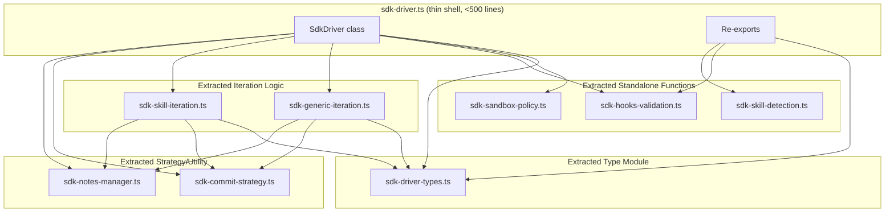

# Design Document: SDK Driver Decomposition

## Overview

This design describes the decomposition of `src/sdk-driver.ts` (1438 lines) into 8 focused modules while maintaining `sdk-driver.ts` as a thin orchestrating shell under 500 lines. The refactoring follows the same extraction pattern already established by `src/sdk-status-helpers.ts` and `src/sdk-quality-helpers.ts`: dependency injection via interfaces, pure functions where possible, and re-exports for backward compatibility.

The key architectural challenge is that the two iteration methods (`executeGenericIteration` and `executeSkillAwareIteration`) access private class state. The solution is an **IterationContext** interface that bundles all shared dependencies, and a **StateMutation** return type that describes how the caller should update its private fields.

## Architecture



### Dependency Flow

The extracted modules form a DAG with no circular dependencies:

1. **sdk-driver-types.ts** — leaf node, no internal imports
2. **sdk-sandbox-policy.ts** — imports only from `sandbox-policy.ts`
3. **sdk-hooks-validation.ts** — imports only from `node:fs`, `node:path`
4. **sdk-skill-detection.ts** — imports only from `node:fs`, `node:path`
5. **sdk-commit-strategy.ts** — imports from `skill-scheduler.ts`, `loop-types.ts`
6. **sdk-notes-manager.ts** — imports from `loop-types.ts`, `context-accumulator.ts`, `run-manager.ts`, `logger/index.ts`
7. **sdk-generic-iteration.ts** — imports from types, commit-strategy, notes-manager, and existing pure modules
8. **sdk-skill-iteration.ts** — imports from types, commit-strategy, notes-manager, and existing pure modules

## Components and Interfaces

### IterationContext Interface

The central design decision is how extracted iteration functions access the state they need. Rather than passing 10+ individual parameters, we bundle them into an `IterationContext` interface:

```typescript
/**
 * Bundles all dependencies needed by extracted iteration functions.
 * Constructed by SdkDriver before each iteration call.
 */
export interface IterationContext {
  // --- Configuration (read-only) ---
  readonly config: SdkDriverConfig;
  readonly limits: RunLimits;

  // --- Current state (read-only snapshot) ---
  readonly orchestratorState: OrchestratorState;
  readonly notesContent: string;
  readonly notesDocument: NotesDocument;

  // --- Injected collaborators ---
  readonly agentAdapter: AgentInterface;
  readonly effectExecutor: EffectExecutorInterface;
  readonly logger: LogSink;
  readonly perfTracker: PerformanceTracker;

  // --- Callbacks for I/O ---
  readonly executeEffects: (effects: OrchestratorEffect[]) => Promise<void>;
  readonly t: (key: string, params?: Record<string, string>) => string;
}
```

For skill-aware iteration, an extended interface adds the additional dependencies:

```typescript
/**
 * Extended context for skill-aware iteration.
 */
export interface SkillIterationContext extends IterationContext {
  readonly statusFileIO: StatusFileIO | undefined;
  readonly puaStateManager: PuaStateManager | null;
  readonly puaEnabled: boolean;
  readonly reviewFixAttempts: number;
}
```

### StateMutation Return Type

Extracted iteration functions cannot directly mutate `SdkDriver`'s private fields. Instead, they return a `StateMutation` object describing what changed:

```typescript
/**
 * Describes state changes that the caller (SdkDriver) should apply
 * after an extracted iteration function completes.
 */
export interface IterationResult {
  /** Updated orchestrator state after all transitions. */
  orchestratorState: OrchestratorState;
  /** Updated notes document with the new entry appended. */
  notesDocument: NotesDocument;
  /** Updated notes content string. */
  notesContent: string;
  /** The last set of effects produced (for loop control). */
  lastEffects: OrchestratorEffect[];
  /** Updated review-fix attempt counter (skill-aware only). */
  reviewFixAttempts?: number;
  /** Whether the loop completed normally (skill-aware only). */
  loopCompletedNormally?: boolean;
}
```

### Module Signatures

#### sdk-driver-types.ts

```typescript
export interface SdkDriverConfig { /* ... existing fields ... */ }
export interface SdkDriverResult { /* ... existing fields ... */ }
export interface IterationContext { /* ... as above ... */ }
export interface SkillIterationContext extends IterationContext { /* ... */ }
export interface IterationResult { /* ... as above ... */ }
```

#### sdk-sandbox-policy.ts

```typescript
import type { PermissionPolicy } from "./sandbox-policy.js";

export function loadSandboxPolicy(cwd: string): PermissionPolicy;
```

#### sdk-hooks-validation.ts

```typescript
export function validateHooksPresence(cwd: string): { valid: boolean; reason?: string };
```

#### sdk-skill-detection.ts

```typescript
export function detectSkillAwareMode(cwd: string): boolean;
```

#### sdk-generic-iteration.ts

```typescript
import type { IterationContext, IterationResult } from "./sdk-driver-types.js";

export async function executeGenericIteration(ctx: IterationContext): Promise<IterationResult>;
```

#### sdk-skill-iteration.ts

```typescript
import type { SkillIterationContext, IterationResult } from "./sdk-driver-types.js";

export async function executeSkillAwareIteration(ctx: SkillIterationContext): Promise<IterationResult>;
```

#### sdk-commit-strategy.ts

```typescript
import type { OrchestratorEffect, OrchestratorState } from "./loop-types.js";

export function buildCommitMessageForPhase(
  phase: string,
  iterationNumber: number,
  summary: string,
  objective: string,
): string;

export interface CommitStrategyResult {
  effects: OrchestratorEffect[];
  stateAdjustment?: { commitCount: number };
}

export function applySkillAwareCommitStrategy(
  effects: OrchestratorEffect[],
  phase: string,
  success: boolean,
  iterationNumber: number,
  summary: string,
  objective: string,
  currentCommitCount: number,
): CommitStrategyResult;
```

#### sdk-notes-manager.ts

```typescript
import type { AgentOutput, IterationEntry, NotesDocument, TokenUsage } from "./loop-types.js";
import type { LogSink } from "./logger/index.js";

export function buildIterationEntry(
  number: number,
  success: boolean,
  output: AgentOutput,
): IterationEntry;

export function appendAndPersistNotes(
  notesDocument: NotesDocument,
  notesContent: string,
  entry: IterationEntry,
  notesPath: string,
  usage?: TokenUsage,
  logger?: LogSink,
  orchestratorState?: OrchestratorState,
  t?: (key: string, params?: Record<string, string>) => string,
  runId?: string,
): { notesDocument: NotesDocument; notesContent: string };

export function logTokenUsage(
  usage: TokenUsage,
  orchestratorState: OrchestratorState,
  logger: LogSink,
  runId: string,
  t: (key: string, params?: Record<string, string>) => string,
): void;
```

### Re-export Strategy in sdk-driver.ts

The barrel file maintains backward compatibility with explicit re-exports:

```typescript
// Re-exports for backward compatibility
export { type SdkDriverConfig, type SdkDriverResult } from "./sdk-driver-types.js";
export { validateHooksPresence } from "./sdk-hooks-validation.js";
export { detectSkillAwareMode } from "./sdk-skill-detection.js";
```

The `SdkDriver` class itself remains in `sdk-driver.ts` as the thin orchestrating shell. It constructs `IterationContext` objects and delegates to the extracted functions, then applies the returned `IterationResult` to its private state.

### SdkDriver Delegation Pattern

```typescript
// Inside SdkDriver.executeIteration():
private async executeIteration(): Promise<void> {
  if (this.config.skillAware) {
    const ctx = this.buildSkillIterationContext();
    const result = await executeSkillAwareIteration(ctx);
    this.applyIterationResult(result);
  } else {
    const ctx = this.buildIterationContext();
    const result = await executeGenericIteration(ctx);
    this.applyIterationResult(result);
  }
}

private applyIterationResult(result: IterationResult): void {
  this.orchestratorState = result.orchestratorState;
  this.notesDocument = result.notesDocument;
  this.notesContent = result.notesContent;
  this.lastEffects = result.lastEffects;
  if (result.reviewFixAttempts !== undefined) {
    this.reviewFixAttempts = result.reviewFixAttempts;
  }
  if (result.loopCompletedNormally !== undefined) {
    this.loopCompletedNormally = result.loopCompletedNormally;
  }
}
```

## Data Models

### Existing Types (unchanged)

- `OrchestratorState` — from `loop-types.ts`
- `OrchestratorEffect` — from `loop-types.ts`
- `OrchestratorEvent` — from `loop-types.ts`
- `AgentOutput` — from `loop-types.ts`
- `IterationEntry` — from `loop-types.ts`
- `NotesDocument` — from `loop-types.ts`
- `TokenUsage` — from `loop-types.ts`
- `PermissionPolicy` — from `sandbox-policy.ts`
- `StatusFileIO` — from `sdk-status-helpers.ts`

### New Types (introduced by this decomposition)

- `IterationContext` — dependency bundle for generic iteration
- `SkillIterationContext` — extended dependency bundle for skill-aware iteration
- `IterationResult` — return type describing state mutations
- `CommitStrategyResult` — return type for commit strategy function

### Type Migration

`SdkDriverConfig` and `SdkDriverResult` move from `sdk-driver.ts` to `sdk-driver-types.ts`. The barrel file re-exports them, so all existing import paths continue to work.

## Correctness Properties

*A property is a characteristic or behavior that should hold true across all valid executions of a system — essentially, a formal statement about what the system should do. Properties serve as the bridge between human-readable specifications and machine-verifiable correctness guarantees.*

### Property 1: Generic iteration state equivalence

*For any* valid `IterationContext` and any agent result (success, soft failure, hard failure, or stop condition), the extracted `executeGenericIteration` function SHALL produce an `IterationResult` whose `orchestratorState` is identical to what the original inline `SdkDriver.executeGenericIteration` method would produce given the same inputs.

**Validates: Requirements 3.2, 3.4**

### Property 2: Skill-aware iteration state equivalence

*For any* valid `SkillIterationContext` and any agent result (success with gate passed, success with gate blocked, soft failure, hard failure, or stop condition), the extracted `executeSkillAwareIteration` function SHALL produce an `IterationResult` whose `orchestratorState`, `reviewFixAttempts`, and `loopCompletedNormally` are identical to what the original inline method would produce given the same inputs.

**Validates: Requirements 4.2, 4.4**

### Property 3: Commit effect filtering for non-commitable phases

*For any* effects array containing at least one commit effect, and *for any* non-commitable phase (e.g., "review", "test", "route") with `success=true`, the `applySkillAwareCommitStrategy` function SHALL return an effects array that contains zero commit effects and a `stateAdjustment` that decrements `commitCount` by the number of removed commit effects.

**Validates: Requirements 5.4**

### Property 4: Commit message format correctness

*For any* commitable phase, iteration number, and summary string, the `buildCommitMessageForPhase` function SHALL return a string matching the pattern `forge(<phase>): <content>` where `<phase>` is the phase identifier and `<content>` is derived from the summary or a phase-specific template.

**Validates: Requirements 5.5**

### Property 5: buildIterationEntry field mapping

*For any* iteration number `n`, success flag `s`, and valid `AgentOutput` object `o`, the `buildIterationEntry(n, s, o)` function SHALL return an `IterationEntry` where: `number === n`, `success === s`, `summary === o.summary`, `keyChanges === (s ? o.key_changes_made : [])`, and `keyLearnings === o.key_learnings`.

**Validates: Requirements 6.4**

## Error Handling

### Extraction Preserves Existing Error Handling

Each extracted module preserves the exact error handling semantics of the original code:

1. **sdk-sandbox-policy.ts**: `loadSandboxPolicy` catches JSON parse errors and validation failures, falling back to `buildDefaultPolicy(cwd)`. No change in behavior.

2. **sdk-hooks-validation.ts**: `validateHooksPresence` catches file read and JSON parse errors, returning `{ valid: false, reason: "..." }`. No change in behavior.

3. **sdk-skill-detection.ts**: `detectSkillAwareMode` catches `existsSync` errors, returning `false`. No change in behavior.

4. **sdk-generic-iteration.ts**: The extracted function preserves the try/catch structure around agent invocation, the `FrozenZoneViolation` handling, and the pre-transition state revert on effect failure.

5. **sdk-skill-iteration.ts**: Same as generic iteration, plus PUA failure escalation in catch blocks.

6. **sdk-commit-strategy.ts**: Pure functions — no error handling needed (they cannot throw).

7. **sdk-notes-manager.ts**: `appendAndPersistNotes` delegates to `RunManager.persistNotes` which uses `writeFileSync` — any I/O error propagates to the caller (SdkDriver), matching existing behavior.

### Error Propagation

Extracted iteration functions propagate errors to `SdkDriver` via:
- Throwing exceptions for unrecoverable errors (same as current behavior)
- Returning failure state in `IterationResult` for handled errors (FrozenZoneViolation, effect failures)

The `SdkDriver.applyIterationResult` method does not need error handling — it only assigns fields.

## Testing Strategy

### Dual Testing Approach

**Unit tests (example-based):**
- Verify specific scenarios for each extracted module in isolation
- Test edge cases: empty objectives, missing files, zero-length effects arrays
- Test integration points: SdkDriver correctly constructs IterationContext and applies IterationResult

**Property tests (property-based with fast-check):**
- Verify universal properties across all valid inputs
- Minimum 100 iterations per property test
- Each property test references its design document property via tag comment

### Property-Based Testing Configuration

- **Library**: fast-check (already in devDependencies)
- **Iterations**: 100 minimum per property
- **Tag format**: `// Feature: sdk-driver-decomposition, Property N: <title>`

### Test Organization

New test files for extracted modules:
- `test/sdk-commit-strategy.property.test.ts` — Properties 3, 4
- `test/sdk-notes-manager.property.test.ts` — Property 5
- `test/sdk-iteration-equivalence.property.test.ts` — Properties 1, 2

### Existing Tests (unchanged)

All 16 existing test files continue to pass without modification because:
1. `sdk-driver.ts` re-exports all previously exported symbols
2. `SdkDriver` class maintains identical constructor and public method signatures
3. Behavioral equivalence is guaranteed by the extraction being purely structural

### Validation Command

The full validation suite (`npm run check`) serves as the integration test:
- `tsc --noEmit` — verifies type correctness of re-exports and new modules
- `biome check src/ test/` — verifies code style compliance
- `vitest run` — verifies all 16 test files pass
- `scripts/check-readme-metrics.sh` — verifies documentation consistency
- `scripts/check-skill-function-refs.sh` — verifies skill function references
