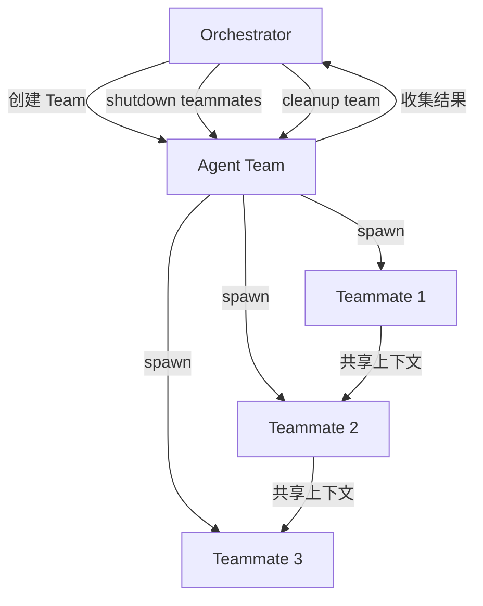
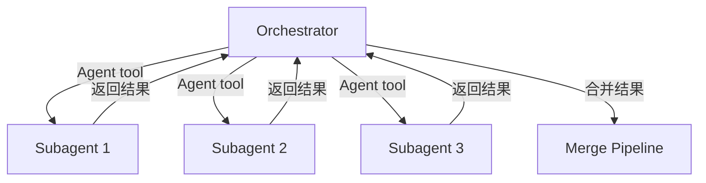
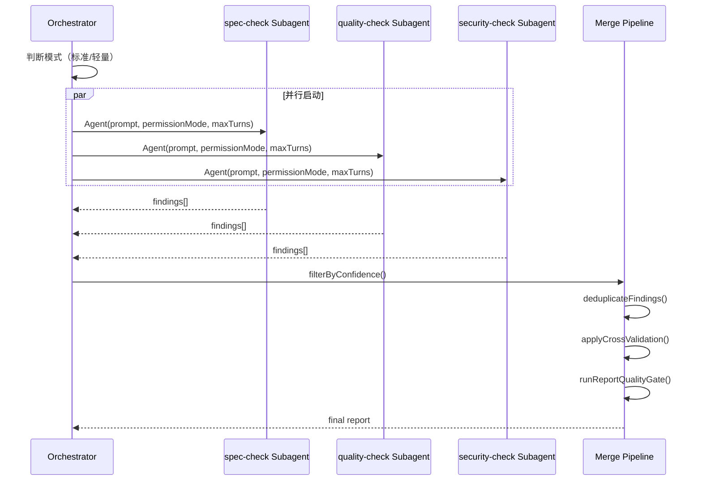
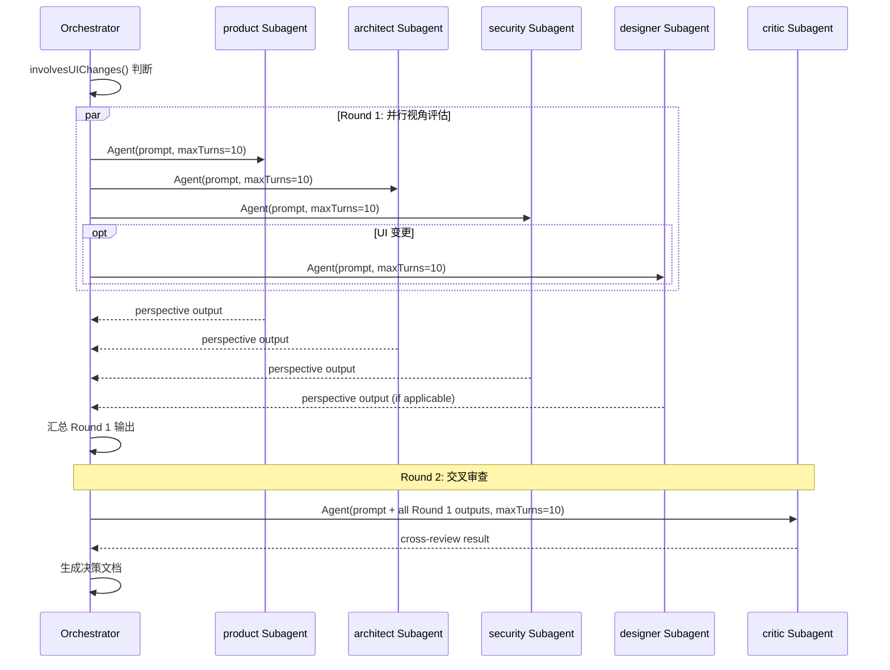
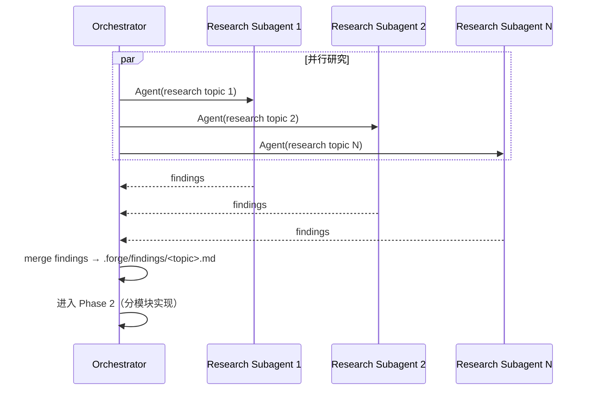

# Design Document: Agent Team Migration

## Overview

本设计将 Forge 项目中三个使用 Claude Code Agent Teams 的场景（`/forge review`、`/forge decide`、`/forge build` 全量路径研究阶段）迁移到独立 Subagent 并行执行模式。

**迁移动机**：Agent Teams 存在已知的可靠性问题——无会话恢复、shutdown 阻塞、状态不持久化。独立 Subagent 模式通过 Claude Code 的 Agent tool 直接调用，生命周期由调用方控制，不依赖 Team 协议，从根本上消除这些问题。

**设计原则**：
- **行为等价**：迁移后的输出格式、合并逻辑、质量门禁与现有实现完全一致
- **最小变更**：复用现有的纯函数（`filterByConfidence`、`deduplicateFindings`、`applyCrossValidation`、`involvesUIChanges` 等），只替换编排层
- **渐进式**：三个场景可独立迁移，互不依赖

## Architecture

### 当前架构（Agent Team 模式）



### 目标架构（独立 Subagent 模式）



关键差异：
- 无 Team 生命周期管理（create → message → wait → shutdown → delete）
- Subagent 之间无共享上下文，各自独立执行
- Orchestrator 直接通过 `Promise.allSettled()` 收集结果，天然支持部分失败

### Review 迁移架构



轻量模式下跳过 S1（spec-check），仅启动 S2 和 S3。

### Decide 迁移架构



### Build 研究阶段迁移架构



## Components and Interfaces

### 新增：SubagentInvocation 接口

```typescript
/** 描述一次 Subagent 调用的完整参数 */
interface SubagentInvocation {
  /** Subagent 角色标识，对应 .claude/agents/ 下的定义文件 */
  agentType: string;
  /** 任务指令 */
  prompt: string;
  /** 权限模式 */
  permissionMode: "default" | "acceptEdits";
  /** 最大轮次 */
  maxTurns: number;
  /** 可选的预加载 skills */
  skills?: string[];
}
```

### 新增：SubagentResult 接口

```typescript
/** Subagent 执行结果 */
interface SubagentResult {
  /** Subagent 角色标识 */
  agentType: string;
  /** 执行状态 */
  status: "success" | "failure" | "timeout";
  /** 结构化输出（成功时） */
  output?: string;
  /** 错误信息（失败时） */
  error?: string;
}
```

### 新增：ParallelSubagentRunner

```typescript
/**
 * 并行执行多个 Subagent 并收集结果。
 * 使用 Promise.allSettled 确保部分失败不阻塞整体。
 */
function runSubagentsInParallel(
  invocations: SubagentInvocation[]
): Promise<SubagentResult[]>;
```

### 修改：Review 编排函数

```typescript
/**
 * 构建 review 阶段的 Subagent 调用列表。
 * 根据是否有 Spec 决定是否包含 spec-check。
 */
function buildReviewSubagents(context: {
  hasSpec: boolean;
  specPath?: string;
  changedFiles: string[];
}): SubagentInvocation[];
```

### 修改：Decide 编排函数

```typescript
/**
 * 构建 decide 阶段的两轮 Subagent 调用。
 * Round 1: 视角 Subagents（product, architect, security, 可选 designer）
 * Round 2: Critic Subagent（接收 Round 1 所有输出）
 */
function buildDecideRound1Subagents(
  context: DecideContext
): SubagentInvocation[];

function buildDecideCriticInvocation(
  round1Outputs: SubagentResult[],
  context: DecideContext
): SubagentInvocation;
```

### 修改：Build 研究阶段编排函数

```typescript
/**
 * 构建 build 全量路径研究阶段的 Subagent 调用列表。
 */
function buildResearchSubagents(
  topics: string[]
): SubagentInvocation[];
```

### 保留不变的组件

以下纯函数组件在迁移中保持不变：

| 组件 | 文件 | 说明 |
|------|------|------|
| `filterByConfidence` | `src/review.ts` | 置信度过滤（阈值 0.8） |
| `deduplicateFindings` | `src/review.ts` | 指纹去重（±3 行容差） |
| `applyCrossValidation` | `src/review.ts` | 跨评审者一致性提升（+0.10） |
| `runReportQualityGate` | `src/review.ts` | 6 项报告质量自检 |
| `involvesUIChanges` | `src/decide.ts` | UI 变更检测 |
| `getDecideTeamMembers` | `src/decide.ts` | 决策成员选择（重命名为 `getDecideSubagents`） |
| `toKebabCase` | `src/decide.ts` | 主题名转换 |
| `generateDecisionPath` | `src/decide.ts` | 决策文档路径生成 |
| `validateAgentOutput` | `src/agent-output.ts` | Subagent 输出验证 |
| `checkBuildGate` | `src/build.ts` | Build 前置门禁 |
| `analyzeFixAttempts` | `src/build.ts` | 连续失败升级 |

## Data Models

### ReviewFinding（不变）

```typescript
interface ReviewFinding {
  layer: "spec-check" | "quality-check" | "security-check";
  severity: "P0" | "P1" | "P2" | "P3";
  confidence: number;        // 0.1 - 1.0
  fixRoute: "safe_auto" | "gated_auto" | "manual" | "advisory";
  file: string;
  line: number;
  description: string;
  suggestion: string;
}
```

### DecideContext（不变）

```typescript
interface DecideContext {
  taskDescription: string;
  involvedFiles: string[];
}
```

### TeamMember → SubagentConfig（重命名）

```typescript
// 现有
interface TeamMember {
  name: string;
  role: string;
  agent: string;
}

// 迁移后（语义等价，仅重命名以反映新模型）
interface SubagentConfig {
  name: string;
  role: string;
  agent: string;
}
```

### 新增：ParallelExecutionResult

```typescript
/** 并行执行的汇总结果 */
interface ParallelExecutionResult<T> {
  /** 成功的结果 */
  succeeded: Array<{ agentType: string; result: T }>;
  /** 失败的记录 */
  failed: Array<{ agentType: string; error: string }>;
}
```

## Correctness Properties

*A property is a characteristic or behavior that should hold true across all valid executions of a system — essentially, a formal statement about what the system should do. Properties serve as the bridge between human-readable specifications and machine-verifiable correctness guarantees.*

### Property 1: Review subagent selection correctness

*For any* review context, the set of subagents selected by `buildReviewSubagents` SHALL include `quality-check` and `security-check`, and SHALL include `spec-check` if and only if a locked Spec is available (`hasSpec === true`).

**Validates: Requirements 1.1, 1.3**

### Property 2: Parallel execution fault tolerance

*For any* set of parallel subagent invocations where at least one subagent succeeds, the `runSubagentsInParallel` function SHALL return results from all successful subagents and error reports for all failed subagents, without blocking or discarding any successful result.

**Validates: Requirements 1.5, 3.3**

### Property 3: Decide Round 1 member selection

*For any* `DecideContext`, the `buildDecideRound1Subagents` function SHALL always include `product`, `architect`, and `security` subagents, and SHALL include `designer` if and only if `involvesUIChanges(context)` returns `true`.

**Validates: Requirements 2.1, 2.3**

### Property 4: Critic blocking issues trigger needs_revision

*For any* critic output that contains blocking issues, the decide document status SHALL be set to `needs_revision`. *For any* critic output without blocking issues, the status SHALL be `confirmed`.

**Validates: Requirements 2.4**

### Property 5: Subagent invocation protocol completeness

*For any* subagent invocation produced by the orchestrator, the invocation SHALL contain a non-empty `prompt`, a valid `permissionMode`, a positive `maxTurns`, and a valid `agentType` that corresponds to an entry in `.claude/agents/`.

**Validates: Requirements 7.1, 7.2**

### Property 6: Research findings merge completeness

*For any* set of successful research subagent outputs, the merged findings document SHALL contain all findings from every successful subagent, with no findings lost or duplicated.

**Validates: Requirements 3.2**

## Error Handling

### Subagent 失败处理

| 场景 | 处理方式 |
|------|---------|
| Subagent 超时 | 标记该 Subagent 为 `timeout`，继续处理其他结果 |
| Subagent 返回无效输出 | 使用 `validateAgentOutput` 检测，标记为 `failure`，记录错误详情 |
| 所有 Subagent 均失败 | 向用户报告完整失败，建议重试 |
| 部分 Subagent 失败 | 在报告中标注缺失的层级，继续合并可用结果 |

### Review 特定错误处理

- 轻量模式下 spec-check 不启动，报告中 Layer 1 标注"轻量路径，已跳过"
- 如果 quality-check 和 security-check 均失败，评审无法完成，阻断流程

### Decide 特定错误处理

- Round 1 中某个视角 Subagent 失败：在决策文档中标注该视角缺失，Critic 仍基于可用输出进行审查
- Critic Subagent 失败：决策文档标记为 `needs_revision`，提示用户手动审查
- 安全视角不可跳过：即使 security Subagent 失败，也必须重试或阻断

### Build 研究阶段错误处理

- 部分研究 Subagent 失败：合并可用结果，在 findings 中标注缺失的研究主题
- 所有研究 Subagent 失败：阻断 Phase 1，提示用户检查研究主题定义

## Testing Strategy

### 测试框架

- **单元测试**：Vitest（项目已配置）
- **属性测试**：fast-check（与 Vitest 集成）
- 每个属性测试最少 100 次迭代

### 属性测试（Property-Based Tests）

每个 Correctness Property 对应一个属性测试：

| Property | 测试文件 | 生成器 |
|----------|---------|--------|
| Property 1: Review subagent selection | `test/review-subagent-selection.test.ts` | 随机 `{ hasSpec: boolean }` |
| Property 2: Parallel fault tolerance | `test/parallel-execution.test.ts` | 随机 `SubagentResult[]`（混合 success/failure） |
| Property 3: Decide member selection | `test/decide-subagent-selection.test.ts` | 随机 `DecideContext`（随机 taskDescription + involvedFiles） |
| Property 4: Critic blocking → status | `test/decide-critic-status.test.ts` | 随机 critic output（有/无 blocking issues） |
| Property 5: Invocation completeness | `test/subagent-invocation.test.ts` | 随机 agent types + contexts |
| Property 6: Research merge completeness | `test/research-merge.test.ts` | 随机 research findings sets |

标签格式：`Feature: agent-team-migration, Property N: <property_text>`

### 单元测试

| 测试范围 | 测试内容 |
|---------|---------|
| 输出格式保留 | Review 报告 YAML frontmatter 结构正确 |
| 输出格式保留 | Decide 文档 YAML frontmatter 和章节结构正确 |
| Team 清理消除 | Review/Decide 流程中无 Team 生命周期调用 |
| 500-token 限制 | Decide Subagent 调用参数包含 token 限制 |
| 并发启动 | 验证 Subagent 并发启动而非顺序启动 |
| 输出验证 | Subagent 结果经过 `validateAgentOutput` 验证 |

### 回归测试

现有测试必须全部通过，确保迁移不破坏：
- `test/review.test.ts`（合并管线、置信度过滤、去重）
- `test/decide.test.ts`（UI 变更检测、成员选择、kebab-case 转换）
- `test/build.test.ts`（门禁检查、连续失败升级）
- `test/agent-output.test.ts`（输出验证、序列化）
