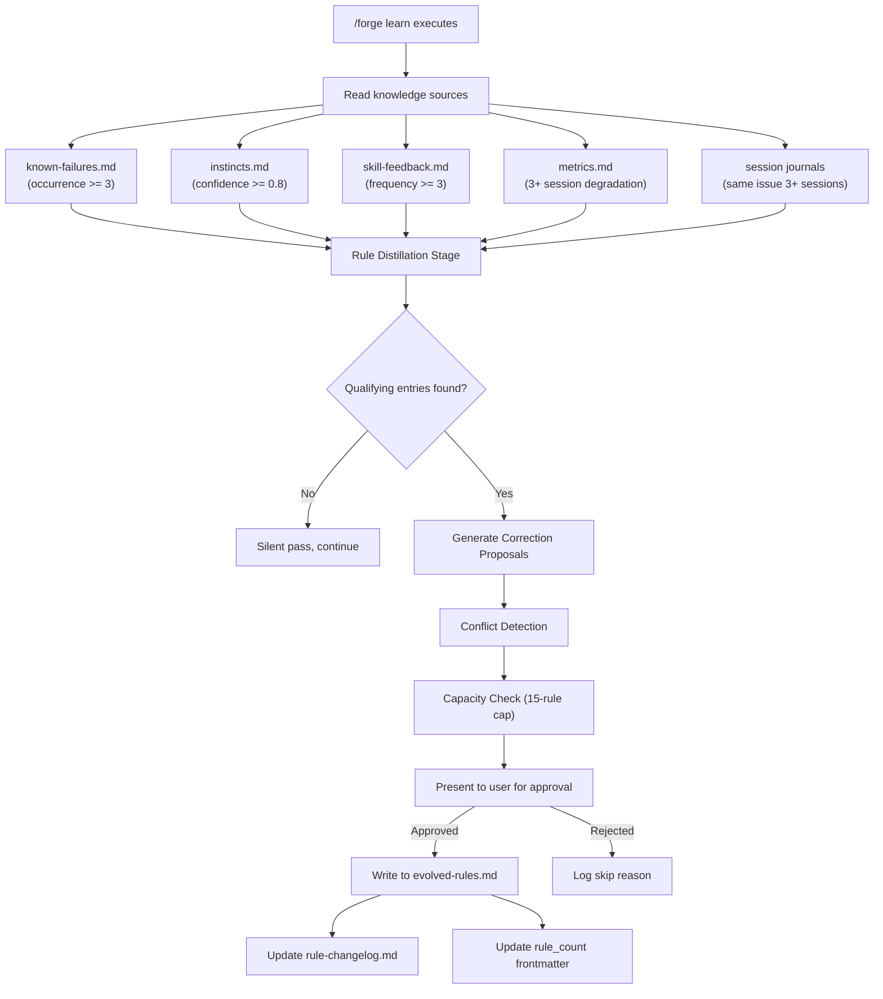
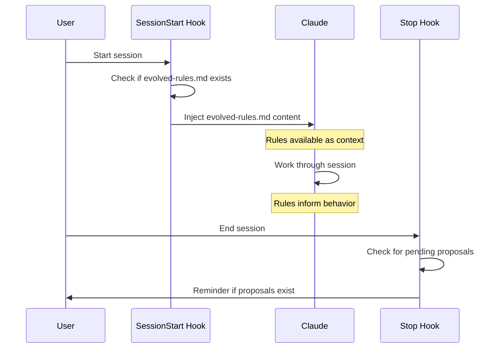

# Design Document: CLAUDE.md Self-Evolution

## Overview

This feature adds a self-evolution mechanism to Forge's CLAUDE.md system. Today, CLAUDE.md is generated once by `forge init` and never updated — the knowledge system (`/forge learn`) accumulates data across sessions but none of it feeds back into Claude's session-level instructions. This design introduces a **dual-file architecture** that distills high-value error-prevention rules from accumulated knowledge and injects them into every Claude session.

### Dual-File Architecture

```
templates/CLAUDE.md (stable)          templates/evolved-rules.md (new)
        │                                       │
   forge init                              forge init
        │                                       │
        ▼                                       ▼
   CLAUDE.md                     .forge/knowledge/evolved-rules.md
   Section 5 references ──────►  (max 15 rules, maintained by /forge learn)
                                        │
                                   SessionStart hook
                                        │
                                        ▼
                                 Injected into Claude context
```

**Key design decisions:**

1. **Separation of stable vs. dynamic content** — CLAUDE.md Sections 1–4 are owned by `forge init` and never modified by the evolution mechanism. Section 5 only references the external evolved-rules.md file.
2. **Template-only changes** — This feature modifies markdown templates, SKILL.md, hooks.json, and contract tests. No TypeScript source code changes.
3. **User approval gate** — All rule changes require explicit user approval via correction proposals. The system never auto-modifies rules.
4. **15-rule cap** — Keeps the instruction budget focused. Rules compete for slots based on confidence and recency.

### Files Modified

| File | Change Type | Description |
|------|-------------|-------------|
| `templates/evolved-rules.md` | **New** | Template for the evolved rules file |
| `templates/rule-changelog.md` | **New** | Template for the rule changelog |
| `templates/CLAUDE.md` | **Modified** | Add Section 5 (Self-Evolution Protocol) |
| `templates/config.md` | **Modified** | Add evolved-rules.md and rule-changelog.md to Guarded zone |
| `skills/forge-learn/SKILL.md` | **Modified** | Add Rule Distillation stage |
| `hooks/hooks.json` | **Modified** | Add SessionStart hook for rules injection, Stop hook for pending proposals |
| `scripts/init.sh` | **Modified** | Process new template placeholders |
| `test/contract.test.ts` | **Modified** | Add contract tests for new files and cross-file consistency |
| `CLAUDE.md` (project root) | **Modified** | Add Section 5 matching the template |

## Architecture

### Data Flow



### Session Lifecycle



### Rule Distillation Position in /forge learn Flow

The rule distillation stage slots into the existing `/forge learn` execution flow:

```
... existing stages ...
  ┌─────────────────────┐
  │  跨项目模式检测       │  Section 6.3 — cross-project pattern detection
  └──────────┬──────────┘
             │
             ▼
  ┌─────────────────────────────┐
  │  Error-Prevention Rule      │  ◄── NEW STAGE
  │  Distillation               │
  │                             │
  │  1. Read 4 data sources     │
  │  2. Apply thresholds        │
  │  3. Generate proposals      │
  │  4. Conflict detection      │
  │  5. Capacity management     │
  │  6. Present to user         │
  │  7. Write approved rules    │
  │  8. Update changelog        │
  └──────────┬──────────────────┘
             │
             ▼
  ┌─────────────────────┐
  │  会话层清理           │  Session cleanup (existing)
  └─────────────────────┘
```

## Components and Interfaces

### 1. Evolved Rules Template (`templates/evolved-rules.md`)

The template file that `forge init` copies to `.forge/knowledge/evolved-rules.md`.

**Structure:**

```markdown
---
updated: "{{init_date}}"
rule_count: 0
max_rules: {{max_rules}}
---

# Error-Prevention Rules

Rules distilled by `/forge learn` from accumulated project knowledge.
Each rule prevents a specific, documented error pattern.

<!-- Rule format:
### R{N}: {title}

**Content**: {concise rule statement}
**Prevents**: {specific error this rule prevents}
**Source**: {knowledge file and entry that triggered this rule}
**Added**: {YYYY-MM-DD}
**Confidence**: {0.3-0.9}
**Last_triggered**: {YYYY-MM-DD}
-->
```

**Placeholder handling in init.sh:**
- `{{init_date}}` → current date (YYYY-MM-DD) — uses existing `init_date` variable
- `{{max_rules}}` → `15` (hardcoded default, matching the 15-rule cap)

### 2. Rule Changelog Template (`templates/rule-changelog.md`)

**Structure:**

```markdown
---
updated: "{{init_date}}"
---

# Rule Changelog

Evolution history of error-prevention rules in evolved-rules.md.

<!-- Entry format:
### YYYY-MM-DD — {action}: R{N} {title}

**Action**: added | updated | retired
**Source**: {evidence source}
**Confidence**: {score}
**Reason**: {why this change was made}
-->
```

### 3. CLAUDE.md Template Section 5

Added after Section 4 (Knowledge Discipline), before "项目信息":

```markdown
## 5. Self-Evolution Protocol

### 5.1 Evolved Rules

At session start, read `.forge/knowledge/evolved-rules.md` and treat its rules as project-specific error-prevention directives. These rules are distilled from accumulated project knowledge and represent patterns where Claude would make mistakes without explicit guidance.

### 5.2 Updatable Knowledge Categories

The following categories qualify as rule candidates:

| Category | Source | Threshold |
|----------|--------|-----------|
| Project-specific traps | known-failures.md | occurrence >= 3 |
| Repeated correction patterns | instincts.md | confidence >= 0.8 |
| Environment/tool quirks | skill-feedback.md | frequency >= 3 |
| Cross-session behavior corrections | session journals | same issue in 3+ sessions |
| Rule friction adjustments | metrics.md | 3+ session degradation trend |

### 5.3 Trigger Conditions

Rules are proposed only when knowledge entries meet the numeric thresholds above. `/forge learn` evaluates these thresholds during the rule distillation stage.

### 5.4 Correction Protocol

1. **Propose** — Present the rule with evidence from knowledge sources
2. **Declare** — State what specific error the rule prevents
3. **Approve** — User reviews and approves/rejects the proposal
4. **Log** — Record the change in `.forge/knowledge/rule-changelog.md`

### 5.5 Constraints

- **15-rule cap** — evolved-rules.md holds at most 15 rules. New rules require retiring low-value existing rules when at capacity.
- **Staleness policy** — Rules not triggered in the last 5 sessions are flagged for retirement review.
- **Guarded zone** — evolved-rules.md is in the Guarded protection zone: updatable only by `/forge learn` rule distillation, not deletable outside maintenance.
- **Sections 1–4 are immutable** — Owned by `forge init`. The self-evolution mechanism never modifies them.

### 5.6 Exclusions

The following are NOT valid rule candidates:
- Architecture descriptions inferable from code
- File path lists
- General best practices Claude already knows
- Raw knowledge data (belongs in knowledge files, not rules)
- Standards enforced by existing tools (e.g., Biome code style)
```

### 4. Config.md Template Changes

Add to the Guarded zone section:

```markdown
- `.forge/knowledge/evolved-rules.md`（only updatable by `/forge learn` rule distillation, not deletable outside maintenance）
- `.forge/knowledge/rule-changelog.md`（append-only — only new entries, no deletion of history）
```

### 5. SKILL.md Rule Distillation Stage

A new section added to `skills/forge-learn/SKILL.md` after Section 6.3 (cross-project pattern detection). The stage follows this algorithm:

**Input:** Four knowledge data sources + session journals
**Output:** Zero or more Correction Proposals presented to the user

**Algorithm:**

```
1. READ evolved-rules.md → current_rules[], rule_count, max_rules
2. READ known-failures.md → failures[]
3. READ instincts.md → instincts[]
4. READ skill-feedback.md → feedback[]
5. READ metrics.md → metrics_history[]
6. SCAN session journals → cross_session_issues[]

7. candidates = []
8. FOR each failure WHERE occurrence >= 3:
     candidates.push(transform(failure))
9. FOR each instinct WHERE confidence >= 0.8:
     candidates.push(transform(instinct))
10. FOR each feedback WHERE frequency >= 3:
      candidates.push(transform(feedback))
11. FOR each cross_session_issue WHERE sessions >= 3:
      candidates.push(transform(cross_session_issue))
12. FOR each metric_dimension WHERE degradation_trend >= 3 sessions:
      candidates.push(friction_adjustment(metric_dimension))

13. IF candidates is empty:
      OUTPUT "No qualifying entries found. Skipping rule distillation."
      RETURN

14. FOR each candidate:
      a. APPLY exclusion filter (architecture, file paths, best practices, raw data, tool standards)
      b. APPLY conflict detection against current_rules[]
      c. IF conflict found: mark candidate with conflict info
      d. APPLY capacity check: if rule_count >= max_rules, identify lowest-value rule for retirement

15. PRESENT proposals to user (including conflicts and retirement suggestions)
16. FOR each approved proposal:
      a. WRITE rule to evolved-rules.md
      b. UPDATE rule_count frontmatter
      c. APPEND entry to rule-changelog.md
      d. IF retirement: REMOVE retired rule, APPEND retirement entry to changelog
```

**Transformation process** (step 8-12 `transform()`):

```
1. EXTRACT raw pattern from knowledge entry
2. DISTILL into concise rule statement (one actionable sentence)
3. DECLARE what specific error the rule prevents (testable failure scenario)
4. ASSIGN confidence from source entry
5. SET last_triggered to current date
```

### 6. Hooks Changes

**SessionStart addition:**

```json
{
  "type": "command",
  "command": "if [ -f .forge/knowledge/evolved-rules.md ]; then echo '=== Evolved Rules ==='; cat .forge/knowledge/evolved-rules.md; fi",
  "timeout": 5
}
```

**Stop addition:**

```json
{
  "type": "command",
  "command": "if [ -f .forge/knowledge/evolved-rules.md ] && grep -q 'PENDING' .forge/knowledge/evolved-rules.md 2>/dev/null; then count=$(grep -c 'PENDING' .forge/knowledge/evolved-rules.md 2>/dev/null || echo 0); echo \"⚠️ 有 $count 条待审核的规则提案。运行 /forge learn 查看并审批。\"; fi"
}
```

The Stop hook checks for a `PENDING` marker that `/forge learn` writes when proposals are generated but the user hasn't completed the review. It counts the number of pending proposals using `grep -c` to give the user a clear indication of how many proposals await review.

### 7. Init Script Changes

Add to the template processing section of `scripts/init.sh`:

```bash
# --- Copy evolved-rules.md template ---
if [[ -f "${FORGE_ROOT}/templates/evolved-rules.md" ]]; then
  sed -e "s/{{init_date}}/${init_date}/g" \
      -e "s/{{max_rules}}/15/g" \
    "${FORGE_ROOT}/templates/evolved-rules.md" > "${PROJECT_ROOT}/.forge/knowledge/evolved-rules.md"
fi

# --- Copy rule-changelog.md template ---
if [[ -f "${FORGE_ROOT}/templates/rule-changelog.md" ]]; then
  sed "s/{{init_date}}/${init_date}/g" \
    "${FORGE_ROOT}/templates/rule-changelog.md" > "${PROJECT_ROOT}/.forge/knowledge/rule-changelog.md"
fi
```

### 8. Contract Test Additions

New test groups added to `test/contract.test.ts`:

| Test Group | Validates |
|------------|-----------|
| Knowledge templates | `templates/evolved-rules.md` and `templates/rule-changelog.md` exist |
| Evolved rules frontmatter | Template contains `updated`, `rule_count`, `max_rules` YAML fields |
| CLAUDE.md self-evolution section | Template contains "Self-Evolution Protocol" or equivalent heading |
| SessionStart hook | hooks.json SessionStart contains entry referencing `evolved-rules.md` |
| Config.md Guarded zone | Template lists evolved-rules.md in Guarded zone |

## Data Models

### Evolved Rule Format

Each rule in `evolved-rules.md` follows this structure:

```markdown
### R{N}: {title}

**Content**: {concise, actionable rule statement}
**Prevents**: {specific error scenario this rule prevents}
**Source**: {knowledge file path and entry identifier}
**Added**: {YYYY-MM-DD}
**Confidence**: {0.3-0.9}
**Last_triggered**: {YYYY-MM-DD}
```

**Field constraints:**

| Field | Type | Constraints |
|-------|------|-------------|
| N | integer | Sequential, 1-based, unique within file |
| title | string | Concise descriptive title, no colons |
| Content | string | Single actionable sentence or short paragraph |
| Prevents | string | Specific testable failure scenario |
| Source | string | Path to knowledge file + entry identifier |
| Added | date | YYYY-MM-DD format |
| Confidence | float | Range 0.3–0.9, inherited from source entry |
| Last_triggered | date | YYYY-MM-DD format, updated when rule is referenced in a session |

### Evolved Rules File Frontmatter

```yaml
---
updated: "YYYY-MM-DD"
rule_count: 0
max_rules: 15
---
```

| Field | Type | Constraints |
|-------|------|-------------|
| updated | date | YYYY-MM-DD, updated on every write |
| rule_count | integer | Must equal actual count of `### R{N}:` headings in file |
| max_rules | integer | Default 15, set at init time |

### Rule Changelog Entry Format

```markdown
### YYYY-MM-DD — {action}: R{N} {title}

**Action**: added | updated | retired
**Source**: {evidence source}
**Confidence**: {score}
**Reason**: {why this change was made}
```

### Correction Proposal (Transient)

Correction proposals are transient — they exist only during the `/forge learn` session and are not persisted to a file. They are presented inline to the user.

```
📋 Rule Proposal #{n}

  Title: {title}
  Content: {rule statement}
  Prevents: {error scenario}
  Source: {knowledge file + entry}
  Confidence: {score}
  
  {conflict info if applicable}
  {retirement suggestion if at capacity}
  
  Approve? (y/n)
```

### Staleness Calculation

A rule is considered stale when:
- `last_triggered` date is older than 5 sessions ago
- Session count is determined by counting entries in `.forge/knowledge/sessions/` directory

### Rule Value Score (for retirement ranking)

```
value = confidence × recency_factor

where recency_factor:
  - triggered within last 2 sessions: 1.0
  - triggered 3-4 sessions ago: 0.7
  - triggered 5+ sessions ago (stale): 0.3
```

The lowest-value rule is the retirement candidate when at capacity.

## Correctness Properties

*A property is a characteristic or behavior that should hold true across all valid executions of a system — essentially, a formal statement about what the system should do. Properties serve as the bridge between human-readable specifications and machine-verifiable correctness guarantees.*

### PBT Applicability Assessment

This feature primarily modifies markdown templates, SKILL.md instructions, hooks.json configuration, and shell scripts. Most acceptance criteria are static content checks (SMOKE) or behavioral instructions for the AI (EXAMPLE). There is limited but meaningful scope for property-based testing:

- **Round-trip property (14.4)**: The evolved-rules.md file format should be unambiguous — parsing then re-serializing should produce an equivalent file. This validates the format specification itself.
- **Rule count invariant (4.4)**: For any valid evolved-rules.md, the `rule_count` frontmatter must equal the actual number of rule headings. This is tested as a contract test rather than PBT since no TypeScript code maintains this invariant.

Most criteria (template content, SKILL.md instructions, hook configuration) are best covered by contract tests and example-based tests.

### Property 1: Evolved rules file round-trip

*For any* valid set of rules (each with title, content, prevents, source, added date, confidence, and last_triggered), formatting them into the evolved-rules.md structure and then parsing the result back should produce an equivalent set of rules with all fields preserved.

**Validates: Requirements 14.4**

## Error Handling

### Template Processing Errors

| Scenario | Handling |
|----------|----------|
| `templates/evolved-rules.md` missing during `forge init` | `init.sh` uses `if [[ -f ... ]]` guard — skips with no error, project works without evolved rules |
| `templates/rule-changelog.md` missing during `forge init` | Same guard pattern — skips gracefully |
| Placeholder `{{max_rules}}` not found in template | `sed` no-op — file copied as-is with literal placeholder (caught by contract test) |
| `{{init_date}}` replacement fails | Uses existing `init_date` variable from init.sh — same failure mode as other templates |

### Hook Execution Errors

| Scenario | Handling |
|----------|----------|
| `evolved-rules.md` doesn't exist at session start | Hook uses `if [ -f ... ]` conditional — silent no-op |
| `evolved-rules.md` is malformed | `cat` outputs whatever is there — Claude handles gracefully |
| Hook timeout exceeded | Timeout set to 5 seconds — hook is killed, session continues |
| Stop hook `grep` fails | Uses `2>/dev/null` — silent failure, no reminder shown |

### Rule Distillation Errors

| Scenario | Handling |
|----------|----------|
| Knowledge source files don't exist | SKILL.md instructs to skip missing sources silently |
| No entries meet thresholds | Silent pass message, proceed to next stage |
| evolved-rules.md is malformed/corrupted | SKILL.md instructs to warn user and skip distillation |
| User rejects all proposals | No changes written, proceed to next stage |
| rule_count out of sync with actual rules | SKILL.md instructs to recount and fix frontmatter before proceeding |

### Protection Zone Violations

| Scenario | Handling |
|----------|----------|
| AI attempts to modify evolved-rules.md outside `/forge learn` | Guarded zone protection — existing PreToolUse hook blocks the write |
| AI attempts to delete entries from rule-changelog.md | Guarded zone — append-only semantics enforced |

## Testing Strategy

### Contract Tests (Primary)

Since this feature modifies templates, configuration, and SKILL.md instructions (not TypeScript functions), **contract tests are the primary testing mechanism**. These validate cross-file consistency — the same pattern used by existing contract tests in `test/contract.test.ts`.

**New contract test groups:**

1. **Evolved rules template existence and format**
   - `templates/evolved-rules.md` exists
   - Template contains YAML frontmatter with `updated`, `rule_count`, `max_rules` fields
   - Template contains rule format documentation comment

2. **Rule changelog template existence and format**
   - `templates/rule-changelog.md` exists
   - Template contains YAML frontmatter with `updated` field

3. **CLAUDE.md self-evolution section**
   - Template contains "Self-Evolution" or "自进化" heading
   - Section appears after Section 4 content
   - Section references `evolved-rules.md`
   - Section documents all five knowledge categories
   - Section documents the 15-rule cap
   - Section documents exclusions

4. **hooks.json evolved rules integration**
   - SessionStart contains hook entry referencing `evolved-rules.md`
   - SessionStart evolved-rules hook uses conditional `if [ -f` check
   - SessionStart evolved-rules hook has positive integer timeout
   - Stop contains hook entry for pending proposals

5. **config.md Guarded zone**
   - Template lists `evolved-rules.md` in Guarded zone section
   - Template lists `rule-changelog.md` in Guarded zone section

6. **SKILL.md rule distillation stage**
   - `skills/forge-learn/SKILL.md` contains "Rule Distillation" or equivalent heading
   - SKILL.md references all four data sources
   - SKILL.md documents all five threshold conditions

### Property-Based Test

**Library:** fast-check 4.7 (already in project dependencies)

**Test file:** `test/contract.evolved-rules.property.test.ts`

One property test validates the evolved-rules.md format specification:

- **Property 1: Evolved rules file round-trip**
  - Generate random rule sets using fast-check arbitraries
  - Format into evolved-rules.md structure (frontmatter + rule sections)
  - Parse the formatted string back into structured data
  - Assert equivalence of input and output
  - Minimum 100 iterations
  - Tag: `Feature: claude-md-self-evolution, Property 1: Evolved rules file round-trip`

This test requires implementing a simple parser/serializer pair for the evolved-rules.md format, which also serves as a reference implementation for validating the format specification.

### Example-Based Tests

Example-based tests cover specific scenarios not suited for PBT:

- Init script processes `{{init_date}}` and `{{max_rules}}` placeholders correctly
- Hook commands execute without error when evolved-rules.md is absent
- Hook commands produce expected output when evolved-rules.md is present
- Project root CLAUDE.md contains Section 5 matching template structure

### What Is NOT Tested

- AI behavior during rule distillation (SKILL.md instructions guide the AI, but we can't unit-test AI decisions)
- Conflict detection logic (implemented by the AI following SKILL.md instructions, not by code)
- User approval flow (interactive, session-level)
- Staleness calculation (performed by the AI, not by code)
