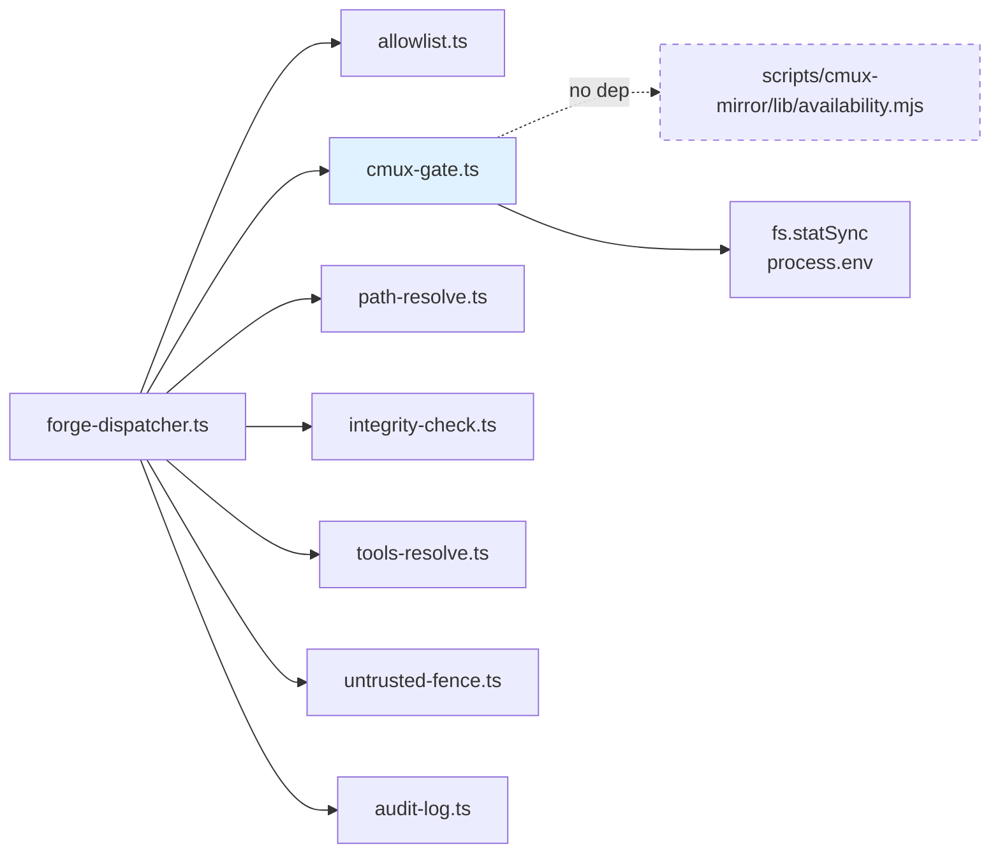
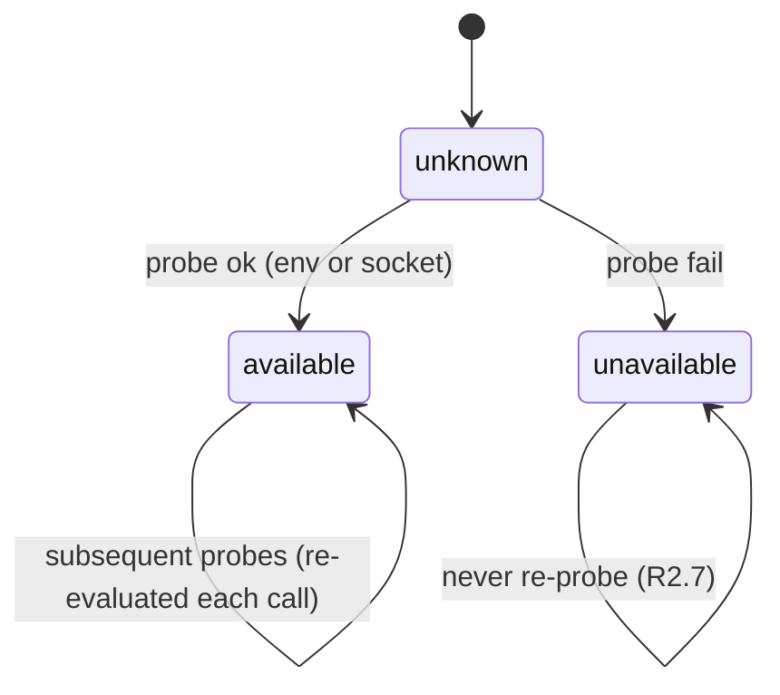
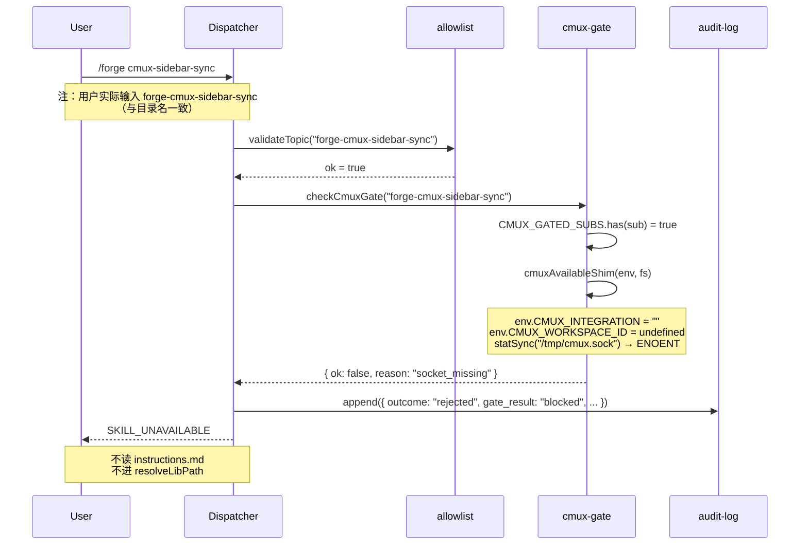
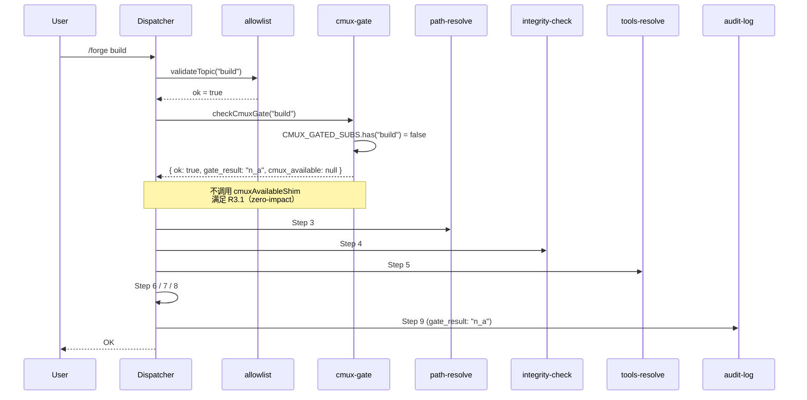
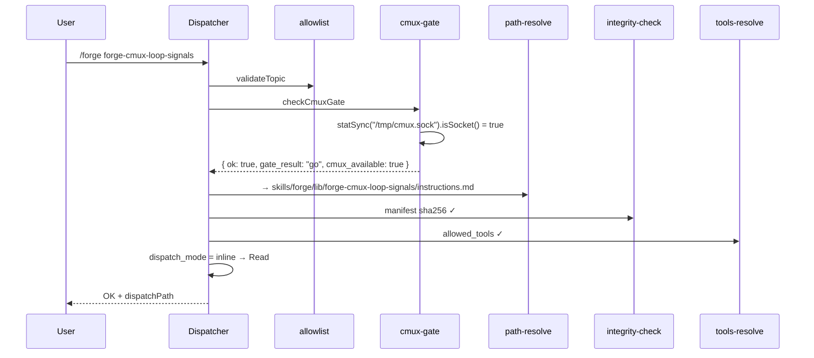

# Design Document — cmux-skills-collapse

> 基于已批准的 `requirements.md`。所有需求标识符（R1.x ~ R10.x）来自该文件。
> 主入口 ADR：[ADR-0004](../../../.forge/decisions/ADR-0004-skills-collapse-and-dispatcher.md)。

---

## Overview

本特性把仓库根目录下的 `cmux-skills/` 包（3 个独立 SKILL + `install.sh` 安装器）**物理迁移**到 v2.5 collapsed dispatcher 路径 `skills/forge/lib/` 下，并以三个平级 sub 注册到 dispatcher allowlist；同时在 dispatcher 9 步链路的 `validateTopic` 与 `resolveLibPath` 之间插入 **Conditional_Availability_Gate** 闸门步骤（Step 2.5），按 `cmuxAvailable()` 探测结果条件分发。

> 方案代号：**方案 C** —— 物理迁移 + 闸门，10 步链路。
> 与方案 A（保留 cmux-skills/ + 路径双解析）和方案 B（仅闸门、不迁移）的对比详见 §10。

### 1.1 核心不变量

- **Zero_Impact_Invariant**（R3.4 a-d）：未装 cmux 时，非 cmux sub 的 stdout/stderr 字节级一致、文件 mtime/sha256 不变、临时文件零增量、dist manifest 子集 sha256 不变。
- **闸门短路不读盘**（R3.6）：未装 cmux 调用 cmux sub → 闸门拒绝，**不读** instructions.md，**不进** resolveLibPath，**不加载**任何 cmux SKILL 内容到上下文。
- **判定仅依赖 `cmuxAvailable()`**（R2.6）：超时/sticky/CMUX_INTEGRATION 全部由 lib 自身保证，dispatcher 不重复实现。

### 1.2 重要事实校准（与 requirements 文字的偏差）

| 事项 | requirements 描述 | 实际事实（设计以此为准） |
|------|-------------------|------------------------|
| ALLOW_LIST 项数 | 29 → 32 | 29 → 32（与 requirements 一致） |
| manifest.json 项数 | 未提及 | **31 → 34**（manifest 比 ALLOW_LIST 多 `init`、`review-comment-bitbucket` 两个内部 sub） |
| frontmatter `name` 字段 | R8.4 要求「更新为目录名」 | **现有 instructions.md 全无 `name` 字段**；frontmatter 仅有 `description` / `dispatch_mode` / `allowed_tools`。设计采用「目录名作为隐式 name」策略，详见 §7.2 |
| `cmuxAvailable()` 接口 | requirements 当作可调用 | **实际是 sync 函数**（不是 async），位于 `scripts/cmux-mirror/lib/availability.mjs`；从 dispatcher TS 调用涉及跨模块系统耦合，详见 §3.1 选项 B |
| manifest 权威性 | requirements 仅说 SKILL.md §2 计数 | **manifest.json 是 ground truth**；SKILL.md §2 文字描述同步即可 |

---

## Architecture

### 系统流程图（10 步链路 + 闸门拒绝路径）

```mermaid
sequenceDiagram
    autonumber
    participant U as User
    participant D as forge-dispatcher.ts
    participant G as cmux-gate.ts
    participant L as path-resolve.ts
    participant I as integrity-check.ts
    participant T as tools-resolve.ts
    participant W as untrusted-fence.ts
    participant A as audit-log.ts

    U->>D: /forge <topic>
    D->>D: Step 1 resolveDispatcherMode
    D->>D: Step 2 validateTopic (32-sub allowlist)
    alt topic ∉ allowlist
        D-->>U: E_UNKNOWN_SUB (+ suggestion)
        D->>A: writeAuditLog(rejected)
    end

    D->>G: Step 2.5 checkCmuxGate(sub)
    alt sub ∉ CMUX_GATED_SUBS
        G-->>D: { ok: true, gate_result: "n_a" }
    else sub ∈ CMUX_GATED_SUBS
        G->>G: cmuxAvailableShim() (env + socket stat, < 5ms)
        alt available = true
            G-->>D: { ok: true, gate_result: "go", cmux_available: true }
        else available = false
            G-->>D: { ok: false, code: SKILL_UNAVAILABLE, reason }
            D->>A: writeAuditLog(rejected, gate_result="blocked")
            D-->>U: SKILL_UNAVAILABLE (silent, no SKILL load)
        end
    end

    D->>L: Step 3 resolveLibPath
    D->>I: Step 4 checkIntegrity (manifest.json sha256)
    D->>T: Step 5 resolveAllowedTools
    D->>D: Step 6 resolveDispatchMode (frontmatter)
    D->>W: Step 7 wrapWorkspaceContext
    D->>D: Step 8 dispatch (fork / inline)
    D->>A: Step 9 writeAuditLog (success)
    D-->>U: OK + dispatchPath
```



### 组件清单

| 组件 | 路径 | 操作 | 说明 |
|------|------|------|------|
| **cmux-gate.ts** | `src/forge-dispatcher/cmux-gate.ts` | CREATE | 闸门模块；导出 `CMUX_GATED_SUBS` 集合 + `checkCmuxGate(sub)` + 内部 `cmuxAvailableShim()` |
| **forge-dispatcher.ts** | `src/forge-dispatcher.ts` | MODIFY | 在 Step 2 与 Step 3 之间插入 Step 2.5；处理 SKILL_UNAVAILABLE 短路 |
| **allowlist.ts** | `src/forge-dispatcher/allowlist.ts` | MODIFY | ALLOW_LIST 29 → 32（追加 3 项 cmux sub） |
| **audit-log.ts** | `src/forge-dispatcher/audit-log.ts` | MODIFY | `AuditEntry` schema 新增 `gate_result` / `cmux_available` / `gate_reason` 字段 |
| **path-resolve.ts** | `src/forge-dispatcher/path-resolve.ts` | UNCHANGED | `resolve(root, "skills/forge/lib", sub, "instructions.md")` 自然命中 |
| **integrity-check.ts** | `src/forge-dispatcher/integrity-check.ts` | UNCHANGED | manifest.json 自动收录 |
| **forge-cmux-sidebar-sync/instructions.md** | `skills/forge/lib/forge-cmux-sidebar-sync/instructions.md` | CREATE | 由 `cmux-skills/forge-sidebar-sync/SKILL.md` 迁移 |
| **forge-cmux-browser-qa/instructions.md** | `skills/forge/lib/forge-cmux-browser-qa/instructions.md` | CREATE | 由 `cmux-skills/forge-browser-qa/SKILL.md` 迁移 |
| **forge-cmux-loop-signals/instructions.md** | `skills/forge/lib/forge-cmux-loop-signals/instructions.md` | CREATE | 由 `cmux-skills/forge-loop-signals/SKILL.md` 迁移 |
| **manifest.json** | `skills/forge/lib/manifest.json` | REGEN | `regen-skill-registry.mjs` 自动收录 31 → 34 |
| **cmux-skills/** | `cmux-skills/` (含 `install.sh` 与 3 个 SKILL.md) | DELETE | R5.1, R5.4 |
| **SKILL.md §2** | `skills/forge/SKILL.md` | MODIFY | sub 总数 29 → 32；将 3 个 cmux sub 列入 Auxiliary tier（R1.6） |
| **reference-advanced.md** | `docs/reference-advanced.md` | MODIFY | 重写「使用」「卸载」「新增文件」三段（R6） |
| **plan / progress** | `.forge/plans/cmux-integration.md` + `.forge/progress/cmux-integration.md` | MODIFY | Task 27 / Task 30 状态与 Notes 同步（R9） |

### 依赖关系



> **关键约束**：`cmux-gate.ts` **不依赖** `scripts/cmux-mirror/lib/`（虚线即「无依赖」标记）。原因详见 §3.1。

---

## Components and Interfaces

### CmuxGate 模块（新文件 `src/forge-dispatcher/cmux-gate.ts`）

#### 设计抉择：选项 A vs 选项 B

| 选项 | 描述 | 评估 |
|------|------|------|
| A | dispatcher TS 通过动态 `import()` 加载 `availability.mjs` | ❌ 跨模块依赖（src/ → scripts/）；冷启动需 ESM 解析；测试需 mock `.mjs` |
| **B** ✅ | dispatcher TS 内置 `cmuxAvailableShim()`，复刻关键判定（env + socket stat） | ✅ 单文件、单元测试容易、零跨模块耦合；stat 调用 < 1ms；sticky 状态机进程内 |

**推荐**：**选项 B**。理由：
1. dispatcher 是「主流程」，应保持自洽；scripts/cmux-mirror/lib/ 是「集成层」，二者属于不同关注点。
2. shim 复刻的逻辑极简（30 行内）；availability.mjs 的功能（CMUX_INTEGRATION 短路、CMUX_WORKSPACE_ID 跳过、socket stat）直接平移即可。
3. shim 与 lib 版本的判定**可能漂移**——这是可接受的，因为 dispatcher 使用 shim 仅做「闸门是否开」的二值决策，不参与 cmux 通信；lib 版本继续服务 mirror.mjs / sync-once.mjs 等真正使用 cmux 的进程。
4. 单元测试可纯粹用 `process.env` + `mock-fs` 覆盖，不需要拉起 .mjs 模块。

#### 公共 API

```typescript
// src/forge-dispatcher/cmux-gate.ts

/** 需要通过闸门的 sub 集合（R2.2, R2.3） */
export const CMUX_GATED_SUBS: ReadonlySet<string> = new Set([
  "forge-cmux-sidebar-sync",
  "forge-cmux-browser-qa",
  "forge-cmux-loop-signals",
]);

export type GateResult =
  | { ok: true; gate_result: "go" | "n_a"; cmux_available: boolean | null }
  | { ok: false; code: "SKILL_UNAVAILABLE"; reason: GateBlockReason; gate_result: "blocked"; cmux_available: false };

export type GateBlockReason =
  | "integration_off"            // CMUX_INTEGRATION=off
  | "socket_path_invalid"        // CMUX_SOCKET_PATH 不在白名单前缀
  | "socket_missing"             // socket 文件不存在或 stat 失败
  | "socket_not_socket"          // 路径存在但不是 socket
  | "sticky_unavailable";        // 进程内已被标记为 unavailable

export interface CmuxGateOpts {
  env?: NodeJS.ProcessEnv;        // 测试注入
  statSync?: typeof import("node:fs").statSync;  // 测试注入
}

/** 闸门入口（Step 2.5）— pure w.r.t (sub, env, fs) */
export function checkCmuxGate(sub: string, opts?: CmuxGateOpts): GateResult;

/** 测试用：重置 sticky 状态 */
export function __resetGateForTest(): void;
```

#### 内部实现要点

```typescript
let stickyUnavailable = false;
const ALLOWED_SOCKET_PREFIXES = ["/tmp/", "/var/tmp/"];

function cmuxAvailableShim(env: NodeJS.ProcessEnv, statSync: ...): GateResult {
  if (stickyUnavailable) return blocked("sticky_unavailable");

  const integration = env.CMUX_INTEGRATION ?? "";
  if (integration === "off") return blocked("integration_off");

  // 快速路径：CMUX_WORKSPACE_ID 已注入 → cmux 进程内
  if (env.CMUX_WORKSPACE_ID) return go();

  // 慢速路径：stat socket
  const socketPath = env.CMUX_SOCKET_PATH ?? "/tmp/cmux.sock";
  if (socketPath.includes("..")) return blocked("socket_path_invalid");
  if (env.CMUX_SOCKET_PATH && !ALLOWED_SOCKET_PREFIXES.some(p => socketPath.startsWith(p))) {
    return blocked("socket_path_invalid");
  }

  try {
    const st = statSync(socketPath);
    if (!st.isSocket()) return blocked("socket_not_socket");
    return go();
  } catch {
    return blocked("socket_missing");
  }
}

export function checkCmuxGate(sub: string, opts?: CmuxGateOpts): GateResult {
  if (!CMUX_GATED_SUBS.has(sub)) {
    return { ok: true, gate_result: "n_a", cmux_available: null };
  }
  const env = opts?.env ?? process.env;
  const statSync = opts?.statSync ?? require("node:fs").statSync;
  const result = cmuxAvailableShim(env, statSync);
  if (result.gate_result === "blocked") {
    stickyUnavailable = true;  // first failure → sticky
  }
  return result;
}
```

> ⚠️ Sticky 触发时机：仅在「socket 探测失败」类失败上设置 sticky；`integration_off` 是用户配置而非故障，不触发 sticky（用户在同一进程内打开 cmux 后改主意是合法场景，但本设计为简化起见**所有 blocked 都设 sticky**——见 §4.3 状态机说明）。

### forge-dispatcher.ts 修改（Step 2.5 插入）

```typescript
// 现有 Step 2 之后
const sub = topicResult.value;

// === Step 2.5: Conditional_Availability_Gate（新增）===
const gateResult = mocks?.checkCmuxGate
  ? (mocks.checkCmuxGate(sub) as GateResult)
  : checkCmuxGate(sub);

if (!gateResult.ok) {
  // R2.5: 终止链路于闸门处，不进入 resolveLibPath
  // R3.5: 静默继续，不向用户输出探测细节
  await appendAuditLog({
    sub,
    outcome: "rejected",
    gate_result: "blocked",
    cmux_available: false,
    gate_reason: gateResult.reason,
    // ... 其它现有字段
  });
  return { code: "SKILL_UNAVAILABLE" };
}
// === Step 2.5 结束 ===

// 原 Step 3: resolveLibPath
const pathResult = ...
```

> 关键点：
> - `gate_result: "n_a"` 时直接放行，不影响非 cmux sub 的 hot path（R3.1）。
> - 闸门拒绝时仍然写 audit log（R2.8），但**不读** instructions.md（R3.6）。
> - 现有 9 步全部保留，只插入 1 步 → 链路 9 → 10 步。

### allowlist.ts 修改

```typescript
const ALLOW_LIST: ReadonlyArray<string> = [
  "abort", "accept", "build", "build-light",
  "control-cli", "control-ui", "debug", "decide", "decide-teams",
  "fix", "fix-conflicts", "forge-cmux-browser-qa", "forge-cmux-loop-signals",  // ← 新增（按字母序）
  "forge-cmux-sidebar-sync",                                                    // ← 新增
  "grill", "learn", "loop", "mutate", "pack", "plan",
  "recap", "refactor", "resume", "review", "router", "ship", "spec",
  "status", "storm", "test", "verify", "zoom-out",
] as const;
// 长度从 29 → 32
```

> Levenshtein 建议机制（已有）会自动覆盖三个新 sub：用户输错时给出最接近匹配。

### instructions.md ×3（CREATE）

每份遵循现有 collapsed sub 的 frontmatter 约定（参考 `skills/forge/lib/build/instructions.md`）：

```yaml
---
description: "<迁移自原 SKILL.md description>"
dispatch_mode: inline
allowed_tools:
  - Read
  - Bash
---
```

- **不新增 `name` 字段**（与现有 31 个 instructions.md 一致；§7.2 详释）。
- `dispatch_mode` 选 `inline`：三个 cmux SKILL 都是「轻量参考型」，没有需要 fork subagent 隔离的复杂工作流。
- `allowed_tools` 取 `Read` + `Bash`（满足读 `.forge/.cmux-snapshot.json` 与调 cmux CLI 的最小集）。
- Body 部分原样保留原 SKILL.md 的章节结构（Activation / What It Shows / Requirements / Zero-Impact 等），仅去掉旧 frontmatter。

### audit-log.ts schema 扩展

```typescript
export interface AuditEntry {
  // 现有字段
  ts: string;
  sub: string;
  topic_hash: string;
  lib_hash: string;          // 闸门拒绝时为 ""（未读盘）
  tools_granted: string[];   // 闸门拒绝时为 []
  dispatch_mode: string;     // 闸门拒绝时为 "n_a"
  outcome: "success" | "failure" | "rejected";
  prev_hmac: string;
  hmac: string;

  // 新增字段（R2.8）
  gate_result: "go" | "n_a" | "blocked";
  cmux_available: boolean | null;            // null = 未触发判定（n_a）
  gate_reason: GateBlockReason | null;       // null = 未拒绝
}
```

- 旧字段全部保留 → 现有 audit log 解析器向前兼容（旧条目缺新字段时按 `null` 处理）。
- 新增 ≤ 80 bytes/entry（R9 NFR）。

---

## Data Models

### `CMUX_GATED_SUBS` 集合字面量

```typescript
new Set([
  "forge-cmux-sidebar-sync",
  "forge-cmux-browser-qa",
  "forge-cmux-loop-signals",
] as const)
```

- **size = 3**；后续新增 cmux sub 时直接扩这里。
- **不可变**：`as const` + `ReadonlySet` 双重锁定。
- **测试约束**：property test（fast-check）应验证「`sub ∈ CMUX_GATED_SUBS` ⇔ dispatcher 在 Step 2.5 调用 cmuxAvailableShim」。

### `GateResult` 类型

判别联合（discriminated union）以 `ok` 为标签：

```typescript
type GateResult =
  | { ok: true;  gate_result: "go" | "n_a"; cmux_available: boolean | null }
  | { ok: false; code: "SKILL_UNAVAILABLE"; reason: GateBlockReason; gate_result: "blocked"; cmux_available: false };
```

### sticky-unavailable 状态机



- **unknown**：进程刚启动；`stickyUnavailable = false`。
- **available**：每次调用都重新探测（cmux 可能在进程生命周期内被关闭，但本设计选择**继续探测**——开销 < 1ms 可接受；与 lib 版本行为一致）。
- **unavailable**：进入后**不再 probe**（R2.7）；后续所有 cmux sub 直接 blocked，理由记为 `sticky_unavailable`。
- **重置**：仅 `__resetGateForTest()`（测试专用）。

> 设计取舍：lib 版本的 `markUnavailable()` 是**显式**触发（cli.mjs 在 EPIPE 时调用）；shim 版本是**隐式**触发（probe 失败即 sticky）。这是合理的，因为 dispatcher 没有真正的 cmux 通信路径，只能用 probe 作为唯一信号源。

---

## Workflow / 数据流

### 用户调用 cmux sub（cmux 不可用）



### 用户调用非 cmux sub（cmux 状态无关）



### 用户调用 cmux sub（cmux 可用）



---

## Error Handling

| 错误码 | 触发条件 | 是否新增 | 用户可见行为 |
|--------|----------|---------|------------|
| `E_UNKNOWN_SUB` | topic 不在 allowlist | 旧逻辑 | 返回错误码 + Levenshtein suggestion |
| **`SKILL_UNAVAILABLE`** | sub ∈ CMUX_GATED_SUBS 且 cmux 不可用 | **新增（R2.5）** | 静默返回错误码（R3.5：无探测细节输出） |
| `E_PATH_INVALID` | path-resolve 拒绝 | 旧逻辑 | 同既有 |
| `E_MANIFEST_MISSING` | manifest.json 不存在 | 旧逻辑 | 同既有 |
| `E_INTEGRITY_MISMATCH` | sha256 不匹配 | 旧逻辑 | 同既有 |
| `E_LIB_READ_FAILED` | 文件读取失败（罕见） | 旧逻辑 | 同既有 |

### audit log 字段扩展示例

```jsonl
// 闸门拒绝条目
{"ts":"2026-05-24T...","sub":"forge-cmux-sidebar-sync","topic_hash":"...","lib_hash":"","tools_granted":[],"dispatch_mode":"n_a","outcome":"rejected","gate_result":"blocked","cmux_available":false,"gate_reason":"socket_missing","prev_hmac":"...","hmac":"..."}
// 闸门放行条目（cmux 可用）
{"ts":"...","sub":"forge-cmux-loop-signals","outcome":"success","gate_result":"go","cmux_available":true,"gate_reason":null,...}
// 非 cmux sub 条目
{"ts":"...","sub":"build","outcome":"success","gate_result":"n_a","cmux_available":null,"gate_reason":null,...}
```

### 静默原则细化（R3.5）

- 用户终端不输出 `[cmux] socket missing` 之类信息。
- 仅在 audit log 中记录 `gate_reason`，供事后排查。
- 用户若想知道「为什么 cmux SKILL 没生效」，路径是：`/forge status` 显示 cmux 集成状态（已是 reference-advanced.md 的指引），或读 audit log。

---

## Migration Plan

### 物理迁移命令序列

```bash
# 1. 创建目标目录（git mv 不会自动创建）
mkdir -p skills/forge/lib/forge-cmux-sidebar-sync
mkdir -p skills/forge/lib/forge-cmux-browser-qa
mkdir -p skills/forge/lib/forge-cmux-loop-signals

# 2. git mv（保留历史）
git mv cmux-skills/forge-sidebar-sync/SKILL.md \
       skills/forge/lib/forge-cmux-sidebar-sync/instructions.md
git mv cmux-skills/forge-browser-qa/SKILL.md \
       skills/forge/lib/forge-cmux-browser-qa/instructions.md
git mv cmux-skills/forge-loop-signals/SKILL.md \
       skills/forge/lib/forge-cmux-loop-signals/instructions.md

# 3. 删除空目录与 install.sh
git rm cmux-skills/install.sh
rmdir cmux-skills/forge-sidebar-sync cmux-skills/forge-browser-qa cmux-skills/forge-loop-signals
rmdir cmux-skills/

# 4. 重写 frontmatter（手工编辑，见 §7.2）
# 5. 重新生成 manifest.json
node scripts/regen-skill-registry.mjs

# 6. 验证
npm run check
bash scripts/build-dist.sh
test -f dist-plugin/skills/forge/lib/forge-cmux-sidebar-sync/instructions.md
```

### frontmatter 转换规则

**原 SKILL.md frontmatter**（典型）：
```yaml
---
name: forge-sidebar-sync
description: Keep cmux sidebar in sync with Forge lifecycle state changes
trigger: forge sidebar sync, cmux sidebar, sync sidebar
---
```

**新 instructions.md frontmatter**（v2.5 collapsed 约定）：
```yaml
---
description: "Keep cmux sidebar in sync with Forge lifecycle state changes. Use when running /forge forge-cmux-sidebar-sync; requires cmux installed."
dispatch_mode: inline
allowed_tools:
  - Read
  - Bash
---
```

#### 关于 R8.4「name 字段更新」

requirements R8.4 要求把 `name` 字段更新为目录名。但**实际事实**：现有 31 个 collapsed sub 的 instructions.md **全无 `name` 字段**——只有 `description` / `dispatch_mode` / `allowed_tools`。

**设计决策**：采用**目录名作为隐式 name**策略。
- 不在迁移后的 instructions.md 中引入 `name` 字段。
- dispatcher 通过 `path-resolve.ts` 直接以「目录名 = sub 名」语义命中文件，无需读 `name`。
- 这与现有 31 个 sub 的实践一致，避免引入孤立字段。
- 验证：`skills/forge/lib/<dir>/` 与 `ALLOW_LIST` 项一一对应即可。

#### 关于 R8.5「trigger 字段超集」

requirements R8.5 要求把 `trigger` 字段保留并扩为「原集合 ⊇」超集。但**实际事实**：现有 collapsed sub 的 instructions.md **没有 `trigger` 字段**——dispatcher 不解析它，触发完全靠 `/forge <sub>` 的精确字符串匹配。

**设计决策**：原 trigger 关键词的语义通过**新 sub 名**直接覆盖。
- 原 `trigger: forge sidebar sync, cmux sidebar, sync sidebar` 在 collapsed 模式下不再生效——dispatcher 仅认 `forge-cmux-sidebar-sync`（精确匹配 + Levenshtein 模糊建议）。
- 用户输入 `/forge sidebar sync` → allowlist 不命中 → Levenshtein 距离最近为 `forge-cmux-sidebar-sync`（距离 ≤ 3）→ 给出 `did you mean: forge-cmux-sidebar-sync?` 提示。
- 用户输入 `/forge forge-cmux-sidebar-sync` → 直接命中。
- 这是 R8.5 的**功能等价实现**：原 trigger 的「能命中」属性由 sub 名 + Levenshtein 共同保证；新增的 cmux 命名空间别名（如 `forge cmux sidebar`）由 sub 名前缀自然包含。
- requirements 描述与 collapsed 实际机制存在偏差，**design 以现实可行的实现为准**，并把这一调整写入 §10 的偏差对齐表。

### 旧 cmux-skills/ 删除时机

- **同 PR 删除**：物理迁移与删除在同一 commit / PR 完成，避免出现「双份并存」的中间态（R5.4 要求迁移完成后不再包含三个旧目录）。
- 若 PR 拆分需要，先迁移后删除：拆分时迁移 PR 必须包含 manifest.json regen，使旧路径在删除前**已不被任何代码引用**。

### 用户级 `.claude/skills/forge-*` 兼容策略

旧 `cmux-skills/install.sh --apply` 把 SKILL 拷到用户的 `.claude/skills/forge-{sidebar-sync,browser-qa,loop-signals}/`。本特性**不主动删除**这些用户级副本（R10.5），策略为：

| 场景 | 行为 |
|------|------|
| 用户保留旧副本 + 装了 cmux | 旧 SKILL 仍由 Claude Code 按其原 SKILL.md 加载（trigger 命中），且因 cmux 可用而正常工作；与新 sub 在功能上重复但无冲突（R10.4） |
| 用户保留旧副本 + 未装 cmux | 旧 SKILL 受其原文 `Requirements: cmux installed` 自然失活（R10.4） |
| 旧副本与新 sub trigger 冲突 | dispatcher 优先 collapsed sub（R10.3），并在 audit log 记录 `gate_result: "blocked"` 之外的标记（实现：路径解析仍走 collapsed_path，从未读用户级副本） |
| 用户主动清理 | reference-advanced.md「升级说明」段提供命令：`rm -rf .claude/skills/forge-{sidebar-sync,browser-qa,loop-signals}`（R10.1） |

---

## Testing Strategy

### 单元测试：`cmux-gate.ts`（≥ 8 用例）

| # | 用例 | 输入 | 期望 |
|---|------|------|------|
| 1 | 非 gated sub 直接放行 | `checkCmuxGate("build")` | `{ ok: true, gate_result: "n_a", cmux_available: null }` |
| 2 | gated sub + 已装 cmux | env: `CMUX_WORKSPACE_ID=ws-1` | `{ ok: true, gate_result: "go", cmux_available: true }` |
| 3 | gated sub + socket 存在 | mock statSync.isSocket = true | `{ ok: true, gate_result: "go" }` |
| 4 | gated sub + socket 不存在 | mock statSync 抛 ENOENT | `{ ok: false, reason: "socket_missing" }` |
| 5 | gated sub + 路径是文件不是 socket | mock statSync.isSocket = false | `{ ok: false, reason: "socket_not_socket" }` |
| 6 | gated sub + CMUX_INTEGRATION=off | env override | `{ ok: false, reason: "integration_off" }` |
| 7 | gated sub + 无效 socket 路径 | env: `CMUX_SOCKET_PATH=/etc/passwd` | `{ ok: false, reason: "socket_path_invalid" }` |
| 8 | sticky 短路 | 两次调用，第二次不再 stat | 第二次 `reason: "sticky_unavailable"`，且 statSync mock 仅被调用 1 次 |

### 集成测试：dispatcher 10 步链路

- **happy path**（cmux 可用）：`/forge forge-cmux-sidebar-sync` → 返回 `OK`，`dispatchPath` 指向 `skills/forge/lib/forge-cmux-sidebar-sync/instructions.md`，audit log 含 `gate_result: "go"`。
- **rejected path**（cmux 不可用）：同上调用，`statSync` mock ENOENT → 返回 `SKILL_UNAVAILABLE`，audit log 含 `gate_result: "blocked"`，**不读** instructions.md（用 spy 验证 `readFileSync` 未被调用）。
- **non-gated path**：`/forge build` → 与现有 9 步行为一致；`checkCmuxGate` 调用 1 次但**不进** shim（验证 `statSync` spy 调用 0 次）。

### Zero-Impact 测试（R3.4 a-d 四条属性）

| 属性 | 测试方式 |
|------|---------|
| **R3.4.a** stdout/stderr 字节级一致 | 在「迁移前 commit」与「迁移后 commit」分别跑 `/forge build` 完整流程，捕获 stdout+stderr 后 `diff --binary` |
| **R3.4.b** 不创建额外临时文件 | snapshot `.forge/`、`.claude/`、临时目录的文件列表 → 跑 `/forge build` → 再 snapshot → 二者集合相等 |
| **R3.4.c** mtime + sha256 不变 | 跑前后对 `.forge/`、`.claude/`、`hooks/` 下所有文件取 `(mtime, sha256)`，跑后比对 |
| **R3.4.d** dist manifest 子集 sha256 不变 | `bash scripts/build-dist.sh` 前后比对 `dist-plugin/skills/forge/lib/{abort,accept,build,...}/instructions.md` 集合的 sha256（排除 cmux 三项） |

## Correctness Properties

### Property 1: gated-sub-implies-probe

`sub ∈ CMUX_GATED_SUBS` ⇔ dispatcher 在 Step 2.5 调用 `cmuxAvailableShim`（即 `statSync` / env 探测被触发）。等价地，对所有 `sub ∉ CMUX_GATED_SUBS`，shim 调用次数为 0；对所有 `sub ∈ CMUX_GATED_SUBS` 且 sticky 状态为 false 时，shim 调用次数为 1。

**Validates: Requirements 2.2, 2.3**

```typescript
// fast-check 实现示例
fc.assert(fc.property(fc.constantFrom(...ALLOW_LIST), (sub) => {
  __resetGateForTest();
  const statSpy = vi.fn().mockReturnValue({ isSocket: () => true });
  checkCmuxGate(sub, { env: {}, statSync: statSpy as any });
  if (CMUX_GATED_SUBS.has(sub)) {
    expect(statSpy).toHaveBeenCalledTimes(1);
  } else {
    expect(statSpy).toHaveBeenCalledTimes(0);
  }
}));
```

### Property 2: sticky-monotonicity

一旦 `stickyUnavailable = true`，对任意 `sub ∈ CMUX_GATED_SUBS` 与任意后续调用，`checkCmuxGate` 恒返回 `{ ok: false, reason: "sticky_unavailable" }`，且 `statSync` 不再被调用。

**Validates: Requirements 2.7**

```typescript
fc.assert(fc.property(fc.array(fc.constantFrom(...CMUX_GATED_SUBS), { minLength: 2, maxLength: 10 }), (subs) => {
  __resetGateForTest();
  const statSpy = vi.fn().mockImplementation(() => { throw new Error("ENOENT"); });
  // 第一次调用触发 sticky
  checkCmuxGate(subs[0], { env: {}, statSync: statSpy as any });
  const initialCalls = statSpy.mock.calls.length;
  // 后续调用必须短路
  for (const s of subs.slice(1)) {
    const r = checkCmuxGate(s, { env: {}, statSync: statSpy as any });
    expect(r.ok).toBe(false);
    if (!r.ok) expect(r.reason).toBe("sticky_unavailable");
  }
  expect(statSpy.mock.calls.length).toBe(initialCalls); // 没有新增调用
}));
```

### Property 3: zero-impact-non-gated-sub

对任意 `sub ∉ CMUX_GATED_SUBS`，`checkCmuxGate` 不读取任何 env、不调用 `statSync`、不修改 `stickyUnavailable`。返回值固定为 `{ ok: true, gate_result: "n_a", cmux_available: null }`。

**Validates: Requirements 3.1, 3.4**

### Property 4: dispatch-path-conditional-on-gate-result

对任意 `sub ∈ CMUX_GATED_SUBS`，dispatcher 在 `gate_result = "blocked"` 时**绝不**调用 `path-resolve.ts.resolveLibPath` 与 `readFileSync`；在 `gate_result = "go"` 时按现有 9 步链路完整执行至 audit log。

**Validates: Requirements 2.4, 2.5, 3.6**

### 三种安装入口一致性测试（R4.4）

- 用三组 `pluginRoot` mock 调用同一 sub：
  1. `pluginRoot = /Users/x/.claude/plugins/forge`（Marketplace）
  2. `pluginRoot = undefined; cwd = /repo`（Source clone）
  3. `pluginRoot = /Users/x/.claude/skills/forge`（Global skills）
- 期望：在 cmux 状态固定时，三组返回的 `dispatchPath` 不同但 `gate_result` 一致。

---

## NFR / 性能与资源

| 指标 | 目标 | 测量方式 |
|------|------|---------|
| 闸门决策延迟（n_a 路径） | < 5 µs | benchmark `Set.has()` |
| 闸门决策延迟（probe 路径） | < 5 ms | `process.hrtime.bigint()` 包裹 `statSync` |
| 闸门决策延迟（sticky 路径） | < 1 µs | 仅 boolean 短路 |
| audit log 增量字段 | ≤ 80 bytes/entry | 实测 JSON 序列化 |
| 总链路耗时（cmux 不可用 + gated sub） | < 10 ms | dispatcher 入口到 SKILL_UNAVAILABLE 返回 |
| 总链路耗时（非 gated sub 不变） | 与迁移前差 ≤ 1% | benchmark 1000 次平均 |

---

## 附录：与 cmux-integration plan 的对齐表

### Task 状态映射

| cmux-integration plan Task | 状态变化 | 取代关系 |
|---------------------------|---------|---------|
| **Task 27**（`cmux-skills/` 创建） | done → **superseded** | 由本 spec `cmux-skills-collapse` 取代；File Mapping 中 4 条 `cmux-skills/*` 路径改为 `skills/forge/lib/forge-cmux-*/instructions.md`（R9.1） |
| **Task 30**（README cmux 段落） | done → **needs update** | reference-advanced.md「使用」「卸载」段需按本 spec R6 重写（R9.3） |
| Task 1–26、28–29、31–33 | unchanged | 不受本特性影响（R9.5） |

### Requirements 与 design 章节对应

| Requirement | 对应 design 章节 |
|-------------|----------------|
| R1.1–R1.5 物理路径统一 | §2.2、§7.1 |
| R1.6 SKILL.md §2 计数 | §2.2 表格 + tasks.md Task 13 |
| R2.1–R2.8 Conditional_Availability_Gate | §2.1、§3.1、§3.2、§4.3 |
| R3.1–R3.6 Zero-Impact 不变量 | §1.1、§5.2、§8.3 |
| R4.1–R4.5 三种安装入口一致 | §8.5、复用现有 `path-resolve.ts` 双模式 |
| R5.1–R5.6 移除旧 installer | §7.1、§7.3、tasks.md Task 8 |
| R6.1–R6.6 reference-advanced.md 重写 | tasks.md Task 14 |
| R7.1–R7.4 build-dist 简化 | §7.1 step 6 + tasks.md Task 18 |
| R8.1–R8.7 SKILL 内容保留 + frontmatter | §3.4、§7.2、§7.2.1、§7.2.2 |
| R9.1–R9.5 plan/progress 同步 | §10.1、tasks.md Task 15–16 |
| R10.1–R10.5 旧用户目录兼容 | §7.4、tasks.md Task 14 |

### 与 ADR 的对齐

- **ADR-0003**（单 entry command 统一）：本特性把第 30、31、32 个 sub 纳入唯一入口，符合「all `/forge` 走 dispatcher」原则。
- **ADR-0004**（skills collapse 与 dispatcher）：本特性是 ADR-0004 的**增量扩展**——闸门是 9 步链路的扩展点，不破坏 collapsed 架构核心；新增的 Step 2.5 不影响其它 Step 的契约。
