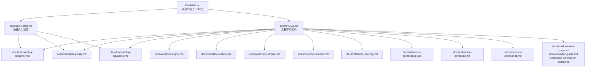

# 设计文档：新用户引导文档与 README 优化

## Overview

本设计定义 Forge 项目文档体系的信息架构，将现有密集的 README 重构为分层、可扫描的文档结构，并创建面向不同用户类型的引导路径。

### 设计目标

1. **30 秒决策**：新访客在 README 前 20 行内理解 Forge 是什么、能做什么
2. **5 分钟上手**：新用户通过快速入门指南完成安装并执行第一个命令
3. **分层深入**：不同经验水平的用户有各自的学习路径
4. **可发现性**：任何文档从 README 出发最多 2 次点击可达
5. **双语支持**：中文为主、核心文档提供英文版本

### 设计决策

| 决策 | 选择 | 理由 |
|------|------|------|
| 文档主语言 | 中文 | 与现有 README 和项目文档一致 |
| 英文版命名 | `<name>.en.md` 后缀 | 同目录便于维护，后缀清晰标识语言 |
| 索引位置 | `docs/INDEX.md` | 集中入口，不污染根目录 |
| 内容拆分阈值 | README 保留 ~150 行 | 当前 ~500 行，拆分后保留核心信息 |
| 工作流示例格式 | 独立文档 per 场景 | 每个场景完整独立，便于单独阅读 |

---

## Architecture

### 信息架构层次



### 文档分层模型

| 层级 | 目的 | 文档 | 目标阅读时间 |
|------|------|------|-------------|
| L0 门面 | 30 秒决策 | README.md | < 1 分钟 |
| L1 入门 | 首次上手 | quick-start.md | 5 分钟 |
| L2 引导 | 按角色深入 | onboarding-*.md | 15-30 分钟 |
| L3 实操 | 场景驱动 | workflow-*.md | 10 分钟/场景 |
| L4 参考 | 深度细节 | reference-*.md | 按需查阅 |

---

## Components and Interfaces

### 文件清单与职责

#### 核心文档（新建）

| 文件路径 | 职责 | 语言版本 |
|---------|------|---------|
| `docs/quick-start.md` | 5 步快速入门，从安装到首次执行 | 中文 + 英文 |
| `docs/quick-start.en.md` | 英文版快速入门 | 英文 |
| `docs/onboarding-beginner.md` | 初次接触者引导路径 | 中文 + 英文 |
| `docs/onboarding-beginner.en.md` | 英文版初次接触者引导 | 英文 |
| `docs/onboarding-daily.md` | 日常开发者引导路径 | 中文 + 英文 |
| `docs/onboarding-daily.en.md` | 英文版日常开发者引导 | 英文 |
| `docs/onboarding-advanced.md` | 高级用户/贡献者引导路径 | 中文 + 英文 |
| `docs/onboarding-advanced.en.md` | 英文版高级用户引导 | 英文 |
| `docs/INDEX.md` | 文档导航索引 | 中文 |
| `docs/INDEX.en.md` | 英文版文档索引 | 英文 |

#### 工作流示例文档（新建）

| 文件路径 | 场景 |
|---------|------|
| `docs/workflow-bugfix.md` | Bug 修复（轻量路径） |
| `docs/workflow-feature.md` | 新功能开发（标准路径） |
| `docs/workflow-complex.md` | 复杂需求（全量路径） |
| `docs/workflow-resume.md` | 会话恢复与团队协作 |

#### 参考文档（从 README 拆分）

| 文件路径 | 内容来源 |
|---------|---------|
| `docs/reference-security.md` | README 安全与信任章节 |
| `docs/reference-architecture.md` | README 目录结构、并行执行、状态保护章节 |
| `docs/reference-advanced.md` | README Forge Loop、cmux 集成、Domain Pack 章节 |
| `docs/reference-commands.md` | README 18 命令速查表、三维路由详解 |

### 文档间接口（链接关系）

每个文档遵循统一的导航接口：

```markdown
<!-- 文档头部导航 -->
[← 返回索引](./INDEX.md) | [English Version](./xxx.en.md)

<!-- 文档内容 -->
...

<!-- 文档尾部导航（可选） -->
---
**下一步**：[相关文档链接]
```

英文版文档头部：

```markdown
<!-- Navigation -->
[← Back to Index](./INDEX.en.md) | [中文版](./xxx.md)

> ⚠️ Translation may be behind the Chinese version. Chinese last updated: YYYY-MM-DD
```

---

## Data Models

### README 结构模型（重组后）

```markdown
# 🔥 Forge — 统一 AI 编码工作流框架

> 一句话描述 (< 100 字符)

## 核心价值 (3-5 要点，每条 < 50 字符)
- 要点 1
- 要点 2
- ...

## 快速开始
<!-- 最简安装命令 + 首次使用示例，~20 行 -->
<!-- 链接到 docs/quick-start.md -->

## 文档导航
<!-- Markdown 表格：文档名 | 路径 | 适用场景 -->

## 安装方式
<!-- 三种方式各 5 行摘要 + 链接到 quick-start.md 详细步骤 -->

## 命令概览
<!-- 精简表格，链接到 reference-commands.md -->

## 安全
<!-- 3-5 行摘要 + 链接到 reference-security.md -->

## 开发
<!-- 保留 npm scripts 部分 -->

## 许可证
```

### 文档索引条目模型

`docs/INDEX.md` 中每个条目的结构：

```markdown
| 文档标题 | 路径 | 简介 (≤120字符) | 适用场景 |
```

按用户意图分类为 5 个章节：
1. **入门** — 快速入门、安装指南
2. **日常使用** — 工作流示例、命令参考
3. **高级配置** — Forge Loop、Domain Pack、cmux
4. **故障排除** — 常见错误、调试指南
5. **贡献开发** — 贡献指南、架构说明

### 国际化文件命名规范

```
docs/
├── quick-start.md          # 中文（主版本）
├── quick-start.en.md       # 英文版本
├── onboarding-beginner.md
├── onboarding-beginner.en.md
├── INDEX.md                # 中文索引
├── INDEX.en.md             # 英文索引
└── ...
```

规则：
- 中文文件：`<name>.md`（无语言后缀）
- 英文文件：`<name>.en.md`
- 同目录放置，便于维护和交叉链接

### 翻译状态标记

英文版文件头部包含翻译状态元信息：

```markdown
> ⚠️ This translation may be behind the Chinese version. Chinese last updated: 2025-01-15

[中文版](./quick-start.md)
```

当中文版更新后英文版未同步时，此标记提醒读者。

---

## Error Handling

### 链接失效处理

| 场景 | 处理方式 |
|------|---------|
| README 链接指向未创建的文档 | 链接旁标注 `<!-- 待创建 -->` |
| 文档间交叉引用目标不存在 | CI 链接检查脚本报告失效链接的源文件和目标路径 |
| 英文版滞后于中文版 | 英文文件头部自动标注翻译滞后提示 |

### 链接检查机制

创建 `scripts/check-doc-links.sh` 脚本：
- 扫描 `docs/` 和根目录 `.md` 文件中的相对链接
- 验证链接目标文件存在
- 报告格式：`[ERROR] <源文件>:<行号> → <目标路径> (文件不存在)`
- 可集成到 CI 的 `npm run check` 流程中

### 内容缺失处理

- 快速入门中的故障排除：至少覆盖 3 个常见错误场景
- 每个场景包含：错误现象 → 原因说明 → 解决步骤
- 常见错误场景：
  1. Claude Code 版本过低
  2. 初始化脚本权限问题
  3. `/forge` 命令未识别（安装路径问题）

---

## Testing Strategy

### 为什么不使用属性测试

本功能是文档/信息架构项目，不涉及纯函数、解析器、序列化器或算法逻辑。验收标准关注的是内容结构、链接有效性和文档组织，这些适合用示例测试和静态分析验证，不适合属性测试。

### 测试方法

#### 1. 链接完整性检查（自动化脚本）

```bash
# scripts/check-doc-links.sh
# 验证所有 .md 文件中的相对链接指向存在的文件
# 输出失效链接列表
```

**覆盖需求**：5.5, 5.6, 3.7

#### 2. 文档结构验证（自动化脚本）

```bash
# scripts/check-doc-structure.sh
# 验证：
# - 每个 docs/*.md 文件第一行包含返回索引的链接 (需求 5.4)
# - 英文版文件包含中文版链接 (需求 6.5)
# - 中文版文件（有英文版时）包含英文版链接 (需求 6.5)
# - INDEX.md 包含所有纳入体系的文档条目 (需求 5.7)
```

**覆盖需求**：5.4, 6.3, 6.5

#### 3. README 指标检查（扩展现有脚本）

现有 `scripts/check-readme-metrics.sh` 可扩展验证：
- README 总行数 ≤ 200 行（需求 3.3）
- 前 20 行包含项目描述和核心卖点（需求 3.2）

**覆盖需求**：3.2, 3.3

#### 4. 内容审查（人工 Review）

以下验收标准需要人工审查：
- 快速入门步骤数 ≤ 5（需求 1.1）
- 命令示例可直接复制执行（需求 1.2, 3.5）
- 故障排除覆盖 ≥ 3 个场景（需求 1.6）
- 引导路径包含实操练习（需求 2.6）
- 工作流示例包含失败恢复流程（需求 4.4）

#### 5. CI 集成

将链接检查和结构验证集成到 `npm run check`：

```bash
# package.json scripts.check 追加：
# && bash scripts/check-doc-links.sh && bash scripts/check-doc-structure.sh
```

### 测试覆盖矩阵

| 需求 | 测试方式 | 自动化 |
|------|---------|--------|
| 1.1-1.8 | 内容审查 + 命令执行验证 | 部分（链接检查） |
| 2.1-2.7 | 内容审查 | 否 |
| 3.1-3.8 | README 指标脚本 + 链接检查 | 是 |
| 4.1-4.6 | 内容审查 | 否 |
| 5.1-5.7 | 链接检查 + 结构验证脚本 | 是 |
| 6.1-6.5 | 结构验证脚本 + 内容审查 | 部分 |
