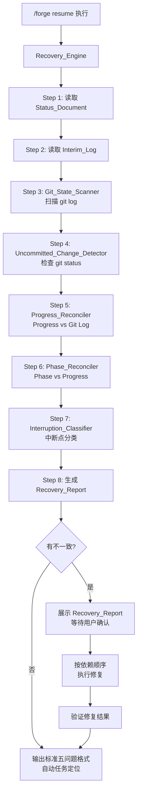
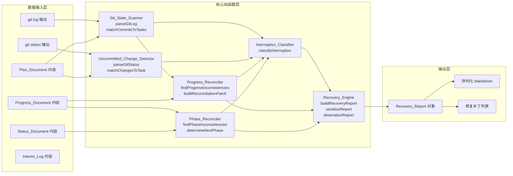

# Design Document: Error Recovery Strategy

## Overview

本设计为 Forge 的 `/forge resume` 命令引入系统性的错误恢复机制，通过 git log 扫描、未提交变更检测、状态交叉比对和中断点精确分类，实现会话中断后的自动状态恢复。

**核心问题**：当前 `/forge resume` 仅从 `.forge/status.md` 和 `.forge/progress/<topic>.md` 读取状态，不检查 git log，无法从 commit 推断任务完成状态。这导致五种中断场景下的状态不一致无法被自动检测和修复。

**设计特点**：这是一个纯 TypeScript 模块功能——所有核心逻辑（git log 解析、commit 匹配、状态比对、中断分类、报告序列化）都实现为纯函数，不执行 I/O。I/O 操作（git 命令执行、文件读写）由调用层负责，模块只接收数据并返回结果。

**设计原则**：
- **纯函数优先**：所有核心逻辑为纯函数，接收数据返回结果，不执行 I/O
- **优先级链**：恢复检查按固定优先级顺序执行，收集所有不一致后统一报告
- **事务性保障**：commit → progress → phase 更新序列遵循检查点模式，中断后可恢复
- **用户确认**：所有修复操作需用户确认后执行，不自动修改持久化状态

## Architecture

### 恢复引擎整体架构



### 模块依赖关系



## Components and Interfaces

### 1. Git_State_Scanner

负责解析 git log 输出并将 commit 与 Plan 任务匹配。

```typescript
/** 从 git log 解析出的单条 commit 信息 */
interface GitCommitEntry {
  hash: string;
  message: string;
  timestamp: string; // ISO 8601
}

/** Plan 任务的 commit message 模式 */
interface TaskCommitPattern {
  taskId: string;
  taskTitle: string;
  /** commit message 前缀，如 "feat(topic):" */
  prefix: string;
  /** 任务标识关键词列表 */
  keywords: string[];
}

/** commit 与任务的匹配结果 */
interface CommitTaskMatch {
  commit: GitCommitEntry;
  taskId: string;
  taskTitle: string;
  /** 匹配置信度：exact（前缀+关键词完全匹配）或 fuzzy（前缀匹配+部分关键词） */
  confidence: "exact" | "fuzzy";
}

/** Git_State_Scanner 扫描结果 */
interface GitScanResult {
  commits: GitCommitEntry[];
  matches: CommitTaskMatch[];
  /** 无新 commit 时为 true */
  noNewCommits: boolean;
}
```

**纯函数接口**：

```typescript
/** 解析 git log --format 输出为 GitCommitEntry 数组 */
function parseGitLog(rawOutput: string): GitCommitEntry[];

/** 从 Plan_Document 内容提取 TaskCommitPattern 列表 */
function extractCommitPatterns(planContent: string): TaskCommitPattern[];

/** 将 commit 列表与任务模式匹配 */
function matchCommitsToTasks(
  commits: GitCommitEntry[],
  patterns: TaskCommitPattern[]
): CommitTaskMatch[];

/** 过滤出指定时间戳之后的 commit */
function filterCommitsSince(
  commits: GitCommitEntry[],
  sinceTimestamp: string
): GitCommitEntry[];
```

### 2. Uncommitted_Change_Detector

负责解析 git status 输出并判断未提交变更与当前任务的相关性。

```typescript
/** git status 解析结果中的单个文件变更 */
interface FileChange {
  filePath: string;
  status: "modified" | "added" | "deleted" | "untracked";
}

/** 未提交变更检测结果 */
interface UncommittedChangeResult {
  changes: FileChange[];
  /** 与当前任务相关的变更 */
  relevantChanges: FileChange[];
  /** 工作目录是否干净 */
  isClean: boolean;
}
```

**纯函数接口**：

```typescript
/** 解析 git status --porcelain 输出为 FileChange 数组 */
function parseGitStatus(rawOutput: string): FileChange[];

/** 判断文件变更是否与任务相关（基于 Plan 中定义的文件路径） */
function matchChangesToTask(
  changes: FileChange[],
  taskFilePaths: string[]
): FileChange[];
```

### 3. Progress_Reconciler

负责比对 git log 匹配结果与 Progress_Document 状态，识别不一致。

```typescript
/** Progress_Document 中的任务状态 */
interface ProgressTaskEntry {
  taskId: string;
  taskTitle: string;
  completed: boolean;
  completionTime: string | null;
}

/** 进度不一致项 */
interface ProgressInconsistency {
  taskId: string;
  taskTitle: string;
  /** 匹配到的 commit */
  commitHash: string;
  commitMessage: string;
  commitTimestamp: string;
  /** 不一致类型 */
  type: "committed-but-not-marked";
}

/** 进度协调补丁 */
interface ProgressReconciliationPatch {
  taskId: string;
  markCompleted: true;
  completionTime: string;
  sourceCommitHash: string;
}

/** 依赖缺口 */
interface DependencyGap {
  taskId: string;
  taskTitle: string;
  missingDependencyTaskId: string;
  missingDependencyTitle: string;
}
```

**纯函数接口**：

```typescript
/** 识别 "committed but progress not updated" 的任务 */
function findProgressInconsistencies(
  matches: CommitTaskMatch[],
  progressEntries: ProgressTaskEntry[]
): ProgressInconsistency[];

/** 检查依赖缺口：已匹配 commit 的任务的前置依赖是否也已完成 */
function findDependencyGaps(
  inconsistencies: ProgressInconsistency[],
  progressEntries: ProgressTaskEntry[],
  taskOrder: string[]
): DependencyGap[];

/** 生成协调补丁列表（按 Plan 任务顺序） */
function buildReconciliationPatch(
  inconsistencies: ProgressInconsistency[],
  taskOrder: string[]
): ProgressReconciliationPatch[];
```

### 4. Phase_Reconciler

负责比对 Progress_Document 完成状态与 Status_Document phase 字段。

```typescript
/** Forge 工作流阶段 */
type ForgePhase = "decide" | "spec" | "plan" | "build" | "review" | "test" | "ship" | "learn";

/** Forge 工作流档位 */
type ForgeTier = "lightweight" | "standard" | "full";

/** 阶段不一致项 */
interface PhaseInconsistency {
  currentPhase: ForgePhase;
  expectedPhase: ForgePhase;
  /** "behind"：phase 落后于 progress；"ahead"：phase 超前于 progress */
  direction: "behind" | "ahead";
  evidence: string;
}
```

**纯函数接口**：

```typescript
/** 获取指定档位的阶段序列 */
function getPhaseSequence(tier: ForgeTier): ForgePhase[];

/** 获取指定阶段在序列中的下一个阶段 */
function getNextPhase(currentPhase: ForgePhase, tier: ForgeTier): ForgePhase | null;

/** 检测阶段不一致 */
function findPhaseInconsistencies(
  allTasksCompleted: boolean,
  currentPhase: ForgePhase,
  tier: ForgeTier
): PhaseInconsistency | null;
```

### 5. Interruption_Classifier

负责根据各检测器的结果将中断点归类为五种场景之一。

```typescript
/** 中断分类结果 */
type InterruptionCategory =
  | "task-completed-not-committed"
  | "committed-not-progress-updated"
  | "progress-updated-not-phase-advanced"
  | "subagent-mid-execution"
  | "clean-state";

/** TDD 中断阶段 */
type TDDInterruptionPhase =
  | "red"              // 测试文件存在，实现缺失或空
  | "green-incomplete" // 测试和实现都存在，但测试失败
  | "refactor-incomplete"; // 测试通过，但有未提交的重构变更

/** 中断分类详情 */
interface InterruptionClassification {
  category: InterruptionCategory;
  evidence: string;
  /** 仅当 category 为 "subagent-mid-execution" 时有值 */
  tddPhase: TDDInterruptionPhase | null;
}
```

**纯函数接口**：

```typescript
/** 分类中断点（按优先级顺序检查） */
function classifyInterruption(
  uncommittedResult: UncommittedChangeResult,
  gitScanResult: GitScanResult,
  progressInconsistencies: ProgressInconsistency[],
  phaseInconsistency: PhaseInconsistency | null,
  verificationPassed: boolean | null
): InterruptionClassification;

/** 判断文件是否为测试文件 */
function isTestFile(filePath: string): boolean;

/** 从未提交变更推断 TDD 中断阶段 */
function inferTDDPhase(
  changes: FileChange[],
  verificationPassed: boolean | null
): TDDInterruptionPhase | null;
```

### 6. Recovery_Engine（报告生成与序列化）

负责汇总所有检测结果生成 Recovery_Report，并提供序列化/反序列化。

```typescript
/** 恢复报告中的单个不一致项 */
interface RecoveryInconsistencyItem {
  category: string;
  evidence: string;
  recommendedAction: string;
}

/** 恢复报告中的用户操作选项 */
interface RecoveryActionOption {
  index: number;
  description: string;
  isDefault: boolean;
}

/** 恢复报告 */
interface RecoveryReport {
  /** 头部信息 */
  header: {
    taskName: string;
    tier: ForgeTier;
    phase: ForgePhase;
    lastUpdate: string;
    interruptionCategory: InterruptionCategory;
  };
  /** 不一致项列表 */
  inconsistencies: RecoveryInconsistencyItem[];
  /** 操作选项（每个不一致项对应一组选项） */
  actions: RecoveryActionOption[][];
  /** 摘要统计 */
  summary: {
    totalInconsistencies: number;
    autoFixable: number;
    requiresUserDecision: number;
  };
}

/** 检查点标记（写入 Interim_Log） */
interface CheckpointMarker {
  taskId: string;
  intendedCommitMessage: string;
  timestamp: string;
}

/** 任务分段信息 */
interface TaskSegmentationInfo {
  completedTasks: Array<{ taskId: string; commitHash: string }>;
  currentTask: { taskId: string; interruptionState: string } | null;
  remainingTasks: string[];
  lastCompletedIndex: number;
}
```

**纯函数接口**：

```typescript
/** 汇总所有检测结果生成 Recovery_Report */
function buildRecoveryReport(
  header: RecoveryReport["header"],
  progressInconsistencies: ProgressInconsistency[],
  phaseInconsistency: PhaseInconsistency | null,
  classification: InterruptionClassification,
  uncommittedResult: UncommittedChangeResult,
  dependencyGaps: DependencyGap[]
): RecoveryReport;

/** 序列化 Recovery_Report 为 Markdown 格式 */
function serializeRecoveryReport(report: RecoveryReport): string;

/** 反序列化 Markdown 为 Recovery_Report */
function deserializeRecoveryReport(markdown: string): RecoveryReport;

/** 序列化 InterruptionClassification */
function serializeClassification(classification: InterruptionClassification): string;

/** 反序列化 InterruptionClassification */
function deserializeClassification(text: string): InterruptionClassification;

/** 序列化 CheckpointMarker */
function serializeCheckpointMarker(marker: CheckpointMarker): string;

/** 反序列化 CheckpointMarker */
function deserializeCheckpointMarker(text: string): CheckpointMarker;

/** 计算任务分段信息 */
function calculateSegmentation(
  planTaskIds: string[],
  completedTaskIds: string[],
  commitMatches: CommitTaskMatch[],
  currentInterruption: InterruptionClassification | null
): TaskSegmentationInfo;
```

## Data Models

### 核心数据类型汇总

| 模型 | 用途 | 序列化格式 |
|------|------|-----------|
| `GitCommitEntry` | git log 解析结果 | 内部使用，不序列化 |
| `TaskCommitPattern` | Plan 任务 commit 模式 | 从 Plan_Document 解析 |
| `CommitTaskMatch` | commit-任务匹配结果 | 内部使用 |
| `FileChange` | git status 解析结果 | 内部使用 |
| `ProgressTaskEntry` | Progress_Document 任务状态 | 从 Progress_Document 解析 |
| `ProgressInconsistency` | 进度不一致项 | Recovery_Report 内嵌 |
| `PhaseInconsistency` | 阶段不一致项 | Recovery_Report 内嵌 |
| `InterruptionClassification` | 中断分类结果 | 结构化文本（往返测试） |
| `RecoveryReport` | 恢复报告 | Markdown（往返测试） |
| `CheckpointMarker` | 事务检查点 | 结构化文本（往返测试） |
| `TaskSegmentationInfo` | 任务分段信息 | 内部使用 |

### 阶段序列定义

```typescript
const PHASE_SEQUENCES: Record<ForgeTier, ForgePhase[]> = {
  lightweight: ["build", "review"],
  standard: ["plan", "build", "review", "test", "ship"],
  full: ["decide", "spec", "plan", "build", "review", "test", "ship", "learn"],
};
```

### 测试文件匹配模式

```typescript
const TEST_FILE_PATTERNS = [
  /\.test\.[tj]sx?$/,
  /\.spec\.[tj]sx?$/,
  /^test\//,
  /\/__tests__\//,
];
```

### Recovery_Report Markdown 序列化格式

```markdown
---
task: <task_name>
tier: <tier>
phase: <phase>
last_update: <ISO timestamp>
interruption: <category>
---

## Inconsistencies

### 1. <category_label>
**Evidence:** <evidence_description>
**Recommended:** <recommended_action>

**Options:**
1. [x] <default_option_description>
2. [ ] <alternative_option_description>

## Summary
- Total: <count>
- Auto-fixable: <count>
- Requires decision: <count>
```

## Correctness Properties

*A property is a characteristic or behavior that should hold true across all valid executions of a system — essentially, a formal statement about what the system should do. Properties serve as the bridge between human-readable specifications and machine-verifiable correctness guarantees.*

### Property 1: Commit pattern extraction completeness

*For any* valid Plan_Document content containing task entries with commit message patterns, `extractCommitPatterns` SHALL return a `TaskCommitPattern` for every task that has a defined commit message, and each pattern SHALL contain the correct prefix and keywords.

**Validates: Requirements 1.1**

### Property 2: Commit-to-task matching with fuzzy tolerance

*For any* set of `GitCommitEntry` items and `TaskCommitPattern` items, `matchCommitsToTasks` SHALL match a commit to a task when the commit message contains the task's prefix and task-identifying keywords, tolerating minor wording variations, and SHALL NOT match when the prefix is absent.

**Validates: Requirements 1.2, 1.4**

### Property 3: Git status parsing correctness

*For any* valid `git status --porcelain` output string, `parseGitStatus` SHALL return a `FileChange` array where each entry has the correct file path and status (modified, added, deleted, or untracked), and the total count matches the number of status lines in the input.

**Validates: Requirements 2.1**

### Property 4: File change to task relevance matching

*For any* set of `FileChange` items and task file path list, `matchChangesToTask` SHALL return exactly those changes whose file paths overlap with the task file paths, and SHALL return an empty array when there is no overlap.

**Validates: Requirements 2.2**

### Property 5: Progress inconsistency detection

*For any* set of `CommitTaskMatch` items and `ProgressTaskEntry` items, `findProgressInconsistencies` SHALL flag exactly those tasks that have a matching commit but are not marked as completed in the progress entries, and each flagged item SHALL include the commit hash, message, and timestamp.

**Validates: Requirements 1.3, 3.1**

### Property 6: Reconciliation patch ordering preserves Plan order

*For any* set of `ProgressInconsistency` items (in any order) and a task order list, `buildReconciliationPatch` SHALL produce patches ordered according to the task order list, and each patch SHALL reference the correct source commit hash and completion time.

**Validates: Requirements 3.2, 3.3**

### Property 7: Dependency gap detection

*For any* set of `ProgressInconsistency` items, `ProgressTaskEntry` items, and task order list, `findDependencyGaps` SHALL flag a gap when a task has a matching commit but a preceding task in the order list is neither marked completed nor has a matching commit.

**Validates: Requirements 3.4**

### Property 8: Phase inconsistency detection (both directions)

*For any* combination of task completion state (all completed or not), current phase, and tier, `findPhaseInconsistencies` SHALL return a "behind" inconsistency when all tasks are completed but the phase has not advanced, a "ahead" inconsistency when tasks are incomplete but the phase is beyond the expected position, and null when phase and progress are consistent.

**Validates: Requirements 4.1, 4.3**

### Property 9: Next phase computation correctness

*For any* valid (phase, tier) combination where the phase appears in the tier's phase sequence, `getNextPhase` SHALL return the immediately following phase in the sequence, or null if the phase is the last in the sequence.

**Validates: Requirements 4.2, 4.4**

### Property 10: Interruption classification totality and evidence validity

*For any* combination of inputs (uncommittedResult, gitScanResult, progressInconsistencies, phaseInconsistency, verificationPassed), `classifyInterruption` SHALL return exactly one of the five categories, and the returned category's evidence conditions SHALL be satisfied by the inputs (e.g., "task-completed-not-committed" requires non-empty relevant uncommitted changes; "committed-not-progress-updated" requires non-empty progress inconsistencies).

**Validates: Requirements 5.1, 5.2, 5.3, 5.4**

### Property 11: Interruption classification priority ordering

*For any* input where multiple classification conditions are simultaneously true, `classifyInterruption` SHALL return the highest-priority category according to the fixed order: (a) task-completed-not-committed → (b) committed-not-progress-updated → (c) progress-updated-not-phase-advanced → (d) subagent-mid-execution → (e) clean-state.

**Validates: Requirements 5.6**

### Property 12: TDD phase inference from file changes

*For any* set of `FileChange` items containing test files, `inferTDDPhase` SHALL return "red" when test files exist but no corresponding implementation files exist, "green-incomplete" when both exist but verification fails, "refactor-incomplete" when verification passes but uncommitted changes remain, and null when the state is ambiguous.

**Validates: Requirements 5.5, 6.1**

### Property 13: Test file identification

*For any* file path string, `isTestFile` SHALL return true if and only if the path matches one of the defined test file patterns (`*.test.ts`, `*.spec.ts`, `test/*`, `__tests__/*`).

**Validates: Requirements 6.4**

### Property 14: Recovery report completeness

*For any* valid inputs to `buildRecoveryReport`, the resulting `RecoveryReport` SHALL include all provided inconsistencies (none dropped), each inconsistency SHALL have non-empty category, evidence, and recommendedAction fields, each inconsistency SHALL have at least one action option with exactly one marked as default, and the summary counts SHALL satisfy: totalInconsistencies equals the inconsistency list length, and autoFixable + requiresUserDecision equals totalInconsistencies.

**Validates: Requirements 7.2, 7.3, 8.1, 8.2, 8.3, 8.4**

### Property 15: Task segmentation correctness

*For any* set of plan task IDs, completed task IDs, and commit matches, `calculateSegmentation` SHALL partition tasks into completed (with commit references), current (with interruption state), and remaining, where completed + current + remaining covers all plan tasks with no duplicates, and lastCompletedIndex is consistent with the completed list.

**Validates: Requirements 9.1, 9.2**

### Property 16: Recovery_Report serialization round-trip

*For any* valid `RecoveryReport` object, `serializeRecoveryReport` followed by `deserializeRecoveryReport` SHALL yield a semantically equivalent `RecoveryReport` object, preserving all fields including header, inconsistency list, action selections, and summary counts.

**Validates: Requirements 11.1, 11.2, 11.3**

### Property 17: InterruptionClassification serialization round-trip

*For any* valid `InterruptionClassification` object, `serializeClassification` followed by `deserializeClassification` SHALL yield a semantically equivalent `InterruptionClassification` object, preserving category, evidence, and tddPhase fields.

**Validates: Requirements 11.4**

### Property 18: CheckpointMarker serialization round-trip

*For any* valid `CheckpointMarker` object, `serializeCheckpointMarker` followed by `deserializeCheckpointMarker` SHALL yield a semantically equivalent `CheckpointMarker` object, preserving taskId, intendedCommitMessage, and timestamp fields.

**Validates: Requirements 10.4**

## Error Handling

### 解析失败处理

| 场景 | 处理方式 |
|------|---------|
| git log 输出为空或格式异常 | `parseGitLog` 返回空数组，`GitScanResult.noNewCommits` 设为 true |
| git status 输出格式异常 | `parseGitStatus` 跳过无法解析的行，返回已成功解析的条目 |
| Plan_Document 无 commit message 模式 | `extractCommitPatterns` 返回空数组，跳过 commit 匹配步骤 |
| Progress_Document 格式异常 | 返回解析错误，Recovery_Report 中标注 "progress document parse error" |
| Status_Document 缺少 phase 字段 | Phase_Reconciler 跳过阶段检查，报告 "phase field missing" |

### 序列化/反序列化失败处理

| 场景 | 处理方式 |
|------|---------|
| `serializeRecoveryReport` 抛出异常 | 回退到纯文本格式输出，记录警告到 `.forge/debug/` |
| `deserializeRecoveryReport` 解析失败 | 返回 null，调用层重新执行完整恢复流程 |
| `serializeCheckpointMarker` 失败 | 跳过检查点写入，记录警告（不阻断 commit 流程） |
| Interim_Log 格式损坏 | 跳过 Interim_Log 读取，依赖 git log 扫描重建状态 |

### 边界情况

- **无 Plan_Document**：Recovery_Engine 跳过 commit 匹配和依赖检查，仅执行 git status 检测和 phase 检查
- **无 Progress_Document**：Recovery_Engine 将所有任务视为未完成，依赖 git log 重建进度
- **git 命令执行失败**：对应检测器返回错误状态，Recovery_Report 中标注 "git command failed"，不阻断其他检测步骤
- **所有检测步骤都失败**：Recovery_Report 输出 "recovery scan incomplete" 警告，回退到标准五问题格式
- **并发会话冲突**：依赖现有 state.ts 的文件锁机制，Recovery_Engine 不引入额外锁

## Testing Strategy

### 测试框架

- **单元测试**：Vitest（项目已配置）
- **属性测试**：fast-check（与 Vitest 集成，项目已使用）
- 每个属性测试最少 100 次迭代

### 属性测试（Property-Based Tests）

本功能的属性测试集中在纯函数模块上，覆盖所有核心逻辑。

| Property | 测试文件 | 生成器 |
|----------|---------|--------|
| Property 1: Commit pattern extraction | `test/error-recovery.property.test.ts` | 随机 Plan_Document 内容（随机任务数、commit 前缀、关键词） |
| Property 2: Commit-to-task matching | `test/error-recovery.property.test.ts` | 随机 GitCommitEntry 数组 + TaskCommitPattern 数组（含匹配和不匹配的组合） |
| Property 3: Git status parsing | `test/error-recovery.property.test.ts` | 随机 git status --porcelain 输出（随机文件路径、状态码） |
| Property 4: File change relevance | `test/error-recovery.property.test.ts` | 随机 FileChange 数组 + 任务文件路径列表 |
| Property 5: Progress inconsistency detection | `test/error-recovery.property.test.ts` | 随机 CommitTaskMatch + ProgressTaskEntry 组合 |
| Property 6: Reconciliation patch ordering | `test/error-recovery.property.test.ts` | 随机 ProgressInconsistency 数组（乱序）+ 任务顺序列表 |
| Property 7: Dependency gap detection | `test/error-recovery.property.test.ts` | 随机任务链（部分有 commit、部分无） |
| Property 8: Phase inconsistency detection | `test/error-recovery.property.test.ts` | 随机 (allCompleted, phase, tier) 组合 |
| Property 9: Next phase computation | `test/error-recovery.property.test.ts` | 枚举所有 (phase, tier) 组合 |
| Property 10: Classification totality + evidence | `test/error-recovery-classifier.property.test.ts` | 随机 (uncommittedResult, gitScanResult, progressInconsistencies, phaseInconsistency) 组合 |
| Property 11: Classification priority | `test/error-recovery-classifier.property.test.ts` | 随机输入（多条件同时为真） |
| Property 12: TDD phase inference | `test/error-recovery-classifier.property.test.ts` | 随机 FileChange 数组（含测试文件和实现文件的各种组合） |
| Property 13: Test file identification | `test/error-recovery-classifier.property.test.ts` | 随机文件路径字符串 |
| Property 14: Report completeness | `test/error-recovery-report.property.test.ts` | 随机 RecoveryReport 输入参数 |
| Property 15: Task segmentation | `test/error-recovery-report.property.test.ts` | 随机 (planTaskIds, completedTaskIds, commitMatches) 组合 |
| Property 16: Recovery_Report round-trip | `test/error-recovery-roundtrip.property.test.ts` | 随机 RecoveryReport 对象 |
| Property 17: InterruptionClassification round-trip | `test/error-recovery-roundtrip.property.test.ts` | 随机 InterruptionClassification 对象 |
| Property 18: CheckpointMarker round-trip | `test/error-recovery-roundtrip.property.test.ts` | 随机 CheckpointMarker 对象 |

标签格式：`Feature: error-recovery-strategy, Property N: <property_text>`

### 单元测试

| 测试范围 | 测试内容 |
|---------|---------|
| 空 git log 输出 | parseGitLog 返回空数组 |
| 空 git status 输出 | parseGitStatus 返回空数组，isClean 为 true |
| 验证通过时的报告选项 | Recovery_Report 包含 commit 和 discard 选项 |
| 验证失败时的报告选项 | Recovery_Report 包含 keep 和 discard 选项 |
| TDD RED 阶段报告选项 | Recovery_Report 包含 preserve 和 discard 选项 |
| TDD REFACTOR 阶段报告选项 | Recovery_Report 包含 commit 和 continue 选项 |
| 阶段序列正确性 | getPhaseSequence 对三种档位返回正确序列 |
| 修复依赖顺序 | progress 补丁在 phase 补丁之前 |
| 零不一致时的输出 | 触发标准五问题恢复格式 |
| 检查点标记无匹配 commit | 分类为 "task-completed-not-committed" |
| 协调注释格式 | 补丁包含任务 ID 和 commit hash 的注释 |

### 回归测试

现有测试必须全部通过，确保新增功能不破坏：
- `test/resume.property.test.ts`（现有 resume 五问题输出）
- `test/git-transaction.property.test.ts`（git 命令构建）
- `test/state.property.test.ts`（状态文件管理）
- `test/plan.property.test.ts`（Plan 文档验证）
- `test/frontmatter.property.test.ts`（frontmatter 解析）

