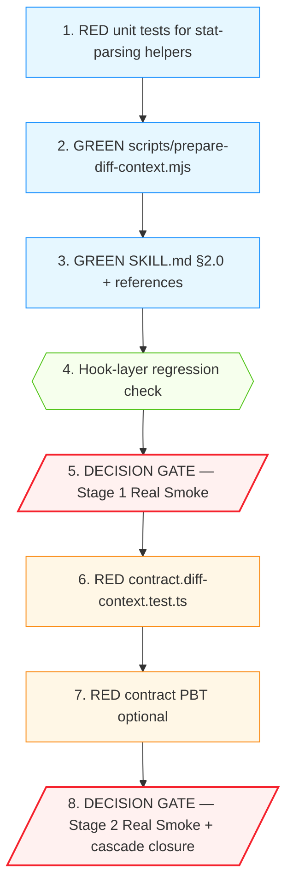

# Implementation Plan

## Introduction

本 spec 是 `subagent-foreground-truncation` 的 **followup** orchestrator-layer bugfix。Stage 4 Real Smoke 揭示 quality-check 回归，事实校准 V4 后根因为**主 agent prompt-following bug**：`/forge review` 流程 Step 1.5 由主 agent 在主会话手工产出 `.forge/reviews/.diff-context.md`，主 agent 没按 SKILL.md §2.0 step 4 把真实 unified diff hunk 写入文件，而是写了 narrative summary。仓库 grep 实证**没有 orchestrator 自动化代码**——SKILL.md 与 references 是纯 prompt 文档。

修复方向 A + B（见 design.md "Architecture / Components"）：

- **A**：实现 `scripts/prepare-diff-context.mjs` 脚本化主路径，复用 `src/mcp/tools/forge-git.ts:86` 的 `truncateDiffContent` pure function（零 MCP 依赖），把手工 4 步 prompt 流程换成单一 `bash` 调用。SKILL.md §2.0 + `references/diff-context-preparation.md` 同步。
- **B**：契约测试 `test/contract.diff-context.test.ts` 扫 `## Patch` 段必须含 unified diff hunk marker（`@@`/`---`/`+++`），narrative summary 反模式 → CI FAIL；可选 PBT 与 PostToolUse hook 守护。

本 tasks 文件按 design.md 两阶段 rollout 组织：

- **Stage 1（脚本 + 文档同步，可独立验证）**：3 任务 — RED unit test for stat parsing helpers → GREEN script → GREEN SKILL/refs；末尾设 manual decision gate（Real `/forge review`）。
- **Stage 2（契约测试 + 可选 hook 守护，防退化）**：3 任务 — RED contract test → GREEN narrative-anti-pattern detection → manual decision gate（故意 narrative 时 CI 拦截）。

每个任务遵守：

1. **TDD 铁律（AGENTS.md §2.1）**：每个 GREEN 任务前置一个 RED 任务。配置改动通过既有 baseline + 契约扫描守护。
2. **Verification 铁律（AGENTS.md §2.3）**：每个任务给出可运行的 `npx vitest run <path>` 或等效命令；声明完成必须基于实际命令输出。
3. **原子提交**：每个任务一次 commit，conventional commits + footer 引用任务号 + Property 编号。

需求映射来自 `bugfix.md` 2.x / 3.x；Property 编号来自 `design.md` § Correctness Properties P1–P5。

---

## Overview

本 spec 高层摘要：

- **修复 Scope**：1 新脚本（`scripts/prepare-diff-context.mjs`）+ 2 份 SKILL/references 文档同步 + 1 份契约测试（可选 PBT）+ 可选 PostToolUse hook 守护。
- **新增组件**：
  - 脚本：脚本化 Step 1.5，复用 `truncateDiffContent` pure function；输出 schema 等价现有 `forge_git(diff-content)`。
  - 契约扫描：扫 `## Patch` 段含 unified diff marker；narrative summary anti-pattern 检测。
  - 文档：SKILL.md §2.0 + references 改为单一 bash 调用，明示禁止 narrative summary 替代。
- **Rollout 划分**：2 阶段 / 共 6 任务。
- **完成判据**：见 `## Acceptance Criteria for Spec Closure`（4 条）。

---

## Tasks

### Stage 1 — 脚本化主路径 + 文档同步（3 任务）

> **Stage 1 目标**：实现 `scripts/prepare-diff-context.mjs` + 改 SKILL.md/references，让 Step 1.5 从手工 4 步变成单一 bash 调用。Stage 1 完成后通过 Real `/forge review` 验证 quality-check 是否恢复完整 Layer 2 报告。

- [x] 1. **Property 1: Bug Condition** — RED unit tests for `prepare-diff-context.mjs` stat parsing helpers
  - **CRITICAL**: 该测试在 UNFIXED 树上 RED — 脚本 + 其 export 的 helper 都尚未存在 → import 失败/模块未导出。
  - **DO NOT attempt to write the script in this task** — 仅交付 RED 单元测试。
  - **GOAL**: 把 `parseFileCount` / `parseAddedRemoved` / `formatFrontmatter` 三个 pure helper 的契约用枚举式单测固化。这是 Stage 1 GREEN 任务的红线。
  - 涉及文件：
    - 新建：`test/prepare-diff-context.test.ts`
  - 测试用例：
    1. `parseFileCount(stat)` — 接受 `git diff --stat` 输出，返回文件数。
       - 空字符串 → 0
       - 单文件（`agents/spec-check.md | 51 +++++--`）→ 1
       - 多文件（5 行 + summary）→ 5
    2. `parseAddedRemoved(stat)` — 返回 `{added: number, removed: number}`。
       - 空字符串 → `{0, 0}`
       - `1 file changed, 28 insertions(+), 23 deletions(-)` → `{28, 23}`
       - `1 file changed, 5 insertions(+)` → `{5, 0}`
       - `1 file changed, 3 deletions(-)` → `{0, 3}`
    3. `formatFrontmatter({base, head, fileCount, totalAdded, totalRemoved, truncated, source})` — 返回 7 字段 frontmatter 字符串。
       - 含 `---\n...\n---` 包裹
       - 7 个字段全部出现
       - `source` 字段值是 `shell_with_truncate_lib`
       - `truncated` 是 `true|false`
  - 运行测试：**EXPECTED OUTCOME — 全部 RED**（脚本 + helpers 不存在）。
  - Depends On: 无（首个任务）。
  - Verify: `npx vitest run test/prepare-diff-context.test.ts`
  - Commit: `test(prepare-diff-context): seed stat-parsing + frontmatter contract for diff-context preparation [P1,P3,P4]`
  - _Bug_Condition: 主 agent 缺少脚本化路径，被迫手工拼接 4 步 prompt 流程。_
  - _Requirements: 2.1, 2.2_

- [x] 2. GREEN — 实现 `scripts/prepare-diff-context.mjs`，让 task 1 通过
  - 涉及文件：
    - 新建：`scripts/prepare-diff-context.mjs`
  - 实现细节（与 design.md "Component 1" 严格对齐）：
    1. shebang `#!/usr/bin/env node`；`category: internal-only` 注释。
    2. 顶部 import：
       - `execSync` from `node:child_process`
       - `mkdirSync, writeFileSync` from `node:fs`
       - `dirname` from `node:path`
       - `truncateDiffContent` from `../dist/src/mcp/tools/forge-git.js`（pure function 复用，零 MCP 依赖）
    3. Export pure helpers（满足 task 1 测试）：
       - `parseFileCount(stat: string): number`
       - `parseAddedRemoved(stat: string): {added: number, removed: number}`
       - `formatFrontmatter({base, head, fileCount, totalAdded, totalRemoved, truncated, source}): string`
    4. Top-level orchestration（仅当作为 script 入口时执行，不在 import 时跑）：
       - `git merge-base main HEAD` → BASE，fallback `HEAD~1`
       - `git rev-parse HEAD` → HEAD_SHA（失败 exit 1）
       - `git diff --stat ${BASE}...HEAD` → diffStat
       - `git diff ${BASE}...HEAD -- ':(exclude)*.lock' ':(exclude)package-lock.json' ':(exclude)dist/*' ':(exclude)*.d.ts'` → rawDiff
       - `truncateDiffContent(rawDiff)` → truncatedDiff（fallback：import 失败 → `rawDiff.slice(0, 200000)`）
       - `wasTruncated = truncatedDiff.length < rawDiff.length`
       - 调用 `formatFrontmatter` + 拼接 `## Diff Stat` + `## Diff Content` 段
       - `mkdirSync(.forge/reviews, recursive: true)` + `writeFileSync(.forge/reviews/.diff-context.md, content)`
       - stdout 输出 `Wrote .forge/reviews/.diff-context.md`
    5. 支持 `--dry-run` flag（不写文件，只 print 完整内容到 stdout，便于自检）。
  - Depends On: task 1。
  - Verify: 
    1. `npx vitest run test/prepare-diff-context.test.ts` — **EXPECTED**: 全部 PASS。
    2. `node scripts/prepare-diff-context.mjs --dry-run` — **EXPECTED**: 输出含 `---\nbase:` frontmatter + `## Diff Stat` + `## Diff Content` + 至少一个 `@@` / `--- a/` / `+++ b/` hunk marker（在当前 working tree 有 diff 时）。
    3. `node scripts/prepare-diff-context.mjs` — **EXPECTED**: stdout 输出 `Wrote ...`，文件 `.forge/reviews/.diff-context.md` 存在且含 hunk marker。
  - Commit: `feat(prepare-diff-context): introduce script-based Step 1.5 with truncateDiffContent reuse [stage 1 of 2] [P1,P2,P3,P4]`
  - _Bug_Condition: 主 agent 没按 SKILL.md §2.0 step 4 写真实 hunk，因为没有可调用的脚本化路径。_
  - _Expected_Behavior: 单一 bash 调用替代手工 4 步，确定性写入真实 unified diff hunk。_
  - _Preservation: 脚本不调 forge_git MCP；走 shell `git diff` + 复用 `truncateDiffContent` pure function；schema 等价现有 `.diff-context.md`。_
  - _Requirements: 2.1, 2.2, 2.6, 3.3_

- [x] 3. GREEN — 改写 `skills/forge-review/SKILL.md` §2.0 + `references/diff-context-preparation.md` 为单一脚本调用
  - 涉及文件：
    - 修改：`skills/forge-review/SKILL.md`（§2.0 段落）
    - 修改：`skills/forge-review/references/diff-context-preparation.md`
  - 实现细节（与 design.md "Component 2 / 3" 严格对齐）：
    1. **SKILL.md §2.0 改写**：把现有 4 步流程压缩为单一调用：
       ```
       **单一调用**：
       
       node scripts/prepare-diff-context.mjs
       
       脚本自动执行：BASE_BRANCH 解析 → diff stat + content 取出 → 智能截断（按文件优先级 + 单文件 200 行 / 总量 1500 行上限） → 写 .forge/reviews/.diff-context.md。
       
       **禁止**：手工拼接 narrative summary 替代真实 patch hunk。脚本输出含 unified diff hunk（@@ 标记）的真实内容；如脚本不可用 → fallback shell `git diff ${BASE}...HEAD | head -3000` 并直接写入 `## Diff Content` 段，不要替换为 narrative summary。
       ```
    2. **references/diff-context-preparation.md 同步**：保留 Step 1-4 详细描述（脚本内部已封装），新增 `## Why Narrative Summary is Forbidden` 段引用 Stage 4 现象 + bugfix.md "Bug Condition"。
    3. **不动**其它段落 — 截断策略 / 推荐配置 / 优先路径降级路径描述等保持现有文字。
  - Depends On: task 2。
  - Verify: 
    1. `npx vitest run test/prepare-diff-context.test.ts` — 仍 PASS。
    2. 既有 SKILL contract test（如有）— 仍 PASS。
    3. `grep -c '## Why Narrative Summary' skills/forge-review/references/diff-context-preparation.md` — 应输出 1。
  - Commit: `docs(forge-review): replace 4-step manual flow with single prepare-diff-context.mjs invocation [stage 1 of 2] [P1]`
  - _Bug_Condition: SKILL.md §2.0 step 4 措辞不显式禁止 narrative summary，未给 unified diff 字面量示例。_
  - _Expected_Behavior: 主 agent 看到单一 bash 调用 + 显式禁止条款，不再自由发挥 step 4。_
  - _Preservation: 截断策略 / 推荐配置 等其它段落 byte-equal 保留。_
  - _Requirements: 2.1, 3.7_

- [x] 4. **Property 5: Preservation** — 既有前序 spec 测试 + 全量回归
  - **CRITICAL**: 守护 Stage 1 改动不污染前序 4 个 spec 的产出。
  - 涉及文件：无（仅运行既有测试）。
  - Depends On: tasks 1-3。
  - Verify (按顺序运行):
    1. `npx vitest run test/agent-prompt-discipline.test.ts test/agent-prompt-discipline.property.test.ts`
    2. `npx vitest run test/hook-stdin-router.test.ts test/hook-stdin-router.property.test.ts`
    3. `npx vitest run test/inject-plan-context.test.ts test/inject-evolved-rules.test.ts test/cmux-sync-once.subagent-skip.test.ts`
    4. `npx vitest run test/hooks-config-integrity.property.test.ts test/non-frozen-hook-preservation.property.test.ts test/contract.hooks.test.ts`
    5. `npx vitest run` (全量；最终回归)
  - **EXPECTED OUTCOME**: 全部 PASS（前序四个 spec 共 5717+ tests）。
  - Commit: 无（验证 checkpoint）。
  - _Requirements: 3.1, 3.2, 3.3, 3.4, 3.5, 3.6, 3.7_

- [x] 5. **Decision Gate Stage 1** — Real `/forge review` 主 agent 会话 dogfood
  - **IMPORTANT**: 必须由用户在 Claude Code 主 agent 会话执行。
  - **GOAL**: 验证 task 2 + task 3 的脚本化路径是否真把 quality-check 从 truncated 拉回完整 Layer 2 报告。
  - 步骤：
    1. **Pre-flight**：
       ```bash
       git rev-parse --short HEAD
       date -u '+%Y-%m-%dT%H:%M:%SZ'
       wc -c .forge/knowledge/evolved-rules.md   # ≥ 8 KB
       find .forge/plans -maxdepth 1 -type f -name '*.md' -size +4k | wc -l   # ≥ 5
       git diff --stat HEAD~1..HEAD | tail -3   # 确保 review 目标 diff 含 ≥ 20 行非测试改动（quality-check 截断的复杂度阈值）
       ```
    2. **In Claude Code main-agent session**：执行 `/forge review`。脚本应该被 SKILL §2.0 引导使用。
    3. **观察三个 subagent**：
       - spec-check: Layer 1 报告是否完整（前序 spec 已 closure，期望 PASS）
       - **quality-check: Layer 2 报告是否完整（Stage 4 截断点，本任务核心验证目标）**
       - security-check: Layer 3 报告是否完整（前序 spec 已 closure，期望 PASS）
    4. **观察 `.diff-context.md`**：`## Patch` / `## Diff Content` 段是否含 `@@ ... @@` 标记（命中正确路径）；不应出现 `See forge_git output` / `Key changes:` + bullet list 模式。
    5. **记录**：把 quality-check 完整输出 + spec-check + security-check 输出 + tool_uses + duration 追加到 `.forge/findings/forge-review-diff-context-fidelity-stage1.md`，以 `## Stage 1 Real Smoke` 二级标题起一个新段。文件不存在则先创建（含 frontmatter:
       ```
       spec: forge-review-diff-context-fidelity
       stage: 1
       commit: <commit>
       generated_at: <timestamp>
       experiment: scriptized-step-1.5
       ```
       ）
  - **Pass Condition**：quality-check 完整 Layer 2 报告 + `.diff-context.md` 含 unified diff hunk marker。
  - **Fail Condition**：quality-check 仍 truncate 或 `.diff-context.md` 仍是 narrative。**禁止**直接进 Stage 2；按 AGENTS.md §2.4 三次失败重排，回到脚本 debug（`truncateDiffContent` import 失败？stat 解析错？fallback 路径未触发？）。
  - Depends On: tasks 1-4。
  - Verify: 手工读 `.forge/findings/forge-review-diff-context-fidelity-stage1.md`，确认 quality-check Layer 2 报告完整 + diff-context 含真实 hunk。
  - Commit (manual smoke 通过后)：`docs(findings): record forge-review-diff-context-fidelity Stage 1 dogfood smoke`
  - _Bug_Condition: 修复前 quality-check 在复杂 review target 上 truncate 到 preamble。_
  - _Expected_Behavior: 修复后 quality-check 完整 Layer 2；`.diff-context.md` 含 unified diff hunk。_
  - _Requirements: 2.1, 2.2, 2.3, 2.5_

---

### Stage 2 — 契约测试 + 可选 hook 守护（3 任务）

> **Stage 2 目标**：加 CI 层契约测试守护防退化；可选 PostToolUse hook 在运行时拦截 narrative summary 写入。Stage 2 完成后跑一次 Real `/forge review` 同时故意手工写 narrative 验证 CI 拦截行为。
>
> **进入条件**：Stage 1 task 5 Real Smoke 已 PASS。否则**禁止进 Stage 2**。

- [x] 6. **Property 1 + Property 2: Bug Condition + Empty Diff Edge Case** — RED contract test for `.diff-context.md` schema
  - **CRITICAL**: 该测试在 UNFIXED 树（Stage 2 前）上 RED — 当前 `.diff-context.md`（Stage 1 后）应该已含 hunk marker，但**故意写 narrative 重现 Bug Condition**会让契约测试 fail，证明它能拦截。
  - **GOAL**: 把 Property 1（unified diff hunk always present）+ Property 2（empty diff edge case）+ Property 4（frontmatter schema stability）+ narrative-anti-pattern detection 编码为契约扫描。
  - 涉及文件：
    - 新建：`test/contract.diff-context.test.ts`
  - 测试用例（与 design.md "Component 4" 严格对齐）：
    1. `it("file gracefully skipped when no review in progress")`：`.diff-context.md` 不存在 → return early，不 fail（让契约测试在 CI 中常态运行）。
    2. `it("frontmatter has all 7 required fields")`：parse frontmatter，断言 `base`/`head`/`file_count`/`total_added`/`total_removed`/`truncated`/`source` 全部存在。
    3. `it("Patch section contains unified diff hunk markers (unless empty diff)")`：parse `## Patch` 或 `## Diff Content` section；如 `file_count === "0"` → 豁免；否则断言含 `/^@@ .+ @@/m` 或 `/^--- a\//m` 或 `/^\+\+\+ b\//m`。
    4. `it("Patch section does not contain narrative-summary anti-pattern")`：检测 `^(\s*See forge_git|\s*Key changes:\s*\n\s*-)` 模式；如命中，断言**同时**含 hunk marker（即 narrative + 真实 hunk 共存允许，纯 narrative 禁止）。
  - 运行测试：在 Stage 1 完成后**应该 PASS**（脚本输出含 hunk marker + 7 字段 frontmatter）。手工把 `.diff-context.md` 改成 narrative summary 跑测试 → 应 FAIL（验证拦截能力）。
  - Depends On: task 5（Stage 1 Real Smoke 已 PASS）。
  - Verify: 
    1. `npx vitest run test/contract.diff-context.test.ts` — **EXPECTED**: 全 PASS（Stage 1 路径正确）。
    2. 手工反向测试：临时把 `.diff-context.md` 的 `## Patch` 段改成 `See forge_git output. Key changes:\n- foo`，跑测试 → **EXPECTED**: 第 3 + 第 4 个 it FAIL；恢复后再跑 → 全 PASS。
  - Commit: `test(contract.diff-context): assert unified diff hunk markers + narrative anti-pattern detection [stage 2 of 2] [P1,P2,P4]`
  - _Bug_Condition: 修复前 narrative summary 模式不被任何测试拦截。_
  - _Expected_Behavior: CI 在 narrative summary 模式 + 缺 hunk marker 时 FAIL。_
  - _Preservation: empty diff edge case (`file_count: 0`) 豁免；frontmatter 7 字段 schema 不变。_
  - _Requirements: 2.4, 3.3_

- [x] 7. **Property 1 PBT** — Property-based test for hunk marker totality (optional, 推荐)
  - **CRITICAL**: 该测试用 fast-check 生成任意输入，PBT 形式锁定契约扫描的 totality。仅当 task 6 通过后做。
  - **GOAL**: 把 Property 1 形式化为不可绕过的 PBT — 任意合法 unified diff 字符串永远被识别为有 marker；任意纯 narrative 字符串永远被识别为缺 marker；任意 frontmatter 缺字段永远被识别。
  - 涉及文件：
    - 新建：`test/contract.diff-context.property.test.ts`
  - 性质（仅 3 个 PBT，规模小）：
    1. `fc.string()` + 强制注入 `@@ -1,3 +1,3 @@` 标记 → 契约扫描函数返回 hasMarker = true。
    2. `fc.string()` 不含 `@@`/`---`/`+++` → 契约扫描函数返回 hasMarker = false。
    3. `fc.record({...frontmatter})` 移除任意一个字段 → 契约扫描函数返回 missing = true 且包含该字段名。
  - Depends On: task 6（确认契约扫描函数已就位）。
  - Verify: `npx vitest run test/contract.diff-context.property.test.ts`
  - Commit: `test(contract.diff-context): property-test hunk-marker totality + frontmatter integrity [stage 2 of 2] [P1,P4]`
  - _Requirements: 2.4_

- [x] 8. **Decision Gate Stage 2** — Real `/forge review` 主 agent dogfood + spec closure ✅ COMPLETE (2026-05-17)
  - **IMPORTANT**: 必须由用户在 Claude Code 主 agent 会话执行。Spec closure 的最终 e2e 证据。
  - **GOAL**: 验证三个 subagent 全绿 + CI 在故意 narrative summary 时拦截。
  - 步骤：
    1. **Pre-flight**（与 task 5 相同）：记录 commit / 时间戳 / fixture / review target。
    2. **Real Smoke #1（正常路径）**：在主 agent 会话执行 `/forge review`。预期：脚本被 SKILL §2.0 引导使用，`.diff-context.md` 含 hunk marker，三个 subagent 全部完整 Layer 报告。
    3. **Real Smoke #2（故意退化路径）**：手工把 `.forge/reviews/.diff-context.md` 的 `## Patch` 段替换为 `See forge_git output. Key changes:\n- foo\n- bar`（保留 frontmatter）。跑 `npx vitest run test/contract.diff-context.test.ts` → 预期 FAIL；恢复后再跑 → 预期 PASS。
    4. **附加 Quality-check Preservation 检查（Property 2）**：把本次 quality-check 输出与 `.forge/findings/subagent-hook-context-budget-smoke.md` § Real Smoke Run 的 quality-check baseline 对比。允许 ≤ 5% 自然语言波动，但 Layer 2 标题 / severity 表格列数 / 行数必须一致。
    5. **记录**：追加 `## Stage 2 Real Smoke` 段到 `.forge/findings/forge-review-diff-context-fidelity-stage2.md`（含三个 subagent 完整输出 + tool_uses + duration + 故意退化测试结果 + Preservation diff）。
    6. **Cascade closure**：
       - 把 `.forge/findings/subagent-foreground-truncation-stage4.md` frontmatter 的 `result` 字段从 `closure-with-known-limitations` 改为 `closure-complete`（quality-check 回归已修）。
       - 把 `.forge/findings/subagent-hook-context-budget-smoke.md` frontmatter 的 `status` 从 `partial-closure` 改为 `complete`（前序 spec acceptance criterion 2 同步解锁，因为 review pipeline 三个 subagent 都已稳定）。
       - 把 `.forge/findings/subagent-result-truncation-stage*.md` 系列frontmatter 的 `result` 改为 `complete`（如适用）。
  - **Pass Condition**：3/3 subagent 完整 Layer 报告 + 故意 narrative 时 CI 拦截 + Quality-check Preservation 通过。
  - **Fail Condition**：任一项不满足。**禁止**直接 closure；按 AGENTS.md §2.4 三次失败重排重新评估根因。
  - Depends On: tasks 6, 7。
  - Verify: 手工读 findings 文件，确认 6 项核对项全绿。
  - Commit: `docs(findings): record forge-review-diff-context-fidelity Stage 2 closure + cascade close subagent-* findings`
  - _Bug_Condition: 修复前 narrative summary 退化无任何 CI 拦截；修复前 quality-check 在复杂 review target 上 truncate。_
  - _Expected_Behavior: CI 拦截 narrative anti-pattern；quality-check 与三个 subagent 在合理 fixture 上稳定输出 Layer 报告。_
  - _Preservation: quality-check happy path byte-equal 前序 spec baseline。_
  - _Requirements: 2.1, 2.2, 2.3, 2.4, 2.5, 3.1, 3.2, 3.3, 3.4, 3.5, 3.6, 3.7_

---

## Acceptance Criteria for Spec Closure

> **Closure 是 spec 最终 closure**（非 partial）。本 spec 是 5 个 spec 链路的最后一环，前序 4 个 spec 在本 spec closure 时联动收束。

Spec 视为完成当且仅当以下条件全部满足：

1. **All tasks pass**：tasks 1–8 的 verify 命令在最近一次执行均显示 PASS。
2. **Stage 1 + Stage 2 dogfood smoke pass**：`.forge/findings/forge-review-diff-context-fidelity-stage1.md` + `.forge/findings/forge-review-diff-context-fidelity-stage2.md` 都已生成；Stage 2 含三个 subagent 完整 Layer 报告 + 故意退化时 CI 拦截 + Quality-check Preservation 通过。
3. **`.diff-context.md` 始终含 unified diff hunk marker**（Property 1 终态校验）：脚本主路径写入的文件均含 `@@`/`---`/`+++` 标志（除 empty diff 豁免）；契约测试 + PBT（如启用）守护防回归。
4. **No P0/P1 review issues remaining**（AGENTS.md §3.3）。Stage 2 review 结论可以含 P0/P1（评审产出而非失败），但本 spec 实现产出（脚本 + 文档 + 测试）不引入新的 P0/P1。

**前序 4 个 spec 联动 closure**（Cascade Closure）：

- `subagent-hook-context-budget`：partial-closure → **complete**（前序 acceptance criterion 2 解锁，三个 review subagent 在 review pipeline 稳定）。
- `subagent-result-truncation`：partial-closure → **complete**（quality-check 回归在本 spec 修复后完整对齐 Stage 2 baseline）。
- `subagent-foreground-truncation`：closure-with-known-limitations → **complete**（quality-check 回归这一遗留项已闭）。
  - LLM-preamble known-limitation 仍是 accepted limitation，不变（不通过本 spec 修复）。

---

## Notes

- **TDD 在脚本上的形态**：本 spec 的脚本主路径 (`prepare-diff-context.mjs`) 含可独立单测的 pure helper（`parseFileCount` / `parseAddedRemoved` / `formatFrontmatter`），所以 task 1 是真正的行为单测 RED；契约测试 (`test/contract.diff-context.test.ts`) 守护的是输出文件 schema，跟脚本 helper 是两个独立 testing surface。
- **Stage 1 / Stage 2 之间的硬 gate**：design.md "Migration / Rollout" 显式规定 Stage 1 Smoke 失败时**禁止**直接合 Stage 2。这与前序 specs 的同款 gate 一致。
- **PostToolUse hook 守护是 optional**：design 阶段决定先靠 CI 契约测试 + 脚本主路径覆盖；如 Stage 2 Real Smoke 仍发现退化，再加 hook 作为兜底。本 tasks 文件不包含 hook 任务；未来如需要追加，独立小 spec 处理。
- **`truncateDiffContent` 复用风险**：脚本 import `dist/src/mcp/tools/forge-git.js` 的 `truncateDiffContent`。若 `src/mcp/tools/forge-git.ts` 重构 export 路径，task 2 的 import 路径需更新；可加 `test/contract.scripts.test.ts` 既有契约测试覆盖该 import（如未已覆盖）。design.md "Error Handling" 已记录 fallback：import 失败 → `rawDiff.slice(0, 200000)` shell 兜底，保证脚本不阻断 review。
- **Real Smoke fixture 依赖**：task 5 与 task 8 的 `/forge review` 必须在 `.forge/plans/` ≥ 5 plans + `.forge/knowledge/evolved-rules.md` ≥ 8 KB + review target 含 ≥ 20 行非测试改动 的环境下执行。Pre-flight 必须 echo 这三个值。
- **不引入 PostToolUse hook 的理由**：前序 spec `subagent-hook-context-budget` 已在 hook 层做了大量改造；本 spec 选择**不**再增加 hook 入口，让修复 surface 集中在脚本 + 测试 + 文档。如未来发现退化频繁，再加 hook 守护是低风险增量。
- **外部参考**：
  - 前序 spec：`.forge/specs/subagent-{hook-context-budget,result-truncation,foreground-truncation}/`
  - 触发证据：`.forge/findings/subagent-foreground-truncation-stage4.md` § quality-check Detailed Analysis
  - LLM 模型层 narrative tendency 的 known-limitation：`.forge/findings/known-limitations-llm-preamble.md`

---

## Task Dependency Graph

```json
{
  "waves": [
    { "wave": 1, "tasks": ["1"] },
    { "wave": 2, "tasks": ["2"] },
    { "wave": 3, "tasks": ["3"] },
    { "wave": 4, "tasks": ["4"] },
    { "wave": 5, "tasks": ["5"] },
    { "wave": 6, "tasks": ["6"] },
    { "wave": 7, "tasks": ["7"] },
    { "wave": 8, "tasks": ["8"] }
  ]
}
```


