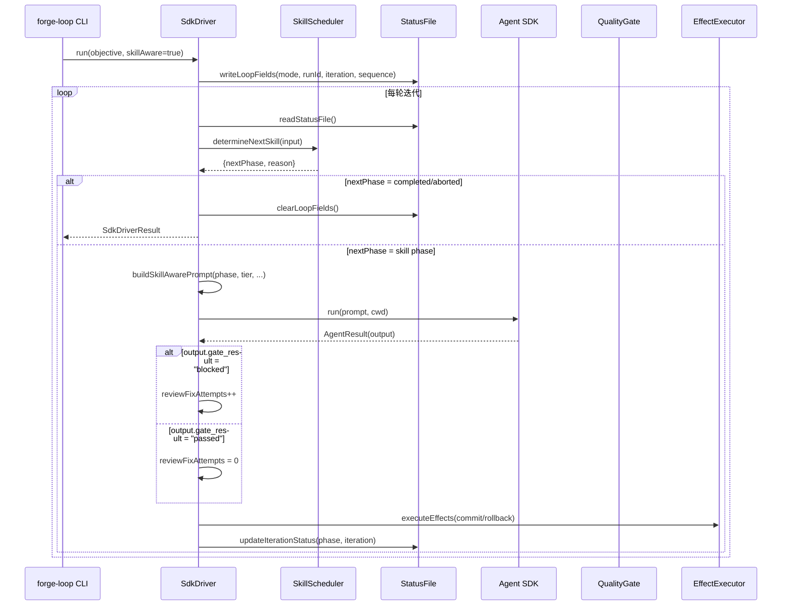
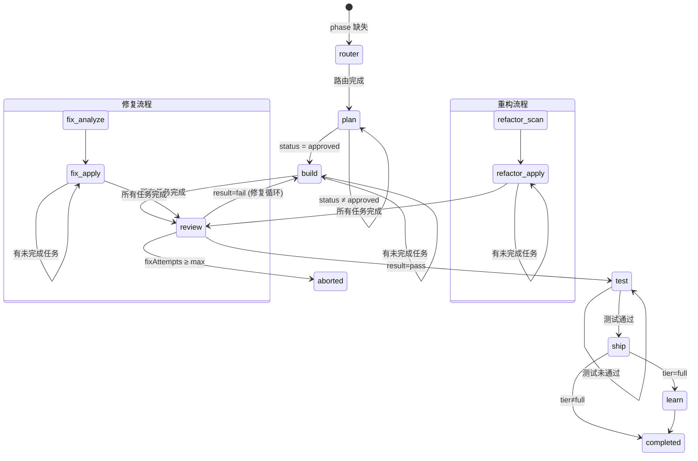
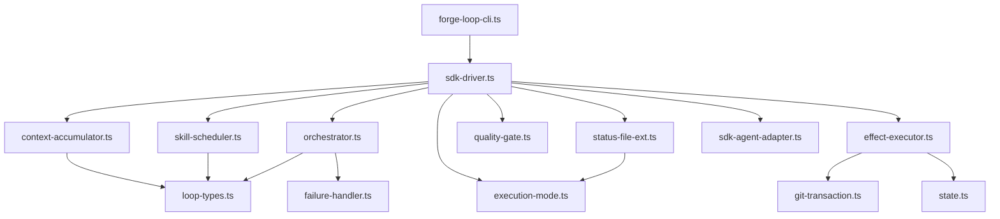

# Design Document: Loop × Skills Fusion

## Overview

Loop × Skills Fusion 是 Forge 项目中期 v2.x 路线图的核心演进方向，目标是将 Forge Loop（自主执行引擎）与 Forge Skills（交互式命令体系）从两套割裂的系统融合为一个协同工作的整体。

### 设计目标

1. **Loop 驱动 Skills**：SdkDriver 的每轮迭代内部调用具体 SKILL 阶段（router → plan → build → review → test → ship），而非作为通用自主循环引擎
2. **Skills 双模式运行**：每个 SKILL 通过 StatusFile 中的 `mode` 字段感知执行模式，在自主模式下跳过确认点并采用预设策略
3. **质量门禁集成**：Loop 的迭代成功/失败判定复用 Skills 的质量门禁（review P0/P1、test 通过率、ship 三重检查）
4. **分发包可用**：分发包用户通过 `/forge loop` SKILL 在无 Agent SDK 环境下使用自主执行模式

### 核心原则

**Loop 驱动 Skills，Skills 保障质量。** 自主模式不降低质量标准——所有门禁、TDD 铁律、评审流程照常执行，只是跳过人工确认点，用预设策略自动决策。

### 架构定位

```
┌─────────────────────────────────────────────────────────┐
│                    用户入口                               │
│  forge-loop CLI (SDK 环境)  │  /forge loop SKILL (分发包) │
├─────────────────────────────┼───────────────────────────┤
│         SdkDriver           │    SKILL 内置状态机         │
│  (skill-aware 迭代循环)      │  (单次会话状态机驱动)       │
├─────────────────────────────┴───────────────────────────┤
│                   共享纯函数层                            │
│  SkillScheduler │ QualityGate │ ExecutionMode │ StatusFile│
├─────────────────────────────────────────────────────────┤
│                   Forge Skills                           │
│  router │ plan │ build │ review │ test │ ship │ learn    │
└─────────────────────────────────────────────────────────┘
```

## Architecture

### 高层架构

融合后的系统分为四层：

1. **入口层**：`forge-loop` CLI（SDK 环境）和 `/forge loop` SKILL（分发包环境）
2. **驱动层**：SdkDriver（skill-aware 模式）或 SKILL 内置状态机
3. **纯函数层**：SkillScheduler、QualityGate、ExecutionMode、StatusFile 操作函数
4. **执行层**：Forge Skills（router、plan、build、review、test、ship、learn）

### Skill-Aware 迭代流程



### 状态机转换图

SkillScheduler 的状态转换覆盖所有 SKILL 阶段：



### 双模式运行机制

Skills 通过 StatusFile 中的 `mode` 字段感知执行模式：

| 确认点 | 交互模式 (`interactive`) | 自主模式 (`autonomous`) |
|--------|------------------------|----------------------|
| Router 档位确认 | 等待用户确认或覆盖 | `auto-detect`：直接采用 AI 建议 |
| Plan 任务拆解确认 | 等待用户确认 | `auto-approve`：自动批准 |
| Build 暂停确认 | 轻量路径每两步暂停 | `continue`：不暂停 |
| Review P0/P1 处理 | 提示用户决定 | `auto-fix`：自动进入修复循环 |
| Ship 交付方式 | 用户选择 | `keep branch`：保留分支（最安全选项） |
| Refactor 扫描选择 | 等待用户选择 | `auto-select-recommended`：自动选择推荐项 |
| Refactor 设计评审 | 等待用户确认 | `auto-approve`：自动批准 |
| Refactor 应用步骤 | 每步暂停 | `continue`：连续执行 |
| Fix 报告确认 | 等待用户确认 | `auto-confirm`：自动确认 |
| Fix 分析确认 | 等待用户确认 | `auto-recommend`：自动采用推荐 |
| Fix 应用验证 | 等待用户验证 | `auto-verify`：自动验证 |

## Components and Interfaces

### 1. ExecutionMode 模块 (`src/execution-mode.ts`)

**职责**：管理执行模式的读写和确认点决策。

```typescript
// 类型定义
type ExecutionMode = "interactive" | "autonomous";

type ConfirmationPoint =
  | "router_tier" | "plan_approval" | "build_pause"
  | "review_p0p1" | "ship_method"
  | "refactor_scan_select" | "refactor_design_review" | "refactor_apply_step"
  | "fix_report_confirm" | "fix_analyze_confirm" | "fix_apply_verify";

interface ConfirmationDecision {
  action: "auto" | "wait_for_user";
  preset?: string;
}

// 公开 API
function getExecutionMode(statusContent: string): ExecutionMode;
function writeExecutionMode(statusContent: string, mode: ExecutionMode): string;
function clearExecutionMode(statusContent: string): string;
function resolveConfirmation(mode: ExecutionMode, point: ConfirmationPoint): ConfirmationDecision;
```

**设计决策**：所有函数均为纯函数，接受字符串输入返回字符串输出，不执行 I/O。SKILL 层负责实际的文件读写。

### 2. StatusFile 扩展模块 (`src/status-file-ext.ts`)

**职责**：管理 StatusFile 中 Loop 相关字段的读写和清除。

```typescript
// 类型定义
interface LoopStatusFields {
  mode?: ExecutionMode;
  loopRunId?: string;
  loopIteration?: number;
  skillSequence?: string[];
}

// 公开 API
function extractLoopFields(statusContent: string): LoopStatusFields;
function writeLoopFields(statusContent: string, fields: LoopStatusFields): string;
function clearLoopFields(statusContent: string): string;
function updateIterationStatus(statusContent: string, phase: string, iteration: number): string;
```

**设计决策**：与 ExecutionMode 模块共享 YAML frontmatter 解析逻辑，但各自管理不同的字段集。Loop 字段包括 `mode`、`loop_run_id`、`loop_iteration`、`skill_sequence`。

### 3. SkillScheduler 模块 (`src/skill-scheduler.ts`)

**职责**：纯函数状态机，根据当前状态决定下一个 SKILL 阶段。

```typescript
// 类型定义
type SkillPhase =
  | "router" | "plan" | "build" | "review" | "test" | "ship" | "learn"
  | "refactor-scan" | "refactor-apply"
  | "fix-analyze" | "fix-apply"
  | "completed" | "aborted";

interface SchedulerInput {
  currentPhase?: string;
  tier?: string;
  planStatus?: string;
  hasIncompleteTasks?: boolean;
  reviewResult?: string;
  testPassed?: boolean;
  reviewFixAttempts: number;
  maxReviewFixAttempts: number;
}

interface SchedulerResult {
  nextPhase: SkillPhase;
  reason: string;
}

// 公开 API
function determineNextSkill(input: SchedulerInput): SchedulerResult;
function getCommandSequence(tier: string): SkillPhase[];
function shouldCommitForPhase(phase: string, success: boolean): boolean;
```

**设计决策**：
- 状态机覆盖所有 SkillPhase 值，未知阶段回退到 `router`
- 终态（`completed`、`aborted`）返回自身，保证幂等性
- 修复循环通过 `reviewFixAttempts` 计数器和 `maxReviewFixAttempts` 阈值实现熔断保护
- 命令序列按 tier 分组，支持 light/standard/full 以及 refactor/fix 工作流

### 4. QualityGate 模块 (`src/quality-gate.ts`)

**职责**：纯函数评估器，评估 review、test、ship 门禁。

```typescript
// 类型定义
interface GateResult {
  status: "passed" | "blocked" | "skipped";
  reason: string;
  issues?: Array<{ severity: string; description: string }>;
}

// 公开 API
function evaluateReviewGate(reviewContent: string): GateResult;
function evaluateTestGate(testResultContent: string): GateResult;
function evaluateShipGate(reviewContent: string, testResultContent: string, progressContent: string): GateResult;
```

**设计决策**：
- 无法解析的内容返回 `status: "skipped"`，不抛出异常
- Ship 门禁是 Review + Test + Progress 的三重组合
- Skipped 子门禁不阻断（不造成 blocked），但也不算 passed

### 5. SkillAwarePrompt 构建 (`src/context-accumulator.ts`)

**职责**：构建包含 SKILL 上下文的迭代提示。

```typescript
interface SkillPromptParams {
  base: {
    iteration: number;
    runId: string;
    objective: string;
    notesContent: string;
    stopWhen?: string;
  };
  skill: {
    phase: string;
    tier: string;
    taskType?: string;
    projectPhase?: string;
    workNature?: string;
    hints?: Array<{ command: string; tag: string; description: string }>;
    fixIssues?: Array<{ severity: string; description: string }>;
  };
  puaContext?: PuaContext;
}

function buildSkillAwarePrompt(params: SkillPromptParams): string;
```

**设计决策**：
- 基于 `buildIterationPrompt()` 扩展，追加 `## SKILL Context` 和 `## Execution Mode` 段落
- 当 `phase` 为空时，提示 Agent 先执行路由分析
- 始终包含 `mode: autonomous` 指令
- 可选注入 PUA 质量引擎上下文

### 6. SdkDriver Skill-Aware 模式 (`src/sdk-driver.ts`)

**职责**：核心循环驱动器，桥接纯函数状态机与实际 I/O。

```typescript
interface SdkDriverConfig {
  // ... 基础配置
  skillAware: boolean;           // 是否启用 Skill-aware 模式
  presetTier?: string;           // 预设路由档位
  presetTaskType?: string;       // 预设任务类型
  presetProjectPhase?: string;   // 预设项目阶段
  presetWorkNature?: string;     // 预设工作性质
  readStatusFile?: () => string; // StatusFile 读取回调
  writeStatusFile?: (content: string) => void; // StatusFile 写入回调
}
```

**设计决策**：
- `skillAware` 标志控制是否使用 skill-aware 迭代逻辑
- 通过回调函数 `readStatusFile`/`writeStatusFile` 解耦 I/O
- 维护 `reviewFixAttempts` 计数器用于修复循环熔断
- Loop 结束时（正常或异常）始终清除 StatusFile 中的 Loop 字段

### 7. EffectExecutor (`src/effect-executor.ts`)

**职责**：执行 Git commit/rollback 等副作用操作。

**设计决策**：
- 内置冻结区检查（inner-layer defense），在 commit 前扫描 staged 文件
- `FrozenZoneViolation` 异常触发循环立即终止（不触发退避）
- `UnexpectedEffectError` 触发 `iteration_hard_failure` 和指数退避
- Rollback 前自动 stash 作为安全网

### 模块依赖关系



## Data Models

### StatusFile YAML Frontmatter

Loop 运行期间的完整 StatusFile 格式：

```yaml
---
current_task: "为用户 API 添加分页功能"
tier: "standard"
task_type: "backend"
project_phase: "iteration"
phase: "build"
hints: "api-contract-check,backward-compat"
mode: "autonomous"
loop_run_id: "a1b2c3d4-e5f6-7890-abcd-ef1234567890"
loop_iteration: 5
skill_sequence: "plan,build,review,test,ship"
updated: "2025-01-15 14:30"
---
```

### Loop 字段生命周期

| 字段 | 写入时机 | 更新时机 | 清除时机 |
|------|---------|---------|---------|
| `mode` | Loop 启动 | — | Loop 结束（正常/异常） |
| `loop_run_id` | Loop 启动 | — | Loop 结束（正常/异常） |
| `loop_iteration` | Loop 启动 (=0) | 每轮迭代完成 | Loop 结束（正常/异常） |
| `skill_sequence` | Loop 启动 | — | Loop 正常完成 |
| `phase` | 路由完成后 | 每轮迭代完成 | Loop 正常完成时设为 `completed` |

### AgentOutput 扩展字段

```typescript
interface AgentOutput {
  success: boolean;
  summary: string;
  key_changes_made: string[];
  key_learnings: string[];
  should_fully_stop?: boolean;
  // ★ Skill-aware 扩展
  skill_phase_completed?: string;  // 本轮完成的 SKILL 阶段
  next_skill_phase?: string;       // 建议的下一个 SKILL 阶段
  gate_result?: "passed" | "blocked" | "skipped";  // 质量门禁结果
}
```

### SchedulerInput / SchedulerResult

```typescript
interface SchedulerInput {
  currentPhase?: string;        // StatusFile phase 字段
  tier?: string;                // StatusFile tier 字段
  planStatus?: string;          // PlanFile status 字段
  hasIncompleteTasks?: boolean; // ProgressFile 是否有未完成任务
  reviewResult?: string;        // Review 报告 result 字段
  testPassed?: boolean;         // 测试是否通过
  reviewFixAttempts: number;    // 修复循环计数器
  maxReviewFixAttempts: number; // 最大修复循环次数
}

interface SchedulerResult {
  nextPhase: SkillPhase;  // 下一个 SKILL 阶段
  reason: string;         // 转换原因说明
}
```

### GateResult

```typescript
interface GateResult {
  status: "passed" | "blocked" | "skipped";
  reason: string;
  issues?: Array<{ severity: string; description: string }>;
}
```

### Commit 策略映射

| SKILL 阶段 | success=true | success=false |
|-----------|-------------|--------------|
| build | commit | rollback |
| plan | commit | 不操作 |
| fix / fix-apply | commit | rollback |
| refactor-apply | commit | rollback |
| review | 不操作 | 不操作 |
| test | 不操作 | 不操作 |
| ship | 不操作 | 不操作 |
| router | 不操作 | 不操作 |
| learn | 不操作 | 不操作 |
| refactor-scan | 不操作 | 不操作 |
| fix-analyze | 不操作 | 不操作 |


## Correctness Properties

*A property is a characteristic or behavior that should hold true across all valid executions of a system — essentially, a formal statement about what the system should do. Properties serve as the bridge between human-readable specifications and machine-verifiable correctness guarantees.*

### Property 1: ExecutionMode 往返一致性

*For any* valid StatusFile content and any valid ExecutionMode value, writing the mode via `writeExecutionMode()` then reading via `getExecutionMode()` shall return the written mode; and clearing via `clearExecutionMode()` then reading shall return `"interactive"` (default).

**Validates: Requirements 13.1, 13.4**

### Property 2: 自主模式确认点全自动

*For any* ConfirmationPoint, when mode is `"autonomous"`, `resolveConfirmation()` shall return `action: "auto"` with a defined preset string; when mode is `"interactive"`, it shall return `action: "wait_for_user"` with no preset.

**Validates: Requirements 2.2, 2.3**

### Property 3: LoopStatusFields 往返一致性

*For any* valid StatusFile content and any valid LoopStatusFields, writing via `writeLoopFields()` then extracting via `extractLoopFields()` shall return equivalent field values; and clearing via `clearLoopFields()` then extracting shall return all fields as `undefined`.

**Validates: Requirements 6.1, 6.3, 13.2, 13.3**

### Property 4: writeLoopFields 保留非 Loop 字段

*For any* valid StatusFile content containing non-Loop frontmatter fields, calling `writeLoopFields()` shall preserve all non-Loop fields unchanged in the output.

**Validates: Requirements 13.5**

### Property 5: SkillScheduler 全函数性

*For any* valid SchedulerInput (including unknown `currentPhase` values), `determineNextSkill()` shall never throw an exception and shall always return a valid SchedulerResult with a recognized SkillPhase. For unknown `currentPhase` values, it shall fall back to `"router"`. For terminal states (`"completed"`, `"aborted"`), it shall return the same state (idempotent).

**Validates: Requirements 12.1, 12.2, 12.4**

### Property 6: SkillScheduler 熔断保护

*For any* SchedulerInput where `reviewFixAttempts >= maxReviewFixAttempts` and `reviewResult` is `"fail"`, `determineNextSkill()` shall return `nextPhase: "aborted"`.

**Validates: Requirements 5.5, 12.3**

### Property 7: SkillScheduler 收敛性

*For any* non-terminal SkillPhase as starting `currentPhase`, simulating successive transitions with favorable conditions (plan approved, no incomplete tasks, review passed, tests passed) shall converge to `"completed"` or `"aborted"` within a bounded number of steps.

**Validates: Requirements 12.5**

### Property 8: shouldCommitForPhase Commit 策略正确性

*For any* phase string and success boolean: (a) commitable phases (`"build"`, `"plan"`, `"fix"`, `"refactor-apply"`, `"fix-apply"`) with `success=true` shall return `true`; (b) non-commitable phases (`"review"`, `"test"`, `"ship"`, `"router"`, `"learn"`, `"refactor-scan"`, `"fix-analyze"`) shall return `false` regardless of success; (c) any phase with `success=false` shall return `false`; (d) any unknown phase string shall return `false`.

**Validates: Requirements 11.1, 11.2, 11.3, 11.5**

### Property 9: getCommandSequence 安全默认值

*For any* tier string not in the known set (`"light"`, `"standard"`, `"full"`, `"refactor_light"`, `"refactor_standard"`, `"fix_light"`, `"fix_standard"`), `getCommandSequence()` shall return the standard sequence (`["plan", "build", "review", "test", "ship"]`).

**Validates: Requirements 12.6**

### Property 10: buildSkillAwarePrompt 内容完整性

*For any* valid SkillPromptParams with a non-empty phase, the output of `buildSkillAwarePrompt()` shall contain: (a) the phase name; (b) the tier; (c) the `mode: autonomous` directive. When `fixIssues` are provided, all issue descriptions shall appear in the output.

**Validates: Requirements 1.2, 1.5, 5.2**

### Property 11: updateIterationStatus 字段更新

*For any* valid StatusFile content, phase string, and iteration number, calling `updateIterationStatus()` then extracting the `phase` and `loop_iteration` fields shall return the written values.

**Validates: Requirements 3.6, 6.2**

## Error Handling

### 错误分类

| 错误类型 | 触发条件 | 处理策略 |
|---------|---------|---------|
| `FrozenZoneViolation` | commit 时检测到冻结区文件被修改 | 立即终止循环，不触发退避 |
| `UnexpectedEffectError` | Git 命令执行失败 | 触发 `iteration_hard_failure`，指数退避 |
| Agent SDK 超时 | SDK 调用超过 30 分钟 | 触发 `iteration_hard_failure`，指数退避 |
| Agent 输出验证失败 | 结构化输出不符合 schema | 触发 `iteration_hard_failure`，指数退避 |
| 熔断器触发 | 连续失败达到阈值（默认 3） | 状态转为 `aborted`，输出中止原因 |
| Review 修复循环超限 | `reviewFixAttempts >= maxReviewFixAttempts` | SkillScheduler 返回 `aborted` |

### 错误恢复策略

1. **Soft Failure**（Agent 报告 `success: false`）：
   - 执行 rollback
   - 递增 `consecutiveFailures`
   - 检查熔断器
   - 继续下一轮迭代

2. **Hard Failure**（SDK 错误、验证错误）：
   - 执行 rollback
   - 递增 `consecutiveFailures` 和 `consecutiveErrors`
   - 检查熔断器
   - 如未熔断，进入指数退避等待

3. **FrozenZoneViolation**：
   - 不执行 rollback（commit 已被阻止）
   - 立即触发 `stop_condition_met`
   - 循环终止

4. **StatusFile 操作失败**：
   - 非关键操作（更新迭代状态）：输出警告，继续执行
   - 关键操作（写入 Loop 字段）：触发 hard failure

### 边界情况

| 场景 | 处理方式 |
|------|---------|
| StatusFile 无 frontmatter | 创建新的 frontmatter |
| StatusFile 字段值无效 | 返回默认值（mode→interactive, iteration→undefined） |
| 空目标描述 | CLI 层拒绝启动，输出用法说明 |
| 无效 --tier 值 | CLI 层拒绝启动，输出有效值列表 |
| 残留 Loop 状态 | 清理残留字段，从当前 phase 继续 |
| hooks.json 缺失 | 输出警告，不阻断启动 |
| PlanFile/ProgressFile 不存在 | SchedulerInput 对应字段为 undefined |

## Testing Strategy

### 测试框架

- **单元测试**：Vitest
- **属性测试**：fast-check（已在项目中使用）
- **测试文件命名**：`test/<module>.property.test.ts`（属性测试）、`test/<module>.test.ts`（单元测试）

### 属性测试（Property-Based Testing）

本特性的核心模块均为纯函数，非常适合属性测试。每个 Correctness Property 对应一个属性测试，使用 fast-check 生成随机输入。

**配置要求**：
- 每个属性测试最少 100 次迭代（推荐 200 次）
- 每个测试必须引用设计文档中的 Property 编号
- 标签格式：`Feature: loop-skills-fusion, Property {number}: {property_text}`

**属性测试覆盖的模块**：

| 模块 | 属性测试 | 对应 Property |
|------|---------|-------------|
| `execution-mode.ts` | ExecutionMode 往返一致性 | Property 1 |
| `execution-mode.ts` | 确认点决策正确性 | Property 2 |
| `status-file-ext.ts` | LoopStatusFields 往返一致性 | Property 3 |
| `status-file-ext.ts` | 非 Loop 字段保留 | Property 4 |
| `skill-scheduler.ts` | 全函数性 | Property 5 |
| `skill-scheduler.ts` | 熔断保护 | Property 6 |
| `skill-scheduler.ts` | 收敛性 | Property 7 |
| `skill-scheduler.ts` | Commit 策略 | Property 8 |
| `skill-scheduler.ts` | 安全默认值 | Property 9 |
| `context-accumulator.ts` | 提示内容完整性 | Property 10 |
| `status-file-ext.ts` | 迭代状态更新 | Property 11 |

### 单元测试（Example-Based）

单元测试覆盖属性测试不适合的场景：

| 模块 | 测试场景 | 对应需求 |
|------|---------|---------|
| `context-accumulator.ts` | build 阶段提示包含未完成任务列表 | 1.3 |
| `context-accumulator.ts` | review 阶段提示包含 P0/P1 问题详情 | 1.4 |
| `quality-gate.ts` | Review 门禁评估（blocked/passed/skipped） | 4.1-4.3 |
| `quality-gate.ts` | Test 门禁评估 | 4.4-4.5 |
| `quality-gate.ts` | Ship 三重门禁组合 | 4.6-4.7 |
| `sdk-driver.ts` | Hooks 验证（validateHooksPresence） | 10.6 |
| `forge-loop-cli.ts` | 空目标描述拒绝启动 | 10.3 |
| `forge-loop-cli.ts` | 无效 --tier 值拒绝启动 | 10.4 |

### 集成测试

集成测试验证模块间的协作：

| 测试场景 | 涉及模块 | 对应需求 |
|---------|---------|---------|
| SdkDriver skill-aware 迭代完整流程 | SdkDriver + SkillScheduler + StatusFile | 1.1, 1.6, 3.4 |
| 修复循环（review blocked → build → review） | SdkDriver + SkillScheduler + QualityGate | 5.1-5.4 |
| 熔断中止流程 | SdkDriver + SkillScheduler | 5.5-5.6 |
| StatusFile 生命周期（启动→运行→结束） | SdkDriver + StatusFile | 6.1-6.5 |
| Git commit/rollback 策略 | SdkDriver + EffectExecutor + SkillScheduler | 7.1-7.7 |
| 残留状态清理 | SdkDriver + StatusFile | 10.5 |

### 测试生成器（Generators）

属性测试需要以下自定义生成器：

```typescript
// StatusFile 内容生成器
const statusFileArb: fc.Arbitrary<string>;

// ExecutionMode 生成器
const executionModeArb: fc.Arbitrary<ExecutionMode>;

// ConfirmationPoint 生成器
const confirmationPointArb: fc.Arbitrary<ConfirmationPoint>;

// LoopStatusFields 生成器
const loopStatusFieldsArb: fc.Arbitrary<LoopStatusFields>;

// SchedulerInput 生成器
const schedulerInputArb: fc.Arbitrary<SchedulerInput>;

// SkillPhase 生成器
const skillPhaseArb: fc.Arbitrary<SkillPhase>;

// SkillPromptParams 生成器
const skillPromptParamsArb: fc.Arbitrary<SkillPromptParams>;
```

### 已有测试

以下测试文件已存在于项目中，覆盖了部分 Property：

- `test/execution-mode.property.test.ts` — Property 1, 2（ExecutionMode 往返、确认点）
- `test/skill-scheduler.property.test.ts` — Property 5, 6, 7, 8, 9（如果存在）
- `test/status-file-ext.property.test.ts` — Property 3, 4, 11（如果存在）

新增测试应遵循现有测试的风格和命名约定。
