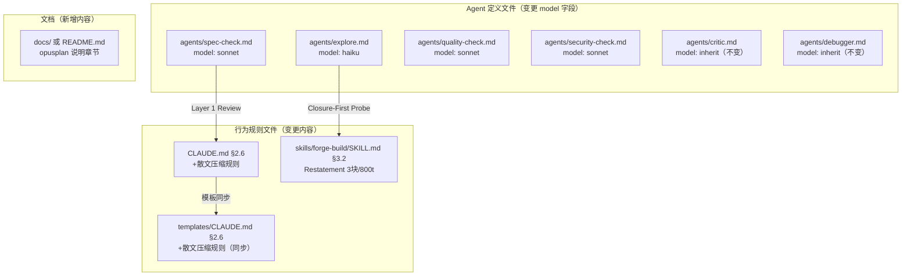

# 设计文档：输出膨胀控制

## Overview

本功能是 Forge token 优化的第二层（Layer 2），控制 AI 输出端的 token 消耗。第一层（`context-bloat-control`）解决输入膨胀；本层通过四项措施解决输出膨胀：

1. **Agent 级模型路由** — 为不同角色的 Agent 分配匹配其任务复杂度的模型别名
2. **散文压缩规则** — 在 CLAUDE.md §2.6 中定义非结构化输出的压缩规则
3. **Restatement 摘要压缩** — 将 Restatement 从 5 块/1500 tokens 简化为 3 块/800 tokens
4. **opusplan 模式推荐** — 文档化 opusplan 的使用方法和成本效益

**关键约束**：所有变更均为文档/配置修改（markdown frontmatter、SKILL 文件、CLAUDE.md），无新脚本或外部依赖。

**与 Layer 1 的关系**：Layer 1 控制输入（工具输出裁剪、文件读取压缩），Layer 2 控制输出（模型选择、散文压缩、摘要精简）。两层互补，不冲突。

---

## Architecture

本功能不引入新的架构组件。所有变更在现有 Forge 文件结构内完成：



**变更范围**：

| 变更类别 | 涉及文件 | 变更类型 |
|---------|---------|---------|
| 模型路由 | 10 个 Agent 定义文件（两个目录各 5 个） | frontmatter `model` 字段修改 |
| 散文压缩 | `CLAUDE.md`、`templates/CLAUDE.md` | §2.6 内容扩展 |
| Restatement 压缩 | `skills/forge-build/SKILL.md` | §3.2 格式和预算修改 |
| opusplan 文档 | `docs/` 下新文件或 `README.md` 新章节 | 纯文档新增 |

---

## Components and Interfaces

### Component 1: Agent Model Routing（需求 1）

**变更对象**：Agent 定义文件的 YAML frontmatter

**路由策略**：

| Agent | 角色 | 当前 model | 目标 model | 理由 |
|-------|------|-----------|-----------|------|
| `explore` | 代码搜索 | （无） | `haiku` | 仅执行 glob/grep，不需要推理 |
| `spec-check` | Spec 对齐评审 | `inherit` | `sonnet` | 需要中等推理对照 Spec |
| `quality-check` | 代码质量评审 | `inherit` | `sonnet` | 需要中等推理检查代码模式 |
| `security-check` | 安全评审 | `inherit` | `sonnet` | 需要中等推理识别安全模式 |
| `architect` | 架构决策 | `inherit` | `inherit` | 架构决策需要强推理，不变 |
| `product` | 产品决策 | `inherit` | `inherit` | 产品定义需要强推理，不变 |
| `security` | 安全决策 | `inherit` | `inherit` | 安全评估需要强推理，不变 |
| `designer` | 设计决策 | `inherit` | `inherit` | 设计评估需要强推理，不变 |
| `critic` | 对抗性审查 | `inherit` | `inherit` | 对抗性审查需要强推理，不变 |
| `debugger` | 根因分析 | （无） | `inherit` | 调试需要强推理，显式声明 |

**双目录同步**：每个 Agent 的变更必须同时应用于 `agents/` 和 `.claude/agents/` 两个目录。当前两个目录的文件内容已保持一致（frontmatter 相同），变更后继续保持一致。

**环境变量覆盖**：`CLAUDE_CODE_SUBAGENT_MODEL` 环境变量优先于 frontmatter 中的 `model` 字段。这是 Claude Code 的内置行为，无需 Forge 额外实现。

**frontmatter 变更示例**（`agents/explore.md`）：

```yaml
---
name: explore
description: "只读代码库搜索专家..."
model: haiku
disallowedTools: Write, Edit
---
```

### Component 2: Prose Compression Rules（需求 2）

**变更对象**：`CLAUDE.md` §2.6 和 `templates/CLAUDE.md` §2.6

**当前 §2.6 内容**：

```markdown
### 2.6 Output Conciseness

> **原则**：代码编辑时沉默执行，决策点时简要说明。SKILL 定义的结构化输出永远不被压制。

禁止操作预告、自我对话、逐步解说。保留所有 Forge 结构化输出...
```

**目标 §2.6 内容**：在现有规则之后追加散文压缩规则子节，包含：

1. **词汇压缩规则**：
   - 省略冠词（a/an/the）、填充词（just/really/basically/actually/simply）
   - 省略客套话（sure/certainly/of course/happy to）
   - 使用短同义词（big 而非 extensive，fix 而非 implement a solution for）
   - 允许句子片段，不要求完整语法
   - 模式：`[事物] [动作] [原因]。[下一步]。`

2. **行为规则**：
   - 文件编辑后输出变更摘要（如 `+5 lines in src/config.ts`），不回显文件内容
   - 非 Decision_Point 直接给推荐方案并执行，不列备选
   - 非 Decision_Point 散文输出 ≤200 tokens
   - Decision_Point 格式：`[原因] → [选择] → [依据]`

3. **Structured_Output 豁免清单**（扩展现有列表）：
   - TDD 标记、P5 证据链、Restatement 摘要、Closure_First_Probe 结果
   - 评审报告、代码块、commit 消息
   - 安全警告、不可逆操作确认、路由分析、前置检查结果

4. **安全阀**：散文压缩让步于信息完整性（错误诊断、安全警告优先保留）

**模板同步**：`templates/CLAUDE.md` 的 §2.6 与 `CLAUDE.md` 保持相同内容（模板变量替换后等价）。

### Component 3: Restatement Summary Compression（需求 3）

**变更对象**：`skills/forge-build/SKILL.md` §3.2

**当前格式（5 块，≤1500 tokens）**：

```
━━━ 📋 Restatement Checkpoint（Task N/M 完成后）━━━
📊 进度：...
🎯 下一步：...
⚠️ 执行纪律重申：...
🧠 活跃的行为提示：...
📚 匹配的直觉模式：...
━━━━━━━━━━━━━━━━━━━━━━━━━━━━━━━━━━━━━━━━━━━━━━
```

**目标格式（3 块，≤800 tokens）**：

```
━━━ 📋 Restatement（Task N/M）━━━
📊 进度：已完成 N/M
  ✅ <已完成任务列表>
  🔜 <下一个任务>

🎯 下一步：Task X — <完整标题和文件路径>

🧠 活跃提示：
  • <从 status.md hints 提取的活跃提示>
  • <最相关的 1 个直觉模式匹配，附 confidence>
━━━━━━━━━━━━━━━━━━━━━━━━━━━━━━━━━━━━━━━━━━━━━━
```

**变更要点**：

| 项目 | 当前 | 目标 | 理由 |
|------|------|------|------|
| 块数 | 5 | 3 | 移除冗余块 |
| Token 预算 | 1500 | 800 | 47% 压缩 |
| 执行纪律重申块 | 存在 | 移除 | 规则已在 CLAUDE.md 和 SKILL 中定义，重复输出浪费 token |
| 直觉模式块 | 独立块，所有匹配 | 合并到活跃提示块，仅 1 个最相关匹配 | 减少冗余 |
| 异常块 | 追加在 5 块后 | 追加在 3 块后，不受 800t 限制 | 异常信息完整性优先 |

**SKILL 文件其他变更**：
- §3.2 Token Cost Constraint：`≤1,500 tokens` → `≤800 tokens`
- §3.2 Restatement Summary Format：替换为新的 3 块格式定义
- §6.5 引用更新（如有）

### Component 4: opusplan Mode Documentation（需求 4）

**变更对象**：`docs/opusplan-guide.md`（新建）+ `README.md`（添加引用链接）

**文档结构**：

```markdown
# opusplan 模式指南

## 工作原理
plan 模式使用 opus（复杂推理），执行模式使用 sonnet（代码生成）。

## 启用方法
- 会话内：`/model opusplan`
- 启动时：`claude --model opusplan`

## 预期成本节省
20-40%，取决于推理/执行比例。

## 与 Agent 级模型路由的关系
opusplan 控制主 Agent 分层，Agent 级路由控制 Subagent 模型选择。两者互补。

## 注意事项
用户自愿选择，Forge 不强制启用。
```

---

## Data Models

本功能不引入新的数据模型。所有变更均为现有文件的内容修改。

**Agent Frontmatter Schema**（现有，无变更）：

```yaml
---
name: string          # Agent 名称
description: string   # Agent 描述
model: string         # 模型别名：haiku | sonnet | opus | inherit
maxTurns: number      # 最大轮次
tools: string         # 可用工具列表
permissionMode: string # 权限模式
memory: string        # 可选，记忆模式
disallowedTools: string # 可选，禁用工具
---
```

**model 字段值域**：

| 值 | 含义 | 适用场景 |
|---|------|---------|
| `haiku` | 轻量模型 | 搜索、grep、简单格式化 |
| `sonnet` | 中等模型 | 代码评审、模式识别 |
| `opus` | 重量模型 | 复杂推理（通常不直接使用） |
| `inherit` | 继承主 Agent 模型 | 需要与主 Agent 同等推理能力 |

---

## Error Handling

| 场景 | 处理方式 |
|------|---------|
| Agent frontmatter 中 `model` 字段值无效 | Claude Code 忽略无效值，回退到默认模型。无需 Forge 额外处理 |
| `CLAUDE_CODE_SUBAGENT_MODEL` 覆盖了 frontmatter 设置 | 预期行为，环境变量优先。文档中说明此覆盖关系 |
| haiku 模型对 explore 任务能力不足 | explore Agent 仅执行 glob/grep，不需要推理。如用户发现问题，可手动改回 `inherit` |
| sonnet 模型对 review 任务能力不足 | review Agent 需要中等推理。如用户发现质量下降，可通过环境变量覆盖 |
| 散文压缩导致关键信息丢失 | 安全阀规则：错误诊断、安全警告优先保留完整性，压缩规则让步 |
| Restatement 800t 预算不足以覆盖大型项目进度 | 异常块不受预算限制；常规进度可用缩写（如 `✅ T1-T5` 而非逐条列出） |
| opusplan 模式下 Forge 工作流中断 | opusplan 是 Claude Code 内置功能，模型切换对 Forge 透明。如有问题，用户可随时 `/model` 切回 |

---

## Testing Strategy

### PBT 不适用

本功能的所有变更均为文档/配置修改（markdown frontmatter 字段、markdown 内容、新建文档文件）。没有可执行的函数、没有输入/输出变换、没有可量化的通用属性。Property-based testing 不适用。

### 验证方法

**结构验证（手动 + grep）**：

1. **Agent frontmatter 验证**：
   - grep 所有 Agent 文件的 `model:` 字段，确认值符合路由策略表
   - 对比 `agents/` 和 `.claude/agents/` 两个目录的 frontmatter 一致性
   - 确认 `model` 字段值仅使用别名（haiku/sonnet/opus/inherit），不含具体模型名

2. **CLAUDE.md §2.6 验证**：
   - 确认散文压缩规则已添加
   - 确认 Structured_Output 豁免清单完整
   - 确认 `templates/CLAUDE.md` 与 `CLAUDE.md` 的 §2.6 内容一致

3. **Restatement 格式验证**：
   - 确认 `forge-build/SKILL.md` §3.2 的格式定义已更新为 3 块
   - 确认 Token Cost Constraint 已更新为 800 tokens
   - 确认异常块规则保留

4. **opusplan 文档验证**：
   - 确认文档包含工作原理、启用方法、成本节省、互补关系说明
   - 确认 Forge 不在任何配置中强制启用 opusplan

**功能验证（手动会话测试）**：

1. 启动 Claude Code 会话，调度 explore Agent，确认其使用 haiku 模型
2. 运行 `/forge review`，确认 review Agent 使用 sonnet 模型
3. 观察 AI 输出是否遵循散文压缩规则（无冠词、无填充词、短同义词）
4. 触发 Restatement Checkpoint，确认输出为 3 块格式且 ≤800 tokens
5. 测试 `/model opusplan` 后运行 `/forge build`，确认工作流正常

**回归验证**：

- 运行 `npm run check` 确认无构建/lint 错误（虽然本功能不改代码，但确认无意外影响）
- 确认 `forge-build/SKILL.md` 中对 §2.6 的引用仍然有效
