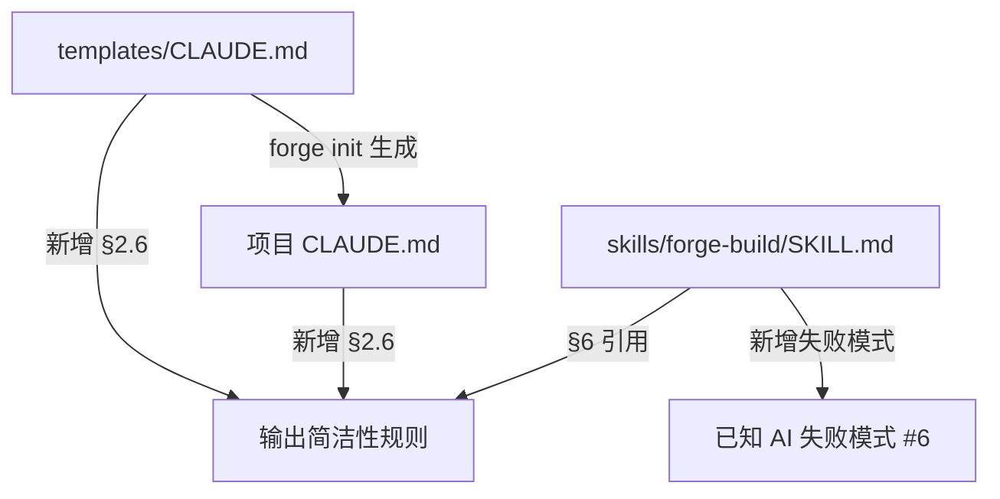

# Design Document: Output Conciseness (输出简洁性)

## Overview

本功能通过在三个文档文件中添加输出简洁性规则，约束 AI 在代码编辑场景下的冗余输出行为。这是一个纯文档修改功能，不涉及任何代码逻辑变更。

**修改范围**：
1. `templates/CLAUDE.md` — 添加 §2.6 输出简洁性章节（模板层，影响所有新项目）
2. `CLAUDE.md` — 添加 §2.6 输出简洁性章节（项目层，立即生效）
3. `skills/forge-build/SKILL.md` — 在 §6 添加引用 + 在"已知 AI 失败模式"添加新条目

**设计原则**：
- 精准打击 Narration，不误伤 Forge 结构化输出
- 优先级明确：SKILL 定义的输出 > 简洁性约束
- 模板与项目文件保持语义一致

## Architecture

本功能无架构变更。所有修改都是对现有 markdown 文档的内容追加，不改变文件结构、不新增文件、不修改任何代码。

### 修改拓扑



### 插入位置策略

| 文件 | 插入位置 | 理由 |
|------|---------|------|
| `templates/CLAUDE.md` | §2.5 上下文刷新纪律之后，§3 评审纪律之前 | §2 是"执行纪律"章节，输出简洁性属于执行行为约束 |
| `CLAUDE.md` | §2.5 上下文刷新纪律之后，§3 评审纪律之前 | 与模板保持一致 |
| `skills/forge-build/SKILL.md` §6 | §6.5 三次换路之后，新增 §6.6 | 执行纪律章节的自然延伸 |
| `skills/forge-build/SKILL.md` 失败模式 | 失败模式 5 之后，反射触发器之前 | 按编号顺序追加为失败模式 6 |

## Components and Interfaces

### Component 1: §2.6 输出简洁性章节（模板 + 项目共用）

此章节是核心内容，在 `templates/CLAUDE.md` 和 `CLAUDE.md` 中完全一致。

**章节结构**：

```markdown
### 2.6 输出简洁性

> **原则**：代码编辑时沉默执行，决策点时简要说明。SKILL 定义的结构化输出永远不被压制。

#### 禁止的输出模式

在执行代码编辑操作（文件创建、修改、删除）时，以下 Narration 模式被禁止：

| 模式类型 | 示例 | 
|---------|------|
| 操作预告 | "现在我要修改 X 文件" / "Now I'll modify X file" |
| 自我对话 | "让我添加 Y 字段" / "Let me add Y field" |
| 逐步解说 | "接下来将 Z 传入 W" / "Next, I'll pass Z into W" |
| 步骤枚举 | "首先...然后...最后..." / "First...then...finally..." |
| 工具调用预告 | 对即将执行的工具调用的重复描述 |

**Before（冗长）**：
> 现在我要修改 `src/config.ts` 文件，添加 `logFormat` 字段。让我先找到 `SdkDriverConfig` 接口的定义...好的，找到了。接下来我会在第 15 行添加 `logFormat: string` 字段。然后我需要更新 `createConfig` 函数，将 `logFormat` 参数传入...

**After（简洁）**：
> *（直接执行编辑，无 Narration）*

#### 保留的输出

以下 Forge 结构化输出不受简洁性约束影响，必须完整保留：

- TDD 阶段标记：🔴 RED / 🟢 GREEN / 🔵 REFACTOR 及其测试运行结果
- Closure-First 探针结果：Probe #1, Probe #2, Verify #1 输出块
- Restatement 摘要：周期性上下文刷新的 5 区块格式
- P5 证据链：`[Command] → [Output] → [Claim]` 验证格式
- 评审报告：含严重度等级（P0/P1/P2/P3）的评审发现
- 路由分析：档位建议、任务类型、项目阶段输出
- 前置检查结果：门禁检查通过/失败输出
- 进度更新：任务完成标记和进度摘要

#### Decision_Point 输出许可

在以下决策点，允许简要说明理由：

- **设计选择**：在多个实现方案间做选择时
- **意外情况**：遇到意外的代码状态、缺失文件或探针失败时
- **计划调整**：偏离计划或重新排序任务时
- **方向变更**：失败后切换方案时（如三次换路）
- **阻塞报告**：报告 BLOCKED 或 NEEDS_CONTEXT 状态时

Decision_Point 输出模板：`[原因] → [选择] → [依据]`

**示例**：
> 接口签名与 Spec 不一致 → 以 Spec 为准重新定义 → Plan Task 2 明确要求对齐 Spec §3.2

#### 优先级

SKILL 定义的输出格式 > 简洁性约束。当 SKILL 要求特定输出（模板、标记、结构化块）时，简洁性规则自动让步。
```

### Component 2: forge-build SKILL.md §6.6 引用

在 `skills/forge-build/SKILL.md` 的 §6 执行纪律末尾新增 §6.6：

```markdown
### 6.6 输出简洁性

代码编辑操作期间，遵守 CLAUDE.md §2.6 的输出简洁性约束：沉默执行，不做逐步解说。

仅在 Decision_Point（设计选择、意外情况、计划调整、方向变更、阻塞报告）时输出简要说明。

本 SKILL 中定义的所有结构化输出（TDD 标记、探针结果、Restatement 摘要、P5 证据链、进度更新等）不受简洁性约束影响。
```

### Component 3: forge-build SKILL.md 失败模式 6

在"已知 AI 失败模式"章节末尾、"反射触发器"章节之前，新增失败模式 6：

```markdown
### 失败模式 6：逐步解说代码编辑操作

**错误行为**：在执行代码编辑时，输出大量逐步解释性文字，如"现在我要修改 X 文件"、"让我添加 Y 字段"、"接下来将 Z 传入 W"。每个工具调用前都附带一段描述即将做什么的 Narration。

**为什么这是错的**：这些 Narration 不提供决策信息，只是对即将执行的操作的冗余描述。它们消耗 token、拖慢执行速度、淹没真正重要的输出（TDD 标记、探针结果、验证证据）。用户需要看到的是结果和决策理由，不是操作预告。

**正确做法**：代码编辑时沉默执行，直接调用工具完成修改。只在 Decision_Point（设计选择、意外情况、计划调整、方向变更）时输出简要说明，格式为 `[原因] → [选择] → [依据]`。所有 SKILL 定义的结构化输出（TDD 标记、探针结果等）正常保留。参见 CLAUDE.md §2.6。
```

## Data Models

本功能不涉及数据模型变更。所有修改都是 markdown 文本内容。

## Error Handling

### 潜在风险与缓解

| 风险 | 影响 | 缓解措施 |
|------|------|---------|
| §2.6 规则过于激进，压制了必要的输出 | AI 在需要解释时也保持沉默 | Decision_Point 许可列表明确定义了允许输出的场景；优先级规则确保 SKILL 输出不被压制 |
| 模板与项目文件不同步 | 新项目和当前项目行为不一致 | Requirement 5 要求同一实现周期内同步更新两个文件 |
| 与现有 §2.1-§2.5 内容冲突 | 执行纪律内部矛盾 | §2.6 明确声明 SKILL 输出优先级高于简洁性约束，不会与 TDD 标记、验证铁律等冲突 |
| forge-build SKILL.md 引用断裂 | §6.6 引用了不存在的 §2.6 | 三个文件在同一实现周期内修改，确保引用目标存在 |

## Testing Strategy

由于本功能是纯文档修改（markdown 文件内容变更），不涉及任何可执行代码，因此：

- **不适用 Property-Based Testing**：没有函数、没有输入/输出、没有可执行逻辑
- **不适用单元测试**：没有代码可测试
- **不适用集成测试**：没有系统交互

### 验证方式

采用人工审查验证：

1. **内容完整性检查**：确认三个文件都包含了预期的新增内容
2. **章节编号一致性**：确认 §2.6 在模板和项目文件中编号一致
3. **交叉引用验证**：确认 forge-build §6.6 引用的 CLAUDE.md §2.6 确实存在
4. **语义一致性**：确认模板和项目文件的 §2.6 内容语义相同
5. **格式兼容性**：确认新增内容与现有文档的 markdown 格式风格一致
6. **无冲突验证**：确认新增内容不与现有 §2.1-§2.5 内容矛盾
