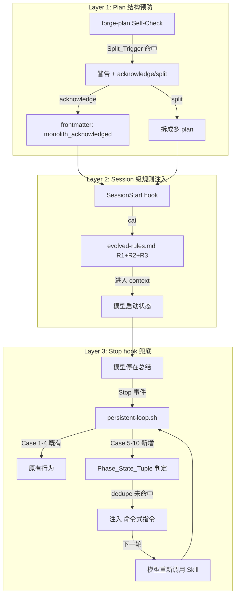
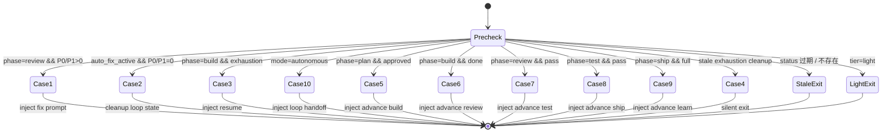

# Design: Phase Advance Hardening

## Overview

修复 SKILL 驱动模式下的阶段推进断点。三层防御：(1) `forge-plan` Self-Check 拦截"准里程碑结构"的 plan；(2) `evolved-rules.md` R3 在每个新会话通过 SessionStart hook 注入；(3) `scripts/persistent-loop.sh` Stop hook 扩展覆盖所有阶段间过渡，用命令式指令主动推进。

**关键设计决策：**

1. **源头预防优于事后修复**：Plan_Structure_Check 阻止大 plan 生成，比依赖 hook 兜底可靠得多。
2. **Stop hook 用 stdout 注入是等价于"冷启动 + 热状态"**：输出进入下一轮模型响应，规则被重新注入，`.forge/` 文件提供完整上下文。
3. **去重基于文件 mtime 而非内存计数器**：shell 脚本无法维护进程状态，文件系统是唯一可靠去重通道。
4. **禁止扩展方案 1**：不再在 CLAUDE.md / SKILL.md 加条款，避免重蹈"硬指令压不住"覆辙。

## Architecture



## Components and Interfaces

### Component 1: Plan_Structure_Check（TypeScript）

文件：`src/plan.ts`（扩展）

```typescript
export interface SplitTriggerResult {
  triggered: boolean;
  reasons: string[];  // 命中的条件描述
}

export function checkPlanStructure(
  tasks: Array<{ id: string; name: string }>,
  headings: string[],
  executionStrategy: string
): SplitTriggerResult;
```

**判定逻辑：**
- `tasks.length > 15` → reason "任务数 > 15"
- `headings.filter(h => /^###\s+(Sprint|Milestone|Phase|阶段)\s+\S/.test(h)).length >= 2` → reason "多 Sprint 分组"
- `tasks.some(t => /(regression|回归|独立\s*ship|交付|release|merge.*main)/i.test(t.name))` → reason "含交付类任务"
- `/Sprint\s+\d+\s+依赖\s+Sprint\s+\d+/.test(executionStrategy)` → reason "链式 Sprint 依赖"

任一命中即 `triggered: true`。

### Component 2: forge-plan SKILL 扩展（Markdown）

文件：`skills/forge-plan/SKILL.md`（修改 §2.4、§9）+ `skills/forge-plan/references/plan-split-wizard.md`（新增）

§2.4 Self-Check 表格追加一行：

| Check | Criteria |
|-------|----------|
| Plan Structure | Split_Trigger 任一命中 → 警告 + 等待用户选择 |

§9 Edge Case "Task count > 20 提醒"条目删除（被 §2.4 硬检查替代）。

### Component 3: evolved-rules.md R3（Markdown）

文件：`.forge/knowledge/evolved-rules.md`（追加）

```markdown
### R3: Sprint Is Not Phase Boundary

**Content**: Plan 文件里的 Sprint / Milestone / Phase 分组是 build 阶段内部执行分组，不是阶段边界。Plan 批准后 build 必须连续执行到最后一个任务完成才 exit 到 review；Sprint 完成 ≠ 阶段完成，不得在 Sprint 间输出总结并停下。进入 build 前若发现 plan 含 ≥2 个 Sprint 或 ≥1 个独立 ship 点，应先停下来提议拆 plan，拆分后每个 plan 对应一次完整 build → review → test → ship 周期。
**Prevents**: 模型把 Sprint 边界当作里程碑停下输出总结，造成 build 阶段中途退出
**Source**: `.forge/knowledge/glm-summary-ending.md` + phase-advance-hardening spec
**Added**: 2026-05-08
**Confidence**: 0.85
**Last_triggered**: 2026-05-08
```

frontmatter `rule_count: 2 → 3`。

### Component 4: persistent-loop.sh 扩展（Shell）

文件：`scripts/persistent-loop.sh`（扩展）

**新增辅助函数：**

```bash
# Compute phase state hash for dedupe
compute_phase_state_hash() {
  local phase="$1" tier="$2" topic="$3" total="$4" done_count="$5"
  local review_mtime test_mtime mode loop_iter
  review_mtime=$(stat_mtime "$FORGE_DIR/reviews" '*.md')
  test_mtime=$(stat_mtime "$FORGE_DIR/test-results" '*.md')
  mode=$(read_field "$STATUS_FILE" "mode")
  loop_iter=$(read_field "$STATUS_FILE" "loop_iteration")
  echo "${phase}|${tier}|${topic}|${total}|${done_count}|${review_mtime}|${test_mtime}|${mode}|${loop_iter}" \
    | shasum -a 1 | awk '{print $1}'
}

# Check and mark dedupe (returns 0 = proceed, 1 = skip)
check_and_mark_dedupe() {
  local hash="$1"
  local marker="$FORGE_DIR/.stop-hook-dedupe/${hash}.ts"
  mkdir -p "$FORGE_DIR/.stop-hook-dedupe" 2>/dev/null || return 0
  if [ -f "$marker" ]; then
    local age
    age=$(( $(date +%s) - $(stat -f %m "$marker" 2>/dev/null || stat -c %Y "$marker" 2>/dev/null || echo 0) ))
    [ "$age" -lt 60 ] && return 1
  fi
  touch "$marker"
  return 0
}

# Cleanup stale dedupe markers (>24h)
cleanup_dedupe_stale() {
  find "$FORGE_DIR/.stop-hook-dedupe" -mtime +1 -delete 2>/dev/null || true
}
```

**新 case 骨架（伪代码，实际代码详见 tasks.md）：**

```bash
cleanup_dedupe_stale

# Case 5: plan → build
if [ "$current_phase" = "plan" ] && plan_approved && [ "$current_tier" != "light" ] && progress_empty; then
  hash=$(compute_phase_state_hash ...)
  if check_and_mark_dedupe "$hash"; then
    echo "🔄 [AUTO-ADVANCE] Plan 已批准，build 阶段未启动。"
    echo "请立即调用 Skill(skill=\"forge\", args=\"build\") 进入构建阶段。"
  fi
  exit 0
fi

# Case 6-9: 同样结构
# Case 10: loop handoff (mode=autonomous 优先)
```

### Component 5: Stop hook 判定优先级



**优先级关键点：**

- Case 10（mode=autonomous）在 Case 5–9 之前判定，避免 loop 模式下重复触发两种注入。
- Case 1–4 的原有 early return 保持不变，新 case 仅在它们全部不命中时才评估。
- 所有新 case 受同一 dedupe 约束；原有 case 的 `fix_iteration` 计数器保留不变。

## Data Models

### Phase_State_Tuple（内存中）

```
phase_state_hash = sha1(
  phase || tier || current_topic || progress_total || progress_done ||
  review_mtime || test_mtime || mode || loop_iteration
)
```

九个字段全部参与 hash，任何一个变化都会产生新 hash，允许下一次注入。

### Dedupe Marker 文件

```
.forge/.stop-hook-dedupe/<sha1>.ts    # 空文件，mtime 表示最近注入时刻
```

TTL 60 秒；超过 24 小时的清理。

### Plan Frontmatter 扩展

```yaml
---
topic: example
status: approved
format: full
monolith_acknowledged: true   # 新增：用户明确知悉未拆分风险
date: 2026-05-08
---
```

## Error Handling

| 场景 | 行为 |
|------|------|
| `.forge/status.md` 缺失 | exit 0，silent |
| `phase` 字段值非预期 | exit 0，silent |
| `status.md` mtime > 2h | exit 0，silent（既有 `is_fresh` 行为） |
| `mkdir .stop-hook-dedupe` 失败 | fail-open，跳过 dedupe 但仍注入 |
| `find_latest` 返回空 | 视为 artifact 不存在，触发条件评估 |
| `sha1sum` 不可用 | hash 退化为字面量拼接，dedupe 仍能基本工作 |
| Stop hook 执行超过 5s | hooks.json `timeout: 5` 超时终止，不影响主进程 |

所有异常路径默认 fail-silent 或 fail-open，不让 hook 错误干扰 Forge 主链路。

## Testing Strategy

### Shell 测试（`test/persistent-loop.test.sh`）

每个 scenario 构造一个临时 `.forge/` fixture，执行 hook，断言 stdout 和 exit code。

**覆盖矩阵：**

| Scenario | 期望 |
|----------|------|
| plan-approved-build-not-started | Case 5 注入 |
| build-done-review-missing | Case 6 注入 |
| review-pass-test-missing | Case 7 注入 |
| test-pass-ship-missing | Case 8 注入 |
| ship-done-full-tier-learn-missing | Case 9 注入 |
| loop-autonomous-progress-remaining | Case 10 注入 |
| dedupe-second-call-silent | 第二次无输出 |
| stale-status-silent | 无输出 |
| unknown-phase-silent | 无输出 |
| light-tier-early-exit | 无输出 |
| existing-case1-regression | 既有 auto-fix 行为不变 |
| existing-case3-regression | 既有 exhaustion 行为不变 |

### TypeScript 测试（`test/plan-structure.test.ts`）

| Scenario | 期望 |
|----------|------|
| split-trigger-task-count (16 tasks) | triggered: true |
| split-trigger-sprint-headings (2 Sprint) | triggered: true |
| split-trigger-delivery-task-name | triggered: true |
| split-trigger-chained-deps | triggered: true |
| no-trigger-small-plan (5 tasks, 0 Sprint) | triggered: false |
| monolith-acknowledged 跳过 | 不再警告 |

### 真实案例 regression

`.forge/plans/cmux-integration.md`（6 Sprint / 33 任务）作为 fixture 放入 `test/fixtures/real-cases/`，断言 `checkPlanStructure` 对其返回 `triggered: true` 且 `reasons` 至少含三条。此 fixture 不可删除，作为本 spec 的实证锚点。

## Rollout

1. **Phase 1**：实现 R3 + Plan_Structure_Check + 基础 Case 5-6（plan→build、build→review）。风险最低、价值最集中。
2. **Phase 2**：补 Case 7-9（review→test、test→ship、ship→learn）+ dedupe 机制。
3. **Phase 3**：Case 10（loop handoff）+ 文档更新 + CHANGELOG。

每个 phase 独立可交付，前一 phase 的 Stop hook 扩展不阻塞后一 phase。
