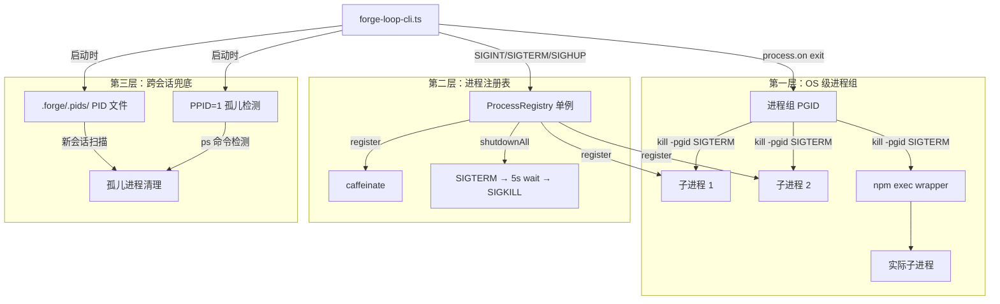
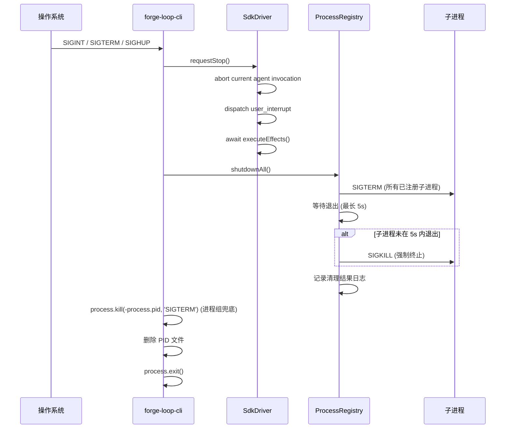
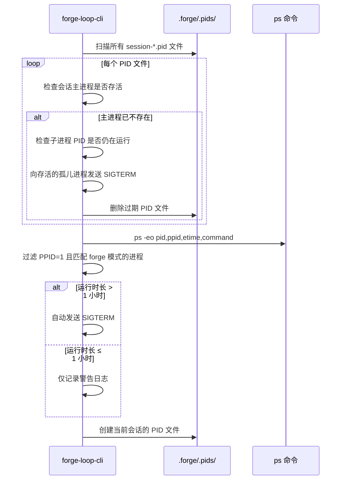

# 设计文档：进程生命周期管理

## 概述

本设计为 Forge 引入三层防御架构的子进程生命周期管理机制：

1. **第一层：进程组隔离** — 利用操作系统级别的进程组（PGID）机制，通过 `kill(-pgid, signal)` 一次性清理整个进程树
2. **第二层：进程注册表 + 统一清理** — 内存中的 `ProcessRegistry` 单例追踪所有子进程，在信号处理中按 SIGTERM → 等待 → SIGKILL 顺序清理
3. **第三层：跨会话兜底清理** — 通过 PID 文件和 PPID=1 检测，在新会话启动时清理前一会话遗留的孤儿进程

当前代码库存在以下问题：
- 无进程注册表（`ProcessRegistry` 不存在）
- Sleep prevention 进程使用 `detached: true` + `unref()`，父进程退出后可能变成孤儿
- `requestStop()` 中 `executeEffects()` 是 fire-and-forget（`void this.executeEffects(result.effects)`）
- git 命令（`execFileSync`）无超时保护，可能无限阻塞
- 信号处理仅处理 SIGINT/SIGTERM，未处理 SIGHUP（终端关闭场景）
- vitest 配置无并发限制，多 worktree 并行测试时可能产生大量 node 进程

本设计通过新增 `ProcessRegistry` 模块和修改现有模块（`forge-loop-cli.ts`、`sdk-driver.ts`、`effect-executor.ts`、`run-manager.ts`、`sleep-preventer.ts`、`vitest.config.ts`）来解决上述问题。

## 架构

### 整体架构图



### 信号处理流程



### 启动时清理流程



## 组件与接口

### 1. ProcessRegistry（新增模块：`src/process-registry.ts`）

核心单例类，负责子进程追踪、封装启动和统一清理。

```typescript
/** 子进程元数据 */
interface ProcessMetadata {
  pid: number;
  pgid: number;
  startTime: number;           // Date.now() 时间戳
  source: string;              // 来源标识，如 "sleep-prevention"、"git-command"、"test-runner"
  detached: boolean;
  description?: string;
}

/** 序列化后的注册表状态 */
interface SerializedRegistry {
  sessionPid: number;
  sessionPgid: number;
  sessionStartTime: number;
  processes: ProcessMetadata[];
}

/** 清理结果统计 */
interface ShutdownResult {
  terminated: number;          // 正常 SIGTERM 终止的数量
  forcedKill: number;          // SIGKILL 强制终止的数量
  alreadyExited: number;       // 清理前已退出的数量
  errors: Array<{ pid: number; error: string }>;
}

class ProcessRegistry {
  /** 获取单例实例 */
  static getInstance(): ProcessRegistry;

  /** 重置单例（仅用于测试） */
  static resetInstance(): void;

  /** 注册子进程 */
  register(child: ChildProcess, metadata: Omit<ProcessMetadata, 'pid' | 'pgid' | 'startTime'>): void;

  /** 注销指定 PID 的子进程 */
  unregister(pid: number): void;

  /** 获取所有已注册子进程的元数据 */
  getAll(): ReadonlyArray<ProcessMetadata>;

  /** 获取已注册子进程数量 */
  size(): number;

  /** 封装 child_process.spawn，自动注册 */
  spawnTracked(
    command: string,
    args: string[],
    options: SpawnOptions & { source: string; description?: string }
  ): ChildProcess;

  /** 封装 child_process.execFileSync，自动设置超时 */
  execTracked(
    command: string,
    args: string[],
    options?: ExecFileSyncOptions & { source?: string; timeout?: number }
  ): Buffer | string;

  /** 统一清理所有已注册子进程：SIGTERM → 等待 5s → SIGKILL */
  shutdownAll(): Promise<ShutdownResult>;

  /** 序列化当前状态为 JSON 字符串 */
  serialize(): string;

  /** 从 JSON 字符串反序列化元数据列表 */
  static deserialize(json: string): SerializedRegistry;
}
```

**设计决策：**
- 使用单例模式确保全局唯一注册表，避免多个模块各自维护子进程列表
- `register()` 自动监听子进程 `exit` 事件实现自动注销，调用方无需手动管理
- `spawnTracked` / `execTracked` 封装原生 API，确保所有子进程都经过注册表
- `shutdownAll()` 返回 Promise，支持 await 等待清理完成（解决 fire-and-forget 问题）
- `serialize()` / `deserialize()` 支持 PID 文件持久化和调试日志

### 2. ProcessTreeCleaner（新增模块：`src/process-tree-cleaner.ts`）

负责多层进程树的发现和清理。

```typescript
/** 进程树节点 */
interface ProcessTreeNode {
  pid: number;
  command: string;
  children: ProcessTreeNode[];
}

/** 获取指定 PID 的所有后代进程 */
function getDescendants(pid: number): Promise<ProcessTreeNode[]>;

/** 按叶子到根的顺序终止进程树 */
function killProcessTree(
  pid: number,
  signal?: NodeJS.Signals,
  timeoutMs?: number
): Promise<{ killed: number[]; failed: number[] }>;

/** 尝试通过进程组 kill 清理，失败时回退到逐 PID 清理 */
function killProcessGroup(
  pgid: number,
  signal?: NodeJS.Signals
): boolean;
```

**设计决策：**
- 独立模块，与 `ProcessRegistry` 解耦，可单独测试
- `getDescendants` 使用 `pgrep -P <pid>` 递归查找后代进程
- `killProcessTree` 按深度优先逆序（叶子到根）发送信号，确保子进程先于父进程终止
- 优先使用 `kill(-pgid)` 进程组级别清理，仅在失败时回退到逐 PID 清理

### 3. OrphanDetector（新增模块：`src/orphan-detector.ts`）

负责跨会话孤儿进程检测与清理。

```typescript
/** PID 文件内容 */
interface PidFileContent {
  sessionPid: number;
  sessionPgid: number;
  sessionStartTime: number;
  processes: Array<{ pid: number; source: string }>;
}

/** 孤儿进程信息 */
interface OrphanProcess {
  pid: number;
  command: string;
  elapsedSeconds: number;
  source: 'pid-file' | 'ppid-detection';
}

/** PID 文件管理 */
function writePidFile(sessionId: string, content: PidFileContent, baseDir: string): void;
function readPidFile(filePath: string): PidFileContent | null;
function deletePidFile(sessionId: string, baseDir: string): void;

/** 扫描 PID 文件，清理已失效会话的孤儿进程 */
function cleanupStaleSessions(baseDir: string): Promise<OrphanProcess[]>;

/** PPID=1 孤儿进程检测（仅 macOS/Linux） */
function detectPpidOrphans(
  patterns: string[],
  maxAgeSeconds: number
): Promise<OrphanProcess[]>;

/** 清理孤儿进程（运行时长 > 1 小时的自动 SIGTERM，其余仅日志） */
function cleanupOrphans(
  orphans: OrphanProcess[],
  autoKillThresholdSeconds: number
): { killed: number[]; warned: number[] };
```

**设计决策：**
- PID 文件存储在 `.forge/.pids/` 目录，文件名格式 `session-<sessionId>.pid`
- PID 文件使用 JSON 格式，便于解析和调试
- PPID=1 检测使用 `ps -eo pid,ppid,etime,command` 命令，匹配 `forge`、`vitest`、`caffeinate` 等关键字
- 自动清理阈值为 1 小时，避免误杀用户手动启动的进程
- 仅在 macOS 和 Linux 上执行 PPID=1 检测（Windows 孤儿机制不同）

### 4. 现有模块修改

#### `forge-loop-cli.ts` 修改

- **信号处理**：新增 SIGHUP 处理，统一调用 `ProcessRegistry.shutdownAll()`
- **Sleep prevention**：移除 `detached: true`，改用 `spawnTracked` 注册到注册表
- **进程组兜底**：在 `process.on('exit')` 中执行 `process.kill(-process.pid, 'SIGTERM')`
- **启动时清理**：在 main() 开头调用 `cleanupStaleSessions()` 和 `detectPpidOrphans()`
- **PID 文件管理**：启动时创建 PID 文件，退出时删除
- **requestStop 等待**：设置 10 秒最大等待时间，超时后强制退出

#### `sdk-driver.ts` 修改

- **requestStop()**：将 `void this.executeEffects(result.effects)` 改为存储 Promise，供外部 await
- 新增 `getStopPromise(): Promise<void> | null` 方法，返回 requestStop 的清理 Promise

#### `effect-executor.ts` 修改

- 所有 `execFileSync` 调用添加 `timeout: 30_000` 和 `killSignal: 'SIGTERM'` 选项
- 超时错误包含被执行的 git 命令和超时时长信息

#### `run-manager.ts` 修改

- 所有 `execFileSync` 调用添加 `timeout: 30_000` 和 `killSignal: 'SIGTERM'` 选项

#### `sleep-preventer.ts` 修改

- `buildCaffeinateCommand()` 返回的 `detached` 改为 `false`（`-w` 参数已确保父进程退出时 caffeinate 自动终止）

#### `vitest.config.ts` 修改

- 添加 `pool: 'forks'`、`poolOptions.forks.maxForks: 2`、`fileParallelism: true`

## 数据模型

### ProcessMetadata

| 字段 | 类型 | 说明 |
|------|------|------|
| pid | number | 子进程 PID |
| pgid | number | 子进程所在进程组 ID |
| startTime | number | 启动时间戳（`Date.now()`） |
| source | string | 来源标识（"sleep-prevention"、"git-command"、"test-runner" 等） |
| detached | boolean | 是否以 detached 模式启动 |
| description | string? | 可选的描述信息 |

### SerializedRegistry（PID 文件格式）

```json
{
  "sessionPid": 12345,
  "sessionPgid": 12345,
  "sessionStartTime": 1719000000000,
  "processes": [
    {
      "pid": 12346,
      "pgid": 12345,
      "startTime": 1719000001000,
      "source": "sleep-prevention",
      "detached": false,
      "description": "caffeinate -i -w 12345"
    },
    {
      "pid": 12347,
      "pgid": 12345,
      "startTime": 1719000002000,
      "source": "git-command",
      "detached": false,
      "description": "git rev-parse HEAD"
    }
  ]
}
```

### ShutdownResult

| 字段 | 类型 | 说明 |
|------|------|------|
| terminated | number | 正常 SIGTERM 终止的子进程数量 |
| forcedKill | number | SIGKILL 强制终止的子进程数量 |
| alreadyExited | number | 清理前已自行退出的子进程数量 |
| errors | Array<{pid, error}> | 清理过程中遇到的错误列表 |


## 正确性属性

*属性（Property）是一种在系统所有有效执行中都应成立的特征或行为——本质上是对系统应做什么的形式化陈述。属性是人类可读规格说明与机器可验证正确性保证之间的桥梁。*

以下属性基于对所有 12 项需求的验收标准进行逐条分析后提炼而成。经过冗余消除和合并，最终保留以下独立属性：

### Property 1: 注册保留元数据

*对于任意* 有效的 ProcessMetadata（包含任意 source 字符串、任意 description、任意 detached 标志），将其通过 `register()` 或 `spawnTracked()` 注册到 ProcessRegistry 后，`getAll()` 返回的列表中应包含该条目，且所有元数据字段（pid、pgid、startTime、source、detached、description）与注册时一致，同时 `size()` 应等于 `getAll().length`。

**Validates: Requirements 1.1, 1.4, 1.5, 1.7, 8.1, 8.5**

### Property 2: 注销移除进程

*对于任意* 已注册子进程集合和任意子集的注销操作（无论是手动调用 `unregister(pid)` 还是子进程 exit 事件触发的自动注销），注销后 `getAll()` 不应包含已注销的 PID，且 `size()` 应减少相应数量，未注销的进程应保持不变。

**Validates: Requirements 1.2, 1.3, 8.3**

### Property 3: shutdownAll 终止所有已注册进程

*对于任意* 已注册子进程集合（包含响应 SIGTERM 的进程和不响应的进程），调用 `shutdownAll()` 后，所有进程最终都应被终止（响应 SIGTERM 的正常退出，不响应的在超时后被 SIGKILL），且 `ShutdownResult` 中 `terminated + forcedKill + alreadyExited` 应等于调用前的 `size()`。

**Validates: Requirements 2.7**

### Property 4: 序列化反序列化 round-trip

*对于任意* 有效的 `SerializedRegistry` 对象（包含任意 sessionPid、sessionPgid、sessionStartTime 和任意长度的 processes 数组），调用 `serialize()` 后再调用 `deserialize()` 应产生与原始状态等价的元数据列表。

**Validates: Requirements 11.1, 11.2, 11.3, 11.4**

### Property 5: deserialize 拒绝无效 JSON

*对于任意* 非法 JSON 字符串（包括空字符串、截断的 JSON、缺少必要字段的 JSON、类型错误的字段值），调用 `deserialize()` 应抛出包含描述性信息的异常，而非返回部分数据或静默失败。

**Validates: Requirements 11.5**

### Property 6: PID 文件解析容错

*对于任意* 无效的 PID 文件内容（损坏的 JSON、空文件、二进制数据），调用 `readPidFile()` 应返回 `null` 而非抛出异常，确保不影响正常启动流程。

**Validates: Requirements 6.7**

### Property 7: ps 输出解析正确过滤 PPID=1 孤儿进程

*对于任意* `ps -eo pid,ppid,etime,command` 的输出（包含不同 PPID 值和不同命令行的进程条目），解析结果应仅包含 PPID=1 且命令行匹配 Forge 相关模式（forge、vitest、caffeinate）的进程，不应包含 PPID≠1 的进程或命令行不匹配的进程。

**Validates: Requirements 7.2**

### Property 8: 孤儿进程自动清理阈值

*对于任意* 检测到的孤儿进程集合（运行时长从 0 到任意大），运行时长超过 1 小时的进程应被自动发送 SIGTERM，运行时长不超过 1 小时的进程不应被自动清理（仅记录警告）。清理决策应完全由运行时长与阈值的比较决定。

**Validates: Requirements 7.4, 7.5**

### Property 9: 进程树清理顺序为叶子到根

*对于任意* 进程树结构（包括单层、多层、宽树、深树），`killProcessTree()` 发送信号的顺序应满足：对于树中任意父子关系 (parent, child)，child 收到信号的时间早于 parent。即信号按深度优先逆序（叶子到根）发送。

**Validates: Requirements 12.2**

### Property 10: Git 超时错误消息格式

*对于任意* git 命令字符串和超时时长，当 `execTracked()` 因超时抛出错误时，错误消息应包含被执行的 git 命令名称和超时时长（30 秒），使开发者能快速定位问题。

**Validates: Requirements 5.3**

### Property 11: PID 文件与注册表状态同步

*对于任意* register/unregister 操作序列，每次操作后 PID 文件的内容应与 `ProcessRegistry.serialize()` 的输出一致，确保跨会话清理机制能获取准确的进程信息。

**Validates: Requirements 6.1, 6.2**

## 错误处理

### 信号处理错误

| 场景 | 处理策略 |
|------|----------|
| SIGTERM 发送失败（进程已退出） | 捕获 ESRCH 错误，标记为 `alreadyExited`，继续处理下一个进程 |
| SIGKILL 发送失败 | 记录错误日志，将错误添加到 `ShutdownResult.errors`，继续处理 |
| `shutdownAll()` 超时（5 秒） | 对未退出的进程发送 SIGKILL，不再等待 |
| `requestStop()` 清理超时（10 秒） | 记录警告日志，调用 `process.exit(1)` 强制退出 |
| 进程组 kill 失败 | 回退到逐 PID 清理策略 |

### PID 文件错误

| 场景 | 处理策略 |
|------|----------|
| PID 文件目录不存在 | 自动创建 `.forge/.pids/` 目录 |
| PID 文件写入失败 | 记录警告日志，不影响主流程（PID 文件是辅助机制） |
| PID 文件读取失败 | 返回 `null`，记录警告日志，跳过该文件 |
| PID 文件 JSON 解析失败 | 返回 `null`，记录警告日志，删除损坏的文件 |
| PID 文件中的 PID 对应进程不存在 | 跳过该 PID，继续处理其他 PID |

### Git 命令错误

| 场景 | 处理策略 |
|------|----------|
| git 命令超时（30 秒） | 抛出包含命令名和超时时长的错误，`execFileSync` 自动终止子进程（`killSignal: 'SIGTERM'`） |
| git 命令执行失败（非超时） | 保持现有错误处理逻辑不变 |

### 孤儿检测错误

| 场景 | 处理策略 |
|------|----------|
| `ps` 命令执行失败 | 记录警告日志，跳过 PPID=1 检测，不影响正常启动 |
| `pgrep` 命令执行失败 | 记录警告日志，回退到仅终止直接子进程 |
| `ps` 输出解析失败 | 跳过无法解析的行，继续处理其他行 |
| 平台不支持（Windows） | 跳过 PPID=1 检测，仅使用 PID 文件机制 |

### 序列化错误

| 场景 | 处理策略 |
|------|----------|
| `serialize()` 时注册表为空 | 正常返回包含空 `processes` 数组的 JSON |
| `deserialize()` 接收无效 JSON | 抛出 `SyntaxError` 或自定义错误，包含描述性信息 |
| `deserialize()` 接收缺少必要字段的 JSON | 抛出包含缺失字段名称的验证错误 |

## 测试策略

### 双轨测试方法

本功能采用 **属性测试（Property-Based Testing）** 和 **示例测试（Example-Based Testing）** 相结合的策略：

- **属性测试**：使用 `fast-check`（项目已有依赖）验证上述 11 个正确性属性，每个属性至少运行 100 次迭代
- **示例测试**：覆盖具体的集成场景、边界条件和错误处理路径

### 属性测试配置

- **库**：`fast-check` 4.7.0（已在 `devDependencies` 中）
- **最小迭代次数**：100 次（`{ numRuns: 100 }`）
- **标签格式**：`Feature: process-lifecycle-management, Property {N}: {property_text}`
- **每个正确性属性对应一个属性测试**

### 测试文件结构

```
test/
├── process-registry.test.ts           # ProcessRegistry 示例测试
├── process-registry.property.test.ts  # ProcessRegistry 属性测试 (Property 1-5)
├── process-tree-cleaner.test.ts       # ProcessTreeCleaner 示例测试
├── process-tree-cleaner.property.test.ts  # ProcessTreeCleaner 属性测试 (Property 9)
├── orphan-detector.test.ts            # OrphanDetector 示例测试
├── orphan-detector.property.test.ts   # OrphanDetector 属性测试 (Property 6-8, 11)
├── git-timeout.test.ts                # Git 超时示例测试
├── git-timeout.property.test.ts       # Git 超时属性测试 (Property 10)
```

### 属性测试与需求映射

| 属性 | 测试文件 | 验证需求 |
|------|----------|----------|
| Property 1: 注册保留元数据 | process-registry.property.test.ts | 1.1, 1.4, 1.5, 1.7, 8.1, 8.5 |
| Property 2: 注销移除进程 | process-registry.property.test.ts | 1.2, 1.3, 8.3 |
| Property 3: shutdownAll 终止所有 | process-registry.property.test.ts | 2.7 |
| Property 4: 序列化 round-trip | process-registry.property.test.ts | 11.1-11.4 |
| Property 5: deserialize 拒绝无效 JSON | process-registry.property.test.ts | 11.5 |
| Property 6: PID 文件解析容错 | orphan-detector.property.test.ts | 6.7 |
| Property 7: ps 输出过滤 | orphan-detector.property.test.ts | 7.2 |
| Property 8: 孤儿清理阈值 | orphan-detector.property.test.ts | 7.4, 7.5 |
| Property 9: 进程树叶子到根顺序 | process-tree-cleaner.property.test.ts | 12.2 |
| Property 10: Git 超时错误格式 | git-timeout.property.test.ts | 5.3 |
| Property 11: PID 文件状态同步 | orphan-detector.property.test.ts | 6.1, 6.2 |

### 示例测试覆盖

| 测试场景 | 类型 | 验证需求 |
|----------|------|----------|
| 单例模式验证 | EXAMPLE | 1.6 |
| SIGINT/SIGTERM/SIGHUP 信号处理 | INTEGRATION | 2.1-2.3 |
| SIGTERM → 5s 等待 → SIGKILL 序列 | EXAMPLE | 2.4, 2.5 |
| 清理结果日志记录 | EXAMPLE | 2.6 |
| requestStop await 而非 fire-and-forget | EXAMPLE | 2.8 |
| 默认不使用 detached:true | EXAMPLE | 3.1 |
| detached 进程记录 PGID | EXAMPLE | 3.2 |
| 进程组兜底清理（exit handler） | INTEGRATION | 3.3, 3.4 |
| detached 进程使用 kill(-pgid) | EXAMPLE | 3.5 |
| Sleep prevention 注册到注册表 | EXAMPLE | 4.1 |
| caffeinate detached:false | EXAMPLE | 4.2 |
| kill() 失败日志 | EDGE_CASE | 4.3 |
| execFileSync timeout:30000 | EXAMPLE | 5.1, 5.2, 5.4 |
| 过期会话 PID 文件清理 | EXAMPLE | 6.3-6.5 |
| 正常退出删除 PID 文件 | EXAMPLE | 6.6 |
| PPID=1 检测仅 macOS/Linux | EXAMPLE | 7.6 |
| 10 秒最大等待时间 | EXAMPLE | 10.2, 10.3 |
| 进程组 kill 失败回退 | EXAMPLE | 12.5 |
| pgrep 后代进程发现 | EXAMPLE | 12.1 |
| 后代进程 3 秒 SIGKILL 升级 | EXAMPLE | 12.3 |
| 清理日志完整性 | EXAMPLE | 12.4 |
| vitest pool/maxForks/fileParallelism 配置 | SMOKE | 9.1-9.3 |

### Mock 策略

由于进程管理涉及大量 OS 级操作，测试中需要广泛使用 mock：

- **ChildProcess mock**：模拟 `spawn` 返回的子进程对象，支持 `kill()`、`pid`、`on('exit')` 等
- **process.kill mock**：模拟信号发送，避免实际终止进程
- **execFileSync mock**：模拟 git 命令执行和超时
- **fs mock**：模拟 PID 文件的读写操作
- **child_process.execSync mock**：模拟 `ps` 和 `pgrep` 命令输出
