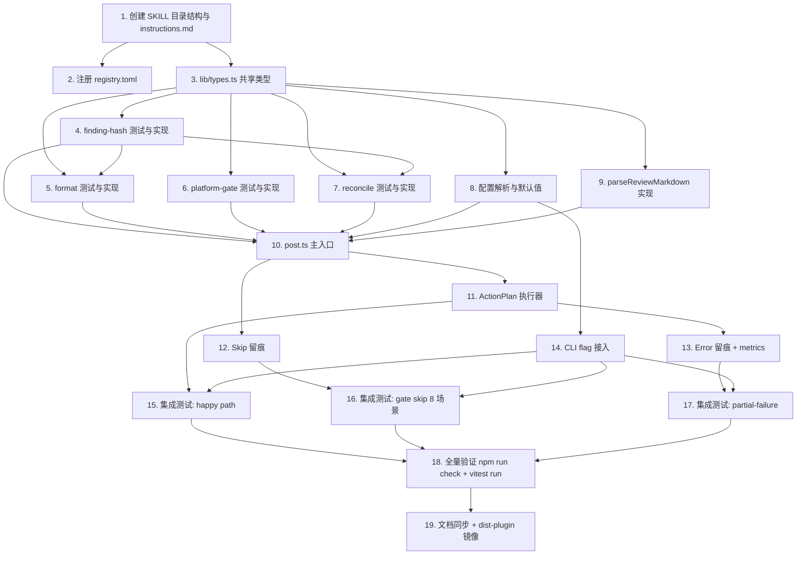

# Implementation Plan: review-comment-bitbucket

> **来源**：本任务清单基于 `.forge/specs/review-comment-bitbucket/design.md`（含 27 条 correctness property）和 `.forge/specs/review-comment-bitbucket/requirements.md`（7 个 Requirement / 66 条 acceptance criterion）反向派生。
> **TDD 铁律**（AGENTS.md §2.1）：每个实现任务必须严格遵守 **RED → GREEN → REFACTOR**。先写测试再写实现，发现代码先于测试出现立刻删码重来。
> **Property-Based Testing**：design.md §Correctness Properties 列出的 27 条 property 全部用 [`fast-check`](https://github.com/dubzzz/fast-check) 实现；platform-gate 的 8 行决策矩阵每行各一条独立 property。
> **冻结区警告**：本计划不修改 `.forge/decisions/*.md`、不主动修改 `AGENTS.md` 或 `.forge/config.md` 主体；如需追加内容已单列任务并明确"仅追加，不重写"。

## Overview

总计 19 个任务，按 6 个阶段组织：Phase 1 创建 SKILL 骨架（串行）；Phase 2 用 4 个独立纯函数模块覆盖 27 条 property（可并行）；Phase 3 实现配置解析与 review markdown 解析；Phase 4 在 `post.ts` 内汇总编排并实现 ActionPlan 执行器；Phase 5 完成跳过/错误留痕、metrics 累计与 CLI flag 接入；Phase 6 跑端到端集成测试与全量验证。预计总工作量约 8–10 人日，关键路径为 T1 → T3 → (T4..T9 并行最长) → T10 → T11 → T15..T17（并行）→ T18。每个实现任务都遵循"先 N 条 fast-check property + M 条 unit test → 再写实现 → 跑 vitest 验证全绿"的三步式节奏。

## Tasks

### Phase 1: 项目骨架（串行）

- [ ] 1. 创建 SKILL 目录结构与 `instructions.md`
  - 在 `skills/forge/lib/review-comment-bitbucket/` 下建立 `instructions.md`、`lib/`、`test/` 三层目录骨架（按 design.md §"Low-Level Design：模块结构"）
  - `instructions.md` 含 frontmatter（`description` 单行 + `dispatch_mode: inline` + `allowed_tools: [Read, Bash, Write]`）和正文锚点指向 `.forge/specs/review-comment-bitbucket/{design,requirements}.md`
  - 不实现任何 lib/ 文件；仅占位空目录与一个 `lib/.gitkeep` 兜底
  - _Requirements: 6.1, 6.10_

- [ ] 2. 在 `skills/forge/registry.toml` 注册新 SKILL
  - 在 `[review]` 之后追加 `[review-comment-bitbucket]` 段，含 `dispatch_mode = "inline"`、`allowed_tools = ["Read", "Bash", "Write"]`、`description = "..."`（描述照搬 instructions.md 顶部）
  - 同步更新 `Last regen` 时间戳；如项目使用 `scripts/regen-skill-registry.mjs`，跑一次脚本而非手改
  - 不实现任何代码逻辑；仅注册条目
  - _Requirements: 6.1_

- [ ] 3. 创建 `lib/types.ts` 共享类型定义
  - **先写**：`test/types.test.ts` 用 TypeScript 类型断言（`expectTypeOf` 或 `tsd`）覆盖：`Priority` 联合类型只接受 `P0|P1|P2|P3`；`Action` 四种 `kind` 互斥；`ResolvedConfig.p3_strategy` 字面量必须是 `'none'`；`Finding.line_type` 联合类型仅含 `ADDED|REMOVED|CONTEXT`
  - **再写实现**：`Finding`、`TaskRecord`、`CommentRecord`、`Action`、`ActionPlan`、`ResolvedConfig`、`GateInput`、`GateSkipReason`、`GateResult`、`PostContext`、`PostResult`、`FormatOutput` 全部类型，对照 design.md §"Data Models"逐字段建模
  - **验证**：`npx tsc --noEmit` 通过
  - _Requirements: 1.1-1.11, 2.1-2.9, 3.1-3.8, 4.1-4.7, 5.1-5.11, 6.1-6.11_

### Phase 2: 纯函数模块（彼此独立，可并行开发）

- [ ] 4. `lib/finding-hash.ts` 测试与实现
  - **先写 fast-check property（5 条）**：
    - Property 1（稳定性）`∀ f: hash(f) === hash(deepClone(f))`，**Validates: Requirement 4.1**
    - Property 2（message 微调免疫）`∀ f, suffix: hash(f) === hash({...f, message: f.message.slice(0,100) + suffix})`，**Validates: Requirement 4.2**
    - Property 3（稳定字段敏感）任一稳定字段变化必产生不同 hash（允许 fast-check `numRuns=200` 的统计放过），**Validates: Requirement 4.3**
    - Property 4（marker 往返）`∀ f, prefix: extractMarker(buildMarker(prefix, hash(f)), prefix) === hash(f)`，**Validates: Requirement 4.4**
    - Property 5（格式严谨）`hash(f).length === 12 ∧ /^[a-f0-9]{12}$/.test(hash(f))`，**Validates: Requirement 4.5**
  - **再写 unit test（4 条）**：
    - 字段分隔符使用 `U+0000`（构造两个串接歧义样本断言不同 hash）→ Requirement 4.1
    - `file_path` 大小写敏感、不归一化分隔符 → Requirement 4.3
    - `extractMarker` prefix 不一致返回 `null`、无匹配返回 `null` → Requirement 4.6
    - `extractMarker` 忽略三反引号围栏代码块内的疑似 marker → Requirement 4.7
  - **再写实现**：`computeFindingHash` / `buildMarker` / `extractMarker` / `MARKER_RE` 完整代码，sha256 用 Node 内置 `crypto`
  - **验证**：`npx vitest run skills/forge/lib/review-comment-bitbucket/test/finding-hash.test.ts` 全绿
  - _Requirements: 4.1, 4.2, 4.3, 4.4, 4.5, 4.6, 4.7_

- [ ] 5. `lib/format.ts` 测试与实现
  - **先写 fast-check property（4 条）**：
    - Property 24（marker 在尾部）`comment_text.endsWith(marker) ∧ (task_text === '' || task_text.endsWith(marker))`，**Validates: Requirement 3.1**
    - Property 25（P2 不产 task）`finding.priority === 'P2' ⇒ format(finding).task_text === ''`，**Validates: Requirement 3.3**
    - Property 26（suggestion 块格式）`suggestion 非空 ⇒ comment_text 含完整 ```suggestion 围栏块且块内 === finding.suggestion`，**Validates: Requirement 3.4**
    - Property 27（single-line task title）P0/P1 时 `task_text` 第一行不含换行符且首行长度 ≤ 200，**Validates: Requirement 3.5**
  - **再写 unit test（5 条）**：
    - `comment_text` 头部按"标签头 → 空行 → message → suggestion 块 → 空行 → `_review run: <id>_` → marker"顺序输出 → Requirement 3.1
    - P0/P1 task title 含 `<file_path>:<line_number>` 子串且整体 ≤ 200 字符；超长截断时保留 `[Forge P0]` 前缀与尾部 marker → Requirement 3.5
    - `message` 含三反引号子串时 `comment_text` 改用四反引号围栏，且 `extractMarker` 仍可从 `comment_text` 末尾稳定提取 → Requirement 3.6
    - `done_comment_text` 文案恒为 `Forge auto-resolved (no longer present in review <run_id>).` 末尾接 marker → Requirement 3.7
    - `reopen_comment_text` 文案恒为 `Forge re-opened (still present in review <run_id>).` 末尾接 marker → Requirement 3.8
  - **再写实现**：`formatFinding` 完整函数，依赖 `lib/finding-hash.ts`（Phase 2 内同时开发，import 类型层面对齐即可）
  - **验证**：`npx vitest run skills/forge/lib/review-comment-bitbucket/test/format.test.ts` 全绿
  - _Requirements: 3.1, 3.2, 3.3, 3.4, 3.5, 3.6, 3.7, 3.8_

- [ ] 6. `lib/platform-gate.ts` 测试与实现
  - **先写 fast-check property（10 条）**，每条对应决策矩阵一行或一项 helper 性质：
    - Property 14（第 1 行：URL 含 `bitbucket.` + auto + MCP 已配置 + 同源 → pass），**Validates: Requirement 1.1**
    - Property 15（第 2 行：URL 含 `bitbucket.` + auto + MCP 已配置 + 不同源 → `mcp-base-url-mismatch`），**Validates: Requirement 1.2**
    - Property 16（第 3 行：URL 含 `bitbucket.` + auto + MCP 未配置 → `mcp-not-configured`），**Validates: Requirement 1.3**
    - Property 17（第 4 行：URL 不含 `bitbucket.` + auto → `platform-not-bitbucket`，含 `null` URL），**Validates: Requirement 1.4**
    - Property 18（第 5 行：override=bitbucket + MCP 已配置 + 同源 → pass，强制路径），**Validates: Requirement 1.5**
    - Property 19（第 6 行：override=bitbucket + MCP 已配置 + 不同源 → `mcp-base-url-mismatch`），**Validates: Requirement 1.6**
    - Property 20（第 7 行：override=bitbucket + MCP 未配置 → `override-but-mcp-missing`），**Validates: Requirement 1.7**
    - Property 21（第 8 行：override=none → `platform-disabled-by-config`，最高优先级），**Validates: Requirement 1.8**
    - Property 22（URL 大小写无关 `Bitbucket.Org === bitbucket.org`），**Validates: Requirement 1.9**
    - Property 23（host 比较含 port，`example.com:7990` 与 `example.com` 不同源），**Validates: Requirement 1.10**
  - **再写 unit test（4 条）**：
    - `null` URL + override=auto → 第 4 行 `platform-not-bitbucket` → Requirement 1.4
    - SCP-style URL `git@bitbucket.example.com:org/repo.git` 解析为 host=`bitbucket.example.com` → Requirement 1.9
    - IPv6 字面量 `[::1]:7990` 与 `::1:7990` 归一化后同源（去外层方括号、小写） → Requirement 1.10
    - 多 remote 场景：`origin` > PR upstream > 首个与 `MCP_Base_URL` 同源 remote > `null` 的优先级选定（在 helper `selectRemoteUrl` 中实现并测试） → Requirement 1.11
  - **再写实现**：`checkPlatformGate` + helper（`isBitbucketUrl` / `isSameHost` / `parseRemoteUrl` / `selectRemoteUrl`），全部纯函数无副作用、不抛异常
  - **验证**：`npx vitest run skills/forge/lib/review-comment-bitbucket/test/platform-gate.test.ts` 全绿
  - _Requirements: 1.1, 1.2, 1.3, 1.4, 1.5, 1.6, 1.7, 1.8, 1.9, 1.10, 1.11_

- [ ] 7. `lib/reconcile.ts` 测试与实现
  - **先写 fast-check property（8 条）**：
    - Property 6（缺失 finding 必标记 done，`Latest_Task` 仅取 `max(task_id)` 且仅在 OPEN 时 done），**Validates: Requirement 5.1**
    - Property 7（新增 finding 必创建 task；`p0_p1_strategy=pr-task` 时仅看历史 PR Task 集合），**Validates: Requirement 5.2**
    - Property 8（冲突 RESOLVED + 当前仍存在 → reopen 取 `Latest_Task`），**Validates: Requirement 5.3**
    - Property 9（`creates`/`dones`/`reopens` 中同一 hash 至多出现一次的互斥性），**Validates: Requirement 5.4**
    - Property 10（`autoReconcileResolved=false` ⇒ `dones === []`），**Validates: Requirement 5.5**
    - Property 11（`autoReopenRegressed=false` ⇒ `reopens === []` 且 RESOLVED 落入 `skips` 并记录 `Latest_Task.task_id`），**Validates: Requirement 5.6**
    - Property 12（`has_p0_p1` 当且仅当 `currentFindings` 含 P0/P1），**Validates: Requirement 5.7**
    - Property 13（输入注入"非 Forge marker"task/comment，输出动作集合不引用其 id），**Validates: Requirement 5.8**
  - **再写 unit test（5 条）**：
    - 同一 marker_hash 多条历史 task 时只对 `max(task_id)` 操作，其它 task_id 不出现在任何动作集合 → Requirement 5.1, 5.3, 5.6
    - `p0_p1_strategy=pr-task` + 历史仅有 inline comment（无 PR Task）+ 当前仍存在 → 落入 `creates` → Requirement 5.2
    - 非 `pr-task` 策略下、历史 inline comment 存在但 PR Task 缺失 → `Action_Skip` 携带 `orphan-comment` 原因 → Requirement 5.9
    - reopen 后 `Post_Channel` 必须挂 `parent_comment_id` 写 `reopen_comment_text`（在 ActionPlan 元数据中携带 `parent_comment_id` 字段） → Requirement 5.10
    - done 后 `Post_Channel` 必须挂 `parent_comment_id` 写 `done_comment_text`（在 ActionPlan 元数据中携带 `parent_comment_id` 字段） → Requirement 5.11
  - **再写实现**：`reconcile`（含 `Latest_Task` 选择 helper）+ `extractForgeTasks` / `extractForgeComments` 过滤函数，全部纯函数
  - **验证**：`npx vitest run skills/forge/lib/review-comment-bitbucket/test/reconcile.test.ts` 全绿
  - _Requirements: 5.1, 5.2, 5.3, 5.4, 5.5, 5.6, 5.7, 5.8, 5.9, 5.10, 5.11_

- [ ] 7.x Checkpoint：Phase 2 收尾
  - 跑 `npx vitest run skills/forge/lib/review-comment-bitbucket/test/` 一次性确认 4 个模块的 27 条 property + 18 条 unit test 全部通过
  - Ensure all tests pass, ask the user if questions arise.

### Phase 3: 配置解析与 review markdown 解析

- [ ] 8. 配置解析与默认值填充（`lib/config.ts`）
  - **先写 fast-check property（2 条）**：
    - 任意合法配置子集 + 缺省字段 ⇒ 解析后字段恰好为默认值表的对应值（`enabled: false` / `platform: bitbucket` / `platform_override: auto` / `p0_p1_strategy: both` / `p2_strategy: inline` / `p3_strategy: none` / `request_changes_on_p0_p1: true` / `auto_reconcile_resolved: true` / `auto_reopen_regressed: true` / `comment_marker_prefix: "forge-review"` / `rate_limit_interval_ms: 100`） → Requirement 6.10
    - `rate_limit_interval_ms` 在 `[0, 10000]` 闭区间内任意值合法、之外必抛错 → Requirement 6.8
  - **再写 unit test（8 条）**：
    - `platform != 'bitbucket'` ⇒ 抛错 → Requirement 6.5
    - `p3_strategy != 'none'` ⇒ 抛错 → Requirement 6.6
    - `platform_override` 不在 `{auto, bitbucket, none}` ⇒ 抛错 → Requirement 6.7
    - `comment_marker_prefix` 不匹配 `[\w-]+` ⇒ 抛错 → Requirement 6.9
    - `rate_limit_interval_ms < 0` 或 `> 10000` ⇒ 抛错 → Requirement 6.8
    - `.forge/config.md` 完全缺失 `review.comment_channel` 段 ⇒ 全部默认值 → Requirement 6.1
    - `BITBUCKET_BASE_URL` 缺失但配置正常 ⇒ 不抛错（运行时由 platform-gate 处理） → Requirement 6.11
    - 错误信息前缀 `Invalid review.comment_channel:` 便于定位 → Requirement 7.4
  - **再写实现**：`parseCommentChannelConfig(rawSection?: object): ResolvedConfig`，从 `.forge/config.md` YAML 段读取
  - **验证**：`npx vitest run skills/forge/lib/review-comment-bitbucket/test/config.test.ts` 全绿
  - _Requirements: 6.1, 6.5, 6.6, 6.7, 6.8, 6.9, 6.10, 6.11, 7.4_

- [ ] 9. `parseReviewMarkdown` 实现（`lib/parse-review.ts`）
  - **先写 unit test（5 条）**：
    - 文件不存在 ⇒ 抛 `ReviewMarkdownNotFoundError`，错误信息含 path → Requirement 7.8
    - 解析失败（schema 不符） ⇒ 抛 `ReviewMarkdownParseError`，错误信息含错误码 → Requirement 7.5
    - 解析成功 ⇒ 返回 `Finding[]`，每条含必填字段（priority / file_path / line_number / finding_type / message / line_type / source_layer） → 间接覆盖 Requirements 2.1-2.9
    - 缺失 `suggestion` / `suggestion_end_line` 字段时为 `undefined`，不报错 → Requirement 3.4
    - P3 finding 仍出现在解析结果中（过滤交给上层 `post.ts`） → Requirement 2.4
  - **再写实现**：`parseReviewMarkdown(path: string): Promise<Finding[]>`，最小 schema：从 markdown 表格或代码块解析（schema 由 review SKILL 已固定，本任务仅消费）
  - **验证**：`npx vitest run skills/forge/lib/review-comment-bitbucket/test/parse-review.test.ts` 全绿
  - _Requirements: 7.5, 7.8, 2.4, 3.4_

### Phase 4: 主入口编排（依赖 Phase 2/3）

- [ ] 10. `lib/post.ts` 主入口测试与实现
  - **先写 fast-check property（2 条）**：
    - 平台门禁 skip ⇒ `bitbucket` MCP mock 任意工具调用次数恒为 0（强契约 property） → Requirement 7.1
    - `has_p0_p1 === false` ⇒ `set_review_status` 调用次数恒为 0 → Requirement 2.6
  - **再写 unit test（9 条）**，全部用 mock 后的 `bitbucket` MCP（`vi.mock('@/skills/forge/lib/review-comment-bitbucket/lib/bitbucket-client')`）：
    - `p0_p1_strategy=both` + 1 条 P0 finding ⇒ 1 次 `create_pr_task` + 1 次 `add_comment` 且 marker 一致 → Requirement 2.1
    - `p0_p1_strategy=pr-task` ⇒ 仅 `create_pr_task`，无 `add_comment` → Requirement 2.7
    - `p0_p1_strategy=inline-only` ⇒ 仅 `add_comment`，无 `create_pr_task` → Requirement 2.8
    - `p2_strategy=inline` + 1 条 P2 finding ⇒ 1 次 `add_comment` 无 task → Requirement 2.2
    - `p2_strategy=none` ⇒ 任何 P2 finding 都不产生调用 → Requirement 2.3
    - P3 finding ⇒ 既不 post 也不参与 `set_review_status` 计数 → Requirement 2.4
    - 存在 P0/P1 ⇒ `set_review_status.comment` 同时含 `P0=<int>` `P1=<int>` `run=<run-id>` 三段子串；即使所有 finding 都已经在历史中 reopen/skip（即 creates/reopens/dones 全空）也照常调用 → Requirement 2.5
    - 工具调用按 P0/P1 → P2 → `set_review_status` 的固定顺序发起 → Requirement 2.9
    - `Action_Reopen` 后 `add_comment` 携带 `parent_comment_id`；`Action_Done` 同理 → Requirements 5.10, 5.11
  - **再写实现**：`postReviewToBitbucket` 函数 + `executePlan` 私有函数（顺序 create → reopen → done → optional set_review_status）；副作用集中于此模块
  - **验证**：`npx vitest run skills/forge/lib/review-comment-bitbucket/test/post.test.ts` 全绿
  - _Requirements: 2.1, 2.2, 2.3, 2.4, 2.5, 2.6, 2.7, 2.8, 2.9, 5.10, 5.11, 7.1_

- [ ] 11. ActionPlan 执行器：节流与 partial-failure 处理
  - **先写 fast-check property（1 条）**：相邻 MCP 工具调用之间记录的最小时间间隔 ≥ `rate_limit_interval_ms`（用 fake timer + spy 注入），**Validates: Requirement 7.7**
  - **再写 unit test（4 条）**：
    - 单条 MCP 调用抛错 ⇒ 后续动作仍执行 + 返回 `posted: true` + `partial_failures: [{ finding_hash, tool_name, error_message, timestamp }]` → Requirement 7.3
    - 限流类错误（429 / `RetryableMCPError`） ⇒ **不**本地重试，直接计入 `partial_failures` → Requirement 7.9
    - `rate_limit_interval_ms === 0` ⇒ 调用之间不强制等待（用 fake timer 验证 `setTimeout(_, 0)` 可被立即推进） → Requirement 7.7
    - 所有动作均失败 ⇒ 仍返回 `posted: true` + 完整 `partial_failures`（不抛给调用方） → Requirement 7.3
  - **再写实现**：在 `lib/post.ts` 中抽出 `executePlan(plan, config, pullRequestId, mcp)` 私有函数；用 `for await` 串行 + 每步 `await sleep(config.rate_limit_interval_ms)`（首步前不睡）
  - **验证**：`npx vitest run skills/forge/lib/review-comment-bitbucket/test/post.test.ts -t "executePlan"` 全绿
  - _Requirements: 7.3, 7.7, 7.9_

### Phase 5: 集成与可观测性

- [ ] 12. Skip 留痕：run-md 追加 + findings 当日文件 + tool-health 计数
  - **先写 unit test（5 条）**，用临时目录（`fs.mkdtemp`）+ 注入 `runId`：
    - 同一 `run-id.md` 多次调用仅向末尾追加 `## comment_channel: skipped (reason: <code>)` 段，永不覆盖文件已有内容（append-only） → Requirement 7.2 + Run_Markdown_Append_Mode
    - `.forge/findings/comment-channel-skipped-<date>.md` 当日文件存在则追加、不存在则创建；含 `reason` / `remote_url` / `mcp_base_url` 三字段 → Requirement 7.2
    - `.forge/knowledge/tool-health.md` 按 `reason` 维护独立计数器，覆盖五个 reason 全集（`platform-not-bitbucket` / `mcp-not-configured` / `mcp-base-url-mismatch` / `override-but-mcp-missing` / `platform-disabled-by-config`） → Requirement 7.2
    - 写入失败（如目录不可写） ⇒ 不抛给调用方，仅吞错并记录 stderr → Requirement 7.1
    - skip 留痕调用 0 次 MCP 工具（与 T10 的强契约 property 互证） → Requirement 7.1
  - **再写实现**：`lib/skip-trace.ts` 暴露 `recordSkip(reviewMarkdownPath, reason, ctx)`；在 `post.ts` 中 gate skip 后调用一次
  - **验证**：`npx vitest run skills/forge/lib/review-comment-bitbucket/test/skip-trace.test.ts` 全绿
  - _Requirements: 7.1, 7.2_

- [ ] 13. Error 留痕：findings 按日期分桶 + metrics.md 累计字段
  - **先写 unit test（4 条）**：
    - `partial_failures` 按当日文件 `.forge/findings/comment-channel-error-<date>.md` 追加；多次调用同日文件不覆盖 → Requirement 7.3
    - `metrics.md` 末尾追加单行（YAML/CSV-ish）含全部 10 个字段：`run_id` / `post_enabled` / `gate_skipped_reason` / `creates` / `dones` / `reopens` / `skips` / `partial_failures` / `set_review_status_called` / `total_duration_ms` → Requirement 7.6
    - `posted: false`（gate skip）路径仍写一行 metrics，`gate_skipped_reason` 非 null、其它计数为 0 → Requirement 7.6
    - `posted: true` 但全部 partial-failed 路径仍写 metrics，`partial_failures` 字段反映正确数量 → Requirement 7.3, 7.6
  - **再写实现**：`lib/observability.ts` 暴露 `recordPartialFailures(failures)` + `appendRunMetrics(plan, ctx, durationMs, gateReason)`；在 `post.ts` 主流程末尾（finally 块）调用
  - **验证**：`npx vitest run skills/forge/lib/review-comment-bitbucket/test/observability.test.ts` 全绿
  - _Requirements: 7.3, 7.6_

- [ ] 14. CLI flag 接入：`--post-comments` / `--no-post-comments` 覆盖 config.md
  - **先写 unit test（5 条）**：
    - 仅 `--post-comments` ⇒ 强制 `enabled = true`（即使 config.md 为 false） → Requirement 6.2
    - 仅 `--no-post-comments` ⇒ 强制 `enabled = false`（即使 config.md 为 true） → Requirement 6.3
    - 同时给 `--post-comments` 与 `--no-post-comments` ⇒ 抛错且错误信息含 `--post-comments 与 --no-post-comments 互斥` 子串 → Requirement 6.4
    - 两个 flag 都未给 ⇒ 取 config.md 值（缺省时 `false`） → Requirement 6.1
    - flag 解析在 `parseCommentChannelConfig` 之后调用，覆盖 `enabled` 字段；其它字段不受 flag 影响 → Requirement 6.2, 6.3
  - **再写实现**：`lib/cli.ts` 暴露 `applyCliOverrides(config: ResolvedConfig, argv: string[]): ResolvedConfig`；在 `post.ts` 入口前调用
  - **验证**：`npx vitest run skills/forge/lib/review-comment-bitbucket/test/cli.test.ts` 全绿
  - _Requirements: 6.1, 6.2, 6.3, 6.4_

### Phase 6: 端到端验证

- [ ] 15. 集成测试：mocked Bitbucket power 全流程 happy path
  - **测试场景**：构造 review markdown fixture（含 1 P0 + 1 P1 + 1 P2 + 1 P3 finding）+ mocked `bitbucket` MCP（`list_pr_tasks` 返回空、`get_pull_request` 返回空 active comments）
  - **断言**：
    - `list_pr_tasks` + `get_pull_request` 各调用 1 次（reconcile 前置读取） → Requirement 5.2 路径
    - `create_pr_task` 调用 2 次（P0 + P1）、`add_comment` 调用 3 次（P0 + P1 + P2，`p0_p1_strategy=both`、`p2_strategy=inline`） → Requirements 2.1, 2.2
    - `set_review_status` 调用 1 次，`comment` 入参含 `P0=1` + `P1=1` + `run=<id>` → Requirement 2.5
    - 工具调用顺序：先全部 P0/P1（task + inline）→ 再 P2 inline → 最后 `set_review_status` → Requirement 2.9
    - 调用之间 sleep ≥ `rate_limit_interval_ms`（用 fake timer + 时间戳数组验证） → Requirement 7.7
    - `metrics.md` 多出一行符合 schema → Requirement 7.6
    - P3 finding 不参与任何 MCP 调用、不参与 `set_review_status.comment` 计数 → Requirement 2.4
  - **验证**：`npx vitest run skills/forge/lib/review-comment-bitbucket/test/integration/happy-path.test.ts` 全绿
  - _Requirements: 2.1, 2.2, 2.4, 2.5, 2.9, 5.2, 7.6, 7.7_

- [ ] 16. 集成测试：gate skip 8 场景留痕完整
  - **测试场景**：参数化 8 行决策矩阵（覆盖 5 种 `GateSkipReason` 全集），每场景一次 `postReviewToBitbucket`：
    - `platform-disabled-by-config`（override=none）
    - `platform-not-bitbucket`（github URL + auto）
    - `platform-not-bitbucket`（remoteUrl=null + auto）
    - `mcp-not-configured`（bitbucket URL + auto + mcpConfigured=false）
    - `mcp-base-url-mismatch`（bitbucket URL + auto + 不同源）
    - `override-but-mcp-missing`（override=bitbucket + mcpConfigured=false）
    - `mcp-base-url-mismatch`（override=bitbucket + 不同源）
    - pass 路径作为对照（确认 skip-trace 不被触发）
  - **断言**：
    - 每个 skip 场景：MCP 工具调用次数恒为 0 → Requirement 7.1
    - run-md 末尾被追加 `## comment_channel: skipped (reason: <code>)` 段，且仅追加（对比 before/after 文件大小） → Requirement 7.2
    - `.forge/findings/comment-channel-skipped-<date>.md` 多出 1 条记录 → Requirement 7.2
    - `.forge/knowledge/tool-health.md` 对应 reason 计数器 +1（覆盖 5 类全集） → Requirement 7.2
    - `metrics.md` 多出一行 `posted=false`，`gate_skipped_reason` 非 null → Requirement 7.6
  - **验证**：`npx vitest run skills/forge/lib/review-comment-bitbucket/test/integration/gate-skip.test.ts` 全绿
  - _Requirements: 1.1-1.10, 7.1, 7.2, 7.6_

- [ ] 17. 集成测试：partial-failure 场景
  - **测试场景**：构造 ActionPlan 含 3 个 create + 2 个 done + 1 个 reopen，mock `add_comment` 在第 2 次调用抛错、`set_pr_task_status` 在第 1 次调用抛 429-style retryable error
  - **断言**：
    - 总调用尝试次数等于 ActionPlan 中动作数（即剩余动作不被中断） → Requirement 7.3
    - 返回 `posted: true` + `partial_failures.length === 2`，每条含 `finding_hash` / `tool_name` / `error_message` / `timestamp` 四字段 → Requirement 7.3
    - `.forge/findings/comment-channel-error-<date>.md` 多出 2 条记录（追加而非覆盖；同日二次跑同测试会再追加 2 条） → Requirement 7.3
    - 限流错误**未触发本地重试**（spy 验证调用次数恒为 1） → Requirement 7.9
    - `set_review_status` 仍被调用（与 partial-failure 解耦） → Requirement 2.5, 2.6
    - 调用之间仍 sleep ≥ `rate_limit_interval_ms` → Requirement 7.7
  - **验证**：`npx vitest run skills/forge/lib/review-comment-bitbucket/test/integration/partial-failure.test.ts` 全绿
  - _Requirements: 2.5, 2.6, 7.3, 7.7, 7.9_

- [ ] 18. 全量验证：`npm run check` + `npx vitest run`
  - 跑 `npm run check`（项目顶层 typecheck + lint）确认无错误
  - 跑 `npx vitest run skills/forge/lib/review-comment-bitbucket/`（单元 + 集成）确认全部通过
  - 跑 `npx vitest run`（全仓库）确认本特性引入未破坏既有测试
  - 输出测试覆盖率报告，27 条 property 与 66 条 acceptance criterion 至少一处覆盖（用 grep 检查 `_Requirements:` 与 `Validates: Requirement` 注释完整性）
  - Ensure all tests pass, ask the user if questions arise.
  - _Requirements: 全部_

- [ ] 19. 文档同步与 dist-plugin 镜像
  - 在 `.forge/specs/review-comment-bitbucket/instructions.md`（如不存在则在本 SKILL `instructions.md`）追加"使用方式"段，**仅追加**，不修改已有锚点
  - 在 `dist-plugin/skills/forge/`、`dist/claude-code/bundles/forge/skills/forge/` 等镜像目录同步 SKILL（如项目用脚本同步则跑脚本；否则手动复制 `instructions.md` + `lib/` + `registry.toml`）
  - **不修改** `AGENTS.md` 或 `.forge/config.md` 主体（冻结区）；如需扩展宪法 §3，单列任务并标注"需用户解锁冻结区后执行"
  - **不修改** `.forge/decisions/2026-05-23-review-inline-comment-channel.md` 或 ADR-0005（已锁定）
  - _Requirements: 6.1, 6.10_

## Notes

- 任务 4–7（Phase 2 纯函数模块）彼此完全独立，可并行开发；除 `format` 依赖 `finding-hash` 的 `buildMarker` 类型（仅类型层面对齐，运行期无依赖）外，无运行期相互依赖。
- 任务 10（`post.ts`）是关键路径：必须等 Phase 2 + Phase 3 全部完成才能开始；`executePlan` 任务（11）从 10 中拆出便于隔离测试节流逻辑与 partial-failure 处理。
- 集成测试（15/16/17）彼此独立，可并行；它们共同依赖 11/12/13/14 全部完成。
- 每个测试任务遵循"先 N 条 fast-check property + M 条 unit test → 再写实现 → 跑 vitest 验证全绿"的三步式节奏（AGENTS.md §2.1 TDD 铁律的具体落地）。
- 27 条 property 在任务 4/5/6/7 与 8/10/11 中已分别明确归属：5 + 4 + 10 + 8 = 27 全覆盖；其它 property 类型断言（如配置默认值）放在配置任务（8）中以 fast-check 形式补充。
- **冻结区约束**：`.forge/decisions/*.md` 全部已锁定；`AGENTS.md` 与 `.forge/config.md` 主体不修改；如发现必须修改请将修改请求单独列出并阻断本任务，不在此任务清单内自动执行。

## Task Dependency Graph



**并行波次（机器可解析的等价 JSON）**：

```json
{
  "waves": [
    { "id": 0, "tasks": ["1"] },
    { "id": 1, "tasks": ["2", "3"] },
    { "id": 2, "tasks": ["4", "6", "8", "9"] },
    { "id": 3, "tasks": ["5", "7", "14"] },
    { "id": 4, "tasks": ["10"] },
    { "id": 5, "tasks": ["11", "12"] },
    { "id": 6, "tasks": ["13"] },
    { "id": 7, "tasks": ["15", "16", "17"] },
    { "id": 8, "tasks": ["18"] },
    { "id": 9, "tasks": ["19"] }
  ]
}
```

- Wave 0（串行）：T1
- Wave 1（并行）：T2、T3
- Wave 2（并行，全部依赖 T3）：T4、T6、T8、T9
- Wave 3（并行）：T5、T7、T14（T5/T7 依赖 T4；T14 依赖 T8）
- Wave 4：T10（关键路径汇聚点）
- Wave 5：T11、T12（均依赖 T10）
- Wave 6：T13（依赖 T11）
- Wave 7（并行）：T15、T16、T17（共同依赖 T11/T12/T13/T14）
- Wave 8：T18
- Wave 9：T19

## References

- 设计文档：`.forge/specs/review-comment-bitbucket/design.md`（含 27 条 correctness property、组件接口、伪代码、数据模型、配置 schema、错误处理）
- 需求文档：`.forge/specs/review-comment-bitbucket/requirements.md`（含 7 个 Requirement / 66 条 EARS acceptance criterion / Glossary / Out of Scope）
- 决策记录：`.forge/decisions/2026-05-23-review-inline-comment-channel.md`（4 个开放问题已锁定，待转 ADR-0006，不修改）
- 项目宪法：`AGENTS.md`（§2.1 TDD 铁律、§2.3 验证铁律、§3 Review Discipline、§3.3 P0/P1 Must Fix）
- 关联 ADR：`.forge/decisions/2026-05-18-review-fallback-ladder.md`（ADR-0005 fallback ladder，本通道附加于其后）
