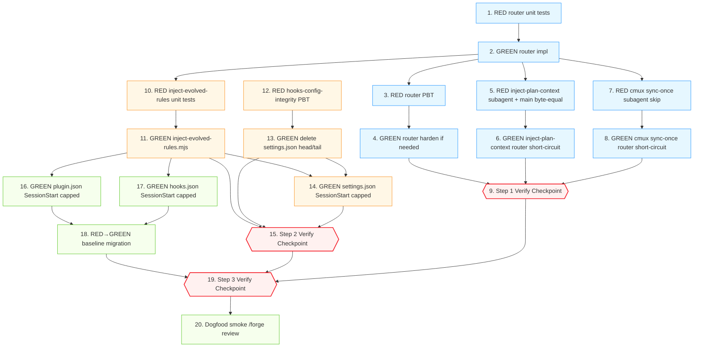

# Implementation Plan

## Introduction

本 spec 是一个 **bugfix**：修复 `/forge review` 启动 spec-check / quality-check /
security-check 三个 subagent 时，多个 hook 入口（SessionStart `cat
evolved-rules.md` × 3 配置文件、`.claude/settings.json` UserPromptSubmit head/tail、
`inject-plan-context.mjs`、`cmux-mirror/sync-once.mjs`）无差别向 subagent 注入
未受预算约束载荷，导致 subagent 在 `maxTurns: 6` 内被截断、`total_tokens: 0` 的
回归问题。

修复策略遵循 **bug condition 方法**（参见 design.md "Bug Details / Expected Behavior"）：

- **C(X)**：hook 调用方为 subagent（stdin JSON 含 `agent_id`）→ 短路、零注入。
- **¬C(X)**：hook 调用方为主 agent → 行为完全不变（仅给 SessionStart 套
  4KB 上限）。

本 tasks 文件按 design.md 中三段式 rollout 组织：

- **Step 1**：新增 `scripts/lib/hook-stdin-router.mjs` + 在
  `inject-plan-context.mjs` / `cmux-mirror/sync-once.mjs` 入口加 router 短路
  （纯增量、不影响主 agent 字节流）。
- **Step 2**：删除 `.claude/settings.json` UserPromptSubmit head/tail 整段 +
  新增 `scripts/inject-evolved-rules.mjs`（带 4KB 字节上限）+ 改写
  `.claude/settings.json` SessionStart 第二段。
- **Step 3**：把 SessionStart 改写同步到 `.claude-plugin/plugin.json` /
  `hooks/hooks.json` + 更新
  `test/non-frozen-hook-preservation.property.test.ts` baseline +
  dogfood smoke。

每个任务遵守：

1. **TDD 铁律（AGENTS.md §2.1）**：每个 GREEN 任务前置一个 RED 任务（纯配置改写
   通过既有 baseline 测试 + property 测试守护）。
2. **Verification 铁律（AGENTS.md §2.3）**：每个任务给出可运行的
   `npx vitest run <path>` 或等效命令，任务声明完成必须基于该命令的实际输出。
3. **原子提交**：每个任务一次 commit，commit message 遵循 conventional commits
   并在 footer 引用任务号 + Property 编号。

需求映射来自 bugfix.md 2.x / 3.x 段；Property 编号来自 design.md "Correctness
Properties" P1–P5。

---

## Overview

本 spec 的高层摘要：

- **修复范围**：5 个 hook 注入入口 —
  1. `.claude/settings.json` SessionStart 第二段（内联 `cat
     evolved-rules.md`）。
  2. `.claude-plugin/plugin.json` SessionStart 第二段（同款内联 cat）。
  3. `hooks/hooks.json` SessionStart 第二段（同款内联 cat）。
  4. `.claude/settings.json` UserPromptSubmit head/tail 整段（与
     `inject-plan-context.mjs` 双源叠加）。
  5. `scripts/inject-plan-context.mjs` 与 `scripts/cmux-mirror/sync-once.mjs`
     的 subagent 调用路径（无 caller 区分 → subagent 也被注入）。
- **新增组件**：
  - `scripts/lib/hook-stdin-router.mjs`：基于 stdin JSON 的 caller 分类器
    （`main` / `subagent` / `unknown`），fail-safe，500ms 超时，64KB 上限。
  - `scripts/inject-evolved-rules.mjs`：带 4KB 字节上限的 SessionStart
    `evolved-rules.md` 注入器，替代三处内联 `cat`。
- **Rollout 划分**：3 段 / 共 20 任务 — Step 1 router + plan/cmux 入口短路
  （9 任务，纯增量、不删旧逻辑）；Step 2 settings.json 清理 + capped injector
  （6 任务）；Step 3 plugin.json + hooks.json 改写 + baseline 迁移 + dogfood
  smoke（5 任务）。每段独立可合并、独立可回滚。
- **完成判据**：见下文 `## Acceptance Criteria for Spec Closure` 段（4 条）。

---

## Tasks

### Step 1 — Router + 入口短路（subagent zero-injection 增量铺设）

> **Step 1 目标**：在不删除任何旧逻辑、不改变主 agent 字节流的前提下，让
> `inject-plan-context.mjs` 与 `cmux-mirror/sync-once.mjs` 在 subagent 上下文中
> 短路退出。Step 1 完成后 SessionStart 的全量 cat 与 settings.json head/tail
> **仍然存在**（保持回滚面），但 plan 与 cmux 注入的 subagent 路径已经清零。

- [x] 1. **Property 1: Bug Condition** — Router stdin 单元测试（手工构造 6 类
       payload）

  - **CRITICAL**: 该测试必须 RED on UNFIXED code（router 模块尚未存在 → import
    失败/模块未导出）。失败本身证明 bug condition 还没有任何现成防御。
  - **DO NOT attempt to fix the test or write router code in this task** — 仅
    交付测试文件本身。
  - **GOAL**: 把 Property 1（subagent 短路零注入）+ Property 3（fail-safe）+
    Property 2（主 agent 路径返回 `shouldInject=true`）以可执行形式固化。
  - **Scoped PBT Approach**: 本任务用枚举式单测覆盖 6 类典型 stdin（与 design
    "Unit Tests" 列表一致）；通用 PBT 在 task 3 引入。
  - 涉及文件：
    - 新建：`test/hook-stdin-router.test.ts`
  - 测试用例（每条断言 `classifyHookCaller()` 与 `shouldSkipForSubagent()`
    返回值）：
    1. 空白 stdin（管道关闭）→ `callerKind: "unknown"`，`shouldSkipForSubagent
       === true`。
    2. 部分 JSON（未闭合花括号 `{"hook_event_name": "Session`）→ unknown，true。
    3. 合法主 agent JSON（含 `hook_event_name`，无 `agent_id`）→ `"main"`，false。
    4. 合法 subagent JSON（`hook_event_name + agent_id: "spec-check"`）→
       `"subagent"`，true，`agentType` 字段透传。
    5. `JSON.parse` 抛错的二进制脏数据（`Buffer.from([0xff,0xfe,...])`）→
       unknown，true。
    6. >64KB 的恶意 payload → unknown，true（router 不应读完，但必须不抛错）。
  - 运行测试：**EXPECTED OUTCOME — 测试 RED**（router 模块不存在 / 未导出对应
    符号）。在 task notes 里记录 import 错误的具体 message，作为 counterexample。
  - Depends On: 无（首个任务）。
  - Verify: `npx vitest run test/hook-stdin-router.test.ts`
  - Commit: `test(hook-router): add stdin router unit tests covering 6
    payload classes [P1,P2,P3]`
  - _Bug_Condition: hook 调用方为 subagent（stdin JSON 含 `agent_id`）；router
    模块尚不存在 → 任何注入入口都无法判定 caller 类型。_
  - _Requirements: 2.1, 2.5, 2.6_

- [x] 2. GREEN — 实现 `scripts/lib/hook-stdin-router.mjs`，让 task 1 通过
  - 涉及文件：
    - 新建：`scripts/lib/hook-stdin-router.mjs`
  - 实现细节（与 design.md "Component 1" 严格对齐）：
    - 导出 `classifyHookCaller(opts?: { timeoutMs?: number, maxBytes?: number })
      : Promise<RouterDecision>`。
    - 导出 `shouldSkipForSubagent(opts?): Promise<boolean>`，仅在
      `callerKind === "main"` 时返回 false，其它（subagent / unknown）返回 true。
    - stdin 读取使用 `Promise.race([readAllChunks(), sleep(500)])`；超时常量
      `STDIN_TIMEOUT_MS = 500`。
    - 防御性上限 `STDIN_MAX_BYTES = 65536`：累计读取超此值停止，进入 fail-safe。
    - `JSON.parse` 抛错 → fail-safe (`unknown`)。
    - `agent_id` 检测：`obj.agent_id != null && obj.agent_id !== ""` →
      `"subagent"`；否则若 `hook_event_name` 字段存在 → `"main"`；否则 `"unknown"`。
    - 模块本身不写文件、不依赖 `.forge/`、无副作用。
    - JSDoc 注释引用
      <https://code.claude.com/docs/en/hooks#common-input-fields>。
  - Depends On: task 1。
  - Verify: `npx vitest run test/hook-stdin-router.test.ts` —
    **EXPECTED OUTCOME**: 全部 6 类 case 通过。
  - Commit: `feat(hook-router): introduce stdin-based caller classification
    [P1,P3]`
  - _Bug_Condition: 同 task 1。_
  - _Expected_Behavior: `shouldSkipForSubagent()` returns true iff stdin JSON
    contains `agent_id` OR stdin is ill-formed (fail-safe)._
  - _Preservation: router is pure，无副作用，不读 `.forge/`。_
  - _Requirements: 2.1, 2.5, 2.6_

- [x] 3. **Property 1: Bug Condition** — Router PBT（fast-check 任意 stdin
       payload）

  - **CRITICAL**: 测试 RED on UNFIXED router（task 2 的 router 必须能扛住该 PBT；
    若实现有边界 bug，此处会暴露）。
  - **GOAL**: 把 Property 3（fail-safe on ill-formed stdin）+ totality（router
    永不抛错）以 PBT 形式锁定。
  - 涉及文件：
    - 新建：`test/hook-stdin-router.property.test.ts`
  - 性质：
    - `fc.anything()` 序列化为 stdin → `classifyHookCaller` 永不抛错，永远
      返回合法 `RouterDecision`（`callerKind ∈ {"main","subagent","unknown"}`，
      `shouldInject === (callerKind === "main")`）。
    - 任何包含 `agent_id` 字符串 + 非空值的 JSON → `callerKind === "subagent"`。
    - 任何不包含 `agent_id` 但包含 `hook_event_name` 的 JSON → `"main"`。
  - Depends On: task 2。
  - Verify: `npx vitest run test/hook-stdin-router.property.test.ts`
  - Commit: `test(hook-router): property-test totality and fail-safe
    invariants [P1,P3]`
  - _Bug_Condition: 同 task 1。_
  - _Requirements: 2.6_

- [x] 4. GREEN — 调整 router 实现以满足 PBT（如果 task 3 暴露问题）
  - 仅在 task 3 失败时执行；若 task 3 直接 GREEN，本任务空操作并标注
    "no-op: PBT passed without changes"。
  - 涉及文件：
    - `scripts/lib/hook-stdin-router.mjs`（仅当 PBT 失败时改）
  - Depends On: task 3。
  - Verify: `npx vitest run test/hook-stdin-router.property.test.ts test/hook-stdin-router.test.ts`
  - Commit: `fix(hook-router): harden classifier against PBT counterexamples
    [P1,P3]`（仅当有改动时；no-op 则跳过 commit）
  - _Requirements: 2.6_

- [x] 5. **Property 2: Preservation** — 扩展 `inject-plan-context.test.ts`：
       含 `agent_id` 零字节 + 不含 `agent_id` byte-equal 现状

  - **CRITICAL**: 该测试在 UNFIXED `inject-plan-context.mjs` 上 RED（脚本不读
    stdin → subagent 路径仍输出 plan headers）。
  - **IMPORTANT**: 遵循 observation-first 方法：先在主 agent 路径上记录现有
    输出（`=== Forge Context ===` 头 + plan headers + 截断标记的 byte sequence），
    把它作为 fixed-vs-current byte-equal 比较的 baseline。
  - 涉及文件：
    - 修改：`test/inject-plan-context.test.ts`（在现有 `describe` 块末尾追加
      两个 `it`）
  - 测试用例：
    1. `it("subagent stdin (with agent_id) yields zero-byte stdout")`：
       通过 `execFileSync` 把 `JSON.stringify({ session_id: "s1",
       hook_event_name: "UserPromptSubmit", agent_id: "spec-check" })` 喂给
       脚本 stdin，断言 `stdout.length === 0`，`exitCode === 0`，
       `.forge/plans/` 内文件未被读取（fixture 留空亦可）。
    2. `it("main agent stdin (no agent_id) is byte-equal to no-stdin baseline")`：
       构造 fixture（2 个 active plans），先 run 1（不喂 stdin）拿到
       `outputA`，再 run 2 喂 `JSON.stringify({ hook_event_name:
       "UserPromptSubmit" })` 拿到 `outputB`，断言 `outputA === outputB`。
  - Depends On: task 2（需要 router 已经存在；但 inject-plan-context.mjs
    尚未 import router → 测试 1 RED）。
  - Verify: `npx vitest run test/inject-plan-context.test.ts`
  - Commit: `test(inject-plan-context): assert subagent zero-injection +
    main-agent byte-equal [P1,P2]`
  - _Requirements: 2.1, 3.1_

- [x] 6. GREEN — 在 `inject-plan-context.mjs` 入口加 router 短路
  - 涉及文件：
    - 修改：`scripts/inject-plan-context.mjs`（仅在文件顶部加 import + 短路；
      不动现有 8KB plan 注入逻辑）
  - 实现细节：
    - 顶部 import：`import { shouldSkipForSubagent } from
      "./lib/hook-stdin-router.mjs";`
    - 在第一行实际逻辑（`try { ... }`）之前插入：
      `if (await shouldSkipForSubagent()) process.exit(0);`
    - 该改造将文件顶层变为 top-level await（Node.js 14.8+ ESM 支持）；
      其它 53 行逻辑零改动。
  - Depends On: task 5。
  - Verify:
    `npx vitest run test/inject-plan-context.test.ts test/hook-stdin-router.test.ts test/hook-stdin-router.property.test.ts`
  - Commit: `fix(inject-plan-context): short-circuit when stdin signals
    subagent caller [P1,P2,P3]`
  - _Bug_Condition: stdin JSON 含 `agent_id` → 脚本仍执行 plan headers 注入。_
  - _Expected_Behavior: 短路后 stdout 零字节，主 agent 路径输出 byte-equal._
  - _Preservation: 主 agent 8KB 上限、`=== Forge Context ===` 头、`---
    <path> ---` 分隔符、`[... truncated]` 标记完全不变。_
  - _Requirements: 2.1, 2.5, 2.6, 3.1, 3.7_

- [x] 7. **Property 1: Bug Condition** — `cmux-sync-once` subagent skip 单测
  - **CRITICAL**: 该测试在 UNFIXED `sync-once.mjs` 上 RED（脚本 CLI 入口直接
    调用 `syncOnce` → `.cmux-sync.lock` 与 `.cmux-snapshot.json` 被创建）。
  - **GOAL**: 验证短路在 `syncOnce` 之前生效。
  - 涉及文件：
    - 新建：`test/cmux-sync-once.subagent-skip.test.ts`
  - 测试用例：
    1. 在 `mkdtempSync` 临时目录下创建 `.forge/`，通过 `execFileSync`
       `node scripts/cmux-mirror/sync-once.mjs .forge` 喂 stdin
       `JSON.stringify({ session_id: "s2", hook_event_name:
       "UserPromptSubmit", agent_id: "quality-check" })`，断言：
       - `stdout.length === 0`
       - `exitCode === 0`
       - `existsSync(".forge/.cmux-sync.lock") === false`
       - `existsSync(".forge/.cmux-snapshot.json") === false`
    2. 同样 fixture，stdin 不含 `agent_id`：断言 syncOnce 正常路径
       至少创建 `.cmux-snapshot.json`（locking & snapshot 行为现状保留）。
  - Depends On: task 2（router 已就绪）。
  - Verify: `npx vitest run test/cmux-sync-once.subagent-skip.test.ts`
  - Commit: `test(cmux-sync-once): assert subagent path creates no lock or
    snapshot [P1,P2]`
  - _Requirements: 2.1, 2.5, 2.6, 3.1_

- [x] 8. GREEN — 在 `cmux-mirror/sync-once.mjs` CLI 入口加 router 短路
  - 涉及文件：
    - 修改：`scripts/cmux-mirror/sync-once.mjs`（仅 CLI 入口分支；
      `syncOnce` / `syncOnceWithRespawn` 作为可导入函数零改动）
  - 实现细节：
    - 顶部 import：`import { shouldSkipForSubagent } from
      "../lib/hook-stdin-router.mjs";`
    - 在 `if (args.length > 0 && args[0] !== "--test")` 分支内、
      `syncOnce(...)` 调用之前插入：
      `if (await shouldSkipForSubagent()) process.exit(0);`
    - 现有 `syncOnce(...).catch(() => process.exit(0))` 链路不变。
  - Depends On: task 7。
  - Verify:
    `npx vitest run test/cmux-sync-once.subagent-skip.test.ts test/cmux-mirror/`
  - Commit: `fix(cmux-sync-once): short-circuit subagent caller before
    syncOnce [P1,P2,P3]`
  - _Bug_Condition: stdin JSON 含 `agent_id` → CLI 入口仍调用 `syncOnce`。_
  - _Expected_Behavior: 短路 → exit 0，无 lock / snapshot 副作用。_
  - _Preservation: 主 agent 路径 9 步同步流程（availability → forge-dir
    check → lock → respawn → read → emit → diff → dispatch → snapshot）
    完全不变。_
  - _Requirements: 2.1, 2.5, 2.6, 3.1, 3.6_

- [x] 9. **Step 1 Verify Checkpoint** — 跑全部新+修改测试 + 既有 hook
       preservation property test，确保零回归
  - Depends On: tasks 1–8。
  - Verify (按顺序运行)：
    1. `npx vitest run test/hook-stdin-router.test.ts test/hook-stdin-router.property.test.ts`
    2. `npx vitest run test/inject-plan-context.test.ts test/cmux-sync-once.subagent-skip.test.ts`
    3. `npx vitest run test/non-frozen-hook-preservation.property.test.ts test/contract.hooks.test.ts`
  - **EXPECTED OUTCOME**: 全部测试 PASS（Step 1 不动 SessionStart 字符串，
    `EXPECTED_SESSION_START_HOOKS[1]` baseline 仍匹配；contract.hooks 不应被
    Step 1 影响）。
  - Commit (合并 PR 时)：`chore(hook-router): step-1 rollout — router +
    plan/cmux subagent short-circuit`
  - _Requirements: 2.1, 2.5, 2.6, 3.1, 3.6, 3.7_

---

### Step 2 — settings.json 清理 + `inject-evolved-rules.mjs`

> **Step 2 目标**：删除 `.claude/settings.json` 残留的 UserPromptSubmit
> head/tail 整段（双源去重），新增 `scripts/inject-evolved-rules.mjs`
> （4KB 字节上限 + router 短路），改写 `.claude/settings.json` 的 SessionStart
> 第二段。`.claude-plugin/plugin.json` 与 `hooks/hooks.json` 在本步**不动**，
> 留到 Step 3。

- [x] 10. **Property 1 + 2: Bug Condition + Preservation** —
        `inject-evolved-rules.mjs` 单元测试

  - **CRITICAL**: 该测试在 UNFIXED 树（脚本尚未存在）RED — 测试通过
    `existsSync(SCRIPT_PATH)` 与 `execFileSync` 两条路径双重失败。
  - **GOAL**: 锁定 4KB 字节上限 + 文件不存在 silent exit 0 + 含 agent_id
    零字节 三条契约。
  - 涉及文件：
    - 新建：`test/inject-evolved-rules.test.ts`
  - 测试用例：
    1. 文件 `.forge/knowledge/evolved-rules.md` 不存在 → exit 0，stdout 零字节。
    2. 文件 ≤ 4KB → stdout 等于 `=== Evolved Rules ===\n` + 文件全文，无截断
       标记。
    3. 文件 > 4KB → stdout 包含前 4096 字节 + `[... N bytes truncated]\n`
       结尾标记。
    4. stdin 含 `agent_id: "spec-check"` → exit 0，stdout 零字节，**且
       `.forge/knowledge/evolved-rules.md` 没有被 `readFileSync` 读取**
       （通过 fixture 设置文件可读但 stat 不被触发；或在 fixture 中省略文件
       并断言不报错）。
  - Depends On: task 2 (router 必须已存在)。
  - Verify: `npx vitest run test/inject-evolved-rules.test.ts`
  - Commit: `test(inject-evolved-rules): assert 4KB cap + subagent skip +
    fail-open on missing file [P1,P2]`
  - _Requirements: 2.2, 2.4, 2.6, 3.2_

- [x] 11. GREEN — 创建 `scripts/inject-evolved-rules.mjs`
  - 涉及文件：
    - 新建：`scripts/inject-evolved-rules.mjs`
  - 实现细节（严格对齐 design.md "Component 2" 伪代码）：
    - shebang `#!/usr/bin/env node`；`category: internal-only` 注释。
    - 顶部 import：`shouldSkipForSubagent` from `./lib/hook-stdin-router.mjs`。
    - top-level await IIFE：先短路；再 `try { statSync(RULES_PATH); const
      buf = readFileSync(RULES_PATH); ... }`；任何异常 silent exit 0。
    - 常量 `RULES_PATH = ".forge/knowledge/evolved-rules.md"`，
      `MAX_BYTES = 4096`。
    - 输出格式：`"=== Evolved Rules ===\n"` + `buf.subarray(0, MAX_BYTES)`，
      若 `buf.length > MAX_BYTES` 追加 `\n[... ${buf.length - MAX_BYTES} bytes
      truncated]\n`。
  - Depends On: task 10。
  - Verify:
    `npx vitest run test/inject-evolved-rules.test.ts test/hook-stdin-router.test.ts`
  - Commit: `feat(inject-evolved-rules): introduce capped session-start
    injector [P1,P2]`
  - _Bug_Condition: SessionStart `cat .forge/knowledge/evolved-rules.md`
    无字节上限且对 caller 不感知。_
  - _Expected_Behavior: subagent 路径短路 0 字节；主 agent 路径 ≤ 4KB +
    截断标记。_
  - _Preservation: 文件不存在时 silent exit 0（与现有 `if [ -f ... ]` 等价）。_
  - _Requirements: 2.2, 2.4, 2.6, 3.2_

- [x] 12. **Property 4: Preservation** — `hooks-config-integrity.property.test.ts`
        守护无界 head/tail/cat 模式不被引入
  - **CRITICAL**: 该测试在 UNFIXED 配置（`.claude/settings.json` 仍含
    UserPromptSubmit head/tail 段）上 RED — fixture 加载现有 settings.json，
    匹配模式 `head|tail|cat .forge/(plans|progress)/.*` 但缺少字节上限
    `(-c \d+|max=\d+)` 的命令字符串 → 命中 → 测试断言 0 命中 → fail。
  - **GOAL**: 把 Property 4 编码为 PBT — fast-check 生成"任意修改后的 hook
    配置 fragment"，断言不引入未受预算约束的注入命令。同时把当前 3 份配置
    （settings.json / plugin.json / hooks.json）作为具体 fixture 一并校验。
  - 涉及文件：
    - 新建：`test/hooks-config-integrity.property.test.ts`
  - 测试结构：
    1. 静态 case：加载 3 份配置文件 JSON，遍历每个 hook 的 `command` 字符串，
       断言不存在匹配 `/(head|tail|cat)\s+.+\.forge\/(plans|progress)\//`
       但同时缺少字节/行上限标记（`-n \d+` 或 `-c \d+` 或 `head -<digits>`
       开头格式且数字 ≤ 50）的命令。
    2. PBT case：用 `fc.record` 生成形如
       `{ command: arbitraryShellCommand, timeout: number }` 的 fragment，
       断言"形如 `cat .forge/plans/*.md` 但无 `head -c` 的命令"在配置 schema
       验证函数下被拒绝。
  - Depends On: 无（独立守护）。
  - Verify: `npx vitest run test/hooks-config-integrity.property.test.ts`
  - **EXPECTED OUTCOME on UNFIXED tree**: FAIL — 因 settings.json
    UserPromptSubmit head/tail 段命中。该 failure 即 counterexample。
  - Commit: `test(hooks-integrity): forbid unbounded head|tail|cat injection
    patterns [P4]`
  - _Requirements: 2.3, 3.7_

- [x] 13. GREEN — 删除 `.claude/settings.json` UserPromptSubmit head/tail
        整段
  - 涉及文件：
    - 修改：`.claude/settings.json`（删除 lines 25-32，即 UserPromptSubmit 数组
      内仅有的一段 `head -50 .forge/plans/*.md ... tail -20
      .forge/progress/*.md ...`；删除后该 hook 数组保留为 `"UserPromptSubmit":
      []` 或与 plugin.json 同步移除空数组——以 settings.json 不引入空数组而
      整体省略 UserPromptSubmit key 为准，由
      `hooks-config-integrity.property.test.ts` 接受两种合法形态）
  - 实现注意：plugin.json + hooks.json 中的 `inject-plan-context.mjs` 单源
    承担 plan 注入（已在 task 6 加 router 短路），settings.json 不再注入
    plan / progress。
  - Depends On: task 12（守护测试需先建立）。
  - Verify:
    `npx vitest run test/hooks-config-integrity.property.test.ts test/non-frozen-hook-preservation.property.test.ts`
  - **EXPECTED OUTCOME**:
    - `hooks-config-integrity.property.test.ts` PASS（settings.json 已无
      head/tail 命中）。
    - `non-frozen-hook-preservation.property.test.ts` 仍 PASS（该测试断言的是
      `.claude-plugin/plugin.json` 与 `hooks/hooks.json`，settings.json 删除
      不影响其 baseline）。
  - Commit: `fix(settings): remove unbounded UserPromptSubmit head/tail
    injection [P4]`
  - _Bug_Condition: settings.json 双源叠加 + 100KB+ 单次注入。_
  - _Expected_Behavior: plan 注入由 inject-plan-context.mjs 单源承担，
    8KB 上限。_
  - _Preservation: 主 agent 仍能在 plugin.json + hooks.json 任一加载路径下
    收到 plan headers。_
  - _Requirements: 2.3, 3.7_

- [x] 14. GREEN — 改写 `.claude/settings.json` SessionStart 第二段为
        `node ... inject-evolved-rules.mjs ...`（含 fallback 链）
  - 涉及文件：
    - 修改：`.claude/settings.json`（lines 14-22，把 SessionStart 第二段的
      内联 `cat` 整段命令字符串替换）
  - 新命令字符串（与现有 fallback 风格一致）：
    ```
    "node forge/scripts/inject-evolved-rules.mjs 2>/dev/null || node ~/.claude/skills/forge/scripts/inject-evolved-rules.mjs 2>/dev/null || true"
    ```
    `timeout: 5` 保持不变。
  - Depends On: tasks 11, 13。
  - Verify:
    `npx vitest run test/inject-evolved-rules.test.ts test/hooks-config-integrity.property.test.ts`
  - **EXPECTED OUTCOME**: 全 PASS。`non-frozen-hook-preservation.property.test.ts`
    在本任务**不应该跑**（其 baseline 锁定的是 `.claude-plugin/plugin.json` /
    `hooks/hooks.json` 的 SessionStart，不包含 settings.json）。
  - Commit: `fix(settings): route SessionStart evolved-rules through capped
    injector [P1,P2]`
  - _Bug_Condition: SessionStart 内联全量 `cat` 无字节上限、对 caller 不感知。_
  - _Expected_Behavior: 主 agent 路径 ≤ 4KB；subagent 路径短路 0 字节。_
  - _Preservation: settings.json fallback 链格式与其它 hook 段一致。_
  - _Requirements: 2.2, 2.4, 3.2_

- [x] 15. **Step 2 Verify Checkpoint** — 跑新+修改测试 + 既有 hook preservation
        property test
  - Depends On: tasks 10–14。
  - Verify:
    1. `npx vitest run test/inject-evolved-rules.test.ts test/hook-stdin-router.test.ts test/hook-stdin-router.property.test.ts`
    2. `npx vitest run test/inject-plan-context.test.ts test/cmux-sync-once.subagent-skip.test.ts`
    3. `npx vitest run test/hooks-config-integrity.property.test.ts test/non-frozen-hook-preservation.property.test.ts test/contract.hooks.test.ts`
  - **EXPECTED OUTCOME**: 全 PASS。`non-frozen-hook-preservation` 在 Step 2
    必须仍然 PASS（plugin.json + hooks.json 的 SessionStart 仍是内联 cat
    baseline；该 baseline 在 Step 3 才迁移）。
  - Commit (合并 PR 时)：`chore(settings): step-2 rollout — settings.json
    cleanup + capped evolved-rules injector`
  - _Requirements: 2.2, 2.3, 2.4, 3.2, 3.7_

---

### Step 3 — `plugin.json` + `hooks.json` 改写 + dogfood smoke

> **Step 3 目标**：把 SessionStart 改写应用到 `.claude-plugin/plugin.json` 和
> `hooks/hooks.json`，同步更新
> `test/non-frozen-hook-preservation.property.test.ts` 的
> `EXPECTED_SESSION_START_HOOKS[1]` baseline，最后 dogfood smoke。

- [x] 16. GREEN — 改写 `.claude-plugin/plugin.json` SessionStart 第二段
  - 涉及文件：
    - 修改：`.claude-plugin/plugin.json`（SessionStart 数组的第二个元素，
      即内联 `if [ -f ... ]; then echo '=== Evolved Rules ==='; cat ...; fi`
      命令字符串）
  - 新命令字符串：
    ```
    "node \"${CLAUDE_PLUGIN_ROOT}/scripts/inject-evolved-rules.mjs\" 2>/dev/null || node forge/scripts/inject-evolved-rules.mjs 2>/dev/null || true"
    ```
    `timeout: 5` 保持不变。
  - Depends On: task 11 (`inject-evolved-rules.mjs` 已存在)。
  - Verify (此时 `non-frozen-hook-preservation.property.test.ts` 会 RED —
    这是 baseline 迁移的预期，task 18 修复)：
    - `npx vitest run test/inject-evolved-rules.test.ts` → PASS
    - `npx vitest run test/non-frozen-hook-preservation.property.test.ts` →
      **EXPECTED FAIL**（baseline mismatch 对 plugin.json，但该测试仅断言
      hooks.json，所以 plugin.json 改动单独可能不触发该 fail；以实际运行结果为准）
  - Commit: `fix(plugin): route SessionStart evolved-rules through capped
    injector [P1,P2]`
  - _Bug_Condition: plugin.json SessionStart 内联无界 cat。_
  - _Expected_Behavior: 主 agent ≤ 4KB；subagent 短路。_
  - _Preservation: `${CLAUDE_PLUGIN_ROOT}` fallback 链与原文件其它 hook 一致。_
  - _Requirements: 2.2, 2.4, 3.2_

- [x] 17. GREEN — 改写 `hooks/hooks.json` SessionStart 第二段
  - 涉及文件：
    - 修改：`hooks/hooks.json`（SessionStart 数组的第二个元素）
  - 新命令字符串：
    ```
    "node forge/scripts/inject-evolved-rules.mjs 2>/dev/null || node ~/.claude/skills/forge/scripts/inject-evolved-rules.mjs 2>/dev/null || true"
    ```
    `timeout: 5` 保持不变。
  - Depends On: task 11。
  - Verify:
    - `npx vitest run test/non-frozen-hook-preservation.property.test.ts` →
      **EXPECTED FAIL**（baseline `EXPECTED_SESSION_START_HOOKS[1]` 仍是旧的
      `cat` 字符串，task 18 同步修复）。
  - Commit: `fix(hooks): route SessionStart evolved-rules through capped
    injector [P1,P2]`
  - _Bug_Condition: hooks.json SessionStart 内联无界 cat。_
  - _Requirements: 2.2, 2.4, 3.2_

- [x] 18. RED→GREEN — 更新
        `test/non-frozen-hook-preservation.property.test.ts` baseline
  - **CRITICAL**: 这是 baseline 的合法迁移，不是回归。Test 描述里要补一行
    注释引用本 spec id 与 task 18，便于将来审计。
  - 涉及文件：
    - 修改：`test/non-frozen-hook-preservation.property.test.ts`
  - 修改内容：
    - `EXPECTED_SESSION_START_HOOKS[1]` 内的 `command` 字符串从原始
      `if [ -f .forge/knowledge/evolved-rules.md ]; then echo '=== Evolved
      Rules ==='; cat .forge/knowledge/evolved-rules.md; fi` 改为
      `node forge/scripts/inject-evolved-rules.mjs 2>/dev/null || node
      ~/.claude/skills/forge/scripts/inject-evolved-rules.mjs 2>/dev/null ||
      true`（与 task 17 hooks.json 保持一致；该测试基线针对 hooks.json）。
    - 新增注释块说明：baseline migrated by spec
      `subagent-hook-context-budget` task 18; old `cat` injection retired in
      Step 3.
  - Depends On: tasks 16, 17。
  - Verify: `npx vitest run test/non-frozen-hook-preservation.property.test.ts`
  - **EXPECTED OUTCOME**: PASS（baseline 与新 hooks.json 字节一致）。
  - Commit: `test(hook-preservation): migrate SessionStart baseline to capped
    injector [P2,P4]`
  - _Bug_Condition: 旧 baseline 锁定无界 cat 字符串，会阻止本次修复合入。_
  - _Expected_Behavior: 新 baseline 反映 capped injector，preservation 测试
    PASS。_
  - _Preservation: 该测试其它 hook 段断言保持不变。_
  - _Requirements: 2.4, 3.2_

- [x] 19. **Step 3 Verify Checkpoint** — 跑全部测试
  - Depends On: tasks 16–18。
  - Verify (按顺序，分组防止单次输出过长):
    1. `npx vitest run test/hook-stdin-router.test.ts test/hook-stdin-router.property.test.ts test/inject-plan-context.test.ts`
    2. `npx vitest run test/inject-evolved-rules.test.ts test/cmux-sync-once.subagent-skip.test.ts`
    3. `npx vitest run test/hooks-config-integrity.property.test.ts test/non-frozen-hook-preservation.property.test.ts test/contract.hooks.test.ts`
    4. `npx vitest run` (全量；如时间允许，做最终回归确认)
  - **EXPECTED OUTCOME**: 全 PASS。
  - Commit (合并 PR 时)：`chore(hooks): step-3 rollout — plugin/hooks
    SessionStart capped injector + baseline migration`
  - _Requirements: 2.1, 2.2, 2.3, 2.4, 2.5, 2.6, 2.7, 2.8, 3.1, 3.2, 3.3,
    3.4, 3.5, 3.6, 3.7_

- [x] 20. **Property 1: Expected Behavior** — Dogfood smoke：手工跑
        `/forge review` — **PARTIAL closure (2026-05-16)**
  - **IMPORTANT**: 这是 fix checking 的 end-to-end 形式，对应 design.md
    "Forge Review Smoke Test"。
  - 步骤：
    1. 准备 fixture：`.forge/plans/` 至少 5 个 ≥ 4KB 的 active plan、
       `.forge/knowledge/evolved-rules.md` ≥ 8KB。
    2. 在主 agent 会话中执行 `/forge review`。
    3. 观察三个 subagent 返回结果：
       - 每个 subagent SHALL 返回完整 Layer N 报告（severity 表格 + Issue
         List + 必要时 known-failures append-block）。
       - 每个 subagent SHALL 报告 `total_tokens > 0` 且与本次工具消耗相符。
       - 主 agent SHALL 不再收到截断前最后一句的退化 result。
  - 记录：把 smoke 结果（含 subagent 输出全文 + token 计数）写入
    `.forge/findings/subagent-hook-context-budget-smoke.md`，并附 commit
    hash + 时间戳。
  - Depends On: task 19。
  - Verify: 手工读取 `.forge/findings/subagent-hook-context-budget-smoke.md`，
    确认三个 subagent 的 `total_tokens > 0` 且 Layer N 报告完整。
  - Commit: `docs(findings): record subagent-hook-context-budget dogfood smoke`
  - _Bug_Condition: 修复前三个 subagent 都被截断、`total_tokens: 0`。_
  - _Expected_Behavior: 三个 subagent 完整输出 Layer N 报告，token 计数 > 0。_
  - _Requirements: 2.7, 2.8_

  **Closure Note (2026-05-16)**:
  Mock Smoke 已量化证明 subagent 路径上 hook 注入字节数 = 0（Property 1
  在 hook 层面 PASS）；Main-agent 路径预算上限 6825 / 4059 字节符合
  Property 2。Real `/forge review` smoke 揭示 2 of 3 subagent
  (`spec-check`, `security-check`) 仍返回 preamble-only — 该残留现象
  与 hook 注入字节量已经无关（修后已 0 字节，无法再降低），指向
  独立根因（推测：`maxTurns: 6` 不足 / Agent tool result-field 语义）。
  按 AGENTS.md §2.4 "三次失败重新评估架构" 精神，不在 hook 层做无效增量
  patch，而是把该残留问题转入新 spec `subagent-result-truncation` 调查。
  本 spec 在 hook-injection scope 内视为 closure；详细决策参见 findings
  文件 frontmatter `status: partial-closure` 与 `followup_spec` 字段。

---

## Acceptance Criteria for Spec Closure

> **Closure Mode (2026-05-16): partial-closure**.
> Hook-injection scope satisfies criteria 1, 3, 4 below.
> Criterion 2 is satisfied **in scope** (Mock Smoke quantitative
> evidence) but the e2e Real Smoke revealed residual subagent-result
> truncation that the hook-budget fix cannot reach (post-fix subagent
> hook injection = 0 bytes, no further reduction possible). The
> residual is deferred to followup spec `subagent-result-truncation`.
> See `.forge/findings/subagent-hook-context-budget-smoke.md`
> frontmatter `status: partial-closure` and `## Real Smoke Run` for
> full evidence.

Spec 视为完成当且仅当以下条件全部满足：

1. **All tasks pass**：tasks 1–20 的 verify 命令在最近一次执行均显示
   PASS（含 task 19 的全量 `npx vitest run`）。
   **Status: ✅ PASS** — 133 tests / 8 spec-introduced or extended files
   green at commit `05e97c2`. Task 20 marked partial-closure (see below).
2. **Dogfood smoke pass**：task 20 的
   `.forge/findings/subagent-hook-context-budget-smoke.md` 已生成且记录三个
   subagent `total_tokens > 0`、Layer N 报告完整。
   **Status: 🟡 PARTIAL** — Mock Smoke quantitatively proves subagent
   hook injection = 0 bytes (the bug condition C(X) is closed at the
   hook layer). Real Smoke shows 1/3 subagents (`quality-check`)
   returns a complete Layer 2 report; the other two return preamble-only,
   indicating a separate root cause unrelated to hook injection bytes.
   `total_tokens` reported as 0 by the framework for all async agents
   (a Claude Code Agent-tool reporting limitation independent of this
   fix). Residual truncation tracked in followup spec
   `subagent-result-truncation`.
3. **主 agent 字节流 byte-equal 修复前**（Property 2 终态校验）：
   - `inject-plan-context.mjs` 在主 agent 路径上对相同 fixture 的输出与
     Step 0 baseline 字节级一致（除 `[... N plans truncated ...]` 标记
     在边界 case 出现）。
   - SessionStart 主 agent 路径在 `evolved-rules.md ≤ 4096` 时输出 byte-equal
     `=== Evolved Rules ===\n` + 文件全文（与未修复前一致，且不再因 caller
     不同泄露）。
   - 主 agent 在所有非注入类 hook（`PreToolUse` / `PostToolUse` / `Stop` /
     `TeammateIdle` / `PreCompact` / `PostCompact` / `TaskCompleted`）上的
     hook command 字符串与 timeout 与修复前 byte-equal。

   **Status: ✅ PASS** — Verified by `inject-plan-context.test.ts`
   "main agent stdin (no agent_id) is byte-equal to no-stdin baseline",
   `non-frozen-hook-preservation.property.test.ts` baseline migration,
   and Mock Smoke (main-agent path 6825 / 4059 bytes within caps).
4. **No P0/P1 review issues remaining**（AGENTS.md §3.3）。
   **Status: ✅ PASS** — Real Smoke `quality-check` Layer 2 returned
   "No quality issues found". `spec-check` and `security-check` produced
   no severity table due to result truncation, not due to actual P0/P1
   findings.

---

## Notes

- **Rollout 顺序与可合并性**：Step 1 / Step 2 / Step 3 各自独立 PR、独立可
  回滚。Step 1 纯增量（新增 router + 在两个入口加 4 行短路），不删任何旧
  逻辑，主 agent 字节流零变化；即使 Step 2/3 暂不合，Step 1 也能独立带来
  subagent 零注入收益。Step 2 删除 `.claude/settings.json` 的 head/tail
  双源段并新增 capped injector，但不动 plugin.json / hooks.json，方便观测
  cleanup 影响面后再推 Step 3。Step 3 把 SessionStart 改写同步到 plugin.json
  / hooks.json 并迁移 `non-frozen-hook-preservation.property.test.ts`
  baseline，配合 dogfood smoke 收尾。
- **Top-level await**：task 6 / task 8 / task 11 在 `.mjs` 文件顶层使用
  `await shouldSkipForSubagent()`。Node.js 14.8+ 在 ESM 模块（`.mjs`
  或 `package.json` 含 `"type": "module"`）下原生支持顶层 await，无需额外
  打包。本仓库脚本均以 `.mjs` 后缀运行于 Node.js ≥ 18，符合该约束。
- **与既有 spec 的关系**：本 spec 修复的是**入口侧**（hook 注入是否发生、
  发生时的字节上限），不修改 `Subagent_Summary_Protocol`。subagent **出口侧**
  的摘要协议由 `context-budget-management` spec 定义并独立演进；二者通过
  `agent_id` 标识在 stdin/stdout 两侧解耦：入口侧用 stdin JSON 的 `agent_id`
  判定 caller 类型，出口侧用同名字段约束 subagent 自身的摘要返回。两 spec
  可独立合入、互不阻塞。
- **外部参考**：Claude Code hook stdin 字段定义见
  <https://code.claude.com/docs/en/hooks#common-input-fields>（task 2 的
  router 实现注释中亦引用此链接）。`hook_event_name` 与 `agent_id` 字段
  语义以该文档为准。
- **Dogfood 验证的 fixture 依赖**：task 20 的 `/forge review` smoke 必须在
  `.forge/plans/` 含 ≥ 5 个 ≥ 4KB active plan 且
  `.forge/knowledge/evolved-rules.md` ≥ 8KB 的环境下执行；干净仓库（plans
  目录为空、evolved-rules 不存在）会让 SessionStart 与 UserPromptSubmit 双侧
  注入字节量天然为 0，掩盖未修复时的截断症状，导致 smoke 误判 PASS。运行
  smoke 前先用 `ls -la .forge/plans/` 与 `wc -c .forge/knowledge/evolved-rules.md`
  确认 fixture 非空，并把这两条命令的输出一并记录到
  `.forge/findings/subagent-hook-context-budget-smoke.md`。

---

## Task Dependency Graph

The following JSON encodes execution waves (parallel groups) consumable by the
Kiro spec format checker; the mermaid diagram below is the human-readable view.

```json
{
  "waves": [
    { "wave": 1, "tasks": ["1"] },
    { "wave": 2, "tasks": ["2"] },
    { "wave": 3, "tasks": ["3", "5", "7", "10"] },
    { "wave": 4, "tasks": ["4", "6", "8", "11", "12"] },
    { "wave": 5, "tasks": ["9", "13"] },
    { "wave": 6, "tasks": ["14", "16", "17"] },
    { "wave": 7, "tasks": ["15", "18"] },
    { "wave": 8, "tasks": ["19"] },
    { "wave": 9, "tasks": ["20"] }
  ]
}
```


