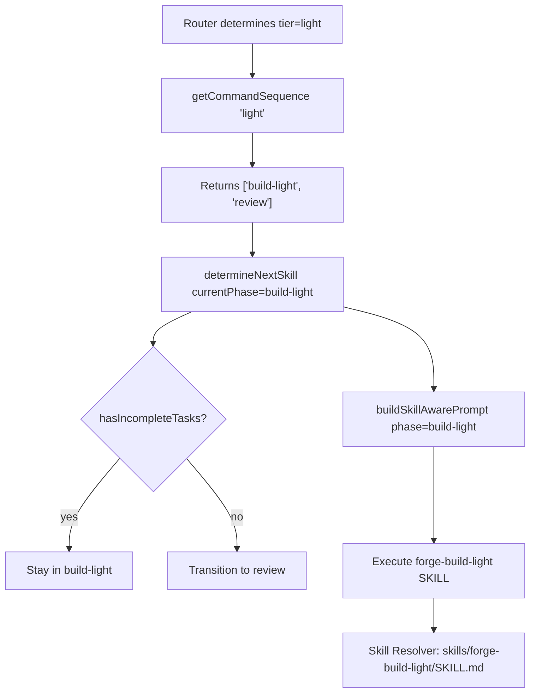

# Design Document: Token Language Optimization

## Overview

This design covers two independent optimization strategies to reduce BPE token consumption in the Forge project:

**P2 — Mixed Language Strategy (~15–20% token savings):** Convert structural content (table headers, section headings, enumerations, output format templates) from Chinese to English across 28 files (16 SKILL files, CLAUDE.md, templates/CLAUDE.md, 10 agents/*.md), while preserving behavioral instructions, user-visible messages, and YAML frontmatter in Chinese.

**P3 — Conditional SKILL Loading (~15K savings for light path):** Add a `"build-light"` phase to the skill scheduler so light-tier tasks load a new lightweight `forge-build-light` SKILL (~3K) instead of the full `forge-build` SKILL (~27K). This requires TypeScript changes to `src/skill-scheduler.ts` and creation of `skills/forge-build-light/SKILL.md`.

### Independence Guarantee

P2 and P3 are fully independent:
- P2 is documentation-only (markdown edits). No TypeScript changes.
- P3 is code + one new SKILL file. No dependency on P2 conversions.
- Either can be deployed or rolled back without affecting the other.

### Implementation Order

P3 is implemented first (code changes, testable with property-based tests), then P2 (documentation, larger scope but lower risk per file).

---

## Architecture

### P3: Conditional SKILL Loading

P3 modifies the skill scheduler state machine to route light-tier tasks through a `"build-light"` phase instead of `"build"`. The existing `buildSkillAwarePrompt()` in `src/context-accumulator.ts` already maps phase names to SKILL files via the pattern `forge-${phase}`, so `"build-light"` automatically maps to `forge-build-light` — no changes needed in the context accumulator.



**Changes required:**

| File | Change |
|------|--------|
| `src/skill-scheduler.ts` | Add `"build-light"` to `SkillPhase` union type |
| `src/skill-scheduler.ts` | Update `SKILL_COMMAND_SEQUENCES.light` to `["build-light", "review"]` |
| `src/skill-scheduler.ts` | Add `"build-light"` to `COMMITABLE_PHASES` set |
| `src/skill-scheduler.ts` | Add `"build-light"` case in `determineNextSkill()` with same logic as `"build"` |
| `skills/forge-build-light/SKILL.md` | New file: lightweight build SKILL for light-tier tasks |
| `src/context-accumulator.ts` | **No changes** — `forge-${phase}` pattern handles `"build-light"` automatically |
| `src/skill-resolver.ts` | **No changes** — resolves any skill name via `skills/{name}/SKILL.md` |

### P2: Mixed Language Strategy

P2 is a sequential file-by-file documentation edit. No architecture changes. Each file is processed with the same conversion rules, then validated against contract tests.

```
For each target file (28 total):
  1. Read file
  2. Apply conversion rules (see §Components)
  3. Run contract tests
  4. Move to next file
```

**Conversion rules (what changes vs. what stays):**

| Content Type | Language | Examples |
|-------------|----------|----------|
| Table headers | → English | `检查条目` → `Check Item`, `验证方法` → `Method` |
| Table cell structural data | → English | `扫描 .forge/specs/` → `Scan .forge/specs/` |
| Section headings (after `##`) | → English | `## 3. 三条执行路径` → `## 3. Three Execution Paths` |
| Enumeration structural items | → English | Forbidden behavior lists, step descriptions |
| Output format template structure | → English | Template field names, column headers |
| YAML frontmatter `description` | Stays Chinese | Validated by contract tests |
| Core behavioral instructions | Stays Chinese | `测试先于代码，验证先于声明` |
| User-visible output messages | Stays Chinese | `🚫 Build 前置检查未通过` |
| Principles and contextual explanations | Stays Chinese | Decision rationale, design philosophy |
| YAML frontmatter `name` field | Stays as-is | `name: forge-build` (already English) |

---

## Components and Interfaces

### P3 Components

#### 1. SkillPhase Type Extension (`src/skill-scheduler.ts`)

Add `"build-light"` to the existing union type:

```typescript
export type SkillPhase =
  | "router"
  | "plan"
  | "build"
  | "build-light"  // NEW
  | "review"
  | "test"
  | "ship"
  | "learn"
  | "refactor-scan"
  | "refactor-apply"
  | "fix-analyze"
  | "fix-apply"
  | "completed"
  | "aborted";
```

#### 2. Command Sequence Update (`src/skill-scheduler.ts`)

Update the light tier sequence:

```typescript
const SKILL_COMMAND_SEQUENCES: Record<string, SkillPhase[]> = {
  light: ["build-light", "review"],  // CHANGED from ["build", "review"]
  standard: ["plan", "build", "review", "test", "ship"],
  full: ["plan", "build", "review", "test", "ship", "learn"],
  // ... refactor and fix sequences unchanged
};
```

#### 3. Commitable Phases Update (`src/skill-scheduler.ts`)

Add `"build-light"` to the set:

```typescript
const COMMITABLE_PHASES = new Set<string>([
  "build", "build-light", "plan", "fix", "refactor-apply", "fix-apply"
]);
```

#### 4. State Machine Extension (`src/skill-scheduler.ts`)

Add a `"build-light"` case in `determineNextSkill()` with identical logic to `"build"`:

```typescript
// Build-light phase (same transitions as build)
if (currentPhase === "build-light") {
  if (hasIncompleteTasks) {
    return { nextPhase: "build-light", reason: "Incomplete tasks remain, continuing build-light" };
  }
  return { nextPhase: "review", reason: "All tasks complete, proceeding to review" };
}
```

#### 5. forge-build-light SKILL File (`skills/forge-build-light/SKILL.md`)

A new lightweight SKILL file containing only sections needed for light-tier execution:

| Section | Content | Source |
|---------|---------|--------|
| Frontmatter | `name: forge-build-light`, `description`, `disable-model-invocation: true` | New |
| §1 Overview | Light-path-specific overview (~200 chars) | Adapted from forge-build §1 |
| §2 Light Path Execution | Direct task execution rules, no pre-checks | Adapted from forge-build §3.1 |
| §3 TDD Rules | Reference directive to CLAUDE.md §2.1 | Reference only (~100 chars) |
| §4 Execution Discipline | Reference directive to forge-build §6 | Reference only (~100 chars) |
| §5 Status Updates | Reference directive to forge-build §7 | Reference only (~100 chars) |

**Target size**: ≤4,000 characters (vs. ~27,000 for full forge-build).

**Excluded sections** (not needed for light path):
- §2 Pre-checks (light path skips Spec/Plan gates)
- §3.2 Standard path
- §3.3 Full path
- §3.4 Closure-First probes
- §3.5 Final Validation details

### P2 Components

#### Mixed Language Conversion Rules

The conversion is applied file-by-file with these precise rules:

**Rule 1: Table Headers** — Convert all Chinese table header cells to English equivalents. The `|` delimiters and alignment markers stay unchanged.

**Rule 2: Table Cell Data** — Convert structural data in table cells (file paths, status values, command names are already English; convert Chinese descriptions of actions/conditions).

**Rule 3: Section Headings** — Convert the Chinese text after `## <number>.` to English. Preserve the `## <number>.` prefix pattern (required by contract tests).

**Rule 4: Enumeration Items** — Convert Chinese text in bullet/numbered lists that describe structural rules, forbidden behaviors, or step sequences. Keep items that are behavioral instructions or principles in Chinese.

**Rule 5: Output Format Templates** — Convert structural parts (field names, column headers) to English. Preserve user-visible messages (emoji-prefixed strings, error messages) in Chinese.

**Rule 6: Preserve Zones** — Never modify:
- YAML frontmatter blocks (between `---` markers)
- Lines that are core behavioral instructions (principles, iron rules)
- User-visible output messages (emoji-prefixed, quoted strings in templates)
- Code blocks (already English)

### Interface: Context Accumulator → Skill Resolver

The existing interface requires no changes. The flow for `"build-light"`:

1. `buildSkillAwarePrompt()` receives `phase = "build-light"`
2. Emits: `Execute the **forge-build-light** SKILL for this iteration.`
3. Skill resolver receives `skillName = "forge-build-light"`
4. Returns: `skills/forge-build-light/SKILL.md`

This works because `buildSkillAwarePrompt()` uses string interpolation `forge-${phase}` and the skill resolver uses `skills/${skillName}/SKILL.md` — both are generic patterns that handle any phase name.

---

## Data Models

### P3: SkillPhase Type

The `SkillPhase` union type is the core data model. Adding `"build-light"` extends it from 13 to 14 members:

```typescript
// Before: 13 phases
"router" | "plan" | "build" | "review" | "test" | "ship" | "learn" 
| "refactor-scan" | "refactor-apply" | "fix-analyze" | "fix-apply" 
| "completed" | "aborted"

// After: 14 phases (+ "build-light")
"router" | "plan" | "build" | "build-light" | "review" | "test" | "ship" | "learn"
| "refactor-scan" | "refactor-apply" | "fix-analyze" | "fix-apply"
| "completed" | "aborted"
```

### P3: SKILL_COMMAND_SEQUENCES

The command sequence map changes only for the `light` key:

```typescript
// Before
light: ["build", "review"]

// After
light: ["build-light", "review"]
```

All other tiers (standard, full, refactor_light, refactor_standard, fix_light, fix_standard) remain unchanged.

### P3: COMMITABLE_PHASES

The commitable phases set gains one member:

```typescript
// Before
Set(["build", "plan", "fix", "refactor-apply", "fix-apply"])

// After
Set(["build", "build-light", "plan", "fix", "refactor-apply", "fix-apply"])
```

### P2: Contract Test Invariants (Must Preserve)

These structural invariants serve as the implicit schema for P2 documentation edits:

| Invariant | Test File | What It Checks |
|-----------|-----------|----------------|
| YAML frontmatter with `name` field | contract.skills.test.ts | `---\nname: forge-*\n` at file start |
| `description` field in frontmatter | contract.skills.test.ts | `description:` present in frontmatter |
| `disable-model-invocation: true` | contract.test.ts §2 | All skills except forge-router |
| `## <number>.` section headings | contract.test.ts §11 | At least one numbered `##` heading after frontmatter |
| Substantive content after frontmatter | contract.skills.test.ts | Non-empty body content |
| CLAUDE.md §5 Self-Evolution section | contract.test.ts §14 | Section heading, evolved-rules.md reference, knowledge categories, 15-rule cap, exclusions |
| templates/CLAUDE.md placeholders | contract.test.ts §3 | `{{project_name}}`, `{{tech_stack}}`, etc. |
| forge-learn Rule Distillation | contract.test.ts §17 | Four data sources + five thresholds |
| Agent frontmatter fields | contract.test.ts §7 | `name:`, `model:`, `maxTurns:`, `tools:`, `permissionMode:` |


---

## Correctness Properties

*A property is a characteristic or behavior that should hold true across all valid executions of a system — essentially, a formal statement about what the system should do. Properties serve as the bridge between human-readable specifications and machine-verifiable correctness guarantees.*

**Note:** Property-based testing applies only to P3 (code changes to `src/skill-scheduler.ts`). P2 is documentation-only — no executable code is changed, so PBT does not apply. P2 validation relies on contract tests and manual review.

### Property 1: Light tier command sequence is updated, all others unchanged

*For any* tier string passed to `getCommandSequence()`:
- If the tier is `"light"`, the returned sequence SHALL be `["build-light", "review"]`
- If the tier is any other known tier (`"standard"`, `"full"`, `"refactor_light"`, `"refactor_standard"`, `"fix_light"`, `"fix_standard"`), the returned sequence SHALL be identical to the pre-change baseline
- If the tier is unknown, the returned sequence SHALL equal the standard tier sequence

**Validates: Requirements 5.2, 5.5, 5.6**

### Property 2: Build-light phase transitions mirror build phase transitions

*For any* `SchedulerInput` where `currentPhase` is `"build-light"`:
- If `hasIncompleteTasks` is `true`, `determineNextSkill()` SHALL return `nextPhase: "build-light"`
- If `hasIncompleteTasks` is `false` (or undefined), `determineNextSkill()` SHALL return `nextPhase: "review"`

This mirrors the exact transition logic of the `"build"` phase, with the phase name adjusted.

**Validates: Requirements 5.3**

### Property 3: Build-light is a commitable phase

*For any* boolean `success` value, `shouldCommitForPhase("build-light", success)` SHALL return `success` (i.e., `true` when success is `true`, `false` when success is `false`).

**Validates: Requirements 5.4**

### Property 4: Phase-to-SKILL name mapping via string interpolation

*For any* non-empty phase string passed to `buildSkillAwarePrompt()`, the output SHALL contain the substring `forge-${phase}`. Specifically, for phase `"build-light"`, the output SHALL contain `forge-build-light`.

**Validates: Requirements 6.1, 6.3**

---

## Error Handling

### P3: Code Changes

| Error Scenario | Detection | Recovery |
|----------------|-----------|----------|
| TypeScript compilation failure after adding `"build-light"` | `npx tsc --noEmit` | Fix type errors — ensure all switch/if branches handle new phase |
| `determineNextSkill` doesn't recognize `"build-light"` | Property test failure | Add the `"build-light"` case before the unknown-phase fallback |
| `shouldCommitForPhase` returns `false` for `"build-light"` | Property test failure | Add `"build-light"` to `COMMITABLE_PHASES` set |
| `getCommandSequence("light")` still returns `["build", "review"]` | Property test failure | Update `SKILL_COMMAND_SEQUENCES.light` |
| `forge-build-light` SKILL file missing or malformed | Contract test failure | Create/fix `skills/forge-build-light/SKILL.md` with valid frontmatter |
| Existing tests break after changes | `npm run check` failure | Regression — update existing test expectations for light tier |

### P2: Documentation Changes

| Error Scenario | Detection | Recovery |
|----------------|-----------|----------|
| Contract test failure after conversion | `npx vitest run` returns non-zero | Revert the conversion that broke the test, adjust approach |
| YAML frontmatter accidentally modified | Contract test catches `name:` / `description:` mismatch | Restore original frontmatter block |
| Section heading pattern broken | Contract test catches missing `## <number>.` | Restore heading prefix, convert only the Chinese text after it |
| Behavioral instruction accidentally converted to English | Manual review | Restore Chinese text for that instruction |
| Template placeholder removed | Contract test catches missing `{{placeholder}}` | Restore placeholder |
| Agent frontmatter field removed | Contract test catches missing `name:`, `model:`, etc. | Restore frontmatter |

### Rollback Strategy

- **P3 rollback**: Revert TypeScript changes and delete `skills/forge-build-light/`. The `"build"` phase continues to work for light tier.
- **P2 rollback**: Use `git revert` on the documentation commits. Alternatively, place original Chinese files at `SKILL.zh.md` paths and set locale to `"zh"` to use the i18n fallback mechanism.

---

## Testing Strategy

### P3: Property-Based Tests + Unit Tests

**Property-based testing library**: Use `fast-check` with Vitest (consistent with the project's existing test setup).

**Property test configuration**:
- Minimum 100 iterations per property test
- Each test tagged with: `Feature: token-language-optimization, Property {number}: {title}`

**Property tests** (new file: `test/skill-scheduler-p3.property.test.ts`):

| Property | What It Tests | Generator Strategy |
|----------|--------------|-------------------|
| Property 1: Command sequence correctness | `getCommandSequence()` for all tiers | Generate from known tier set + arbitrary strings for unknown tiers |
| Property 2: Build-light transitions | `determineNextSkill()` with `currentPhase="build-light"` | Generate random `SchedulerInput` with varying `hasIncompleteTasks`, `reviewFixAttempts`, etc. |
| Property 3: Build-light commitable | `shouldCommitForPhase("build-light", *)` | Generate random booleans for `success` |
| Property 4: Phase-to-SKILL mapping | `buildSkillAwarePrompt()` output | Generate random non-empty phase strings |

**Unit tests** (updates to existing `test/skill-scheduler.test.ts`):

| Test | What It Verifies |
|------|-----------------|
| `getCommandSequence("light")` returns `["build-light", "review"]` | Specific example for the changed sequence |
| `determineNextSkill` with `"build-light"` + incomplete tasks → stays | Specific transition example |
| `determineNextSkill` with `"build-light"` + all complete → review | Specific transition example |
| `shouldCommitForPhase("build-light", true)` → true | Specific commit decision |
| `shouldCommitForPhase("build-light", false)` → false | Specific commit decision |

### P2: Contract Tests + Manual Review

P2 has no property tests (documentation-only). Validation relies on:

1. **Contract tests**: Run after each file conversion to validate structural invariants
2. **Manual review**: Verify behavioral semantics preservation
3. **CI suite**: Full `npm run check` after all conversions

### Checkpoint Protocol

**P3 checkpoints:**
1. After TypeScript changes: `npx tsc --noEmit` (type check)
2. After all P3 changes: `npx vitest run test/skill-scheduler.test.ts test/skill-scheduler-p3.property.test.ts` (unit + property tests)
3. After forge-build-light SKILL creation: `npx vitest run test/contract.test.ts test/contract.skills.test.ts` (contract tests)
4. Final: `npm run check` (full CI)

**P2 checkpoints:**
1. After each file conversion: `npx vitest run test/contract.test.ts test/contract.skills.test.ts`
2. After all conversions: `npm run check` (full CI)
3. Token measurement: Compare BPE token counts before and after

### Test Commands

```bash
# P3: Type check
npx tsc --noEmit

# P3: Property + unit tests
npx vitest run test/skill-scheduler.test.ts test/skill-scheduler-p3.property.test.ts

# P3: Contract tests (after forge-build-light creation)
npx vitest run test/contract.test.ts test/contract.skills.test.ts

# P2: Contract tests (after each file conversion)
npx vitest run test/contract.test.ts test/contract.skills.test.ts

# Final: Full CI
npm run check

# Size verification
wc -c skills/forge-build-light/SKILL.md
```
