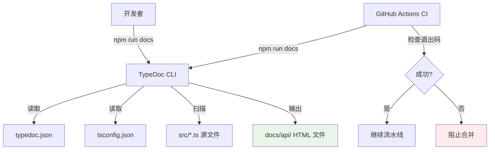

# 设计文档：API 文档生成（TypeDoc）

## 概述

本设计描述如何将 TypeDoc 集成到 Forge Loop 项目中，实现从 `src/` 目录下的 TypeScript 源码自动生成 HTML 格式的 API 参考文档。

核心设计原则：
- **非侵入性**：不修改现有构建、测试、lint 脚本，TypeDoc 仅作为独立的文档生成步骤
- **零配置维护**：复用现有 `tsconfig.json`，避免重复维护编译选项
- **CI 验证**：在 GitHub Actions 中验证文档可生成，但不上传产物
- **按需生成**：文档为构建产物，不提交到 Git 仓库

### 设计决策摘要

| 决策项 | 选择 | 理由 |
|--------|------|------|
| TypeDoc 版本 | `0.28.x`（精确版本锁定） | 当前最新稳定版，与 TypeScript 5.x 兼容；精确版本与项目现有 devDependencies 策略一致 |
| 入口点策略 | `entryPointStrategy: "expand"` + `entryPoints: ["src/"]` | 自动递归扫描 `src/` 下所有 `.ts` 文件，无需手动维护入口列表 |
| 输出目录 | `docs/api/` | 与 `dist/` 分离，语义清晰；加入 `.gitignore` 排除 |
| 主题 | TypeDoc 默认主题 | 内置搜索、侧边栏导航、面包屑，无需额外依赖 |
| 警告处理 | `treatWarningsAsErrors: true` | 确保 CI 中文档质量问题阻止合并 |
| CI 集成位置 | `check` job 中 `typecheck` 和 `lint` 之后 | 依赖类型检查通过，避免重复报错 |

## 架构

本功能不引入新的运行时代码或模块。架构变更仅涉及项目配置层：



### 文件变更范围

```
项目根目录/
├── typedoc.json          # 新增：TypeDoc 配置文件
├── package.json          # 修改：添加 devDependency 和 docs 脚本
├── .gitignore            # 修改：添加 docs/api/ 排除规则
├── .github/workflows/
│   └── ci.yml            # 修改：check job 添加文档生成步骤
└── docs/
    └── api/              # 生成产物（不提交）
        └── index.html
```

## 组件与接口

本功能不引入新的代码组件。所有变更均为配置文件级别。

### 1. TypeDoc 配置文件（typedoc.json）

项目根目录下的 TypeDoc 配置文件，定义文档生成的所有选项。

```jsonc
{
  // 入口点：递归扫描 src/ 目录
  "entryPoints": ["src/"],
  "entryPointStrategy": "expand",

  // 输出配置
  "out": "docs/api",
  "cleanOutputDir": true,

  // TypeScript 配置复用
  "tsconfig": "tsconfig.json",

  // 项目信息
  "name": "Forge Loop",

  // 排除规则：标记 @internal 的符号不生成文档
  "excludeInternal": true,

  // 排除 test/ 目录（tsconfig.json include 了 test/，但文档不需要）
  "exclude": ["test/**/*.ts"],

  // 源码链接
  "sourceLinkTemplate": "https://github.com/{gitRevision}/{path}#L{line}",

  // 验证与警告
  "treatWarningsAsErrors": true,
  "validation": {
    "notExported": true,
    "invalidLink": true
  }
}
```

**关键配置说明：**

- **`entryPointStrategy: "expand"`**：由于项目没有单一的 barrel export 文件（`loop-index.ts` 是部分重导出），使用 `expand` 策略递归扫描 `src/` 下所有文件，确保完整覆盖 API 表面。
- **`exclude: ["test/**/*.ts"]`**：项目的 `tsconfig.json` 的 `include` 包含了 `test/**/*.ts`，但 API 文档不应包含测试文件。通过 `exclude` 显式排除。
- **`cleanOutputDir: true`**：每次生成前清除旧文件，确保输出反映当前源码状态（满足需求 2.4）。
- **`treatWarningsAsErrors: true`**：将 TypeDoc 警告提升为错误，使 CI 中文档质量问题阻止合并（满足需求 8.3）。

### 2. package.json 脚本

在 `scripts` 中添加 `docs` 命令：

```json
{
  "scripts": {
    "docs": "typedoc"
  }
}
```

TypeDoc 会自动读取项目根目录的 `typedoc.json`，无需在命令行中指定配置文件路径。

**不修改 `check` 脚本**：根据需求 9.3，文档生成不包含在 `npm run check` 中，避免阻塞本地开发循环。文档验证仅在 CI 中执行。

### 3. CI 工作流变更

在 `.github/workflows/ci.yml` 的 `check` job 中，在 `typecheck` 和 `lint` 步骤之后、`test:coverage` 之前添加文档生成步骤：

```yaml
- name: Verify docs generation
  run: npm run docs
```

**放置位置的理由：**
- 在 `typecheck` 之后：TypeDoc 依赖类型检查通过才能正确解析类型信息
- 在 `lint` 之后：确保代码格式问题已先被捕获
- 在 `test:coverage` 之前：文档生成速度快（秒级），不影响测试反馈速度
- 不上传产物：文档为按需生成的构建产物，CI 仅验证可生成性

### 4. .gitignore 变更

在 `.gitignore` 中添加：

```
docs/api/
```

确保生成的 HTML 文件不被提交到仓库。

### 5. devDependency 安装

```json
{
  "devDependencies": {
    "typedoc": "0.28.4"
  }
}
```

使用精确版本号（无 `^` 或 `~` 前缀），与项目现有的 devDependencies 版本策略一致（参考 `biome`、`vitest`、`typescript` 等依赖的版本格式）。

## 数据模型

本功能不引入新的数据模型。TypeDoc 从现有的 TypeScript 类型声明和 JSDoc 注释中提取信息，生成静态 HTML 文件。

### 输入数据

- **TypeScript 源文件**（`src/*.ts`）：包含 `export` 导出的函数、类型、接口、常量
- **JSDoc 注释**：`/** ... */` 格式的文档注释，支持 `@param`、`@returns`、`@throws`、`@example`、`@deprecated`、`@internal` 标签
- **TypeScript 类型信息**：参数类型、返回类型、泛型约束（由 `tsconfig.json` 的 `declaration: true` 支持）

### 输出数据

- **HTML 文件**（`docs/api/`）：包含 `index.html` 入口页面、各模块/符号的详情页面、搜索索引
- **目录结构**：由 TypeDoc 默认路由器（`kind` 策略）按符号类型组织（函数、接口、类型别名等）

## 错误处理

### TypeDoc 执行错误

| 错误场景 | 行为 | 退出码 |
|----------|------|--------|
| `typedoc.json` 不存在 | TypeDoc 使用默认配置运行（可能产出不完整文档） | 0 |
| `typedoc.json` JSON 格式无效 | TypeDoc 输出解析错误信息并终止 | 非零 |
| JSDoc `@param` 引用不存在的参数名 | 因 `treatWarningsAsErrors: true`，输出警告并以非零退出码终止 | 非零 |
| TypeScript 类型引用断裂 | 因 `validation.notExported: true`，输出警告并以非零退出码终止 | 非零 |
| `@link` 标签指向不存在的符号 | 因 `validation.invalidLink: true`，输出警告并以非零退出码终止 | 非零 |
| `tsconfig.json` 不兼容选项 | TypeDoc 输出具体的不兼容信息 | 非零 |

### CI 失败处理

当 `npm run docs` 以非零退出码终止时，GitHub Actions 的 `check` job 将标记为失败，阻止 PR 合并。开发者需根据 TypeDoc 输出的错误信息修复 JSDoc 注释或类型引用后重新提交。

## 测试策略

### PBT 不适用说明

本功能为工具配置类功能（安装 devDependency、创建配置文件、修改 CI 流水线），不涉及需要属性基测试的代码逻辑。所有验证通过集成测试和冒烟测试完成。

### 测试方法

#### 1. 冒烟测试（手动验证 + CI 自动化）

- **文档生成可行性**：`npm run docs` 成功执行，退出码为 0
- **输出完整性**：`docs/api/index.html` 存在且可在浏览器中打开
- **CI 集成**：GitHub Actions `check` job 包含文档生成步骤且通过

#### 2. 配置正确性验证

- **入口点覆盖**：生成的文档包含 `src/` 下所有导出符号（抽样检查 `parseFrontmatter`、`CliError`、`OrchestratorState` 等关键符号）
- **内部符号排除**：标记 `@internal` 的符号不出现在生成文档中
- **测试文件排除**：`test/` 目录下的文件不出现在生成文档中
- **项目名称**：文档标题显示 "Forge Loop"
- **源码链接**：文档中的符号包含指向源文件的链接

#### 3. 错误检测验证

- **警告即错误**：故意引入一个错误的 `@param` 标签，验证 `npm run docs` 以非零退出码终止
- **CI 阻止合并**：文档生成失败时，`check` job 标记为失败

#### 4. 非侵入性验证

- **现有脚本不受影响**：`npm run check`、`npm run test`、`npm run lint`、`npm run typecheck` 行为不变
- **发布产物不受影响**：`package.json` 的 `files` 字段不包含 `docs/api/`
- **Git 仓库不受影响**：`docs/api/` 在 `.gitignore` 中被排除
