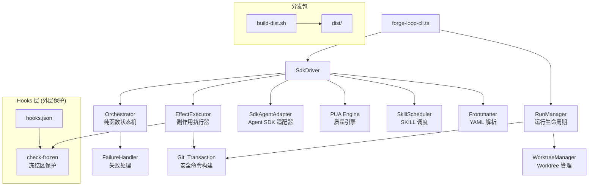
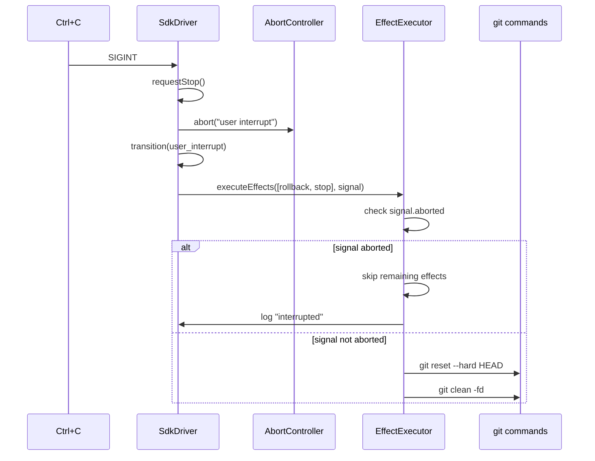

# 设计文档 — v2.2.1 审计发现项修复

## Overview

本设计文档描述 Forge v2.2.1 审计发现的 25 项问题的修复方案。这些问题来自上线前深度审核，涵盖安全防护、竞态条件、数据一致性、错误处理、代码可维护性等多个维度。

### 设计原则

1. **纯函数优先**: 所有新增逻辑尽量保持纯函数设计，与现有 orchestrator/failure-handler/frontmatter 等模块风格一致
2. **最小侵入**: 修复不改变现有模块的公共 API 签名，仅扩展行为或添加防御性检查
3. **防御性编程**: 对边界输入、异常路径、竞态条件进行显式处理
4. **可测试性**: 每项修复都有对应的属性测试或单元测试覆盖

### 修复分组

25 项审计发现按修改范围分为 6 个工作组：

| 工作组 | 涉及模块 | 需求编号 |
|--------|----------|----------|
| A: 启动与运行时验证 | SdkDriver, Hooks | R1, R5, R10, R16 |
| B: 并发与资源管理 | RunManager, WorktreeManager | R2, R4, R11, R13 |
| C: 分发包与冻结保护 | build-dist.sh, hooks.json, EffectExecutor | R3, R8, R14 |
| D: 纯函数逻辑修复 | Frontmatter, FailureHandler, Orchestrator, Git_Transaction | R7, R9, R15, R18, R19 |
| E: PUA 引擎与失败处理 | PUA_Engine, SdkDriver | R6, R17 |
| F: 代码质量与可维护性 | Router, Skill_Scheduler, Spec, Plan | R20, R21, R22, R23, R24, R25 |

## Architecture

### 现有架构概览



### 修复影响范围

本次修复不改变架构拓扑，仅在现有模块内部增强：

- **SdkDriver**: 添加启动时 hooks 验证、notes 初始化修复、PUA 硬失败路径、effect 错误分类
- **RunManager**: 添加文件锁序列化、孤立分支清理、notes 备份逻辑
- **EffectExecutor**: 添加 abort signal 检查、FrozenZoneViolation 错误类型
- **Orchestrator**: 添加终态守卫、stop_condition_met 迭代计数
- **Frontmatter**: 添加正则转义防护
- **FailureHandler**: 添加 consecutiveErrors 下界保护
- **Git_Transaction**: 扩展非法字符集
- **Plan/Spec**: 添加验证逻辑和依赖字段

## Components and Interfaces

### 工作组 A: 启动与运行时验证

#### R1: Hooks 验证检查

在 `SdkDriver` 构造函数或 `run()` 方法入口添加 hooks 存在性检查：

```typescript
// 新增纯函数：验证 hooks 配置
function validateHooksPresence(cwd: string): { valid: boolean; reason?: string } {
  const hooksPath = join(cwd, "hooks", "hooks.json");
  if (!existsSync(hooksPath)) {
    return { valid: false, reason: "hooks/hooks.json not found" };
  }
  try {
    const content = readFileSync(hooksPath, "utf-8");
    const parsed = JSON.parse(content);
    if (!parsed?.hooks?.PreToolUse) {
      return { valid: false, reason: "PreToolUse section missing in hooks.json" };
    }
    return { valid: true };
  } catch {
    return { valid: false, reason: "hooks.json parse failed" };
  }
}
```

**设计决策**: 检查失败仅输出 `console.warn`，不阻断启动。理由：hooks 缺失是配置问题而非运行时错误，阻断会影响开发体验。

#### R5: notesContent 初始化一致性

修改 `SdkDriver` 构造函数，使用包含 `branchName` 的参数初始化 `notesDocument`：

```typescript
// 修改前
this.notesDocument = { runId: config.runId, entries: [] };

// 修改后
this.notesDocument = { runId: config.runId, branchName: config.branchName, entries: [] };
```

需要在 `SdkDriverConfig` 接口中添加 `branchName` 字段，并在 CLI 层传入。

#### R10: PUA 状态恢复错误日志增强

统一所有 PUA 相关 catch 块的日志格式：

```typescript
// 统一格式
const errorDetail = err instanceof Error ? (err.stack ?? err.message) : String(err);
console.warn(`Warning: PUA state restore failed: ${errorDetail}`);
```

#### R16: buildPressurePrompt 返回值丢弃意图注释

纯文档修改，在 `handlePuaFailure` 方法中添加设计意图注释。

### 工作组 B: 并发与资源管理

#### R2: Worktree 文件锁

在 `RunManager.setupWorktree` 中引入文件锁序列化：

```typescript
// 新增接口
interface FileLock {
  acquire(timeoutMs: number): boolean;
  release(): void;
}

// 锁文件路径: .tinkerman/.locks/worktree.lock
// 实现使用 fs.openSync 的 O_EXCL 标志实现原子创建
```

**设计决策**: 使用文件系统级锁（`O_CREAT | O_EXCL`）而非进程级锁，因为并发 worktree 创建可能来自不同进程。锁获取失败时回退到无锁模式并输出警告，保证向后兼容。

#### R4: Worktree 删除前 Notes 保全

在 CLI 的 worktree 清理逻辑前添加 notes 备份：

```typescript
// 在 decideWorktreeCleanup 返回 "remove" 后、执行 git worktree remove 前
function backupWorktreeNotes(
  worktreeNotesPath: string,
  mainRepoRunDir: string,
): { success: boolean; error?: string } {
  // 将 worktree 内的 notes.md 复制到主仓库 .tinkerman/runs/<runId>/
}
```

#### R11: 孤立分支清理

在 `setupWorktree` 的 catch 块中添加分支删除：

```typescript
// 现有: 移除 worktree
// 新增: 删除已创建的分支
try {
  execFileSync("git", ["branch", "-D", branchName], { cwd: repoRoot });
} catch (branchErr) {
  // 包含分支名的错误信息以便手动清理
}
```

#### R13: resumeRun CLI 连接

在 CLI 中添加 `--resume <branchName>` 选项，调用 `RunManager.resumeRun()`。

### 工作组 C: 分发包与冻结保护

#### R3: 分发包冻结保护

**方案选择**: 在 `build-dist.sh` 中复制编译后的 `dist/src/` 目录到分发包，使 `check-frozen.js` 在分发包环境中可用。

```bash
# build-dist.sh 新增
if [[ -d "${FORGE_ROOT}/dist/src" ]]; then
  mkdir -p "${CC_BUNDLE}/dist/src"
  cp "${FORGE_ROOT}/dist/src/check-frozen.js" "${CC_BUNDLE}/dist/src/"
  # 复制 check-frozen.js 的依赖模块
fi
```

**设计决策**: 选择复制编译产物而非替换为 shell 脚本，因为 `check-frozen.js` 依赖 `frontmatter.ts` 的解析逻辑，shell 脚本难以完整复现。

#### R8: Effect 执行失败错误分类

新增错误类型层次：

```typescript
// 新增错误类型
export class FrozenZoneViolation extends Error {
  readonly code = "FROZEN_ZONE_VIOLATION" as const;
  constructor(files: string[]) {
    super(`Frozen zone violation: ${files.join(", ")}`);
    this.name = "FrozenZoneViolation";
  }
}

export class UnexpectedEffectError extends Error {
  readonly code = "UNEXPECTED_EFFECT_ERROR" as const;
  constructor(message: string) {
    super(message);
    this.name = "UnexpectedEffectError";
  }
}
```

SdkDriver 在 catch 块中通过 `instanceof` 区分错误类型，FrozenZoneViolation 直接终止循环，UnexpectedEffectError 触发退避。

#### R14: Abort 信号传递至 Effect 执行

修改 `executeEffects` 调用链，将 `currentAbortController.signal` 传递到 EffectExecutor：

```typescript
// EffectExecutor.executeEffect 已支持 abortSignal 参数
// 需要在 commit/rollback 的关键步骤前检查
private executeCommit(message: string, abortSignal?: AbortSignal): void {
  if (abortSignal?.aborted) {
    this.deps.onLog("Commit skipped: abort signal received");
    return;
  }
  // ... existing logic
}
```

### 工作组 D: 纯函数逻辑修复

#### R7: Frontmatter 正则转义

新增纯函数 `escapeRegExp` 并在所有字段提取函数中使用：

```typescript
function escapeRegExp(str: string): string {
  return str.replace(/[.*+?^${}()|[\]\\]/g, "\\$&");
}

export function extractStringField(frontmatter: string, fieldName: string): string | null {
  const escaped = escapeRegExp(fieldName);
  const regex = new RegExp(`^${escaped}:\\s*"?([^"\\n]*)"?\\s*$`, "m");
  // ...
}
```

#### R9: Backoff 下界保护

修改 `calculateBackoffMs`：

```typescript
export function calculateBackoffMs(consecutiveErrors: number, baseMs = DEFAULT_BASE_MS): number {
  const clamped = Math.max(1, consecutiveErrors);
  return baseMs * 2 ** (clamped - 1);
}
```

#### R15: sanitizeBranchName 完整覆盖

扩展 `ILLEGAL_BRANCH_CHARS_RE` 以排除 `~`、`^`、`*`、`[`、`:`、`?`、`\`：

```typescript
const ILLEGAL_BRANCH_CHARS_RE = /[^a-zA-Z0-9\-_./]/g;
// 修改为:
const ILLEGAL_BRANCH_CHARS_RE = /[^a-zA-Z0-9\-_.\/]/g;
// 注意: 现有正则已排除这些字符（它们不在 a-zA-Z0-9\-_./ 范围内）
// 但需要额外处理 @{ 序列的残留 { 字符
```

**设计决策**: 现有正则的白名单模式已经排除了 `~^*[:?\` 等字符。真正需要修复的是 `@{` 替换后可能残留孤立 `{` 的问题，以及确保输出通过 `git check-ref-format --branch` 验证。

#### R18: Orchestrator 终态守卫

在 `transition` 函数入口添加终态检查：

```typescript
export function transition(state, event, limits = {}) {
  // 终态守卫: aborted/stopped 状态拒绝所有事件
  if (state.status === "aborted" || state.status === "stopped") {
    return { state, effects: [] };
  }
  
  // idle 状态仅接受 start 事件
  if (state.status === "idle" && event.type !== "start") {
    return { state, effects: [] };
  }
  
  // ... existing switch
}
```

#### R19: stop_condition_met 迭代计数

修改 `stop_condition_met` 分支：

```typescript
case "stop_condition_met": {
  return {
    state: { ...state, currentIteration: state.currentIteration + 1, status: "aborted" },
    effects: [{ type: "abort", reason: "stop condition met" }],
  };
}
```

### 工作组 E: PUA 引擎与失败处理

#### R6: 熔断器与 PUA L4 阈值对齐

**方案选择**: 文档化方案 — 在代码注释中明确说明设计意图。

```typescript
// failure-handler.ts
/** 
 * Default consecutive-failure threshold for the circuit breaker.
 * 
 * 设计意图: Circuit Breaker 阈值 (3) 与 PUA L4 阈值 (5) 有意不同。
 * PUA L1-L3 用于渐进式预警和方法论切换（2-4 次失败），
 * Circuit Breaker 用于终止循环（3 次连续失败）。
 * 两者协作关系: PUA 在 Circuit Breaker 触发前提供 1-2 轮预警机会。
 * 
 * @see src/pua-engine.ts determinePressureLevel — PUA 压力等级阈值
 */
const DEFAULT_CIRCUIT_BREAKER_THRESHOLD = 3;
```

#### R17: 硬失败路径 PUA 状态更新

在 `executeSkillAwareIteration` 和 `executeGenericIteration` 的 catch 块中添加 PUA 失败处理：

```typescript
// catch 块中
if (this.config.puaEnabled) {
  this.handlePuaFailure(errorMessage);
}
```

### 工作组 F: 代码质量与可维护性

#### R20: Router/Scheduler 交叉引用注释

纯文档修改，在两个模块的序列定义处添加交叉引用。

#### R21: 孤儿导出函数标注

为 `getWorkNatureSequenceKey`、`getCommandSequence`、`shouldCommitForPhase` 添加 `@internal` / `@visibleForTesting` JSDoc。

#### R22: Brownfield 提升逻辑

在 `shouldBrownfieldBoost` 中评估 standard→full 提升条件，或添加设计决策注释。

#### R23: confirmSpec 验证前置

修改 `confirmSpec` 函数，在锁定前调用验证：

```typescript
export function confirmSpec(spec: SpecDocument): 
  { success: true; spec: SpecDocument } | { success: false; errors: string[] } {
  
  const errors: string[] = [];
  
  if (!validateTestability(spec.requirements)) {
    errors.push("Not all requirements have testable scenarios");
  }
  
  if (spec.isBrownfield && !validateBrownfieldDelta(spec)) {
    errors.push("Brownfield spec missing complete Delta section");
  }
  
  if (errors.length > 0) {
    return { success: false, errors };
  }
  
  return {
    success: true,
    spec: { ...spec, frontmatter: { ...spec.frontmatter, status: "locked" } },
  };
}
```

**设计决策**: `confirmSpec` 返回类型从 `SpecDocument` 改为联合类型，这是一个 breaking change。需要更新所有调用点。

#### R24: Plan 执行前 Spec 状态检查

在 plan 验证逻辑中添加 spec 状态检查：

```typescript
export function validateSpecLocked(specStatus: string): 
  { valid: true } | { valid: false; error: string } {
  if (specStatus !== "locked") {
    return { valid: false, error: "spec not locked" };
  }
  return { valid: true };
}
```

#### R25: AtomicTask dependsOn 字段

扩展 `AtomicTask` 接口并添加验证：

```typescript
export interface AtomicTask {
  // ... existing fields
  dependsOn?: number[];  // 引用其他任务的 taskNumber
}

// 在 validatePlanTasks 中添加依赖验证
function validateDependencies(tasks: AtomicTask[]): string[] {
  const errors: string[] = [];
  const taskNumbers = new Set(tasks.map(t => t.taskNumber));
  
  for (const task of tasks) {
    if (task.dependsOn) {
      for (const dep of task.dependsOn) {
        if (!taskNumbers.has(dep)) {
          errors.push(`Task ${task.taskNumber} depends on non-existent task ${dep}`);
        }
      }
    }
  }
  
  return errors;
}
```

## Data Models

### 新增类型

```typescript
// effect-executor.ts — 错误分类 (R8)
export class FrozenZoneViolation extends Error {
  readonly code = "FROZEN_ZONE_VIOLATION" as const;
  readonly files: string[];
}

export class UnexpectedEffectError extends Error {
  readonly code = "UNEXPECTED_EFFECT_ERROR" as const;
}

// run-manager.ts — 文件锁 (R2)
interface FileLockOptions {
  lockPath: string;
  timeoutMs: number;  // 默认 5000ms
}

// plan.ts — 任务依赖 (R25)
export interface AtomicTask {
  taskNumber: number;
  title: string;
  filePath: string;
  estimatedMinutes: number;
  tddSteps: TDDSteps;
  verifyCommand: string;
  commitMessage: string;
  dependsOn?: number[];  // 新增
}
```

### 修改类型

```typescript
// sdk-driver.ts — 配置扩展 (R5, R12)
export interface SdkDriverConfig {
  // ... existing fields
  branchName: string;  // 新增 (R5)
}

// sdk-agent-adapter.ts — 超时配置 (R12)
export interface SdkAgentAdapterConfig {
  // ... existing fields
  globalTimeoutMs?: number;  // 新增，默认 1_800_000 (30 min)
}

// spec.ts — confirmSpec 返回类型变更 (R23)
type ConfirmSpecResult = 
  | { success: true; spec: SpecDocument }
  | { success: false; errors: string[] };
```

## Correctness Properties

*A property is a characteristic or behavior that should hold true across all valid executions of a system — essentially, a formal statement about what the system should do. Properties serve as the bridge between human-readable specifications and machine-verifiable correctness guarantees.*

### Property 1: Hooks 验证正确分类 JSON 结构

*For any* JSON object, the hooks validation function shall return `valid: true` if and only if the object contains a `hooks.PreToolUse` array; for all other structures (missing key, wrong type, malformed JSON, empty object), it shall return `valid: false` with a non-empty reason string.

**Validates: Requirements 1.1**

### Property 2: NotesDocument branchName 往返保持

*For any* valid `NotesDocument` containing a `branchName`, calling `formatNotesDocument` shall produce a string that contains the `branchName` value, and calling `formatNotesDocument` twice with the same input shall produce identical output (idempotence).

**Validates: Requirements 5.1, 5.2**

### Property 3: Frontmatter 字段提取正则安全

*For any* string used as `fieldName` (including strings containing regex special characters `.*+?^${}()|[]\`), calling `extractStringField`, `extractListField`, or `extractNumericField` shall either return a valid result or `null` — never throw a `SyntaxError` or `RegExp` construction error.

**Validates: Requirements 7.1, 7.2**

### Property 4: Backoff 下界不变量

*For any* `consecutiveErrors` value (including 0 and negative integers) and *for any* positive `baseMs`, `calculateBackoffMs(consecutiveErrors, baseMs)` shall return a value greater than or equal to `baseMs`.

**Validates: Requirements 9.1, 9.2**

### Property 5: sanitizeBranchName 生成合法 Git 引用名

*For any* input string, `sanitizeBranchName` shall produce output that does not contain any Git-illegal characters (`~`, `^`, `*`, `[`, `:`, `?`, `\`, `..`, `@{`, trailing `.lock`, control characters, spaces) and does not start or end with `.`, `/`, or `-`. For non-degenerate inputs (containing at least one alphanumeric character), the output shall be non-empty.

**Validates: Requirements 15.1, 15.2, 15.3**

### Property 6: PUA 压力等级单调性

*For any* sequence of increasing `consecutiveFailures` values (with `stallDetected` held constant), `determinePressureLevel` shall return pressure levels that are non-decreasing — i.e., the ordinal index of the returned level shall never decrease as `consecutiveFailures` increases.

**Validates: Requirements 17.3**

### Property 7: Orchestrator 终态/空闲态守卫

*For any* `OrchestratorEvent`, if the orchestrator is in `aborted` or `stopped` status, `transition` shall return the state unchanged with an empty effects array. Additionally, *for any* non-`start` event applied to an `idle` state, `transition` shall return the state unchanged with an empty effects array.

**Validates: Requirements 18.1, 18.2**

### Property 8: stop_condition_met 递增迭代计数

*For any* `OrchestratorState` in `running` status, applying a `stop_condition_met` event shall produce a new state where `currentIteration` equals the original `currentIteration + 1` and `status` equals `aborted`.

**Validates: Requirements 19.1**

### Property 9: confirmSpec 验证前置守卫

*For any* `SpecDocument` where `validateTestability` returns `false` (requirements lack testable scenarios), `confirmSpec` shall return a failure result with non-empty errors. Additionally, *for any* brownfield `SpecDocument` where `validateBrownfieldDelta` returns `false`, `confirmSpec` shall return a failure result.

**Validates: Requirements 23.1, 23.2, 23.3**

### Property 10: dependsOn 依赖验证

*For any* list of `AtomicTask` objects, if any task's `dependsOn` array contains a `taskNumber` that does not exist in the task list, `validateDependencies` shall return a non-empty error array. Conversely, if all `dependsOn` references point to existing task numbers, the error array shall be empty.

**Validates: Requirements 25.2, 25.3**

### Property 11: Brownfield 提升分类

*For any* `TaskSignals` with a brownfield `ProjectContext` where `touchesExistingModules` is true, if the signals also indicate `hasAuthChanges` or `hasNewService`, the classified tier shall be at least `standard` (and potentially `full` if the boost is implemented). For non-brownfield contexts, the boost logic shall have no effect on tier classification.

**Validates: Requirements 22.1**

## Error Handling

### 错误分类策略

本次修复引入两层错误分类：

| 错误类型 | 来源 | 处理方式 |
|----------|------|----------|
| `FrozenZoneViolation` | EffectExecutor 冻结区检查 | 直接终止循环，不触发退避 |
| `UnexpectedEffectError` | EffectExecutor 意外崩溃 | 触发 `iteration_hard_failure` + 指数退避 |
| `TimeoutError` | SdkAgentAdapter 全局超时 | 触发 `iteration_hard_failure` + 指数退避 |
| 文件锁超时 | RunManager worktree 锁 | 抛出错误，阻断 worktree 创建 |
| 文件锁机制失败 | RunManager 锁目录不可用 | 回退无锁模式 + 警告日志 |
| Hooks 验证失败 | SdkDriver 启动检查 | 警告日志，不阻断启动 |
| Notes 备份失败 | CLI worktree 清理 | 警告日志，不阻断删除 |

### 防御性编程模式

1. **边界输入保护**: `calculateBackoffMs` 对 `consecutiveErrors < 1` 进行 clamp；`sanitizeBranchName` 对所有 Git 非法字符进行过滤
2. **正则注入防护**: `escapeRegExp` 在构造动态正则前转义特殊字符
3. **终态守卫**: Orchestrator 在 `aborted`/`stopped` 状态拒绝所有事件
4. **资源清理**: Worktree 创建失败时清理孤立分支；文件锁在 finally 块中释放
5. **优雅降级**: 文件锁失败回退无锁模式；hooks 缺失仅警告不阻断

### Abort 信号传播



## Testing Strategy

### 测试框架

- **单元测试**: Vitest（已有配置）
- **属性测试**: fast-check（已有依赖）
- **覆盖率**: V8 provider，阈值 80% lines/functions/statements, 70% branches

### 属性测试配置

每个属性测试运行最少 100 次迭代，使用 `fc.assert(fc.property(...), { numRuns: 100 })` 配置。

每个属性测试文件头部包含设计文档属性引用注释：

```typescript
/**
 * Feature: audit-remediation-v221, Property N: <property_text>
 */
```

### 双轨测试方法

**属性测试**（验证普遍性质）:

| 属性 | 测试文件 | 生成器 |
|------|----------|--------|
| P1: Hooks 验证 | `test/hooks-validation.property.test.ts` | 随机 JSON 对象 |
| P2: Notes branchName | `test/notes-branchname.property.test.ts` | 随机 branchName 字符串 |
| P3: Frontmatter 正则安全 | `test/frontmatter.property.test.ts` (扩展) | 含正则特殊字符的 fieldName |
| P4: Backoff 下界 | `test/failure-handler.property.test.ts` (扩展) | 随机 (consecutiveErrors, baseMs) |
| P5: Branch 名合法性 | `test/git-transaction.property.test.ts` (扩展) | 随机字符串含 Git 非法字符 |
| P6: PUA 压力单调性 | `test/pua-engine.property.test.ts` (新增) | 递增 consecutiveFailures 序列 |
| P7: 终态守卫 | `test/orchestrator.property.test.ts` (新增) | 随机 OrchestratorEvent × 终态 |
| P8: stop_condition_met | `test/orchestrator.property.test.ts` (新增) | 随机 running 状态 |
| P9: confirmSpec 守卫 | `test/spec.property.test.ts` (新增) | 随机 SpecDocument |
| P10: dependsOn 验证 | `test/plan.property.test.ts` (新增) | 随机 AtomicTask 列表 |
| P11: Brownfield 提升 | `test/router.property.test.ts` (扩展) | 随机 TaskSignals + ProjectContext |

**单元测试**（验证具体示例和边界条件）:

| 需求 | 测试内容 | 测试文件 |
|------|----------|----------|
| R1 | hooks 缺失/损坏时的警告日志 | `test/sdk-driver.test.ts` |
| R2 | 文件锁获取/释放/超时 | `test/run-manager.test.ts` |
| R3 | 分发包包含 check-frozen.js | `test/contract.scripts.test.ts` (扩展) |
| R4 | Notes 备份成功/失败路径 | `test/worktree-notes.test.ts` |
| R6 | 阈值交叉引用注释存在性 | 代码审查（非自动化） |
| R8 | FrozenZoneViolation vs UnexpectedEffectError | `test/effect-executor.test.ts` (扩展) |
| R10 | PUA catch 块日志格式 | `test/sdk-driver.test.ts` |
| R12 | Agent 超时触发 | `test/sdk-agent-adapter.test.ts` |
| R13 | --resume CLI 选项 | `test/forge-loop-cli.test.ts` (扩展) |
| R14 | Abort 信号传递 | `test/effect-executor.test.ts` (扩展) |

**集成测试**:

| 需求 | 测试内容 | 测试文件 |
|------|----------|----------|
| R2 | 并发 worktree 创建序列化 | `test/worktree-lock.integration.test.ts` |
| R11 | 孤立分支清理 | `test/run-manager.integration.test.ts` |
| R3 | 分发包冻结保护端到端 | `test/frozen-protection.integration.test.ts` (扩展) |

### 测试优先级

1. **P0 (必须)**: 属性测试 P3-P5, P7-P8（纯函数修复，高回归风险）
2. **P1 (重要)**: 属性测试 P1-P2, P6, P9-P10（新增逻辑）
3. **P2 (建议)**: 单元测试 R8, R12, R14（I/O 相关修复）
4. **P3 (可选)**: 集成测试、属性测试 P11（依赖设计决策）

