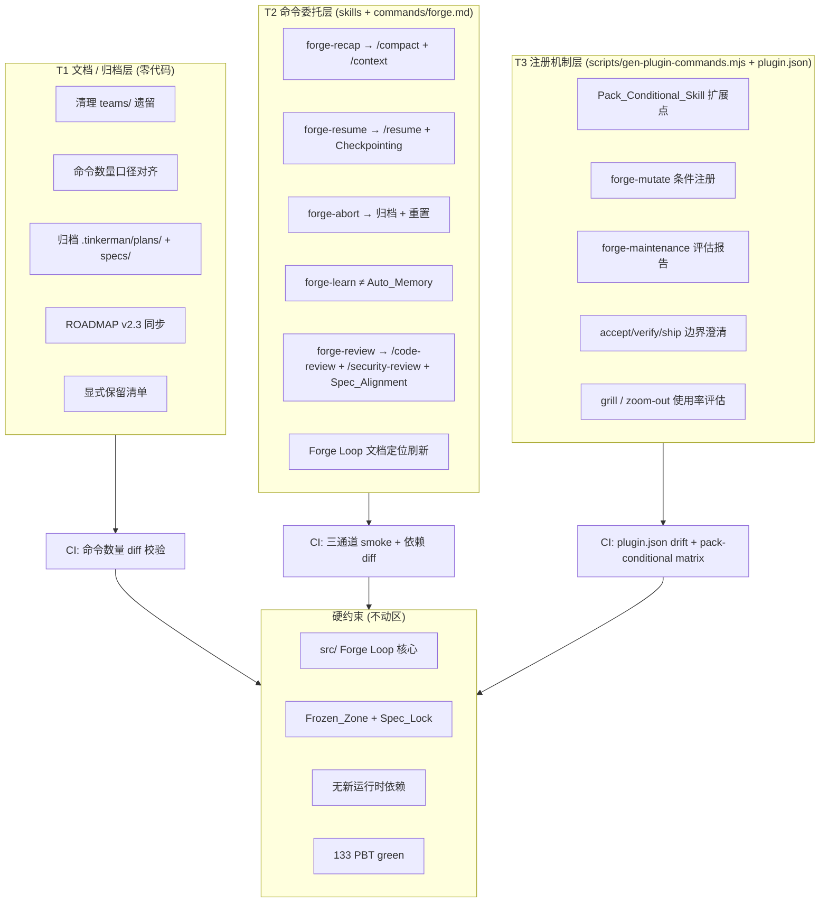
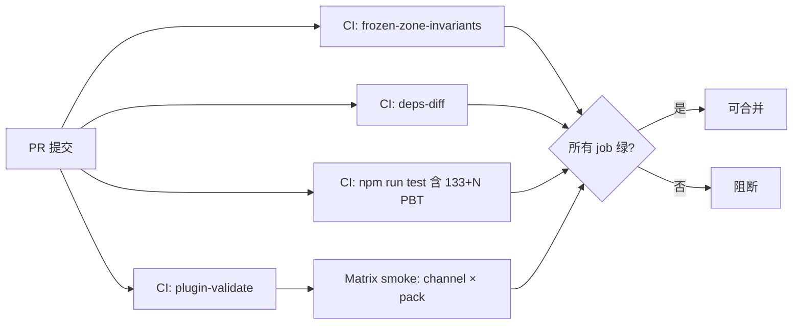

# Design Document — forge-slimming-plan

## Overview

forge-slimming-plan 把 Claude Code 官方原生能力与 Forge 差异化能力重新分层。目标有三：

1. **T1 文档 / 归档层面**：对齐 `plugin.json` / `marketplace.json` / `README` 中的命令数量口径、归档已交付 spec/plan、同步 v2.3 observability 状态。零行为变化、零代码改动。
2. **T2 命令委托层**：`/forge recap | resume | abort | learn | review` 的基础能力委托给 `/compact`、`/context`、`/resume`、Checkpointing、Auto Memory、`/code-review`、`/security-review`；Forge 只保留差异化上层（五问题结构化 prompt、`--from-pr`、跨项目 ADR、五维度 learn、Spec_Alignment_Review）。委托实现位于 `skills/forge-*/SKILL.md` 与 `commands/forge.md` 的编排脚本中，**不触碰 `src/` 核心引擎**。
3. **T3 注册机制层**：`scripts/gen-plugin-commands.mjs` 与 `plugin.json` / 命令表生成链路新增 Pack_Conditional_Skill 扩展点；`forge-mutate` 不再常驻主包命令列表，仅当 pack 启用 `feature_flags.mutation_critical_modules` 时才自动注册。

整个瘦身始终遵循以下硬约束：

- Forge Loop 核心引擎（`src/` 下的 Git 事务、熔断器、指数退避、Worktree 管理、PUA、StatusFile 驱动、Restatement）**完全不动** — 所有 T1 / T2 / T3 变更不得产生 `src/` 下的 diff（文档字符串例外需单独审批）。
- Frozen_Zone 分级（locked / approved / open）、Spec_Lock 语义、`FrozenZoneViolation` 语义保持原样。
- 无新运行时依赖进入 `package.json.dependencies`；任何 `devDependencies` 新增都需在 commit message 中解释。
- 133 个 fast-check 属性测试全部保持 green（`npm run test` 必须通过）。

本 design 的输出物按需求分布到三个层面：T1 交付结构化归档脚本与审计日志格式；T2 交付 Delegation_Adapter 模式 + Deprecation_Notice 去重机制；T3 交付 Pack_Conditional_Skill 注册扩展点 + Integration_Evaluation_Report 模板 + 使用率度量管线 + 边界对比表契约测试。

**覆盖 R1-R25（全局背景）**

---

## Architecture

### 三层分工总览



### 分层执行顺序

```mermaid
flowchart LR
    T1R2[R2 命令数量口径] --> T3R18[R18 plugin.json 对齐]
    T1R3[R3 归档 plans/specs] --> T3R17[R17 skill 数量目标]
    T2R14_16_metrics[R14 + R16 Usage_Metrics_Window<br/>(与 T2 并行启动)] --> T3R14[R14 maintenance 评估]
    T2R14_16_metrics --> T3R16[R16 grill/zoom-out 评估]
    T2R11[R11 Loop 定位刷新] --> T2R6_10[R6-R10 命令委托]
    T2R6_10 --> T3R13[R13 forge-mutate 条件注册]
```

**拓扑依赖要点**：
- **R2 必须先于 R18**：命令数量单一事实源在 T1 就要确立，T3 才能在此基础上做"生成 vs. 声明"的 CI diff 校验。
- **R14 / R16 的 Usage_Metrics_Window（至少 14 天）与 T2 并行启动**：度量采集不阻塞命令委托；等到 T3 做合并评估时 14 天窗口已闭合。
- **R11 文档定位先于 R6-R10**：用户看到的 Forge Loop 描述先对齐为"带工程纪律的自主执行"，避免委托期间出现描述混淆。
- **R21 横跨三层**：任何阶段发现需要改 `src/` 就立刻 defer 到 `.tinkerman/features/`，不在本 spec 内执行。

**覆盖 R1-R25（架构全局）**

---

## Components and Interfaces

### 1. Native_Command Delegation_Adapter 模式

#### 1.1 设计目标

把 `/forge recap | resume | abort | learn | review` 的基础层委托给 Claude Code 官方命令，同时保证：

- 用户在低版本 Claude Code 上**仍然可用**（fallback to legacy）。
- 每个 session 对每个受影响命令**最多提醒一次** Deprecation_Notice。
- `/forge review` 在合并 delegated findings + Spec_Alignment findings 时做 `source` 字段 tagging，便于后续工具消费。

#### 1.2 Delegation_Adapter 流程图

```mermaid
flowchart TD
    A[用户调用 /forge recap|resume|abort|learn|review] --> B[Delegation_Adapter 入口<br/>位于 skills/forge-*/SKILL.md]
    B --> C[detectClaudeCodeVersion<br/>exec: claude --version]
    C --> D{semver ≥ 所需最低版本?<br/>且对应 Native_Command 存在?}

    D -- 是 --> E[standardPath: 调用 Native_Command]
    E --> F{exit code = 0?}
    F -- 否 --> X1[abort Forge 上层<br/>透传 exit code]
    F -- 是 --> G[执行 Forge 差异化上层<br/>五问题 / --from-pr / 结构化摘要 /<br/>Spec_Alignment_Review]
    G --> H[合并输出<br/>source 字段 tagging]

    D -- 否 --> L[legacyPath: 运行旧行为]
    L --> M[emitDeprecationNoticeOnce]

    M --> N[basename + session_id 写入<br/>.tinkerman/.deprecation-notice/&lt;sid&gt;/&lt;cmd&gt;.lock]
    N --> O{锁文件是否已存在?}
    O -- 是 --> P[静默跳过]
    O -- 否 --> Q[原子写入锁文件<br/>O_CREAT &#124; O_EXCL<br/>输出 Notice 到 stderr]
    Q --> R[继续 legacy 输出]
    P --> R

    H --> END[返回给用户]
    R --> END
    X1 --> END
```

#### 1.3 版本探测（detectClaudeCodeVersion）

- **实现位置**：`skills/forge-router/` 下新增一个共享 helper 片段（纯 Bash / Node，不进入 `src/`），被 `skills/forge-recap/`、`skills/forge-resume/`、`skills/forge-abort/`、`skills/forge-learn/`、`skills/forge-review/` 的 SKILL.md 引用。
- **探测命令**：`claude --version`（官方 CLI 自带）→ 解析 `x.y.z` → 与每个命令所需的 `min_claude_version` 比较。
- **最低版本声明集中管理**：在 `skills/shared/native-command-matrix.md`（新增文件，纯文档）里维护一张表：

| Forge 命令 | 委托的 Native_Command | 推荐最低 Claude Code 版本 |
|------------|----------------------|--------------------------|
| `/forge recap` | `/compact` + `/context` | 2.0+ |
| `/forge resume` | `/resume` + Checkpointing | 2.0+ |
| `/forge learn` | Auto_Memory | 2.1.59+ |
| `/forge review --delegate-quality` | `/code-review` | 2.0+ |
| `/forge review --delegate-security` | `/security-review` | 2.0+ |

具体数值以 Claude Code 官方 changelog 为准，**在实现任务阶段由 `/forge spec` 或 `/forge decide` 复核后写回**。

#### 1.4 执行顺序与回退

- `standardPath`：`Native_Command` → 等待退出 → 退出码非零立刻 abort Forge 上层（不做 Forge 侧的补偿逻辑，避免"半成品"状态）。
- `legacyPath`：完整复用瘦身前的实现逻辑（当前每个 skill 的 SKILL.md 已经是这套）。
- **任何阶段都不修改 `src/`**：委托只改 `skills/forge-*/SKILL.md` 的步骤描述与 `commands/forge.md` 的可选编排。

#### 1.5 一次性 Deprecation_Notice（去重方案）

| 维度 | 设计选型 | 原因 |
|------|---------|------|
| 唯一性标识 | `session_id`（从 Claude Code 环境变量或 `.tinkerman/status.md` 的 `runId` 取）+ 命令名 basename | 保证跨子会话不会重复提醒；进程崩溃重启后 session_id 变化，允许再次提醒一次 |
| 存储位置 | `.tinkerman/.deprecation-notice/<session_id>/<command>.lock`（0 字节文件） | 与现有 `.tinkerman/.stop-hook-dedupe/` 约定一致；目录自动 GC（session 结束后由现有 cleanup hook 清理） |
| 原子性 | `open(..., O_CREAT \| O_EXCL, 0o644)` | 与 `src/run-manager.ts` 的 worktree 锁同构，但实现在 Bash / mjs 脚本层，不进入 `src/` |
| 输出通道 | stderr，单行 + 链接 `docs/slimming-migration.md` | 不污染 stdout，不影响下游 pipeline |
| 内容字段 | 受影响 `/forge` 命令、缺失的 Native_Command、推荐最低 Claude Code 版本、迁移指南 URL | 对应 R12.2 强制字段 |

**Edge case**：如果 `.tinkerman/` 被 hooks 暂时阻断（极少见），改写到 `/tmp/.forge-deprecation-<session_id>/<cmd>.lock`；Notice 本身不应成为阻断项。

#### 1.6 Spec_Alignment_Review 在 delegated findings 之上的合并

`/forge review` 委托 `/code-review` 或 `/security-review` 后，输出结构演进为：

```yaml
# .tinkerman/reviews/<timestamp>.yaml
review_run_id: "<uuid>"
sources:
  - source: "claude:code-review"
    invocation: "/code-review"
    exit_code: 0
    findings_count: 12
  - source: "claude:security-review"
    invocation: "/security-review"
    exit_code: 0
    findings_count: 3
  - source: "forge:spec-alignment"
    invocation: "subagent:architect"
    exit_code: 0
    findings_count: 5
findings:
  - id: "F-001"
    source: "claude:code-review"     # 原样透传
    severity: "P1"
    file: "src/foo.ts"
    line: 42
    message: "..."
  - id: "F-006"
    source: "forge:spec-alignment"    # Forge 独有层
    severity: "P0"
    violates_spec: ".tinkerman/specs/foo-bar/requirements.md#R3.2"
    message: "..."
merged_summary:
  P0_blockers: 2
  P1: 8
  P2: 10
```

**合并规则**：
- 不做 finding 级别的去重（`/code-review` 与 Spec_Alignment_Review 的视角不同；重复问题由 reviewer 人工确认）。
- 每条 finding 保留 `source` 原值，Forge 端只追加 `forge:spec-alignment` 类别。
- P0 阻断判定只依赖 Spec_Alignment_Review 的 P0（Forge 差异化），`/code-review` / `/security-review` 的 P0 转化为"强建议"并由 `/forge ship` 的现有门禁决定。
- **输出格式保持向后兼容**：`.tinkerman/reviews/*.yaml` 的 top-level schema 原有的字段全部保留，`sources` / `merged_summary` 为新增字段（R19.5）。

**不改动 `src/` 核心在本节的生效点**：
- Delegation_Adapter 的探测 / 调用 / 合并逻辑全部位于 `skills/forge-*/SKILL.md` 的"过程描述"段（由 LLM 按 SKILL.md 执行），或 `commands/forge.md` 的编排注释。不新增 TypeScript 模块。
- Deprecation_Notice 的锁文件读写由 Bash 片段（或 `scripts/` 下一个新的 `.mjs` helper）完成，**不经过 `src/` 下任何现有 file-locking 工具**。

**覆盖 R6-R10, R12**

### 2. Pack_Conditional_Skill 注册机制

#### 2.1 设计目标

`forge-mutate` 只在 pack 启用 `feature_flags.mutation_critical_modules` 时出现在 `/forge` 命令菜单里。当前 `packs/pms/pack.yaml` 已经声明了这个字段，可以直接消费。

未来更多 skill 都可能走同样路径（例如 domain-pack 专属的 lint / scenario 命令），因此需要一个**通用扩展点**而不是 hard-code `forge-mutate`。

#### 2.2 方案对比

| 方案 | 描述 | 优点 | 缺点 |
|------|------|------|------|
| **A：构建时扫描 pack 生成 plugin.json** | `scripts/gen-plugin-commands.mjs` 在生成时读取 `packs/*/pack.yaml`，按 feature_flags 条件决定是否把 skill 纳入 `commands/` 输出 | plugin.json 一次生成、无运行时开销；CI diff 可直接校验；与现有生成流无缝集成 | 启用 / 关闭 pack 需要重新运行生成脚本；多 pack 组合时生成矩阵较复杂 |
| **B：静态 plugin.json + SKILL 加载时短路** | plugin.json 始终声明 `forge-mutate`，但 SKILL.md 首行检查 pack 激活状态，未激活则打印提示并提前退出 | 运行时动态响应 pack 启停 | 命令菜单"假可见"体验差；与"主包 skill 数量约 20"的对外声明冲突；R13.2 明确要求"不在命令菜单出现" |

#### 2.3 推荐方案：A（构建时扫描），附运行时保护

理由：

1. R13.2 明确要求"不在 `plugin.json` 常驻命令集合出现"，只有 A 能满足。
2. 现有 CI 已经有 `plugin-validate` job（由 2026-05-12 ADR 固化），扩展一条 pack-conditional matrix 就能覆盖"无 pack / pms pack / 未来 pack"三种场景的快照。
3. 运行时保护仍然加一层：SKILL.md 入口仍然检查 pack 激活（B 方案的防御价值），用于"分发包已包含源文件但用户临时禁用 pack"的场景，避免命令可调用但 pack 缺失导致失败。

#### 2.4 Pack_Conditional_Skill 注册数据流

```mermaid
flowchart TD
    A[packs/*/pack.yaml] --> B[loadEnabledPacks<br/>.tinkerman/config.md:pack_activation]
    B --> C[collectFeatureFlags<br/>{mutation_critical_modules, forced_acceptance_contexts, ...}]

    D[skills/forge-*/SKILL.md<br/>frontmatter:<br/>  pack_conditional:<br/>    required_flag: mutation_critical_modules] --> E[scanSkillsDir]

    C --> F[gen-plugin-commands.mjs<br/>filterConditionalSkills]
    E --> F

    F --> G{required_flag 在<br/>enabledFlags 集合里?}
    G -- 是 --> H[纳入 commands/<br/>→ plugin.json.commands]
    G -- 否 --> I[skipSilently<br/>写入 .tinkerman/audit/pack-conditional-skipped.log]

    H --> J[commands/forge-mutate.md 生成]
    I --> K[commands/forge-mutate.md 不生成]

    J --> L[CI: plugin-validate job<br/>snapshot: no-pack / pms-pack / all-packs]
    K --> L

    L --> M{三种分发通道各自是否含<br/>预期命令集?}
    M -- 是 --> PASS[PASS]
    M -- 否 --> FAIL[FAIL: drift report]
```

#### 2.5 SKILL.md frontmatter 新字段

```yaml
---
name: forge-mutate
description: "..."
disable-model-invocation: true
pack_conditional:
  required_flag: mutation_critical_modules
  rationale: "Stryker 只针对 pack 声明的关键模块才有 ROI"
  fallback_message: "启用声明 mutation_critical_modules 的 pack 后可用，例如 pms。"
---
```

`gen-plugin-commands.mjs` 解析 frontmatter：
- 无 `pack_conditional` 字段 → 无条件注册（保持现有行为）。
- 有 `pack_conditional.required_flag` → 读取当前 pack 激活状态，条件为真才注册。

运行时短路实现写在 SKILL.md 的正文第一段（不进入 `src/`）：若 `.tinkerman/config.md` 未激活对应 pack，打印 `fallback_message` 并终止执行。

#### 2.6 三种分发通道的处理

| 通道 | build-dist.sh 行为 | plugin install 行为 | clone install 行为 |
|------|-------------------|---------------------|-------------------|
| clone | `packs/` 与 `skills/forge-mutate/` 都在仓库里；运行时由 gen-plugin-commands 决定命令菜单 | N/A | 运行 `scripts/gen-plugin-commands.mjs` 即可 |
| dist-package | `skills/forge-mutate/` 作为源文件随 `dist/` 一起分发（R20.4），但 `commands/forge-mutate.md` 由安装后 post-install hook 基于目标项目的 pack 激活状态重新生成 | N/A | N/A |
| plugin（marketplace） | plugin 仓库的 `commands/` 在默认安装场景下**不含** `forge-mutate.md`；启用 pms pack 后，plugin 的 post-install step 重新生成 `commands/forge-mutate.md` | 同左 | N/A |

**实现要点**：
- `scripts/build-dist.sh` 需要同时带走 `skills/forge-mutate/` 的源文件与运行 gen-plugin-commands 所需脚本（已在 CCBP Phase 2 固化）。
- `scripts/install-dist.sh` 在目标项目初始化后调用 `gen-plugin-commands.mjs`，按目标项目 `.tinkerman/config.md` 的 pack 激活状态决定是否创建 `commands/forge-mutate.md`。
- Plugin 安装场景下，marketplace 下载的文件是"已生成的静态集合"；Forge marketplace plugin 的生命周期 hook（SessionStart）可触发 regenerate 逻辑。

**不改动 `src/` 核心在本节的生效点**：
- 所有注册 / 过滤 / 生成逻辑都在 `scripts/gen-plugin-commands.mjs`（现有 Node 脚本）里扩展，不新增或修改 `src/` 下任何模块。
- 运行时短路只使用 SKILL.md 的正文描述，由 LLM 执行；不新增 TS adapter。

**覆盖 R13, R18, R20**

### 3. 命令数量单一事实源

#### 3.1 事实源定义

**唯一事实源** = `commands/forge.md` 的子命令表。所有对外声明的命令总数必须从这张表计算得到。

| 消费方 | 当前行为 | 目标行为 |
|--------|---------|---------|
| `.claude-plugin/plugin.json.description` | 硬编码 "28 commands" | 占位符 `{FORGE_COMMAND_COUNT}`，由 CI 在 release build 时替换 |
| `.claude-plugin/marketplace.json.description` | 硬编码 "28 commands" | 同上占位符 |
| `README.md` 概述区 | 文字叙述 "28 个 slash command" | 同上占位符 |
| `docs/reference-commands.md` | 手工列表 | 由 `scripts/gen-plugin-commands.mjs --docs` 生成 |
| `docs/quick-start.md` | 文字叙述 | 占位符 |
| `ROADMAP.md` Forge Loop 章节 | 文字叙述 | 占位符 |

#### 3.2 占位符机制

- **输入侧**：repo 里的文档保存占位符 `{FORGE_COMMAND_COUNT}`。
- **CI 替换**：`scripts/gen-plugin-commands.mjs --stamp-count` 新增子模式，遍历上表的文件集合，将占位符替换为真实数值；失败时报错退出。
- **校验模式**：`scripts/gen-plugin-commands.mjs --verify-count` 在 CI 中跑，若任一文档的数值与事实源不一致则失败。

#### 3.3 CI diff 校验链路

```
commands/forge.md 子命令表 (SST)
        │
        ▼
scripts/gen-plugin-commands.mjs
  - 输出 1: commands/<name>.md 集合
  - 输出 2: plugin.json.commands 数组
  - 输出 3: 命令总数 N (纯数字, 写入 .tinkerman/.command-count)
        │
        ▼
CI job: plugin-validate (现有) 扩展
  ① git diff commands/ 为空
  ② git diff .claude-plugin/plugin.json 为空
  ③ scripts/gen-plugin-commands.mjs --verify-count 通过
  ④ Pack_Conditional_Skill matrix (三种组合) 快照一致
```

#### 3.4 边界情况

- `forge-mutate` 只在 pack matrix 的"启用 pms"场景里计入总数；默认主包场景不计入。
- 对外声明的 "约 20 skills"（R17）是 **skills/ 目录下常驻条目数量**，与命令总数不完全一致（`commands/forge.md` 本身是一个入口命令，不对应 skill）。

**不改动 `src/` 核心在本节的生效点**：
- 所有占位符替换与 count 导出都在 scripts 层，不进入 `src/`。

**覆盖 R2, R18**

### 4. 归档工作流

#### 4.1 审计脚本设计

新脚本：`scripts/audit-archive-candidates.mjs`（零运行时依赖，仅使用 Node 标准库 + 现有 `scripts/lib/` helper）。

**输入**：
- `.tinkerman/plans/*.md`
- `.tinkerman/specs/*/`
- `ROADMAP.md`（已交付特性标识：✅ / `## vX.Y 已完成` 段落）
- `CHANGELOG.md`（release log）
- `.tinkerman/progress/*.md`（进行中状态）

**判定逻辑**：

```
for each plan or spec dir:
  evidence = {
    in_roadmap_shipped: roadmap 中是否出现在 "✅" / "已完成" 段落
    in_changelog: CHANGELOG 是否有对应 slug
    in_active_progress: .tinkerman/progress/ 是否有未完成项引用这个 spec/plan
    in_status_current: .tinkerman/status.md 的 current_task 是否指向这个
  }

  if in_roadmap_shipped AND in_changelog AND NOT in_active_progress AND NOT in_status_current:
    status = "shipped"
  elif in_active_progress OR in_status_current:
    status = "active"
  else:
    status = "ambiguous"
```

#### 4.2 归档目录命名

`.tinkerman/archive/YYYY-MM-DD-<slug>/`：
- `YYYY-MM-DD` 取审计脚本运行日期。
- `<slug>` 保留原文件 / 目录的 slug（kebab-case，与 spec / plan 名称一致）。
- 目录内**原样保留**所有子目录与文件（R3.2 "preserving its internal structure"）。

#### 4.3 audit log 结构化行格式

`.tinkerman/archive/.audit-YYYY-MM-DD.md`：

```markdown
| path | status | evidence | action |
|------|--------|----------|--------|
| .tinkerman/plans/foo.md | shipped | roadmap:v2.4 + changelog:2026-05-01 + no-active | moved to .tinkerman/archive/2026-05-20-foo/ |
| .tinkerman/specs/bar/ | active | progress:.tinkerman/progress/bar-build.md | keep in place |
| .tinkerman/specs/baz/ | ambiguous | no-roadmap-mention + no-progress | logged to .audit-pending.md |
```

未决项追加到 `.tinkerman/archive/.audit-pending.md`（R3.3），供人工复核。

#### 4.4 交叉引用更新

`scripts/audit-archive-candidates.mjs --fix-refs` 扫描 `docs/`、`README.md`、`.tinkerman/features/` 下对已归档路径的引用，将 `.tinkerman/plans/foo.md` 自动改写为 `.tinkerman/archive/<date>-foo/foo.md`。修改逐条写入 audit log 的 `action` 字段。

**不改动 `src/` 核心在本节的生效点**：
- 审计脚本是纯 Node 脚本，不 touch `src/`。
- 写入的内容只在 `.tinkerman/` 下，遵循 Frozen_Zone 语义：归档前检查原路径是否被 Spec_Lock 标记 `locked`；是则跳过并报告（等待 spec 结束锁定状态）。

**覆盖 R3**

### 5. 评估报告工作流

#### 5.1 Integration_Evaluation_Report 模板

新增 `.tinkerman/decisions/TEMPLATE-integration-evaluation.md`：

```markdown
# Integration Evaluation: <target-skill-group>

## 1. 当前命令序列对比
| Skill | 命令序列（脚本化步骤） | 触发时机 | 关键输出产物 |

## 2. 重叠 / 分叉步骤
- 重叠步骤（可共享实现）：...
- 分叉步骤（若合并需要参数化）：...

## 3. Usage_Metrics (14 天窗口)
| Skill | 总调用次数 | 手动触发 | Loop 触发 | 每日分布 |

## 4. 合并利弊
- Pros (合并): ...
- Cons (合并): ...

## 5. Go / No-go 决策
Decision: go | no-go
Rationale: ...（必须引用 §3 数据）
Migration Plan (if go): rename / alias / deprecation schedule / doc updates
Re-evaluation Trigger (if no-go): ...（什么条件下再看）
```

#### 5.2 Usage_Metrics 采集管线

**数据源**：
1. **Forge Loop events.ndjson**（既有，由 `src/logger/` 写入）：已记录 iteration 维度的 skill 调用，直接消费，不改 `src/`。
2. **Hooks ndjson writer**（新增，轻量）：`scripts/metrics-recorder.mjs`，被 `plugin.json` 的 UserPromptSubmit hook 调用，写入 `.tinkerman/.metrics/<YYYY-MM>.ndjson`。
   - 每条记录：`{ts, skill, source: "manual"|"loop"|"auto-advance", runId?}`
   - 零运行时依赖，只用 Node 标准库。

**数据聚合**：
- `scripts/aggregate-metrics.mjs --window 14d --skill forge-grill,forge-zoom-out,forge-refactor,forge-fix,forge-fix-conflicts` 生成 Markdown 聚合报告，粘贴进 Integration_Evaluation_Report §3。

**与 `src/` 的关系**：
- `events.ndjson` 本来就由 Forge Loop 写出；本 spec 只**读取**，不修改写入逻辑。
- Hooks 的 ndjson writer 是**额外一条写入通道**，独立文件（`.tinkerman/.metrics/`），不影响现有 events.ndjson 消费者（cmux Mirror_Daemon、未来 IDE 插件等）。

#### 5.3 决策归档路径

- `.tinkerman/decisions/<ISO-date>-forge-maintenance-evaluation.md`（R14.1）
- `.tinkerman/decisions/<ISO-date>-grill-zoomout-usage.md`（R16.2）
- `.tinkerman/decisions/<ISO-date>-skill-count-deviation.md`（R17.2，仅当最终数量落在 18-22 范围外时生成）

所有报告都引用 Usage_Metrics 原始 ndjson 文件路径，便于复现。

**不改动 `src/` 核心在本节的生效点**：
- Usage_Metrics 写入只走 hooks + 新 scripts，不经过 `src/logger/`。
- `events.ndjson` 的 schema 不变；只被只读消费。

**覆盖 R14, R16**

### 6. 边界澄清机制

#### 6.1 "Use when..." 唯一性契约

每个 gate skill（`forge-accept` / `forge-verify` / `forge-ship`）的 SKILL.md **必须以一段 `Use when …` 开头**，描述"什么时候用我，不要与另外两个混淆"。

#### 6.2 契约测试

新增 `scripts/validate-gate-boundary.mjs`（或扩展现有 `validate-skill-descriptions.mjs`）：

```
1. 读取三个 gate skill 的 SKILL.md。
2. 提取正文首段（"## Use when ..." 或 "Use when ..."）。
3. 断言：
   a. 每个段落都存在。
   b. 三段落两两之间编辑距离 > 阈值（如 Jaccard similarity < 0.5）。
   c. 三段落的"触发时机"关键词（accept / verify / ship）互斥。
4. 失败则 exit 1。
```

#### 6.3 README 对比表结构

`README.md` 新增一节 `## Gate Skills 对比`：

| 维度 | forge-accept | forge-verify | forge-ship |
|------|--------------|--------------|------------|
| 触发时机（workflow phase） | 用户故事验收场景执行 | 证据化三态验证（VERIFIED/NOT_VERIFIED/INCONCLUSIVE）收尾 | 最终交付前的合规 / 合并 / release |
| 主要责任 | 运行场景脚本并记录验收结果 | 汇总所有证据、产出三态结论 | 综合所有前置门禁、执行合并 / tag |
| 典型输出产物 | `.tinkerman/accept/<scenario>.md` | `.tinkerman/verify/<task>.md`（three-state） | PR merge + tag + CHANGELOG entry |
| 下游接续 | → `/forge verify` 或 `/forge ship --with-acceptance` | → `/forge ship`（所有证据齐备） | Release 完成 |

**不改动 `src/` 核心在本节的生效点**：
- 仅修改 SKILL.md 与 README.md 文本 + 新增一个 scripts 校验器。

**覆盖 R15**

### 7. 回归保护

#### 7.1 CI smoke test（三通道）

`.github/workflows/smoke-channels.yml`（新增）或扩展现有 `plugin-validate`：

```
matrix:
  channel: [clone, dist, plugin]
  pack: [none, pms]
steps:
  - setup-node@v6
  - 按 channel 执行各自 install 流程
  - 运行 pack 激活脚本（如 matrix.pack=pms）
  - 执行 smoke: 逐个调用 /forge recap|resume|abort|learn|review|status|plan|build... --dry-run
  - 对比 "/forge help" 输出中的命令集合 vs 期望
  - 断言：matrix.pack=none 时 forge-mutate 不在命令菜单；pms 时存在
```

#### 7.2 Frozen_Zone / Spec_Lock 不变性

新增 `scripts/check-frozen-zone-invariants.mjs`（每个 PR 必跑）：

```
1. 断言 src/frozen-zone/ 下所有 TS 模块的 git blame 指纹未被本 PR 修改（允许仅 comment 调整，需 allowlist）。
2. 断言 FrozenZoneViolation 类的 public API（构造、message 模板）未变。
3. 运行 tests/frozen-zone-*.test.ts 全部 green（已有 PBT 覆盖）。
```

#### 7.3 依赖 diff CI job

```
1. 提取 base / PR 两端的 package.json.dependencies。
2. 若 PR 侧 keys 更多 → 失败（除非 PR description 含 `[allow-new-dep]` 显式 override）。
3. devDependencies 允许新增，但要求 commit message 含 `dev-dep:` 理由行（lint 式检查）。
```

#### 7.4 PBT green

- `npm run test` 必须通过（既有 133 个 fast-check 属性测试 + 本 spec 新增的 PBT）。
- 任何 T3 合并若涉及 `src/` 模块调整（按 R21 原则不应该发生）→ 走独立 spec；本 spec 不允许此路径。

**不改动 `src/` 核心在本节的生效点**：
- Smoke / frozen-zone / deps-diff 三个 CI job 都只调用现有 scripts 或读 git diff，不修改 `src/`。

**覆盖 R19-R24**

### 8. 风险与缓解

| 风险 | 影响 | 缓解 |
|------|------|------|
| 低版本 Claude Code 用户体验降级 | 部分用户 legacyPath 不断看 Deprecation_Notice 造成心智负担 | per-session 去重 + 文档迁移指南 + 版本矩阵表 |
| Pack 启停时 plugin.json drift | 用户启/停 pack 后忘记重跑 gen-plugin-commands | 在 `/forge pack enable|disable` 的 SKILL.md 里强制调用 gen-plugin-commands，并在 CI 添加"pack manifest 与 plugin.json 一致性"断言 |
| Native_Command 输出格式变化 | Forge 合并层失效 | 将 delegated findings 原样透传（不解析字段），只追加 `source` tag；对格式变化不敏感 |
| Usage_Metrics 采集压力 | hooks 每次 prompt 都写一行 ndjson，14 天下来文件过大 | 按月滚动（`.tinkerman/.metrics/<YYYY-MM>.ndjson`），合并评估只读取需要的时间窗 |
| Pack_Conditional_Skill 在 dist 通道被遗漏 | 启用 pms 后 `/forge mutate` 仍不可见 | post-install step 必须重跑 gen-plugin-commands，CI matrix 覆盖 `channel × pack` 笛卡尔积 |
| 归档脚本误归档 active spec | 丢失 in-flight 工作 | "ambiguous" 归类不自动移动 + `.audit-pending.md` 人工复核 + commit 前本地 dry-run |

---

## Data Models

### Deprecation_Notice 锁文件

```
路径: .tinkerman/.deprecation-notice/<session_id>/<command>.lock
内容: 0 字节（存在性即是信号）
生命周期: SessionStart 创建目录 → 命令触发时以 O_EXCL 原子创建单个 lock → Stop hook 清理整个 session 目录
```

### Pack_Conditional_Skill 注册记录

```yaml
# .tinkerman/audit/pack-conditional-skipped.log（append-only）
- ts: 2026-05-20T10:00:00Z
  skill: forge-mutate
  required_flag: mutation_critical_modules
  enabled_flags: []
  action: skipped
- ts: 2026-05-20T10:05:00Z
  skill: forge-mutate
  required_flag: mutation_critical_modules
  enabled_flags: [mutation_critical_modules, forced_acceptance_contexts]
  action: registered
```

### Review 合并输出（扩展 schema）

已在 §1.6 给出 YAML 示例；关键字段：
- `sources[]`：每个来源的 invocation + exit_code + findings_count
- `findings[].source`：`claude:code-review` | `claude:security-review` | `forge:spec-alignment`
- `merged_summary.P0_blockers`：只从 `forge:spec-alignment` 计数

### Usage_Metrics 记录

```ndjson
{"ts":"2026-05-20T10:00:00Z","skill":"forge-grill","source":"manual"}
{"ts":"2026-05-20T10:05:00Z","skill":"forge-fix","source":"loop","runId":"abc123"}
```

### Command_Count_Declaration

```
占位符: {FORGE_COMMAND_COUNT}
数值来源: scripts/gen-plugin-commands.mjs 导出 .tinkerman/.command-count 纯数字文件
CI 校验: scripts/gen-plugin-commands.mjs --verify-count
```

### Archive Audit Log

已在 §4.3 给出 Markdown 表格式；每行包含 `path | status | evidence | action`。

---


## Correctness Properties

*A property is a characteristic or behavior that should hold true across all valid executions of a system-essentially, a formal statement about what the system should do. Properties serve as the bridge between human-readable specifications and machine-verifiable correctness guarantees.*

本 spec 主产物是"文档 + 归档脚本 + 命令注册机制 + 委托适配器 + CI 不变量"。其中**归档判定函数、命令注册函数、命令数量导出函数、Delegation_Adapter 路径选择 / Notice 去重 / source 合并逻辑、调用语法兼容矩阵**都是纯函数或可构造纯函数模型，输入空间足够丰富以触发 PBT 价值。相反，三通道分发 smoke / Frozen_Zone 指纹 / PBT green 等环境级检查走 CI smoke 或 integration，不在本节覆盖。

### Property 1: 命令数量单一事实源一致性

*For any* 合法的 `commands/forge.md` 子命令表 T（含 0 到 N 条不重复子命令）与 `scripts/gen-plugin-commands.mjs` 的命令数量导出结果 N = |T|，在对 `plugin.json.description` / `marketplace.json.description` / `README.md` 概述区 / `docs/reference-commands.md` / `docs/quick-start.md` / `ROADMAP.md` Forge Loop 章节中的 `{FORGE_COMMAND_COUNT}` 占位符完成 stamping 后，以上所有文档解析回的数值都相等且等于 N；若任意一处数值被篡改，`scripts/gen-plugin-commands.mjs --verify-count` 必须以非零退出。

**Validates: Requirements 2.1, 2.2, 2.3, 2.4, 18.1, 18.2, 18.3, 18.4**

### Property 2: 归档判定函数分类正确性

*For any* evidence 四元组 `e = {in_roadmap_shipped, in_changelog, in_active_progress, in_status_current}`（布尔四元组共 16 种），`classify(e)` 的输出满足下列决策表：`in_active_progress ∨ in_status_current ⇒ "active"`；`in_roadmap_shipped ∧ in_changelog ∧ ¬in_active_progress ∧ ¬in_status_current ⇒ "shipped"`；其他所有情形 ⇒ `"ambiguous"`；并且对 `status = "shipped"` 的条目 move 到 `.tinkerman/archive/<ISO-date>-<slug>/`，对 `status = "ambiguous"` 的条目保持原位且 append 到 `.audit-pending.md`，对 `status = "active"` 的条目保持原位且不记录为 pending；同时每条记录通过 audit log serialize / parse round-trip 保持不变。

**Validates: Requirements 3.1, 3.2, 3.3, 3.5**

### Property 3: Delegation_Adapter 统一行为契约

*For any* 受委托 `/forge` 命令 C ∈ {recap, resume, abort, learn, review} × 任意 Claude Code 版本字符串 V × 任意会话内命令调用序列 S = (s₁, s₂, ..., sₙ) × 任意 Native_Command 退出码 E，Delegation_Adapter 同时满足以下不变量：
1. **路径选择确定性**：`chooseExecutionPath(C, V) = standard ⟺ semver(V) ≥ min_version(C) ∧ native_available(C)`；否则 `= legacy`。
2. **退出码透传**：当 `chooseExecutionPath(C, V) = standard` 且 Native_Command 以 E 退出时，Forge 上层若 E ≠ 0 则立即 abort 并透传 E；若 E = 0 则继续差异化上层。
3. **Notice per-session 去重**：在同一 session S 中，每个命令 C 触发 Deprecation_Notice 的次数 ≤ 1；整个序列的 Notice 总数 ≤ |{cᵢ ∈ S : chooseExecutionPath(cᵢ, V) = legacy}| 去重后的基数。
4. **Notice 字段完整性**：每条被触发的 Notice 都包含 {affected_command, missing_native_command, min_recommended_version, migration_guide_url} 全部四个字段，且只写入 stderr。
5. **Review 合并 source tag**：对任意 delegated findings 列表 D 与 Spec_Alignment_Review findings 列表 A，合并输出的每一条 finding 都含非空 `source` 字段，且 `source ∈ {"claude:code-review", "claude:security-review", "forge:spec-alignment"}`；`merged_summary.P0_blockers` 只计入 `source = "forge:spec-alignment"` 的 P0 条目。

**Validates: Requirements 6.1, 6.3, 6.4, 7.1, 7.3, 7.4, 8.1, 9.1, 10.2, 10.3, 10.5, 10.6, 12.1, 12.2, 19.2, 19.3, 19.4**

### Property 4: Pack_Conditional_Skill 注册对 pack 激活集合的单调一致性

*For any* 启用的 pack 集合 P、聚合得到的 feature_flag 集合 F(P) = ⋃_{p ∈ P} flags(p) 与声明 `pack_conditional.required_flag = flag` 的 skill K，`gen-plugin-commands.mjs` 的注册函数 `shouldRegister(K, P)` 满足 `shouldRegister(K, P) ⟺ flag ∈ F(P)`；无 `pack_conditional` 字段的 skill 对任意 P 恒等注册（`shouldRegister(K, P) = true`）；同时输出的 `commands/` 目录集合、`plugin.json.commands` 数组、`.tinkerman/audit/pack-conditional-skipped.log` 记录三者对同一 (K, P) 输入的判定一致。

**Validates: Requirements 13.2, 13.3, 18.4, 20.4**

### Property 5: 命令调用语法前后兼容

*For any* 瘦身前合法的 `/forge <subcommand> [args...]` 调用语法 I ∈ pre-slimming 合法集合（包括 `/forge control-cli`、`/forge control-ui`、所有 T2 受影响命令的原生调用形式、Pack_Conditional_Skill 在 pack 启用状态下的调用），post-slimming 的入口编排（`commands/forge.md` + 各 SKILL.md）都接受 I 不抛 syntax error；对消费 `.tinkerman/reviews/*.md` / `.tinkerman/runs/*.md` 等产物的下游工具，以 pre-slimming schema 解析 post-slimming 输出，解析成功且原有字段值保持功能等价（可能新增 `sources[]` / `merged_summary` 等字段但不删除既有字段）。

**Validates: Requirements 12.3, 12.4, 19.1, 19.5**

### Property 6: 归档保持原目录结构

*For any* 被 `classify` 判定为 `shipped` 的源路径 src（可能是 `.tinkerman/plans/<slug>.md` 或 `.tinkerman/specs/<slug>/` 子树）与目标 `.tinkerman/archive/<ISO-date>-<slug>/`，归档操作 `archive(src, dst)` 满足：(a) `tree(dst)` 与归档前 `tree(src)` 的相对路径 / 内容 / 权限 bit 逐项相等；(b) 归档前指向 src 的任意跨引用（docs/ / README.md / .tinkerman/features/ 中的 Markdown 链接）在归档后被重写为指向 dst 的等价链接，且重写后的链接解析到的内容与归档前一致。

**Validates: Requirements 3.2, 3.4**

---

## Error Handling

### Delegation_Adapter 错误路径

| 场景 | 处理 |
|------|------|
| `claude --version` 执行失败 / 输出不可解析 | 视为低版本，走 legacyPath，发出 Deprecation_Notice（per-session 去重） |
| Native_Command 存在但执行非零退出 | 透传退出码，abort Forge 上层；不自动回退到 legacy（避免"半成品"） |
| Deprecation_Notice 锁目录不可写（hooks 阻断等） | 降级到 `/tmp/.forge-deprecation-<session_id>/`；仍然不阻断命令 |
| Review 合并时 delegated findings 为空 | 仅输出 Spec_Alignment findings；`sources[]` 记录 delegated 来源 exit_code = 0 + findings_count = 0 |

### Pack_Conditional_Skill 错误路径

| 场景 | 处理 |
|------|------|
| `packs/*/pack.yaml` 解析失败 | `gen-plugin-commands.mjs` 以错误退出；`.tinkerman/audit/pack-conditional-skipped.log` 记录失败原因；CI 阻断 |
| 分发包 install 后忘记重跑 gen-plugin-commands | post-install hook 兜底调用；marketplace plugin 的 SessionStart hook 二次触发 |
| SKILL.md frontmatter 缺 `pack_conditional.required_flag` 但声明了 `pack_conditional` | 校验器报错并要求显式声明；fail-safe 默认**不**注册，避免"误注册"污染命令菜单 |

### 归档脚本错误路径

| 场景 | 处理 |
|------|------|
| 某个候选路径当前被 Spec_Lock 标记 `locked` | 跳过该条目并在 audit log 的 `action` 字段写 `skipped: locked`；不阻断其他条目 |
| 跨引用重写遇到非 Markdown 格式链接 | 跳过并在 audit log 记录 `warn: unrecognized-link-format`，防止破坏非预期文本 |
| 目标归档目录已存在 | 报错退出；要求手工解决（避免覆盖） |

### 命令数量校验错误路径

- `--verify-count` 发现任一位置数值与事实源不一致 → 退出码 1 + 打印 diff；CI 阻断 merge。
- 占位符 `{FORGE_COMMAND_COUNT}` 存在但 `--stamp-count` 被跳过 → release build 阶段 verify-count 报告"发现占位符未 stamping"，CI 阻断。

### Frozen_Zone / src/ 保护错误路径

- 本 spec 所有产物在 CI 跑 `scripts/check-frozen-zone-invariants.mjs`；若检测到 `src/` 下 diff 则阻断 merge。
- `FrozenZoneViolation` 错误类保持原样抛出；任何 `.tinkerman/` 下的归档 / 生成写入都经过现有 hooks。

---

## Testing Strategy

### 测试分层

| 层 | 覆盖对象 | 工具 |
|----|----------|------|
| Unit (example-based) | 单函数具体场景、SKILL.md 静态契约、CLI flag 解析 | vitest |
| Property-based (PBT) | 本 spec §Correctness Properties 中的 6 条属性 | fast-check（与现有 133 PBT 同栈） |
| Integration | 三种分发通道 smoke、CI `plugin-validate` 扩展、依赖 diff job、Frozen_Zone 不变性、Spec_Lock 语义 | GitHub Actions matrix |

### 属性测试具体要求

- **最少 100 次迭代/属性**：每条 Property 对应的 `*.pbt.test.ts` 使用 `fc.assert(..., { numRuns: 200 })`，与现有 PBT 文化一致。
- **Tag 格式**：测试文件首行注释必须写 `// Feature: forge-slimming-plan, Property N: <property title>`，便于 traceability。
- **每条属性 = 单个 PBT**：Property 3 / Property 2 等综合属性通过"参数化生成器"实现，而非拆成多个测试，避免"kick vs mute"式重复。

### 新增测试文件清单（预期）

| 测试文件 | 覆盖 Property | 生成器要点 |
|---------|--------------|-----------|
| `tests/slimming/command-count.pbt.test.ts` | P1 | 随机生成 commands/forge.md 子命令表 → stamp → 解析回比对 |
| `tests/slimming/archive-classify.pbt.test.ts` | P2 | 随机生成 evidence 四元组 → 断言 classify 输出 + action + audit log round-trip |
| `tests/slimming/delegation-adapter.pbt.test.ts` | P3 | 随机生成 (command, version, session-sequence, native-exit-code) → 模拟 adapter → 断言 5 个子不变量 |
| `tests/slimming/pack-conditional.pbt.test.ts` | P4 | 随机生成 pack 激活集合 P + skill frontmatter K → 断言 shouldRegister 与三处输出一致 |
| `tests/slimming/syntax-compat.pbt.test.ts` | P5 | 随机生成 pre-slimming 合法调用语法 → 断言 post-slimming 接受；随机生成 review data → 断言 pre-slimming schema 仍可解析 |
| `tests/slimming/archive-structure.pbt.test.ts` | P6 | 随机生成源目录树 → 执行 archive → 递归对比树；随机在 docs/ 插入引用 → 断言重写后链接解析一致 |

### 不适用 PBT 的部分

- **三通道分发 smoke**：INTEGRATION，CI matrix 跑 `channel × pack` 笛卡尔积。
- **Frozen_Zone 不变性**：SMOKE，`scripts/check-frozen-zone-invariants.mjs` 单次执行。
- **`src/` 零 diff**：SMOKE，`git diff --stat src/` 在 PR CI 中断言空。
- **Gate skill "Use when ..." 相似度校验**：虽然可以用 PBT 构造反例，但实际校验是单次输入（三段文本），采用 example-based test 更实际；仅在单元测试里加 1 条"相似度超阈值应拒绝"的反例用例即确保 validator 正确。
- **依赖 diff**：CI SMOKE，`scripts/check-deps.mjs` 扩展 `--no-new-runtime-deps` 模式。

### 回归保护执行顺序



**不改动 `src/` 核心在本节的生效点**：
- 所有新增 PBT 文件位于 `tests/slimming/`，不增加 `src/` 下模块。
- 属性覆盖的被测函数都是 `scripts/` 下的纯 Node 模块（`gen-plugin-commands.mjs`、`audit-archive-candidates.mjs`、`aggregate-metrics.mjs` 等）或 SKILL.md 中声明的行为模型（用 TS 侧的 in-test 模拟实现，便于 PBT 驱动；真实执行仍由 LLM 按 SKILL.md 完成）。
