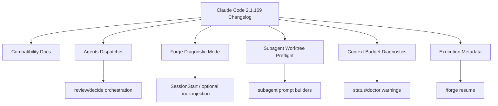

# Design — Claude Code 2.1.169 Inspired Hardening

## Overview

This design turns six Claude Code 2.1.169 changelog lessons into Forge-local infrastructure improvements. The goal is not parity with Claude Code internals; the goal is to make Forge's own orchestration safer, more observable, and easier to troubleshoot.

The change is split into six slices:

1. `claude agents` dispatch timeout and state-aware JSON parsing.
2. `FORGE_DIAGNOSTIC_MODE` for minimal Forge troubleshooting.
3. Compatibility docs for Claude Code 2.1.169.
4. Subagent worktree edit preflight prompt.
5. Model-window-aware context budget helper.
6. Execution metadata persistence for status/resume.

## Architecture



## Component Design

### 1. Agent Dispatch Hardening

Current entrypoint: `src/forge/agents-dispatcher.ts`.

Extend public types:

```ts
export type AgentState =
  | "completed"
  | "failed"
  | "blocked"
  | "running"
  | "just-dispatched"
  | "unknown";

export interface DispatchOptions {
  agentType: string;
  prompt: string;
  workdir: string;
  effort?: "low" | "medium" | "high" | "xhigh";
  timeoutMs?: number;
  includeAll?: boolean;
}

export interface DispatchResult {
  agent: string;
  status: "completed" | "failed";
  id?: string;
  state?: AgentState;
  findings?: unknown[];
  duration_ms?: number;
  diagnostic?: string;
}
```

Behavior:

- `buildAgentArgs()` appends `--all` when `includeAll === true`.
- `dispatch()` passes `timeout` and `killSignal` to `execFile`.
- Timeout maps to `{ status: "failed", state: "unknown", diagnostic: "timeout after <ms>ms" }`.
- JSON `status === "completed"` is only accepted when `state` is absent or `state === "completed"`.
- Non-completed `state` values return failed status with a diagnostic, preserving inline fallback behavior.

Testing:

- Mock `execFile` or dependency-inject an executor.
- Table-drive state parsing for `completed`, `blocked`, `running`, `just-dispatched`.
- Assert old JSON shape still works.

### 2. Forge Diagnostic Mode

Entry point: `scripts/inject-evolved-rules.mjs`.

Add a first check after imports and before file reads:

```js
if (process.env.FORGE_DIAGNOSTIC_MODE === "1") {
  process.exit(0);
}
```

Optional second phase:

- Add `diagnosticMode` to `forge-doctor` output.
- Document the mode in `docs/claude-code-compatibility.md`.

Design decision:

- This is not named `FORGE_SAFE_MODE` because it does not and cannot disable the Forge plugin itself while still allowing `/forge` to run.
- The mode disables optional injection, not hard gates.

### 3. Claude Code 2.1.169 Compatibility Docs

Entry point: `docs/claude-code-compatibility.md`.

Add a section:

- Version: `v2.1.169`
- Changelog date: `2026-06-08`
- Forge action table:
  - `--safe-mode`: document operator troubleshooting; Forge adds diagnostic mode.
  - `/cd`: document operator guidance; no Forge implementation.
  - `disableBundledSkills`: document compatibility note; no Forge implementation.
  - `claude agents --json --all`, `id`, `state`: implement in dispatcher.
  - Context-window-scaled CLAUDE.md warning: implement context budget helper/docs.
  - Background sessions preserve flags: persist Forge metadata.

### 4. Subagent Worktree Edit Preflight

Likely entry points:

- `src/review/subagent.ts`
- `src/forge/agents-dispatcher.ts`
- build/decide prompt builders if present in skill instructions.

Define a small reusable preflight block:

```ts
export const WORKTREE_EDIT_PREFLIGHT = `Before editing files, verify you are operating in the intended worktree. If Forge policy reports shared-checkout edits are blocked, enter or request the assigned worktree before attempting edits.`;
```

Prompt placement:

- Prepend before task-specific instructions when an agent may edit.
- Keep read-only review prompts unchanged unless the caller opts in.

Avoid:

- Do not claim Claude Code will always provide `EnterWorktree`.
- Do not mention unverified platform internals.

### 5. Model-Window-Aware Context Budget

Entry point: `src/context-budget.ts`.

Add pure helper:

```ts
export interface ContextWindowBudgetInput {
  configuredBudgetTokens?: number;
  contextWindowTokens?: number;
  warningRatio?: number;
  compactRatio?: number;
  criticalRatio?: number;
}

export interface ContextBudgetThresholds {
  warningTokens: number;
  compactTokens: number;
  criticalTokens: number;
  source: "context-window" | "configured-budget";
}

export function computeContextBudgetThresholds(input: ContextWindowBudgetInput): ContextBudgetThresholds;
```

Defaults:

- `warningRatio = 0.3`
- `compactRatio = 0.5`
- `criticalRatio = 0.7`
- If `contextWindowTokens` is known, thresholds derive from it.
- Otherwise thresholds derive from `configuredBudgetTokens ?? 100000`.

Documentation:

- Token estimates are conservative.
- Forge must not claim it can read live Claude context percentage.

### 6. Execution Environment Metadata

Likely entry points:

- status parsing/extension modules such as `src/status-file-ext.ts` and `src/resume.ts`
- `.tinkerman/status.md` frontmatter or a nested metadata block.

Suggested data shape:

```ts
export interface ExecutionMetadata {
  claude_version?: string;
  dispatch_mode?: "inline" | "agents" | "auto";
  diagnostic_mode?: boolean;
  tier?: "light" | "standard" | "full";
  branch?: string;
  forge_flags?: string[];
  recorded_at?: string;
}
```

Persistence policy:

- Allowlist only.
- Never write raw environment dumps.
- Never persist keys containing `KEY`, `TOKEN`, `SECRET`, `PASSWORD`, or `AUTH`.
- Missing metadata is valid for old status files.

Resume integration:

- `generateResumeOutput()` may include a compact metadata suffix when present.
- Metadata is diagnostic context only; it does not override `.tinkerman/config.md`.

## Rollout Plan

1. Start with tests for each pure unit or script behavior.
2. Implement R1 and R2 first because they reduce troubleshooting risk.
3. Update docs early to record exact platform assumptions.
4. Implement R4-R6 as isolated, backward-compatible helpers.
5. Run focused tests after each slice, then `npm run check`.
6. Run `npm run dist:resync` if any `src/**/*.ts` file changes.

## Risk Analysis

| Risk | Mitigation |
|------|------------|
| New dispatcher fields break existing callers | Keep `status` and `findings` compatible; add optional fields only |
| Diagnostic mode accidentally disables hard gates | Limit it to optional injection scripts first |
| Prompt preflight bloats subagent prompt | Use a single short constant and test truncation behavior |
| Context window detection becomes speculative | Accept only configured/inferred values; do not read live context percentage |
| Metadata leaks secrets | Allowlist fields and test secret exclusion |
| Docs claim unsupported platform behavior | Phrase operator-only features separately from implemented Forge features |

