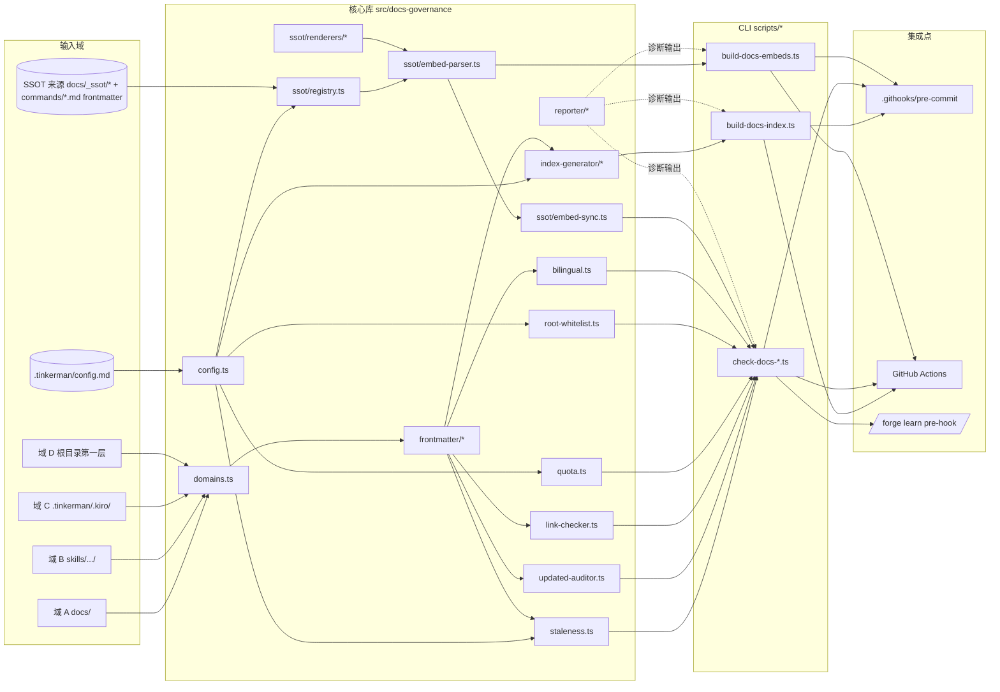
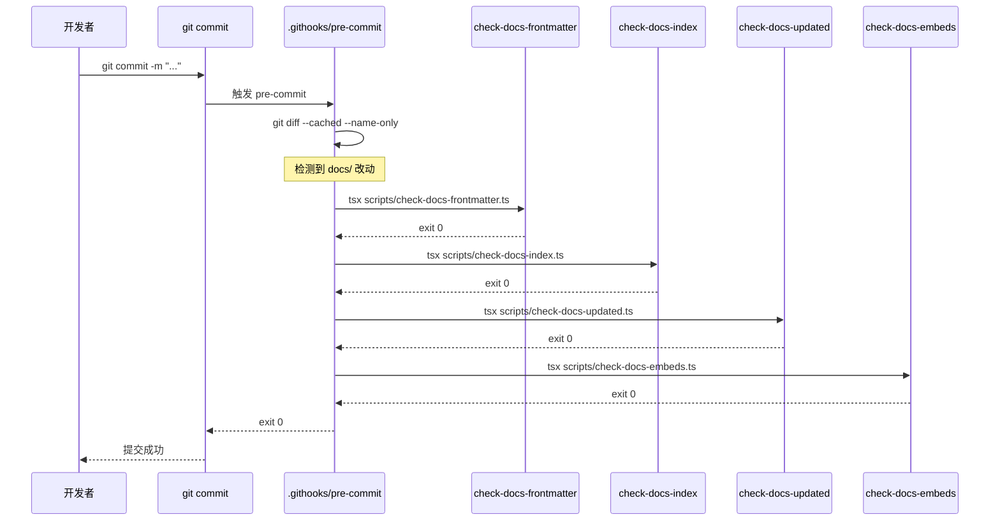
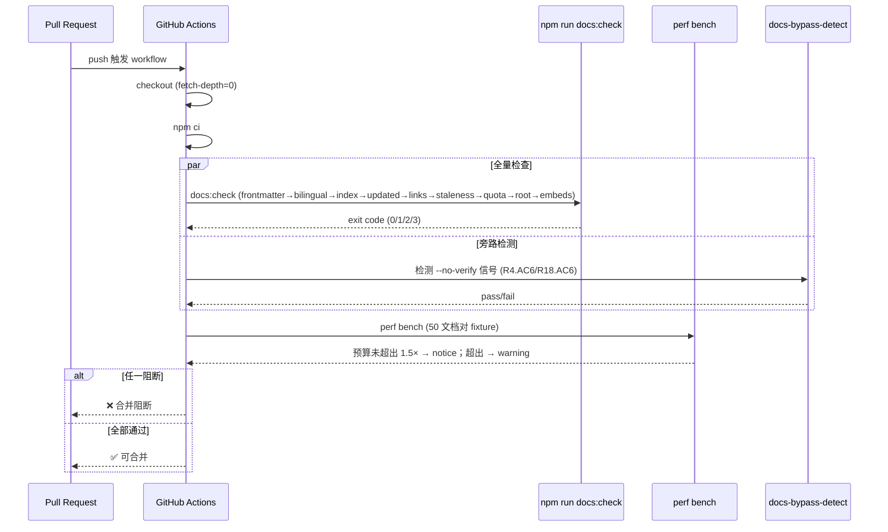

# Design Document

> 中文设计：文档治理体系（docs-governance-system）
> 对应需求：`./requirements.md`（R1–R20，共 20 条 EARS）

## Overview

> 概述

本设计要解决的问题：Forge 仓库 ~997 篇 Markdown 文档当前处于「四不像」状态——总目录手工维护失修、根目录残留一次性产物、`updated` 字段无人对账、链接逐渐死亡、命令数量等关键事实在多份副本之间漂移。设计边界：仅治理仓库内 `.md` 文档，不涉及网站构建、不引入文档站工具（Astro / VitePress / Docusaurus 等一律不引入）；所有产物以纯文本与 Git 提交为唯一交付。

本特性以五层机制实现治理：

| 层 | 机制 | 主要模块 | 对应需求 |
|---|---|---|---|
| L1 | 分类隔离（四域 + 排除前缀） | `domains.ts` | R1 |
| L2 | Frontmatter Schema 与解析—序列化 | `frontmatter/*` | R2、R11 |
| L3 | INDEX 自动生成 + 同步闸门 + 失修三件套 | `index-generator/*`、`staleness.ts`、`updated-auditor.ts`、`link-checker.ts` | R3、R4、R5、R6、R7、R12 |
| L4 | 数量纪律（quota + 根级白名单） + `/forge learn` 集成 | `quota.ts`、`root-whitelist.ts`、`bilingual.ts` | R8、R9、R10 |
| L5 | SSOT 注册表 + 段落级嵌入指令 + 嵌入同步闸门 | `ssot/*` | R16、R17、R18 |

横切关注：统一错误信号（R13）、性能预算（R14、R20）、迁移阶段（R15、R19）。

## Architecture

> 总体架构



模块依赖方向（高内聚低耦合）：

- 自下而上的层次：`config.ts` → `domains.ts` / `frontmatter/*` → 其他业务模块（`index-generator`、`staleness`、`link-checker`、`quota`、`root-whitelist`、`bilingual`、`updated-auditor`、`ssot/*`） → `reporter/*` → `cli/*`。
- 业务模块之间不互相依赖，只通过共同的 `Doc` / `DocPair` / `Frontmatter` 数据模型协作。
- `ssot/*` 内部分层：`registry` → `embed-parser` → `renderers/*` ← `renderer-registry` → `embed-sync`，其中 `renderers/*` 是纯函数，不依赖文件系统。
- CLI 仅做"参数解析 → 调库 → 调 reporter → 退出码"的薄壳，禁止业务逻辑下沉到脚本。

对应需求：R1（域）、R2（frontmatter）、R3/R4（INDEX）、R5/R6/R7（失修）、R8/R9（数量）、R12（双语）、R16–R18（SSOT）、R13（错误信号）。

## Components and Interfaces

> 模块拆分

```text
src/docs-governance/
  ├─ domains.ts          # 域归属与排除前缀（R1）
  ├─ frontmatter/
  │   ├─ schema.ts       # Zod schema + 字段约束（R2、R11）
  │   ├─ parser.ts       # YAML → 结构化对象（R2.6）
  │   └─ serializer.ts   # 结构化对象 → YAML（R2.7、行尾约定）
  ├─ index-generator/
  │   ├─ generator.ts    # 主生成器（R3）
  │   └─ format.ts       # Markdown 输出模板（R3.5、R11.4、R12.4）
  ├─ staleness.ts        # 陈旧度等级与报告（R5）
  ├─ updated-auditor.ts  # updated 字段对账（R6）
  ├─ link-checker.ts     # 相对链接 + 锚点体检（R7）
  ├─ quota.ts            # docs 数量纪律（R8）
  ├─ root-whitelist.ts   # 根级白名单（R9）
  ├─ bilingual.ts        # 双语镜像配对（R12）
  ├─ ssot/
  │   ├─ registry.ts     # SSOT 注册表加载与校验（R16）
  │   ├─ embed-parser.ts # 嵌入指令扫描与替换（R17.1、R17.4、R17.7）
  │   ├─ renderers/
  │   │   ├─ commands-table.ts   # 命令速查表（R16.AC2）
  │   │   ├─ routing-table.ts    # 三维路由表
  │   │   ├─ security-tiers.ts   # 安全分级表
  │   │   └─ json-list.ts        # 通用 JSON 数组列表
  │   ├─ renderer-registry.ts    # register/resolve（R17.6）
  │   └─ embed-sync.ts   # 嵌入同步闸门（R18）
  ├─ reporter/
  │   ├─ diagnostic.ts   # DiagnosticRecord 类型与渲染（R13.1、R13.4、R13.5）
  │   └─ exit-code.ts    # severity → 退出码映射 + 异常 3 优先级（R13.2、R13.6）
  ├─ config.ts           # loadConfigWithDefaults，所有配置回退集中地（R5.8、R8.1、R9.7、R9.8、R16.6）
  └─ cli/
      ├─ check-docs-frontmatter.ts   # R2 入口
      ├─ build-docs-index.ts         # R3 入口（同步生成中英双索引）
      ├─ check-docs-index.ts         # R4 入口
      ├─ check-docs-staleness.ts     # R5 入口
      ├─ check-docs-updated.ts       # R6 入口（含 --fix）
      ├─ check-docs-links.ts         # R7 入口
      ├─ check-docs-quota.ts         # R8 入口（含 --allow-grow）
      ├─ check-docs-root-whitelist.ts # R9 入口
      ├─ check-docs-bilingual.ts     # R12 入口
      ├─ check-docs-embeds.ts        # R18 入口（同步闸门）
      └─ build-docs-embeds.ts        # R17 入口（重渲染并写回）
```

每个模块的职责一句话说明：

- `domains.ts`：把任意 `.md` 路径映射到 `Domain` 枚举之一，处理排除前缀与多前缀冲突的优先级，提供 `classify(path) → Domain | "EXCLUDED" | "UNCLASSIFIED"`（对应 R1.1–R1.7）。
- `frontmatter/schema.ts`：定义 `Frontmatter` 的 Zod schema、`category`/`audience` 枚举、字段长度与日期范围约束（R2、R11）。
- `frontmatter/parser.ts`：把 frontmatter YAML 子集解析为结构化对象，校验只允许 schema 内的字段（R2.5、R2.6）。
- `frontmatter/serializer.ts`：把结构化对象写回 YAML，保证 LF 行尾、关闭行后单 LF 加空行（R2.7、R2.8、R2.9）。
- `index-generator/generator.ts`：纯函数，输入归一化的 `DocPair[]`，输出 INDEX 字符串；不读 git、不读 Date（R3.1–R3.10）。
- `index-generator/format.ts`：分组、排序、条目模板与"由脚本生成"提示行（R3.5、R11.4、R12.4）。
- `staleness.ts`：用 UTC 当日基准计算天数差，分级输出报告与 `.tinkerman/staleness-report.json`（R5）。
- `updated-auditor.ts`：调用 `git log --follow -1 --format=%cs` 获取最近正文修改日期，识别"仅 frontmatter 变更"的提交（R6）。
- `link-checker.ts`：扫描代码块外的 Markdown 链接，校验文件存在与 GFM 锚点（R7）。
- `quota.ts`：扫描 `docs/` 计数，按文档对合并，校验 `docs.max_count` 与 `--allow-grow` 的 ADR 配套（R8）。
- `root-whitelist.ts`：仅扫描根目录第一层 `.md`，校验白名单与 `LICENSE` / `LICENSE.md` 兼容（R9）。
- `bilingual.ts`：识别 `<slug>.md` 与 `<slug>.en.md` 配对，校验 `mirror_of`、配对状态、字段一致性（R12）。
- `ssot/registry.ts`：从 `.tinkerman/config.md` 加载 `docs.ssot_sources`，校验保留前缀、来源存在、渲染器已注册（R16）。
- `ssot/embed-parser.ts`：扫描 `<!-- ssot:begin ... -->` / `<!-- ssot:end ... -->` 配对，识别 `#[[file:...]]` 指令；返回 `EmbedDirective[]`（R17.1、R17.4、R17.7）。
- `ssot/renderers/*`：4 个内置纯函数渲染器，相同输入产生相同输出（R17.3）。
- `ssot/renderer-registry.ts`：维护 `Map<string, RendererFn>`，提供 `register` / `resolve`（R17.6）。
- `ssot/embed-sync.ts`：在临时目录重渲染并逐字节比对，复用 `embed-parser` 与 reporter（R18）。
- `reporter/diagnostic.ts`：定义 `DiagnosticRecord`、人类可读与 NDJSON 输出、GitHub Actions 注解（R13.1、R13.3、R13.4、R13.5）。
- `reporter/exit-code.ts`：severity → 退出码映射，并在主入口包 try/catch 实现退出码 3 的优先级（R13.2、R13.6）。
- `config.ts`：唯一的配置加载入口 `loadConfigWithDefaults()`，所有字段缺失/非法时回落到默认值并发出 warning 诊断（R5.8、R8.1、R9.7、R9.8、R16.6）。

## Data Models

> 数据模型

仅给出类型签名（不实现）。位置：`src/docs-governance/types.ts`（少量基础类型）与各模块内部类型导出。

```typescript
// ─────────────────────────────────────────────────────────────
// 路径与域
// ─────────────────────────────────────────────────────────────
declare const DocPathBrand: unique symbol;
export type DocPath = string & { readonly [DocPathBrand]: void }; // 仓库根相对，正斜杠

export type Domain = "A" | "B" | "C" | "D" | "EXCLUDED";

// ─────────────────────────────────────────────────────────────
// Frontmatter
// ─────────────────────────────────────────────────────────────
export type Category =
  | "getting-started"
  | "daily-use"
  | "advanced"
  | "troubleshooting"
  | "contributing"
  | "reference"
  | "audits";

export type Audience =
  | "new-user"
  | "daily-developer"
  | "advanced-user"
  | "contributor"
  | "maintainer"
  | "auditor";

export interface Frontmatter {
  readonly title: string;          // 1–200, 允许 CJK
  readonly category: Category;
  readonly audience: readonly Audience[]; // 长度 1–6，元素去重
  readonly updated: string;        // YYYY-MM-DD，UTC，2026-04-28 ≤ x ≤ today
  readonly owner: string;          // 1–100
  readonly mirror_of?: string;     // 仅 *.en.md，相对路径，不以 / 开头，不含 ..
}

// ─────────────────────────────────────────────────────────────
// 文档与配对
// ─────────────────────────────────────────────────────────────
export interface Doc {
  readonly path: DocPath;
  readonly domain: Domain;
  readonly frontmatter: Frontmatter;
  readonly bodyHash: string;       // 用于 R6 区分 frontmatter-only 改动
}

export type PairState =
  | "paired"
  | "cn-only"
  | "en-only"
  | "orphan_mirror";               // *.en.md 存在但缺中文原文（R12.AC6）

export interface DocPair {
  readonly slug: string;           // 不含 .md / .en.md
  readonly directory: DocPath;
  readonly cn?: Doc;               // <slug>.md
  readonly en?: Doc;               // <slug>.en.md
  readonly state: PairState;
}

// ─────────────────────────────────────────────────────────────
// 诊断与退出码
// ─────────────────────────────────────────────────────────────
export type Severity = "critical" | "error" | "warning" | "notice" | "info";

export interface DiagnosticRecord {
  readonly script: string;         // 例：check-docs-frontmatter
  readonly severity: Severity;
  readonly file: DocPath;
  readonly message: string;        // ≤ 500，超出附 "…[truncated]"
  readonly line?: number;          // 1-based
  readonly column?: number;        // 1-based
  readonly code?: string;          // 错误代码，例：UNCLASSIFIED_DOC
  readonly extra?: Readonly<Record<string, string | number | boolean>>;
}

export const ExitCode = {
  OK: 0,
  ERROR: 1,
  CRITICAL: 2,
  INTERNAL: 3,
} as const;
export type ExitCode = (typeof ExitCode)[keyof typeof ExitCode];

// ─────────────────────────────────────────────────────────────
// SSOT
// ─────────────────────────────────────────────────────────────
export interface SsotRegistryEntry {
  readonly topic: string;          // 1–50, 小写连字符，不得以保留前缀开头
  readonly source: string;         // 仓库根相对路径或 glob
  readonly renderer: string;       // 必须存在于 RendererRegistry
}

export interface EmbedDirective {
  readonly file: DocPath;
  readonly topic: string;
  readonly render: string;         // 渲染器名称
  readonly args: Readonly<Record<string, string>>;
  readonly beginLine: number;      // 1-based, 含起始标记行
  readonly endLine: number;        // 1-based, 含结束标记行
  readonly innerContent: string;   // [beginLine+1, endLine-1] 之间的字面文本
  readonly kind: "ssot-block" | "file-embed"; // file-embed 对应 #[[file:...]]
}

export interface RenderInput {
  readonly topic: string;
  readonly renderer: string;
  readonly args: Readonly<Record<string, string>>;
  readonly source: unknown;        // 渲染器内部断言其 schema
}

export interface RenderResult {
  readonly markdown: string;       // 不含起止标记
  readonly diagnostics: readonly DiagnosticRecord[];
}

export type RendererFn = (input: RenderInput) => RenderResult;

export interface RendererRegistry {
  register(name: string, fn: RendererFn): void;
  resolve(name: string): RendererFn | undefined;
  list(): readonly string[];
}

// ─────────────────────────────────────────────────────────────
// 配置
// ─────────────────────────────────────────────────────────────
export interface Config {
  readonly docs: {
    readonly max_count: number;                  // R8.AC1，默认 30
    readonly root_whitelist: readonly string[];  // R9.AC1，默认 8 项
    readonly ssot_sources: readonly SsotRegistryEntry[]; // R16.AC1
    readonly grace_period_until?: string;        // R15.AC4 / R19.AC4，YYYY-MM-DD
  };
  readonly staleness: {
    readonly warning_days: number;               // R5.AC8，默认 90
    readonly critical_days: number;              // R5.AC8，默认 180
    readonly exempt_paths: readonly string[];    // R5.AC8，默认 LICENSE.md / ROADMAP.md
    readonly warning_log_cap: number;            // R5.AC9，默认 50
  };
  readonly diagnosticsFromConfigLoad: readonly DiagnosticRecord[]; // 字段缺失/非法时的 warning 列表
}
```

## Key Algorithms

> 关键算法

### A1 域归属优先级匹配（R1）

伪代码：

```
function classify(path):
  for prefix in EXCLUDED_PREFIXES:               # R1.5
    if path startsWith prefix: return "EXCLUDED"
  for prefix in DOMAIN_C_PREFIXES (.tinkerman/, .kiro/):  # R1.3 优先级最高
    if path startsWith prefix: return "C"
  for prefix in DOMAIN_B_PREFIXES (skills/, ...):
    if path startsWith prefix: return "B"
  for prefix in DOMAIN_A_PREFIXES (docs/):
    if path startsWith prefix: return "A"
  if isRootFirstLevelMd(path):                    # R1.7：仅根目录第一层
    return "D"
  return "UNCLASSIFIED"                           # R1.4 / R1.6 触发阻断
```

域 D 仅识别根目录第一层的实现要点：判定 `path.indexOf("/") === -1 && path.endsWith(".md")`。

### A2 INDEX 生成的确定性（R3）

```
function buildIndex(domain_docs):
  pairs   = pairBilingual(domain_docs)            # 同 slug 合并 *.md/*.en.md
  groups  = groupBy(pairs, p => p.cn?.frontmatter.category ?? p.en?.frontmatter.category)
  for cat in CATEGORY_ORDER:                      # R11.4 固定枚举顺序
    if groups[cat] is empty: skip                  # R11.4 空组省略
    sorted = stableSort(groups[cat], by [
      p => unicodeCodePoints(p.cn?.frontmatter.title ?? p.en?.frontmatter.title), # R3.2 主键
      p => p.cn?.path ?? p.en?.path,                                              # R3.2 次键
    ])
    emit category heading + entries
  emit "由 scripts/build-docs-index.ts 生成；请勿手动编辑"  # R3.5
  ensure trailing single LF                                  # R3.5
  return text
```

外部观感的确定性由两点保证：① 输入归一化（去重 + 稳定多键排序）；② 输出模板里没有任何不稳定字段（无生成时间戳、无 git 信息、无环境变量），对应 R3.6、R3.7、R3.8。

### A3 frontmatter 解析与序列化（R2、R11）

允许的 YAML 子集：单层映射，值类型限于字符串、字符串数组、整数。禁止：嵌套映射、锚点 `&`、复合标量、流式 `[]` 数组（数组只允许块级 `- item`）。

序列化器输出格式约定：
- 行尾 LF；
- 字段顺序固定为 `title → category → audience → updated → owner → mirror_of?`；
- 数组用块式 `- value`；
- 关闭行 `---` 后恰好一个 LF + 一个空行 + 文档正文（R2.7）；
- 不追加任何尾部空行。

R2.8（对象 → YAML → 对象 等价）由序列化器把对象的字段集合 1:1 写出 + 解析器拒绝未知字段共同保证。
R2.9（YAML → 对象 → YAML → 对象 等价）由"序列化器输出唯一规范形态"+"再次解析必然回到同一对象"共同保证；不规范的合法输入（如多余空格、引号风格差异）允许首次解析后被规范化。

### A4 嵌入指令解析与替换（R17）

```
function parseEmbeds(file):
  lines = file.text.split("\n")
  stack = []
  results = []
  for i, line in enumerate(lines, start=1):
    if matches BEGIN_RE(line):
      stack.push({begin: i, topic, render, args})
    else if matches END_RE(line):
      top = stack.pop()
      if top is None or top.topic != endTopic:
        emit diagnostic(MISMATCHED_EMBED, line=i)   # R17.4
      else:
        results.push(EmbedDirective{
          beginLine: top.begin,
          endLine: i,
          innerContent: lines[top.begin..i-2].join("\n"),
          ...
        })
    else if matches FILE_EMBED_RE(line):           # #[[file:relative]]
      results.push(EmbedDirective{kind: "file-embed", beginLine: i, endLine: i, ...})
  if stack non-empty: emit diagnostic(UNCLOSED_EMBED)  # R17.4
  return results

function render(file, directives, registry, ssot):
  newLines = lines.copy()
  for d in directives sorted by beginLine descending:   # 倒序避免行号偏移
    rendered = registry.resolve(d.render)({topic, args, source: ssot[d.topic]})
    if d.kind == "ssot-block":
      replace newLines[d.beginLine .. d.endLine] with [
        beginMarker(d), rendered.markdown.split("\n"), endMarker(d)
      ]
    else: # file-embed
      replace newLines[d.beginLine] with readFile(d.args.file).split("\n")
  return newLines.join("\n")
```

外部字节序列不变（R17.9）由「只 splice 起止标记之间的内容」保证；对 `ssot-block` 而言，起始行与结束行字面被保留。
渲染幂等性（R17.8）：渲染器纯函数 + 起止标记保留 + 行尾约定 ⇒ 第二次渲染输入与第一次渲染输出在标记之间的内容一致 ⇒ 输出字节相同。

### A5 GFM 锚点生成（R7.3）

```
function gfmAnchor(headingText):
  s = headingText
  s = stripCodeSpans(s)                  # 去除反引号包裹的内联代码反引号本身
  out = []
  for ch in s:
    if isAsciiAlpha(ch):  out.push(toLower(ch))
    elif isAsciiDigit(ch): out.push(ch)
    elif ch == ' ' or ch == '\t': out.push('-')
    elif ch == '-' or ch == '_': out.push(ch)
    elif isCJK(ch):       out.push(ch)   # 保留原样
    else:                 skip            # 删除其它 ASCII 标点
  anchor = collapseRepeatedDash(out.join(""))
  return anchor

function dedupAnchorsInDoc(headings):
  seen = Map<string, int>()
  for h in headings (按出现顺序):
    base = gfmAnchor(h.text)
    n = seen.get(base, 0)
    h.anchor = n == 0 ? base : `${base}-${n}`
    seen.set(base, n + 1)
```

匹配规则与 R7.3 一致：ASCII 字母小写、空格→`-`、删除连字符以外的 ASCII 标点、保留 CJK；同名标题按出现顺序追加 `-1`、`-2`…

### A6 git 历史对账（R6）

```
function lastBodyChangeDate(path):
  # 取最近一次提交日期（UTC ISO 短日期），--follow 处理重命名
  date = sh("git log --follow -1 --format=%cs -- " + path)
  if date is empty: return None       # R6.AC5：新文件
  # 跳过仅由合并/rebase/cherry-pick 产生且不含正文行 diff 的提交
  while currentCommitIsMergeOrRebaseWithoutBodyDiff(path):
    date = previousCommitDate(path)
  return date

function currentDiffTouchesBody(path):
  # 用 git diff --cached -U0 -- path 区分 frontmatter 与正文行
  diff = sh("git diff --cached -U0 -- " + path)
  hunks = parseHunks(diff)
  fmRange = findFrontmatterRange(stagedFile(path))  # 第 1 行 --- 到第二个独占 ---
  for hunk in hunks:
    if hunkLinesIntersect(hunk, fmRange): treat as frontmatter-only
    else: return true                  # 正文行有增/删/改
  return false
```

跳过纯合并/rebase 提交的判定：在 `git log --format=%H %cs` 基础上额外读 `%P`（父提交）；当 parent 数 ≥ 2 且 `git show --first-parent --pretty= --name-only -- <path>` 列表为空时即认为该提交不含路径上的实际变更。R6.AC4 的"仅 frontmatter 改动"由 `currentDiffTouchesBody` 的 hunk 与 `fmRange` 相交判定。

### A7 锁定确定性的禁忌项

`Index_Generator` 与所有内置 `RendererFn` 必须满足以下"禁忌项"约束（编译期通过分包 + lint 规则强制）：

- 禁止 `import "child_process"`、`import "node:child_process"`（即不得调用 git）；
- 禁止 `Date.now()` / `new Date()` / `process.env`；
- 禁止读除入参以外的文件系统（生成器与渲染器都是纯函数）；
- 禁止 `Math.random()`；
- CI 加 Biome 自定义规则或 `eslint-no-restricted-imports` 等价检查。

对应 R3.8、R17.3。

### A8 LICENSE 与 LICENSE.md 兼容判定（R9.AC2）

```
function checkLicense():
  hasMd   = exists("LICENSE.md")
  hasBare = existsAtRootFirstLevel("LICENSE")    # 无后缀
  if hasMd and hasBare:
    emit critical("LICENSE_DUAL_PRESENCE")        # 阻断
  elif hasMd or hasBare:
    treat as whitelist hit
  else:
    emit error("LICENSE_MISSING")
```

`LICENSE` 是无后缀文件，因此不参与"白名单 .md 文件计数"；R9.AC2 仅借助"LICENSE 与 LICENSE.md 互为兼容"放行白名单校验。

## CLI Entry Points

> CLI 与 npm script

所有 `.ts` 脚本通过 `tsx` 执行，与项目现有 TypeScript 偏好一致；shell 仅用于 pre-commit 钩子与 CI workflow 包装。脚本路径相对仓库根。

| 脚本路径 | npm script | 主命令 | 关键参数 | 退出码 |
|---|---|---|---|---|
| `scripts/build-docs-index.ts` | `npm run docs:index` | `tsx scripts/build-docs-index.ts` | （无） | 0 / 1 / 2 / 3 |
| `scripts/check-docs-index.ts` | `npm run docs:check:index` | `tsx scripts/check-docs-index.ts` | `--json` | 0 / 1 / 2 / 3 |
| `scripts/check-docs-frontmatter.ts` | `npm run docs:check:frontmatter` | `tsx scripts/check-docs-frontmatter.ts` | `--json` | 0 / 1 / 2 / 3 |
| `scripts/check-docs-staleness.ts` | `npm run docs:check:staleness` | `tsx scripts/check-docs-staleness.ts` | `--json`、`--ci` | 0 / 1 / 2 / 3 |
| `scripts/check-docs-updated.ts` | `npm run docs:check:updated` | `tsx scripts/check-docs-updated.ts` | `--fix`、`--json` | 0 / 1 / 2 / 3 |
| `scripts/check-docs-links.ts` | `npm run docs:check:links` | `tsx scripts/check-docs-links.ts` | `--json` | 0 / 1 / 2 / 3 |
| `scripts/check-docs-quota.ts` | `npm run docs:check:quota` | `tsx scripts/check-docs-quota.ts` | `--allow-grow=<adr-path>`、`--json` | 0 / 1 / 2 / 3 |
| `scripts/check-docs-root-whitelist.ts` | `npm run docs:check:root` | `tsx scripts/check-docs-root-whitelist.ts` | `--json` | 0 / 1 / 2 / 3 |
| `scripts/check-docs-bilingual.ts` | `npm run docs:check:bilingual` | `tsx scripts/check-docs-bilingual.ts` | `--json` | 0 / 1 / 2 / 3 |
| `scripts/check-docs-embeds.ts` | `npm run docs:check:embeds` | `tsx scripts/check-docs-embeds.ts` | `--json` | 0 / 1 / 2 / 3 |
| `scripts/build-docs-embeds.ts` | `npm run docs:embeds` | `tsx scripts/build-docs-embeds.ts` | `--dry-run` | 0 / 1 / 2 / 3 |
| `scripts/migrate-docs-frontmatter.ts` | `npm run docs:migrate:frontmatter` | `tsx scripts/migrate-docs-frontmatter.ts` | `--apply` | 0 / 1 / 3 |
| `scripts/scan-literal-mismatches.ts` | `npm run docs:scan:literals` | `tsx scripts/scan-literal-mismatches.ts` | `--json` | 0 / 1 / 3 |

聚合 npm script：
- `npm run docs:check`：依次串行执行 `frontmatter → bilingual → index → updated → links → staleness → quota → root → embeds`，任一失败则中止。挂在现有 `npm run check` 的"文档检查"阶段。
- `npm run docs:build`：`docs:embeds` + `docs:index`，用于本地补全产物。

每个脚本的统一 `--help` 输出（满足项目宪法 §2.8 Scripts as Black Box 铁律）由 `src/docs-governance/cli/_help.ts` 提供模板。所有脚本登记到 `scripts/.help-exempt` 之外，即默认强制 `--help`。

对应需求：R3、R4、R5、R6、R7、R8、R9、R12、R13、R17、R18、R19。

## Hook Design

> pre-commit 钩子设计

路径：`.githooks/pre-commit`。安装方式见 Integration Points 节。

决策树（依据 `git diff --cached --name-only`）：

```
let staged = git diff --cached --name-only --diff-filter=ACMR
let touchesDocs        = staged matches /^docs\//
let touchesConfig      = staged contains ".tinkerman/config.md"
let touchesSsotSource  = staged matches any of registry.sources()
let touchesRootMd      = staged matches /^[^/]+\.md$/         # 仅根目录第一层 .md
let touchesEnRules     = staged matches /\.(ts|tsx|js|mjs|json)$/  # 例：仅源代码

if not (touchesDocs or touchesConfig or touchesSsotSource or touchesRootMd):
  exit 0   # 轻量路径 ≤ 1 秒，对应 R14.AC6 / R20.AC5

run check-docs-frontmatter --staged
run check-docs-bilingual   --staged
run check-docs-index       --staged
run check-docs-updated     --staged
run check-docs-embeds      --staged
if touchesRootMd:
  run check-docs-root-whitelist
if touchesConfig:
  # 配置变更时跑全量
  run check-docs-staleness
  run check-docs-links
  run check-docs-quota
exit highest_severity_exit_code
```

要点：
- 钩子用 POSIX shell（`#!/usr/bin/env bash`），只调用 `npm run` 与 `tsx`；不内联业务逻辑。
- 失败时统一打印 `Run \`npm run docs:build\` to regenerate, then re-stage.`。
- 性能：轻量路径（无文档变更）必须 ≤ 1 秒（R14.AC6、R20.AC5）；这通过提前 return + 不加载 Node 重模块实现。
- 用户可通过 `--no-verify` 绕过本地钩子，但 CI 会按 R4.AC6 / R18.AC6 检测旁路并阻断合并。

对应需求：R4、R6、R14、R18、R20。

## Configuration Schema

> 配置 schema

`.tinkerman/config.md` frontmatter 完整示例：

```yaml
---
docs:
  max_count: 30
  root_whitelist:
    - README.md
    - CHANGELOG.md
    - SECURITY.md
    - CONTRIBUTING.md
    - ROADMAP.md
    - AGENTS.md
    - CLAUDE.md
    - LICENSE.md
  ssot_sources:
    - topic: commands
      source: "commands/*.md"
      renderer: commands-table
    - topic: routing
      source: "docs/_ssot/routing.json"
      renderer: routing-table
    - topic: security-tiers
      source: "docs/_ssot/security-tiers.json"
      renderer: security-tiers
    - topic: gate-skills
      source: "docs/_ssot/gate-skills.json"
      renderer: commands-table
  grace_period_until: "2026-06-15"
staleness:
  warning_days: 90
  critical_days: 180
  exempt_paths:
    - LICENSE.md
    - ROADMAP.md
  warning_log_cap: 50
---
```

`loadConfigWithDefaults` 接口签名：

```typescript
export function loadConfigWithDefaults(
  configPath?: string                 // 默认 .tinkerman/config.md
): Config;                            // 永不抛出；非法/缺失字段写入 diagnosticsFromConfigLoad
```

回退策略表（每个字段缺失/非法时的默认值与诊断 severity）：

| 字段 | 默认值 | 缺失 severity | 非法 severity | 退出码影响 |
|---|---|---|---|---|
| `docs.max_count` | 30 | warning | warning | 0（R8.AC1） |
| `docs.root_whitelist` | 8 项默认（见示例） | warning | warning | 0（R9.AC8） |
| `docs.ssot_sources` | 4 项默认（见示例） | warning | error | 缺失 0；非法 1（R16.AC4-AC6） |
| `docs.grace_period_until` | undefined | info | warning | 0 |
| `staleness.warning_days` | 90 | warning | warning | 0（R5.AC8） |
| `staleness.critical_days` | 180 | warning | warning | 0（R5.AC8） |
| `staleness.exempt_paths` | `["LICENSE.md","ROADMAP.md"]` | warning | warning | 0（R5.AC8） |
| `staleness.warning_log_cap` | 50 | info | warning | 0（R5.AC9） |

字段「非法」判定：类型不符、范围越界（如 `max_count` 不在 [1, 1000]）、枚举不匹配、glob 解析为空（仅对 `ssot_sources.source`，对应 R16.AC4）。

对应需求：R5.AC8、R5.AC9、R8.AC1、R9.AC1、R9.AC7、R9.AC8、R16.AC1、R16.AC6。

## Error Handling

> 错误信号与诊断输出

### 9.1 DiagnosticRecord 完整字段

见 Data Models 节类型定义。约束：
- `message` 长度 > 500 时按 UTF-16 码元截断到 500 并附 `…[truncated]`（R13.AC1）。
- `script` 取脚本基名（无扩展名），例 `check-docs-frontmatter`。

### 9.2 输出模式

人类可读模式（默认）输出示例：

```
docs/INDEX.md:1:1  error  check-docs-index   INDEX 与生成结果不一致，请运行 npm run docs:index
docs/INDEX.md      error  check-docs-index   3 个条目缺失，1 个排序错误
Summary: 0 critical, 2 error, 0 warning
```

NDJSON 模式（`--json`）：

```
{"script":"check-docs-index","severity":"error","file":"docs/INDEX.md","line":1,"column":1,"code":"INDEX_DRIFT","message":"INDEX 与生成结果不一致，请运行 npm run docs:index"}
{"script":"check-docs-index","severity":"error","file":"docs/INDEX.md","code":"INDEX_DRIFT","message":"3 个条目缺失，1 个排序错误"}
```

### 9.3 GitHub Actions 注解格式映射

| Severity | GitHub 注解前缀 | 是否输出 |
|---|---|---|
| critical | `::error file=<path>::<message>` | 是 |
| error | `::error file=<path>::<message>` | 是 |
| warning | `::warning file=<path>::<message>` | 是 |
| notice | `::notice file=<path>::<message>` | 是 |
| info | （不输出） | 否 |

由 `reporter/diagnostic.ts` 检测 `process.env.CI === "true"` 控制（R13.AC3）。

### 9.4 退出码 3 优先级实现位置

```typescript
// src/docs-governance/cli/_runtime.ts（伪代码）
export async function run(main: () => Promise<DiagnosticRecord[]>): Promise<never> {
  let diagnostics: DiagnosticRecord[] = [];
  try {
    diagnostics = await main();
  } catch (err) {
    process.stderr.write(formatStack(err));
    process.exit(ExitCode.INTERNAL); // 退出码 3 优先级（R13.AC6）
  }
  reportDiagnostics(diagnostics);
  process.exit(severityToExitCode(diagnostics));
}
```

要点：try/catch 必须包住 `main`；任何 I/O 错误、Zod 解析未声明字段以外的解析异常、JSON 写入失败统一走退出码 3。即使 `main` 在抛错前已经 push 了若干 critical 记录，最终退出码也是 3——这正是 R13.AC6 的"优先级"语义。

对应需求：R13。

## Renderers

> 渲染器设计

### 10.1 输入数据形态

| 渲染器 | 入参 source 形态 | 输出 Markdown 模板 |
|---|---|---|
| `commands-table` | `Array<{name: string; tier: string; summary: string}>`（来自 `commands/*.md` frontmatter 聚合，按 name 升序） | 三列表格 `| Command \| Tier \| Summary \|` |
| `routing-table` | `Array<{tier: string; condition: string; sequence: string[]}>` | 三列表格 `| Tier \| Condition \| Command Sequence \|` |
| `security-tiers` | `Array<{level: number; name: string; capabilities: string[]; constraints: string[]}>` | 二级列表，每级一个二级标题 + 两个子项 |
| `json-list` | `Array<{label: string; value: string \| number}>` | 无序列表 `- **${label}**: ${value}` |

输出模板示例（commands-table，伪示例）：

```markdown
| Command | Tier | Summary |
|---|---|---|
| `/forge` | Light/Standard/Full | 三级路由总入口 |
| `/forge build` | Standard | 任务实现，TDD 强制 |
| ... |
```

### 10.2 RendererRegistry 接口

```typescript
const registry: RendererRegistry = createRendererRegistry();
registry.register("commands-table", commandsTableRenderer);
registry.register("routing-table", routingTableRenderer);
registry.register("security-tiers", securityTiersRenderer);
registry.register("json-list", jsonListRenderer);
```

`resolve(name)` 返回 `RendererFn | undefined`；未注册时返回 `undefined`，由 `embed-parser` 在拿到 `EmbedDirective` 后立即报 `error`（R17.AC6）。

### 10.3 确定性保证（R17.AC3）

每个渲染器：
- 是纯函数（无文件 I/O、无 `Date`、无 `process.env`、无 `Math.random`）；
- 输入 `source` 在调用前由 `registry.ts` 完成"输入归一化"（去重 + 稳定排序），渲染器内不再排序；
- 输出 Markdown 行尾固定 LF，最后一行无尾部换行（由 `embed-parser` 在 splice 时统一加换行）。

PBT 用例：见 Testing Strategy 节"渲染幂等性 + 排序稳定性"。

对应需求：R16、R17。

## Integration Points

> 集成点

### 11.1 pre-commit 钩子安装

仓库已有 `.githooks/`，沿用 `git config core.hooksPath .githooks`。安装时机：在 `package.json` 的 `postinstall` 脚本中执行 `tsx scripts/install-hooks.ts`（不存在则创建），脚本仅在以下条件全满足时操作：
- `.git/` 存在；
- `.githooks/pre-commit` 已存在并具可执行权限；
- 当前 `core.hooksPath` 不是 `.githooks`。

满足条件则执行 `git config core.hooksPath .githooks` 并打印一次提示；CI 环境（`CI=true`）跳过。

### 11.2 CI 集成

GitHub Actions workflow `.github/workflows/docs-governance.yml` 步骤：

1. checkout（含完整历史 `fetch-depth: 0`，因 `updated-auditor` 需要 `git log --follow`）；
2. setup Node + 缓存 npm；
3. `npm ci`；
4. `npm run docs:check`（聚合脚本）；
5. 如失败，把 NDJSON 上传为 artifact `docs-governance-diagnostics.ndjson`。

附加 job：`docs-bypass-detect`，按 R4.AC6 / R18.AC6 的可观测信号检测 `--no-verify` 旁路（提交 trailer、缺失的 hook 运行痕迹等），任一命中即阻断合并。

### 11.3 `/forge learn` 集成

在现有 `learn` skill 的 pre-hook 阶段调用：

```
pre_hook:
  - timeout: 10s                    # R10.AC1 时间预算
    run:
      - tsx scripts/check-docs-quota.ts --json
      - tsx scripts/check-docs-staleness.ts --json
      - tsx scripts/check-docs-links.ts --json
    aggregate_to: .tinkerman/knowledge/sessions/<session>.md "文档增量" 小节
```

要点：
- 整体调用时间预算 10 秒，超时则把"文档增量"小节标注为 `needs_attention` 且不阻断 learn 主流程（R10.AC3）。
- 三个检测器全部以零状态码完成且无 critical → 标注 `clean` + UTC ISO 8601 时间戳（R10.AC4）。
- 阶段 5 启用后，新增 `embeds` 字段汇总：嵌入指令总数、独立 topic 数、最近一次同步状态（R19.AC3）。

对应需求：R10、R19。

## Testing Strategy

> 测试策略

三层结构：单元测试 + 集成测试 + 属性测试（PBT）。位置：
- 单元：`test/docs-governance/<module>.test.ts`，每个 src 模块一对一覆盖。
- 集成：`test/docs-governance/cli/<cli>.integration.test.ts`，跑真 `tsx scripts/...`，断言退出码 + stdout/stderr。
- PBT：`test/docs-governance/<module>.pbt.test.ts`，使用 `fast-check`。

### 12.1 PBT 重点

| 属性 | 对应需求 | 关键 arbitrary |
|---|---|---|
| frontmatter 解析—序列化—解析往返 | R2.AC8、R2.AC9 | `fc.record({title, category, audience, updated, owner, mirror_of?})`，title 用 CJK + ASCII 混合 string，updated 用日期 arbitrary 限定 [2026-04-28, today] |
| INDEX 生成幂等性 | R3.AC6 | `fc.array(arbitraryDoc)` → `gen(gen(input)) === gen(input)` |
| INDEX 输入顺序无关性 | R3.AC7 | `fc.permutation(docs)` → `gen(p1) === gen(p2)` |
| 嵌入渲染幂等性 | R17.AC8 | `fc.tuple(arbitraryDoc, arbitrarySsot)` → `render(render(d, s), s) === render(d, s)` |
| 嵌入外部字节保留 | R17.AC9 | 在文档中插入随机外部字节（控制字符以外），断言渲染前后嵌入指令外部 byte 序列严格相等 |
| 退出码与 severity 单调映射 | R13.AC2 | `fc.array(arbitrarySeverity)` → `severityToExitCode` 等于 `max(severity).toExitCode` |

### 12.2 集成测试夹具

位置：`test/docs-governance/__fixtures__/`。每个 fixture 是一个迷你仓库快照（裸目录树 + 最小 `.git/`），通过 `setupFixture(name)` 拷贝到临时目录运行。覆盖：

- `fixture-domain-boundaries/`：覆盖排除前缀、多前缀冲突、根目录第一层 vs 子目录的 R1 边界。
- `fixture-frontmatter-violations/`：覆盖 R2、R11 的所有违规情形（必填缺失、类型错、长度越界、枚举越界、日期越界、未知字段、非法 mirror_of）。
- `fixture-bilingual-states/`：覆盖 R12 的四态 `paired` / `cn-only` / `en-only` / `orphan_mirror`，以及字段一致性违规、mirror_drift。
- `fixture-embed-errors/`：覆盖 R17.AC4–AC7（未闭合、topic 不匹配、未知 topic、未知 renderer、`#[[file:...]]` 越出仓库）。
- `fixture-perf-50pairs/`：50 文档对场景，用于性能测试。

### 12.3 性能测试

位置：`test/docs-governance/perf/*.bench.test.ts`，CI 上单独 job 跑（不阻塞 PR，仅记录 trend）。基线：

| 场景 | 预算 | 对应需求 |
|---|---|---|
| 50 文档对，`build-docs-index` | ≤ 5s | R14.AC1 |
| 50 文档对，`check-docs-links` | ≤ 10s | R14.AC2 |
| pre-commit `index-sync + updated-audit` | ≤ 5s | R14.AC3 |
| 50 文档对 + 100 嵌入实例，`build-docs-embeds` | ≤ 3s | R20.AC1 |
| 50 文档对 + 100 嵌入实例，`check-docs-embeds` | ≤ 5s | R20.AC2 |
| 轻量路径（无 docs/ 改动） | ≤ 1s | R14.AC6、R20.AC5 |

预算超出 1.5× 时仅发 `severity=warning` 诊断不阻断（R14.AC5、R20.AC4）。

### 12.4 TDD 一致性

按项目宪法 §2.1 与 R15.AC7 / R19.AC6，每个模块严格 RED → GREEN → REFACTOR：先写失败测试 → 最小实现通过 → 重构。任务文件中每个实现任务都先挂一个 PBT 或单元测试任务。

对应需求：R2、R3、R5、R6、R7、R12、R13、R14、R15.AC7、R17、R19.AC6、R20。

## Correctness Properties

> 正确性属性

本节把跨模块的正确性不变量集中登记，便于在 PBT 与集成测试中追踪到每一条需求。每条属性都标注属性名、形式化陈述、对应需求与首选验证手段。

### Property 1: 域归属互斥

- 形式化陈述：`∀ path. classify(path) ∈ {EXCLUDED, A, B, C, D, UNCLASSIFIED}` 且任一路径仅落入一个域。

**Validates: Requirements 1.1, 1.3**
- 验证手段：单元 + PBT（任意路径生成器）。

### Property 2: frontmatter 对象往返

- 形式化陈述：`∀ fm: Frontmatter. parse(serialize(fm)) ≡ fm`。

**Validates: Requirements 2.8**
- 验证手段：PBT。

### Property 3: frontmatter 文本往返

- 形式化陈述：`∀ yaml ∈ valid. parse(serialize(parse(yaml))) ≡ parse(yaml)`。

**Validates: Requirements 2.9**
- 验证手段：PBT。

### Property 4: INDEX 生成幂等

- 形式化陈述：`gen(gen(input)) ≡ gen(input)`（按字节）。

**Validates: Requirements 3.6**
- 验证手段：PBT。

### Property 5: INDEX 输入顺序无关

- 形式化陈述：`∀ permutation π. gen(input) ≡ gen(π(input))`（按字节）。

**Validates: Requirements 3.7**
- 验证手段：PBT。

### Property 6: INDEX 无不稳定输入

- 形式化陈述：生成器调用图中不含 `child_process` / `Date` / `process.env` / `Math.random`。

**Validates: Requirements 3.8**
- 验证手段：静态规则（Biome）+ 单元。

### Property 7: 同步闸门字节比对

- 形式化陈述：暂存区 INDEX 与重新生成版本逐字节相等 ⇔ 闸门通过。

**Validates: Requirements 4.2, 4.5**
- 验证手段：集成。

### Property 8: 陈旧度等级单调

- 形式化陈述：`daysDiff > critical ⇒ level=critical`；`warning < daysDiff ≤ critical ⇒ level=warning`。

**Validates: Requirements 5.2, 5.3**
- 验证手段：单元 + PBT。

### Property 9: updated 漂移阈值

- 形式化陈述：当 `updated < lastBodyChangeDate` 且差值 ≥ 2 天，标记 `updated_drift`。

**Validates: Requirements 6.2**
- 验证手段：单元。

### Property 10: frontmatter-only 提交豁免

- 形式化陈述：当本次 staged diff 仅落在 frontmatter 行范围内时，不强制 `updated` 字段变更。

**Validates: Requirements 6.4**
- 验证手段：集成（`fixture-frontmatter-only`）。

### Property 11: 链接锚点 GFM 一致

- 形式化陈述：`gfmAnchor(text)` 实现匹配 R7.AC3 规则；同名标题按出现顺序追加 `-1`、`-2`…

**Validates: Requirements 7.3**
- 验证手段：PBT（CJK + ASCII 混合 arbitrary）。

### Property 12: 嵌入渲染幂等

- 形式化陈述：`render(render(d, s), s) ≡ render(d, s)`（按字节）。

**Validates: Requirements 17.8**
- 验证手段：PBT。

### Property 13: 嵌入外部字节保留

- 形式化陈述：渲染前后嵌入指令外部的字节序列严格相等。

**Validates: Requirements 17.9**
- 验证手段：PBT（外部字节 arbitrary）。

### Property 14: 渲染器纯函数性

- 形式化陈述：任意渲染器对相同 `RenderInput` 产生相同 `RenderResult`。

**Validates: Requirements 17.3**
- 验证手段：PBT + 静态规则。

### Property 15: severity → 退出码单调

- 形式化陈述：`severityToExitCode(records) === ExitCode of max(severity(records))`。

**Validates: Requirements 13.2**
- 验证手段：PBT。

### Property 16: 退出码 3 优先级

- 形式化陈述：任一抛出 `Error` 的运行路径最终退出码为 3，覆盖 critical。

**Validates: Requirements 13.6**
- 验证手段：集成（注入异常的 fixture）。

### Property 17: 双语字段一致

- 形式化陈述：同一 `DocPair` 中英两侧的 `category` 与 `audience` 集合相等。

**Validates: Requirements 12.8**
- 验证手段：单元。

### Property 18: 性能预算上界

- 形式化陈述：在基准硬件上，50 文档对场景下各检查脚本耗时不超过 R14/R20 列出的预算。

**Validates: Requirements 14, 20**
- 验证手段：bench 测试。

PBT arbitrary 概览（位置 `test/docs-governance/_arbitraries.ts`）：
- `arbitraryDocPath`：`fc.string` + 限定字符集 `[a-zA-Z0-9_/-]` + 排除前缀过滤；
- `arbitraryFrontmatter`：组合 `arbitraryTitle`（CJK + ASCII）+ `arbitraryCategory`（枚举）+ `arbitraryAudience`（枚举数组，去重，长度 1–6）+ `arbitraryUtcDate`（[2026-04-28, today]）；
- `arbitrarySsotSource`：`fc.array(fc.record({label, value}))` 等映射；
- `arbitraryEmbed`：先生成普通 Markdown 行，随机插入合法的起止标记对，保证 topic 一致与不嵌套。

对应需求：R1、R2、R3、R4、R5、R6、R7、R12、R13、R14、R17、R20。

## Migration Implementation

> 迁移阶段实现要点

阶段对齐 R15（阶段 1–4）+ R19（阶段 5）。

### 阶段 1：baseline 报告生成器（R15.AC1、R15.AC2）

- 新增脚本 `scripts/report-docs-baseline.ts`：扫描全仓库 `.md` → 调用 `domains.classify` → 输出 `docs-governance-baseline.md`，每条记录字段：源路径、域归属、目标路径（如需迁移）、迁移时间戳。
- 同时生成 `docs/audits/` 目录骨架 + `.tinkerman/archive/` 索引（不迁移文件，只占位）。
- DoD：根级白名单外文件全部迁移完成、baseline 产出、所有 `.md` 已归入四域之一；owner 在 PR 中显式 approve。

### 阶段 2：frontmatter 半自动补齐（R15.AC1、R15.AC3）

- 新增脚本 `scripts/migrate-docs-frontmatter.ts`：对 `docs/` 下缺 frontmatter 的文件生成草稿（`title` 取 H1、`category` 启发式默认 `reference`、`audience` 默认 `["maintainer"]`、`updated` 取 `git log -1 --format=%cs --` 的日期、`owner` 默认 `forge-maintainers`），写入临时分支供维护者 review；不传 `--apply` 时仅 dry-run。
- 在阶段 2 末尾执行 `npm run docs:index` 一次性产出 INDEX，`Index_Sync_Checker` 通过。
- DoD：所有 `docs/` 文件 frontmatter 通过校验、INDEX 由生成器产出且同步闸门通过。

### 阶段 3：pre-commit 启用 + grace period（R15.AC4）

- 在 `.tinkerman/config.md` 加 `docs.grace_period_until` 字段（YYYY-MM-DD），覆盖未来 7 个自然日。
- 钩子脚本读取该字段，若 `today < grace_period_until` 则把所有 `severity=error` 降级为 `severity=warning` 不阻断；到期后强制阻断。
- DoD：钩子在 frontmatter / index-sync / updated-auditor 三个检查器上启用且 CI 通过。

### 阶段 4：`/forge learn` pre-hook（R15.AC1、R10）

- 在现有 learn skill 的 pre-hook 阶段挂入 quota / staleness / link 三个检查器，10 秒预算 + 超时降级 `needs_attention`。
- DoD：最近一次 learn 调用证明运行正常并输出"文档增量"小节。

### 阶段 5：字面值扫描器 + SSOT 落地（R19）

- 新增脚本 `scripts/scan-literal-mismatches.ts`：扫描索引域中字面包含 `\d+ 个命令` 或 `\d+ commands` 的位置，输出迁移建议清单（源文件路径 + 行号 + 原始字面值 + 推荐替换为的嵌入指令）。
- 维护者 review 后用 `tsx scripts/build-docs-embeds.ts --apply` 批量替换。
- 新增 grace period 配置覆盖 `Embed_Sync_Checker`，同阶段 3。
- DoD：四个初始 topic 已建 SSOT；README.md 与 docs/INDEX.md 中"22 个命令"/"18 个命令"等历史不一致字面值已被嵌入指令替换；CI 通过。

阶段间回滚约束：每个阶段一个独立 PR；任一阶段验证失败时 `git revert` 该 PR 不影响前序阶段（R15.AC5、R19.AC5）。已合并到 main 后发现治理问题致 CI 持续阻断，按 R15.AC6 在 24 小时内提交 hotfix revert PR。

对应需求：R15、R19。

## Sequences

> 关键时序图

### 序列 1：开发者 commit 到 docs/ 改动



### 序列 2：CI on PR 全量检查 + 性能预算监控



对应需求：R4、R6、R10、R14、R17、R18、R20。

## Risks & Trade-offs

> 风险与折中

| 风险 | 影响 | 折中方案 | 对应需求 |
|---|---|---|---|
| frontmatter 全量补齐工作量大，可能阻塞迁移 | 阶段 2 拖期 | 半自动脚本生成草稿 + 7 天 grace period + 迁移期 severity 降级 | R15.AC3、R15.AC4 |
| SSOT 替换造成 PR diff 噪音过大 | 评审困难 | 拆两个 PR：① 建 SSOT 来源 + 注册器；② 批量替换字面值；前者只新增、后者只 splice 指令块 | R19 |
| pre-commit 性能影响开发体验 | 提交体感慢 | 严格遵守 R14.AC6 / R20.AC5 的"无文档变更走轻量路径 ≤ 1s"；钩子用 POSIX shell 提前 return；不预加载 Node | R14、R20 |
| 远端 `--no-verify` 检测信号本身可被伪造 | 旁路漏检 | 同时依赖：① 字节比对（即使旁路也被字节差异捕获）；② 提交 trailer / CI 痕迹检测；任一触发即阻断 | R4.AC6、R18.AC6 |
| 内嵌渲染器演进与项目宪法 `#[[file:...]]` 语法冲突 | 兼容性破坏 | 后者保持不变（仅文件级嵌入），前者作为"段落级嵌入"扩展；两套语法共存于 `embed-parser`，互不重叠（前者是 `<!-- ssot:begin/end -->` 块标记，后者是单行指令） | R17.AC7 |
| 域归属覆盖范围演进（如新增顶级目录） | 静态前缀清单失效 | 域 B 路径前缀清单写在 `domains.ts` 常量里，配套单测覆盖；新增目录走单 PR + 单测 + ADR | R1 |
| Date.now / git 调用的"潜规则"被未来贡献者无意打破 | 确定性丢失 | A7 节列出禁忌项 + Biome 自定义规则（`no-restricted-imports` + `no-restricted-globals`）拦截 | R3.AC8、R17.AC3 |
| `docs.max_count` 阶段性放宽缺乏审计 | 文档膨胀失控 | R8.AC7 强制：上限上调必须配 ADR；`--allow-grow` 必须随附 ADR 路径；CI 拒绝无 ADR 的放宽 | R8.AC6、R8.AC7 |

对应需求：R1、R3、R4、R8、R14、R15、R17、R18、R19、R20。
