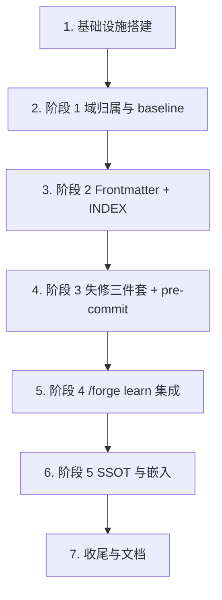

# Implementation Plan

## Overview

> 概述

按需求 R1–R20 与设计文档（src/docs-governance/* 模块、18 条 Correctness Properties P1–P18、五阶段迁移 R15+R19）拆解为 7 个父任务、56 个子任务。任务按迁移阶段组织：1 是基础设施前置，2–6 对应阶段 1–阶段 5，7 是收尾。每个实现任务严格遵循 RED → GREEN → REFACTOR：测试先行写在子任务描述中，与实现属同一个原子任务。

## Task Dependency Graph

> 任务依赖图



依赖说明：
- T1（types.ts、config.ts、reporter、cli/_runtime.ts、Biome 规则）是所有后续模块的前置。
- T2（domains.ts + baseline）是 T3 INDEX 生成的前置（生成器需先识别索引域）。
- T3（frontmatter + bilingual + INDEX）为 T4 失修三件套提供 Doc/DocPair 数据模型与 Index_Sync_Checker 字节比对前置。
- T4 必须在 T5 之前完成 pre-commit 启用与 grace period 配置。
- T6 阶段 5 仅在阶段 4 完成后启动（R19.AC1）。
- T7 在 T2–T6 全部 DoD 通过后产出参考文档与收尾 ADR。

并行波次（顺序执行，每波内部父任务串行；子任务在所属父任务内可按列出顺序推进）：

```json
{
  "waves": [
    {
      "wave": 1,
      "tasks": ["1"],
      "description": "基础设施前置：types、config、reporter、cli/_runtime、Biome 规则"
    },
    {
      "wave": 2,
      "tasks": ["2"],
      "description": "阶段 1：域归属、根级白名单、baseline 报告、forge-v2.3 归档"
    },
    {
      "wave": 3,
      "tasks": ["3"],
      "description": "阶段 2：frontmatter Schema、双语镜像、INDEX 生成器与同步闸门、半自动补齐"
    },
    {
      "wave": 4,
      "tasks": ["4"],
      "description": "阶段 3：staleness、updated-auditor、link-checker、quota、pre-commit 钩子、CI workflow、grace period"
    },
    {
      "wave": 5,
      "tasks": ["5"],
      "description": "阶段 4：/forge learn pre-hook 接入三检查器，输出文档增量小节"
    },
    {
      "wave": 6,
      "tasks": ["6"],
      "description": "阶段 5：SSOT 注册表、嵌入解析、4 个内置渲染器、嵌入同步闸门、字面值替换"
    },
    {
      "wave": 7,
      "tasks": ["7"],
      "description": "收尾：参考文档、INDEX 更新、宪法 detail 章节、CHANGELOG、迁移收尾 ADR"
    }
  ]
}
```

## Tasks

- [x] 1. 基础设施搭建
  - 建立可复用的核心类型、配置加载、诊断输出与 CLI 运行时；为后续五个阶段的所有模块提供共同地基
  - _Requirements: 1.1, 2.2, 5.8, 8.1, 9.7, 9.8, 13.1, 13.2, 13.3, 13.4, 13.5, 13.6, 16.6_
  - _Properties: P6, P14, P15, P16_

- [x] 1.1 创建 src/docs-governance/ 目录骨架与 types.ts
  - 在 src/docs-governance/ 下创建 cli/、frontmatter/、index-generator/、reporter/、ssot/、ssot/renderers/ 子目录占位（每个目录放 .gitkeep 或 index.ts 占位）
  - 在 src/docs-governance/types.ts 中定义 DocPath（branded string）、Domain、Category、Audience、Frontmatter、Doc、PairState、DocPair、Severity、DiagnosticRecord、ExitCode、SsotRegistryEntry、EmbedDirective、RenderInput、RenderResult、RendererFn、RendererRegistry、Config 等类型
  - 仅类型签名，不实现任何函数体
  - _Requirements: 1.1, 2.2, 13.1_

- [x] 1.2 实现 src/docs-governance/config.ts loadConfigWithDefaults
  - 测试先行：在 test/docs-governance/config.test.ts 中编写每个字段（max_count、root_whitelist、ssot_sources、grace_period_until、staleness.warning_days/critical_days/exempt_paths/warning_log_cap）的缺失与非法回退场景，断言默认值与 diagnosticsFromConfigLoad 中的 severity 对应回退策略表
  - 实现 loadConfigWithDefaults(configPath?: string): Config，永不抛出；非法/缺失字段写入 diagnosticsFromConfigLoad 并使用默认值
  - 默认值常量集中在 config.ts 顶部，与回退策略表保持单一来源
  - _Requirements: 5.8, 8.1, 9.7, 9.8, 16.6_

- [x] 1.3 实现 src/docs-governance/reporter/diagnostic.ts 与 exit-code.ts
  - 测试先行：编写 PBT，对任意 severity 数组验证 severityToExitCode 等于 max(severity).toExitCode（对应 P15）；编写单元测试覆盖 GitHub Actions 注解映射（critical/error/warning/notice/info）、message ≤ 500 字符截断附 "…[truncated]"、按 severity 降序 + file 字典序的多记录排序、Summary 末行格式
  - 实现 DiagnosticRecord 渲染（人类可读表格 + NDJSON 双模式，由 --json 切换）
  - 实现 severityToExitCode 函数与 ExitCode 常量映射
  - _Requirements: 13.1, 13.2, 13.3, 13.4, 13.5_
  - _Properties: P15_

- [x] 1.4 实现 src/docs-governance/cli/_runtime.ts 统一 try/catch 与退出码 3 优先级
  - 测试先行：编写集成测试注入抛出 Error 的 main 函数，验证即使运行中已 push critical 记录最终退出码也为 3（对应 P16）；验证正常路径下退出码与诊断 severity 一致
  - 实现 run(main: () => Promise<DiagnosticRecord[]>): Promise<never>，把 main 包在 try/catch 中，捕获异常时写入 stderr 并以退出码 3 终止；正常返回时调用 reporter 输出后按 severityToExitCode 退出
  - 同时实现 cli/_help.ts 模板（满足项目宪法 §2.8 Scripts as Black Box 铁律）
  - _Requirements: 13.6_
  - _Properties: P16_

- [x] 1.5 添加 Biome 自定义规则禁止不稳定输入
  - 测试先行：编写规则的 fixture 用例（每条违规用一个最小代码片段触发），断言 Biome 在 index-generator/* 与 ssot/renderers/* 路径下报错
  - 配置 no-restricted-imports 禁止 child_process / node:child_process
  - 配置 no-restricted-globals/syntax 禁止 Date / Date.now() / Math.random() / process.env 出现在 generator.ts 与 renderers/*
  - 验证生成器与渲染器在编译期被强制为纯函数（A7 节禁忌项清单）
  - _Requirements: 3.8, 17.3_
  - _Properties: P6, P14_

- [ ] 2. 阶段 1 — 域归属与 baseline 报告
  - 实现域归属、根级白名单与一次性产物归档；产出 docs-governance-baseline.md 报告并完成 forge-v2.3 文件迁移
  - _Requirements: 1.1, 1.2, 1.3, 1.4, 1.5, 1.6, 1.7, 9.1, 9.2, 9.3, 9.4, 9.5, 9.6, 9.7, 9.8, 15.1, 15.2_
  - _Properties: P1_

- [x] 2.1 实现 src/docs-governance/domains.ts classify 函数
  - 测试先行：在 test/docs-governance/domains.test.ts 编写单元用例覆盖排除前缀命中、域 C/B/A 优先级冲突、根目录第一层 vs 子目录边界；编写 PBT 用 fc.string 限定 [a-zA-Z0-9_/-] 字符集生成任意路径，验证 classify(path) 仅落入 EXCLUDED/A/B/C/D/UNCLASSIFIED 之一（对应 P1）
  - 实现 classify(path: DocPath): Domain | "UNCLASSIFIED"，按 EXCLUDED_PREFIXES → 域 C → 域 B → 域 A → 根目录第一层判定 D 的顺序
  - 把排除前缀清单与各域路径前缀清单作为常量导出
  - _Requirements: 1.1, 1.3, 1.5, 1.7_
  - _Properties: P1_

- [x] 2.2 实现 scripts/report-docs-baseline.ts 全仓库扫描
  - 测试先行：在 test/docs-governance/__fixtures__/fixture-domain-boundaries/ 准备含排除前缀、多前缀冲突、根目录第一层、UNCLASSIFIED 的迷你仓库快照；编写集成测试断言 baseline 报告中每条记录字段（源路径、域归属、目标路径、迁移时间戳）正确
  - 实现脚本扫描全仓库 .md → 调用 domains.classify → 输出 docs-governance-baseline.md
  - 命中 UNCLASSIFIED 时输出 script=check-docs-domains 的诊断并以非零状态码退出
  - _Requirements: 1.2, 1.4, 1.6, 15.2_

- [ ] 2.3 迁移 forge-v2.3-* 一次性产物至 .tinkerman/archive/
  - 用 git mv 把 forge-v2.3-executive-audit.md 与 forge-v2.3-technical-review.md 迁移至 .tinkerman/archive/
  - 验证 git log --follow 在新路径下能追溯历史，源路径不再存在
  - 在 baseline 报告中记录两条迁移记录（源路径、目标路径、迁移时间戳）
  - _Requirements: 9.4, 9.5, 9.6_

- [x] 2.4 实现 src/docs-governance/root-whitelist.ts
  - 测试先行：单元用例覆盖白名单精确文件名匹配、大小写敏感、不跟随符号链接、不含隐藏文件；集成用例覆盖 LICENSE 与 LICENSE.md 互为兼容的判定（任一存在放行、两者同时存在阻断）；覆盖 .tinkerman/config.md 缺失或字段非法时回落到 8 项默认值并发 severity=warning 诊断
  - 实现 root-whitelist.ts 暴露 checkRootWhitelist(rootDir): DiagnosticRecord[]
  - 实现 LICENSE 兼容判定（A8 节算法）
  - _Requirements: 9.1, 9.2, 9.7, 9.8_

- [x] 2.5 实现 scripts/check-docs-root-whitelist.ts CLI 入口
  - 通过 cli/_runtime.ts 包装；接受 --json 参数
  - 调用 root-whitelist.ts 业务逻辑后由 reporter 输出
  - 退出码：违规 1、零违规 0、异常 3
  - _Requirements: 9.3, 13.1_

- [ ] 2.6 阶段 1 DoD 检查与 PR approve
  - 验证根级白名单外文件全部迁移完成、baseline 报告产出、所有 .md 已归入四个域之一（无 UNCLASSIFIED）
  - 在 PR 描述中由 owner 显式 approve baseline 报告
  - 关闭阶段 1 的迁移 PR
  - _Requirements: 15.1, 15.2_

- [x] 3. 阶段 2 — Frontmatter Schema + INDEX 生成
  - 落地 frontmatter 校验、双语镜像配对与 INDEX 生成器；对 docs/ 现有文档半自动补齐 frontmatter，一次性产出 INDEX
  - _Requirements: 2.1, 2.2, 2.3, 2.4, 2.5, 2.6, 2.7, 2.8, 2.9, 3.1, 3.2, 3.3, 3.4, 3.5, 3.6, 3.7, 3.8, 3.9, 3.10, 4.1, 4.2, 4.3, 4.4, 4.5, 4.6, 11.1, 11.2, 11.3, 11.4, 11.5, 12.1, 12.2, 12.4, 12.5, 12.6, 12.7, 12.8, 15.1, 15.3_
  - _Properties: P2, P3, P4, P5, P7, P17_

- [x] 3.1 实现 src/docs-governance/frontmatter/schema.ts Zod schema
  - 测试先行：单元用例覆盖 title 长度上下界（1–200，含 CJK Unicode）、category 枚举（7 项）、audience 数组长度 1–6 与枚举（6 项）+ 元素去重、updated 范围 [2026-04-28, today]、owner 长度 1–100、mirror_of 路径不以 / 开头且不含 ..；边界用例覆盖 CJK title、updated 等于 2026-04-28 与等于 today 的情形
  - 实现 frontmatter Zod schema 与 Category/Audience 枚举常量
  - _Requirements: 2.2, 2.3, 11.1, 11.2, 11.3_

- [x] 3.2 实现 src/docs-governance/frontmatter/parser.ts
  - 测试先行：单元用例覆盖合法 YAML 解析为 Frontmatter 对象、未知字段抛诊断、首行 BOM 容忍、frontmatter 块由首行 --- 与第二个独占 --- 包裹的边界（含正文中含 --- 的情形）、嵌套映射与流式数组的拒绝
  - 实现 parser.ts 暴露 parseFrontmatter(text): { frontmatter: Frontmatter; body: string; diagnostics: DiagnosticRecord[] }
  - 拒绝 schema 之外的字段（R2.5）
  - _Requirements: 2.1, 2.4, 2.5, 2.6_

- [x] 3.3 实现 src/docs-governance/frontmatter/serializer.ts
  - 测试先行：单元用例覆盖字段顺序（title→category→audience→updated→owner→mirror_of?）、LF 行尾、关闭行 --- 后单 LF + 空行 + 正文、无尾部空行；编写 PBT 验证 parse(serialize(fm)) ≡ fm（往返一致性，对应 P2）与 parse(serialize(parse(yaml))) ≡ parse(yaml)（解析—序列化—解析往返，对应 P3）
  - 实现 serialize(fm: Frontmatter): string，输出唯一规范形态
  - _Requirements: 2.7, 2.8, 2.9_
  - _Properties: P2, P3_

- [x] 3.4 实现 scripts/check-docs-frontmatter.ts CLI 入口
  - 通过 cli/_runtime.ts 包装；接受 --json 参数
  - 扫描索引域全部 .md，对每篇调用 parser + schema 校验，违规时输出文件路径 + 字段名 + 违规原因
  - 退出码遵循 reporter/exit-code.ts 映射
  - _Requirements: 2.4, 2.5, 13.1, 13.2_

- [x] 3.5 实现 src/docs-governance/bilingual.ts 与 scripts/check-docs-bilingual.ts
  - 测试先行：在 test/docs-governance/__fixtures__/fixture-bilingual-states/ 准备 paired / cn-only / en-only / orphan_mirror 四态文档对（对应 P17）；集成测试覆盖 mirror_of 解析失败、中英两侧 category/audience 不一致阻断、mirror_drift（git 提交日期差 > 14 天）追加提示
  - 实现 bilingual.ts 暴露 pairBilingual(docs: Doc[]): DocPair[] 与 checkBilingualPairs(pairs: DocPair[]): DiagnosticRecord[]
  - CLI 入口走 cli/_runtime.ts
  - _Requirements: 12.1, 12.2, 12.5, 12.6, 12.7, 12.8_
  - _Properties: P17_

- [x] 3.6 实现 src/docs-governance/index-generator/format.ts
  - 测试先行：单元用例覆盖 category 枚举固定顺序（getting-started→daily-use→advanced→troubleshooting→contributing→reference→audits）、空分组省略、条目模板（标题、相对路径、category、updated）、英文镜像合并为同一条目并列展示两条相对链接、INDEX.en.md 把英文链接置于条目首位附 (EN)/(中) 标记、尾部"由脚本生成；请勿手动编辑"提示行 + 单 LF
  - 实现 format.ts 暴露分组、排序键与模板常量
  - _Requirements: 3.3, 3.4, 3.5, 11.4, 11.5, 12.4_

- [x] 3.7 实现 src/docs-governance/index-generator/generator.ts 主生成器
  - 测试先行：编写 PBT 验证 gen(gen(input)) ≡ gen(input)（生成幂等性 P4）、gen(input) ≡ gen(π(input))（输入顺序无关 P5），用 fc.array(arbitraryDoc) 与 fc.permutation 生成；单元用例验证不引入 Date/process.env/git 调用（与 1.5 Biome 规则配合，对应 P6）；编写用例验证存在 frontmatter 校验失败时拒绝生成且不写入文件
  - 实现 buildIndex(pairs: DocPair[]): { cn: string; en: string }，按 A2 节算法稳定多键排序
  - 纯函数：不读 git、不读 Date、不读 process.env、不读 fs（除入参）
  - _Requirements: 3.1, 3.2, 3.6, 3.7, 3.8, 3.10_
  - _Properties: P4, P5, P6_

- [x] 3.8 实现 scripts/build-docs-index.ts CLI 入口
  - 通过 cli/_runtime.ts 包装
  - 调用 generator.ts 后把输出写入 docs/INDEX.md 与 docs/INDEX.en.md（同步生成中英双索引）
  - _Requirements: 3.9_

- [x] 3.9 实现 scripts/check-docs-index.ts 同步闸门
  - 测试先行：集成用例覆盖临时目录重新生成与仓库版本逐字节比对、不一致时输出 unified diff 摘要（单文件 ≤ 200 行，超出截断附"已截断,共 N 行差异"）、人工编辑暂存区 INDEX 场景输出差异行号、--no-verify 旁路检测（对应 P7）
  - 实现 check-docs-index.ts 在临时目录调用 generator 后逐字节比对
  - pre-commit 上下文按 git diff --cached --name-only 是否含 docs/ 或 .tinkerman/config.md 决定是否执行；CI 上下文无条件执行
  - 退出消息提示 npm run docs:index，且不写回暂存区
  - _Requirements: 4.1, 4.2, 4.3, 4.4, 4.5, 4.6_
  - _Properties: P7_

- [x] 3.10 编写 scripts/migrate-docs-frontmatter.ts 半自动补齐
  - 测试先行：单元 + 集成用例覆盖 dry-run 默认行为、--apply 写入、title 取 H1、category 启发式默认 reference、audience 默认 ["maintainer"]、updated 取 git log -1 --format=%cs、owner 默认 forge-maintainers
  - 实现脚本扫描 docs/ 缺 frontmatter 的文件并生成草稿
  - 输出迁移建议清单供维护者 review
  - _Requirements: 15.3_

- [x] 3.11 对 docs/ 现有 38 篇 .md 半自动补齐 frontmatter
  - 在 feature 分支上运行 scripts/migrate-docs-frontmatter.ts 生成草稿
  - 维护者 review 草稿后用 --apply 写入；产出独立 PR 供 owner approve
  - 验证 npm run docs:check:frontmatter 通过
  - _Requirements: 2.1, 2.2, 15.3_

- [x] 3.12 一次性运行 npm run docs:index 产出 INDEX
  - 调用 build-docs-index 生成 docs/INDEX.md 与 docs/INDEX.en.md
  - 验证 npm run docs:check:index 通过（字节比对一致）
  - 提交 INDEX 至阶段 2 PR
  - _Requirements: 3.9_

- [x] 3.13 阶段 2 DoD 检查
  - 验证所有 docs/ 文件 frontmatter 通过 Frontmatter_Validator
  - 验证 INDEX 由生成器产出且 Index_Sync_Checker 通过
  - 关闭阶段 2 PR
  - _Requirements: 15.1_

- [ ] 4. 阶段 3 — 失修三件套 + pre-commit 启用
  - 实现陈旧度、updated 对账、链接体检三个检查器与数量纪律；启用 pre-commit 钩子并通过 CI；进入 7 天 grace period
  - _Requirements: 4.1, 5.1, 5.2, 5.3, 5.4, 5.5, 5.6, 5.7, 5.8, 5.9, 6.1, 6.2, 6.3, 6.4, 6.5, 6.6, 6.7, 7.1, 7.2, 7.3, 7.4, 7.5, 8.1, 8.2, 8.3, 8.4, 8.5, 8.6, 8.7, 13.1, 14.1, 14.2, 14.3, 14.5, 14.6, 15.1, 15.4, 18.1, 19.4, 20.5_
  - _Properties: P8, P9, P10, P11, P18_

- [x] 4.1 实现 src/docs-governance/staleness.ts
  - 测试先行：单元用例覆盖 UTC 当日基准、warning_days/critical_days 阈值、invalid 等级（缺失/格式错误/未来日期）、staleness.exempt_paths 豁免；编写 PBT 验证陈旧度等级单调性（daysDiff > critical ⇒ critical；warning < daysDiff ≤ critical ⇒ warning，对应 P8）
  - 实现 classifyStaleness(doc, today, config): "fresh"|"warning"|"critical"|"invalid"
  - _Requirements: 5.1, 5.2, 5.3, 5.7, 5.8, 5.9_
  - _Properties: P8_

- [x] 4.2 实现 scripts/check-docs-staleness.ts CLI
  - 通过 cli/_runtime.ts 包装；接受 --json、--ci 参数
  - 输出按 category 分组的人类可读文本报告 + .tinkerman/staleness-report.json（含路径、updated、天数差、陈旧度等级）
  - CI 上下文（CI=true）下：critical/invalid → 退出码 1；warning → 退出码 0 但追加 ::warning:: 注解；warning 注解条数超 staleness.warning_log_cap 时截断并附 ::notice:: 汇总
  - _Requirements: 5.4, 5.5, 5.6, 5.9_

- [x] 4.3 实现 src/docs-governance/updated-auditor.ts git 历史对账
  - 测试先行：在 test/docs-governance/__fixtures__/fixture-updated-auditor/ 准备 fixture 含 frontmatter-only 提交、合并提交、rebase/cherry-pick 提交、文件重命名（--follow）；集成测试覆盖 updated < lastBodyChangeDate 且差值 ≥ 2 天标记 updated_drift（对应 P9）；frontmatter-only 提交豁免 updated 字段变更（对应 P10）
  - 实现 lastBodyChangeDate(path)：调用 git log --follow -1 --format=%cs，跳过纯合并/rebase/cherry-pick 提交（A6 节算法）
  - 实现 currentDiffTouchesBody(path)：用 git diff --cached -U0 区分 frontmatter 与正文行
  - _Requirements: 6.1, 6.2, 6.7_
  - _Properties: P9, P10_

- [x] 4.4 实现 scripts/check-docs-updated.ts CLI
  - 通过 cli/_runtime.ts 包装；接受 --fix、--json 参数
  - 在 pre-commit 钩子中：正文行有增删改且未更新 updated 为 UTC 当日则非零状态码退出
  - --fix 模式：把违规文档的 updated 字段写为 UTC 当日并以零状态码退出
  - 新文件（git log 无记录）：接受任何不晚于 UTC 当日的 updated 值；晚于则非零退出
  - _Requirements: 6.3, 6.4, 6.5, 6.6_

- [x] 4.5 实现 src/docs-governance/link-checker.ts
  - 测试先行：编写 PBT 用 CJK + ASCII 混合 arbitrary 验证 GFM 锚点生成规则（ASCII 字母小写、空格→`-`、删除连字符以外的 ASCII 标点、保留 CJK、同名标题按出现顺序追加 -1/-2…，对应 P11）；集成用例覆盖 CJK 标题锚点匹配、重复标题去重、行内链接/图片链接/引用式链接/自动链接四种识别、围栏代码块与四空格缩进代码块外的链接扫描、http/https/mailto/tel 跳过可达性校验
  - 实现 link-checker.ts 暴露 checkLinks(docs: Doc[]): DiagnosticRecord[]
  - 实现 gfmAnchor(text) 与 dedupAnchorsInDoc(headings)（A5 节算法）
  - _Requirements: 7.1, 7.2, 7.3, 7.5_
  - _Properties: P11_

- [x] 4.6 实现 scripts/check-docs-links.ts CLI
  - 通过 cli/_runtime.ts 包装；接受 --json 参数
  - 失败记录字段：源文件路径、1 起始行号、原始目标值、失败原因
  - _Requirements: 7.4, 13.1_

- [x] 4.7 实现 src/docs-governance/quota.ts
  - 测试先行：单元用例覆盖按文档对合并（<slug>.md 与 <slug>.en.md 合计 1 项）、排除 .mdx 与 README.md 与 INDEX*.md、文档对总数 ≥ max_count 阻断、等于 max_count - 1 输出 warning 但零退出、--allow-grow 必须随附 .tinkerman/decisions/ 下 ADR 路径、max_count 上调必须有对应 ADR
  - 实现 quota.ts 暴露 countDocPairs(rootDir): { count: number; distribution: Record<string, number> } 与 checkQuota(config, allowGrow?: string): DiagnosticRecord[]
  - _Requirements: 8.1, 8.2, 8.3, 8.4, 8.6, 8.7_

- [x] 4.8 实现 scripts/check-docs-quota.ts CLI
  - 通过 cli/_runtime.ts 包装；接受 --allow-grow=<adr-path>、--json 参数
  - 输出当前计数、上限以及按 audience 与 category 维度的分布
  - _Requirements: 8.3, 8.5, 8.6_

- [x] 4.9 创建 .githooks/pre-commit 决策树脚本
  - 测试先行：在 test/docs-governance/perf/pre-commit.bench.test.ts 用 fixture-perf-50pairs 验证两条性能路径——轻量路径（无 docs/ 改动）≤ 1 秒、含 docs/ 改动的标准路径 ≤ 5 秒（对应 P18）
  - 实现 .githooks/pre-commit POSIX shell 脚本：先 git diff --cached --name-only 判定是否触动 docs/、.tinkerman/config.md、SSOT 来源或根目录 .md，未触动直接 exit 0（轻量路径）
  - 触动文档时按决策树调用 check-docs-frontmatter / check-docs-bilingual / check-docs-index / check-docs-updated / check-docs-embeds；触动根 .md 加 check-docs-root-whitelist；触动配置加 check-docs-staleness / check-docs-links / check-docs-quota
  - 失败统一打印 "Run `npm run docs:build` to regenerate, then re-stage."
  - _Requirements: 4.1, 14.6, 18.1, 20.5_
  - _Properties: P18_

- [x] 4.10 实现 scripts/install-hooks.ts postinstall 钩子安装
  - 测试先行：单元 + 集成用例覆盖 .git/ 存在、.githooks/pre-commit 已存在且可执行、当前 core.hooksPath 不是 .githooks 三个条件全满足时执行 git config core.hooksPath .githooks；CI=true 跳过
  - 在 package.json 的 postinstall 中接入该脚本
  - _Requirements: 14.6_

- [x] 4.11 创建 .github/workflows/docs-governance.yml CI workflow
  - 步骤：checkout（fetch-depth: 0 以支持 git log --follow）→ setup Node + 缓存 npm → npm ci → npm run docs:check
  - 失败时上传 NDJSON 为 artifact docs-governance-diagnostics.ndjson
  - 附加 docs-bypass-detect job 按 R4.AC6 检测 --no-verify 旁路（提交 trailer、缺失的 hook 运行痕迹等），命中即阻断
  - _Requirements: 4.1, 4.6, 6.1, 18.1_

- [ ] 4.12 在 .tinkerman/config.md 添加 docs.grace_period_until 字段
  - 写入未来 7 个自然日的 YYYY-MM-DD 日期
  - 钩子脚本读取该字段：今日 < grace_period_until 时把 severity=error 降级为 severity=warning 不阻断；到期后强制阻断
  - _Requirements: 15.4, 19.4_

- [ ] 4.13 阶段 3 DoD 检查
  - 验证 pre-commit 在 Frontmatter_Validator / Index_Sync_Checker / Updated_Auditor 三个检查器上启用
  - 验证 CI workflow 通过
  - 关闭阶段 3 PR
  - _Requirements: 15.1, 15.4_

- [ ] 5. 阶段 4 — /forge learn 集成
  - 把 quota / staleness / link 三检查器接入 /forge learn pre-hook，10 秒预算 + 超时降级 needs_attention；输出"文档增量"小节
  - _Requirements: 8.5, 10.1, 10.2, 10.3, 10.4, 15.1_

- [ ] 5.1 修改现有 learn skill pre-hook 接入三检查器
  - 在 learn skill 的 pre-hook 阶段 inline 调用 tsx scripts/check-docs-quota.ts --json、check-docs-staleness.ts --json、check-docs-links.ts --json
  - 整体调用时间预算 10 秒
  - 任一检测器返回非零状态码、超时或脚本不存在 → 把"文档增量"小节标注为 needs_attention 但不阻断 learn 主流程
  - _Requirements: 8.5, 10.1, 10.3_

- [ ] 5.2 实现"文档增量"小节聚合写入会话文件
  - 把检测器输出的 critical 级别问题作为 /forge learn 的明确建议项写入 .tinkerman/knowledge/sessions/<session>.md
  - 每条建议至少包含字段：来源检测器、文档相对路径、问题摘要
  - _Requirements: 10.2_

- [ ] 5.3 测试 /forge learn 集成
  - 编写集成测试注入失败场景（脚本返回非零、超时、脚本缺失）验证 needs_attention 降级
  - 编写 clean 状态测试：三个检测器全部以零状态码完成且无 critical → 标注 clean 并附 UTC ISO 8601 时间戳
  - 在测试仓库中调用 /forge learn 验证报告"文档增量"小节正常输出
  - _Requirements: 10.3, 10.4_

- [ ] 5.4 阶段 4 DoD 检查
  - 在最近一次 /forge learn 调用中证明运行正常并输出"文档增量"小节
  - 关闭阶段 4 PR
  - _Requirements: 15.1_

- [ ] 6. 阶段 5 — SSOT 与段落级嵌入
  - 实现 SSOT 注册表、嵌入指令解析、4 个内置渲染器、嵌入同步闸门；建立 4 个初始 topic 的 SSOT 来源；把"22 个命令"/"18 个命令"等历史不一致字面值替换为嵌入指令
  - _Requirements: 16.1, 16.2, 16.3, 16.4, 16.5, 16.6, 16.7, 17.1, 17.2, 17.3, 17.4, 17.5, 17.6, 17.7, 17.8, 17.9, 17.10, 18.1, 18.2, 18.3, 18.4, 18.5, 18.6, 18.7, 19.1, 19.2, 19.3, 19.4, 19.5, 19.6, 20.1, 20.2_
  - _Properties: P12, P13, P14_

- [x] 6.1 实现 src/docs-governance/ssot/registry.ts
  - 测试先行：单元用例覆盖 docs.ssot_sources 字段加载、保留前缀冲突（internal-/debug-/forge-meta-）拒绝、topic 重复检测、source glob 解析为空报错、renderer 名称未注册报错、配置缺失时使用 4 项默认注册条目并发 severity=warning
  - 实现 loadSsotRegistry(config): { entries: SsotRegistryEntry[]; diagnostics: DiagnosticRecord[] }
  - _Requirements: 16.1, 16.2, 16.3, 16.4, 16.5, 16.6, 16.7_

- [x] 6.2 实现 src/docs-governance/ssot/embed-parser.ts
  - 测试先行：单元用例覆盖 <!-- ssot:begin topic=X render=Y --> / <!-- ssot:end topic=X --> 配对扫描、未闭合检测、topic 不匹配检测、嵌套不允许、同一文档同一 topic 多次出现独立解析、#[[file:relative]] 单行指令识别；编写 PBT 验证渲染前后嵌入指令外部的字节序列严格相等（外部字节保留，对应 P13），arbitrary 在文档中插入随机外部字节（控制字符以外）
  - 实现 parseEmbeds(file: Doc): { directives: EmbedDirective[]; diagnostics: DiagnosticRecord[] }
  - 实现按 beginLine 倒序 splice 替换以避免行号偏移（A4 节算法）
  - _Requirements: 17.1, 17.4, 17.7, 17.9, 17.10_
  - _Properties: P13_

- [x] 6.3 实现 4 个内置渲染器
  - 测试先行：每个渲染器一组单元用例覆盖输入归一化（去重 + 稳定排序）、输出 Markdown 模板、行尾固定 LF 且最后一行无尾部换行、不含时间戳/随机值/环境字段；编写 PBT 验证相同 RenderInput 产生相同 RenderResult（确定性，对应 P14）
  - 在 src/docs-governance/ssot/renderers/ 下实现 commands-table.ts、routing-table.ts、security-tiers.ts、json-list.ts
  - 渲染器为纯函数：无文件 I/O、无 Date、无 process.env、无 Math.random（与 1.5 Biome 规则配合）
  - _Requirements: 17.3_
  - _Properties: P14_

- [x] 6.4 实现 src/docs-governance/ssot/renderer-registry.ts
  - 测试先行：单元用例覆盖 register/resolve/list 接口、未注册 renderer 时 resolve 返回 undefined、与 embed-parser 协作时未注册渲染器立即报 error
  - 实现 createRendererRegistry(): RendererRegistry
  - 在初始化时注册 4 个内置渲染器
  - _Requirements: 17.6_

- [x] 6.5 实现 src/docs-governance/ssot/embed-sync.ts
  - 测试先行：在 test/docs-governance/__fixtures__/fixture-embed-errors/ 准备 fixture 覆盖未闭合标记、topic 不匹配、未知 topic、未知 renderer、#[[file:...]] 越出仓库工作树（对应 R17.AC4-AC7）；集成测试覆盖临时目录重新渲染与仓库版本逐字节比对、不一致输出 unified diff（每个嵌入指令 ≤ 100 行，超出截断）、人工编辑暂存区违规检测
  - 实现 embed-sync.ts 暴露 checkEmbedSync(docs, registry, ssotData): DiagnosticRecord[]
  - 复用 embed-parser 与 reporter，遵循 R13 错误信号格式
  - _Requirements: 18.2, 18.3, 18.5, 18.7_

- [x] 6.6 实现 scripts/build-docs-embeds.ts CLI
  - 通过 cli/_runtime.ts 包装；接受 --dry-run 参数
  - 调用 embed-parser + renderer-registry 重新渲染索引域所有嵌入指令
  - --dry-run 仅输出预览；默认写回文档
  - 同时支持 #[[file:relative]] 整文件嵌入语法（R17.AC7）
  - _Requirements: 17.2, 17.7, 17.8_

- [x] 6.7 实现 scripts/check-docs-embeds.ts CLI 同步闸门
  - 通过 cli/_runtime.ts 包装；接受 --json 参数
  - pre-commit 上下文：仅当 git diff --cached --name-only 含 docs/、docs/_ssot/、SSOT 注册表 source 路径或 .tinkerman/config.md 时执行；CI 无条件执行
  - 退出消息提示 npm run docs:embeds，且不写回暂存区
  - CI 上下文检测 --no-verify 旁路并阻断（同 R4.AC6）
  - _Requirements: 18.1, 18.4, 18.6_

- [x] 6.8 创建 4 个初始 SSOT 来源
  - 创建 commands SSOT：编写 commands/*.md frontmatter 聚合视图脚本或直接以 commands/registry.json 提供
  - 创建 docs/_ssot/routing.json：三维路由表数据
  - 创建 docs/_ssot/security-tiers.json：安全分级表数据
  - 创建 docs/_ssot/gate-skills.json：gate-skills 列表数据
  - 验证四个来源能被对应渲染器正常消费
  - _Requirements: 16.2, 19.1_

- [x] 6.9 实现 scripts/scan-literal-mismatches.ts 字面值扫描
  - 测试先行：单元 + 集成用例覆盖 \d+ 个命令 / \d+ commands 正则识别、跳过代码块内字面值、输出迁移建议清单字段（源文件路径、行号、原始字面值、推荐替换为的嵌入指令）
  - 实现脚本扫描索引域中字面值并产出建议清单
  - 维护者 review 后再写入
  - _Requirements: 19.2_

- [ ] 6.10 在 .tinkerman/config.md 注册 4 个初始 topic
  - 在 .tinkerman/config.md frontmatter 的 docs.ssot_sources 字段写入 commands、routing、security-tiers、gate-skills 四项
  - 每项包含 topic、source、renderer
  - 验证 npm run docs:check:embeds 通过
  - _Requirements: 16.1, 16.2_

- [ ] 6.11 把命令数量字面值替换为嵌入指令
  - 在 README.md / docs/INDEX.md / docs/onboarding-beginner.md 等文档中按 6.9 产出的迁移建议清单替换"22 个命令"/"18 个命令"等字面值
  - 替换为 <!-- ssot:begin topic=commands render=commands-table --> ... <!-- ssot:end topic=commands --> 嵌入指令块
  - 用 npm run docs:embeds 重新渲染并提交
  - _Requirements: 19.1, 19.3_

- [ ] 6.12 编写嵌入渲染幂等性 PBT
  - 测试先行：用 fc.tuple(arbitraryDoc, arbitrarySsot) 验证 render(render(d, s), s) ≡ render(d, s)（按字节，对应 P12）
  - arbitraryEmbed 先生成普通 Markdown 行后随机插入合法的起止标记对，保证 topic 一致与不嵌套
  - _Requirements: 17.8_
  - _Properties: P12_

- [ ] 6.13 阶段 5 DoD 检查
  - 验证所有"命令数量"字面值不再出现在索引域文档中
  - 验证 Embed_Sync_Checker 在 CI 通过
  - 验证 /forge learn 报告"文档增量"小节包含新增 embeds 字段（嵌入指令总数、独立 topic 数、最近一次同步状态）
  - 关闭阶段 5 PR
  - _Requirements: 19.1, 19.3_

- [ ] 7. 收尾与文档
  - 编写本系统的参考文档、更新 INDEX 与项目宪法、记录 CHANGELOG 与迁移收尾 ADR
  - _Requirements: 2.1, 2.2, 3.9, 8.7, 11.1, 15.1, 15.5_

- [x] 7.1 编写 docs/reference-docs-governance.md 参考文档
  - 介绍 frontmatter 用法（必填字段、枚举、日期约束、mirror_of）、命令与脚本（13 个 CLI + 聚合 npm script）、配置项（.tinkerman/config.md 字段表）、错误信号（severity 与退出码映射、GitHub Actions 注解）
  - 文档自身满足 frontmatter Schema（category=reference）
  - 同时产出英文镜像 docs/reference-docs-governance.en.md
  - _Requirements: 2.1, 2.2, 11.1_

- [x] 7.2 把新文档加入 docs/INDEX.md
  - 运行 npm run docs:index 自动重新生成 INDEX
  - 验证 npm run docs:check:index 通过
  - _Requirements: 3.9_

- [ ] 7.3 在项目宪法 detail 中追加文档治理章节
  - 在 docs/forge-constitution-detail.md 追加新的"文档治理"章节，链接到 docs/reference-docs-governance.md
  - 在 AGENTS.md 项目宪法主文档中添加一行指向 detail 章节的引用（如适用）
  - _Requirements: 15.1_

- [x] 7.4 在 CHANGELOG.md 添加版本条目
  - 记录 docs-governance-system 上线、五阶段迁移完成、新增 13 个 CLI 与聚合 npm script、4 个初始 SSOT topic 与嵌入指令机制
  - _Requirements: 15.1_

- [ ] 7.5 编写迁移收尾 ADR
  - 在 .tinkerman/decisions/ 下创建 ADR：2026-XX-XX-docs-governance-rollout.md
  - 记录：迁移前后状态对比、五阶段执行回顾、放弃的备选方案（Astro/VitePress 等文档站工具）、docs.max_count 上调时的复用规则、`--allow-grow` 配套 ADR 的引用模板
  - _Requirements: 8.7, 15.1, 15.5_


## Notes

> 备注

- TDD 一致性：每个实现子任务的描述里"测试先行"段落即是 RED 阶段；最小实现通过测试是 GREEN；实现完成后按代码风格重构是 REFACTOR。测试与实现同属一个原子任务，不拆分为独立"运行测试"任务。
- 不引入文档站工具：Astro、VitePress、Docusaurus 一律不引入；YAML 解析使用 yaml 包（已在 npm 生态常见）；PBT 使用 fast-check。
- 退出码映射统一在 src/docs-governance/reporter/exit-code.ts，所有脚本通过 cli/_runtime.ts 接入退出码 3 优先级（R13.AC6）。
- pre-commit 钩子轻量路径性能预算 ≤ 1 秒（R14.AC6、R20.AC5）；标准路径 50 文档对场景 ≤ 5 秒（R14.AC3）；超 1.5× 预算时仅发 severity=warning 不阻断。
- 阶段间回滚：每个父任务一个独立 PR，git revert 该 PR 不影响前序阶段（R15.AC5、R19.AC5）；已合并到 main 后发现治理问题致 CI 持续阻断，按 R15.AC6 在 24 小时内提交 hotfix revert PR。
- 任务追溯：每个任务的 _Requirements:_ 行追溯到 R1–R20 的 AC 编号；_Properties:_ 行追溯到 design.md Correctness Properties 节的 P1–P18。
