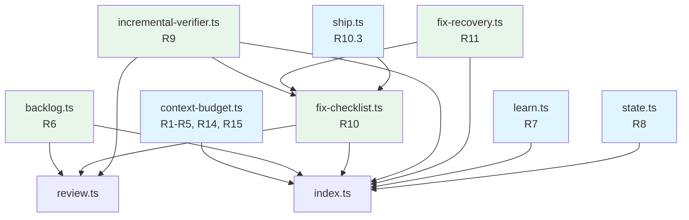
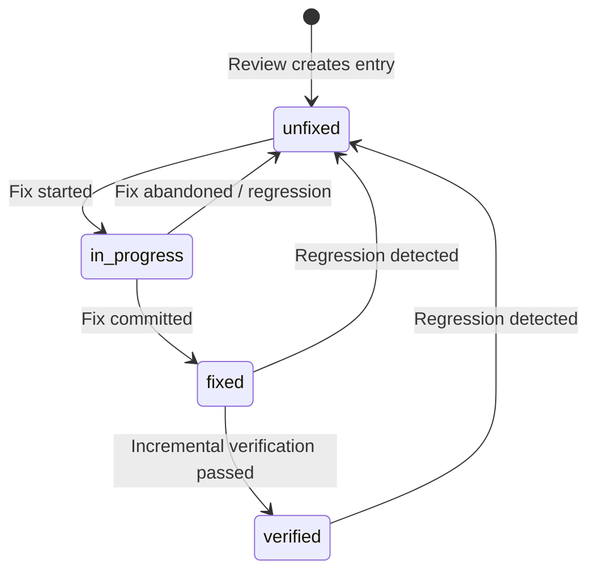

# Design Document: forge-review-fix-optimization

## Overview

This design addresses six systemic pain points discovered through dogfooding the Forge workflow framework. The central theme is reducing the cost and friction of the review → fix → re-review → ship cycle, while also addressing context pressure, knowledge gaps, and parallel work support that compound that cost.

The implementation strategy follows a key principle: **extend existing modules rather than creating new ones**, except where a genuinely new concern requires its own module. The existing `src/context-budget.ts`, `src/review.ts`, `src/ship.ts`, `src/learn.ts`, and `src/state.ts` modules already contain the core types and serialization patterns. New functionality builds on these foundations.

### Scope Summary

| Area | Requirements | Approach |
|------|-------------|----------|
| Context budget serializers (fix P1s + harden) | R1–R5, R14, R15 | Extend `src/context-budget.ts` — fix 3 P1 bugs, add runtime enum validation |
| P2/P3 backlog capture | R6 | New module `src/backlog.ts` — new concern with its own file format |
| Knowledge accumulation | R7 | Extend `src/learn.ts` — existing knowledge types and validation |
| Parallel task status | R8 | Extend `src/state.ts` — existing status/protection zone logic |
| Incremental P1 verification | R9 | New module `src/incremental-verifier.ts` — new verification logic |
| P1 fix checklist tracking | R10 | New module `src/fix-checklist.ts` — new file format and state machine |
| Git history fix recovery | R11 | New module `src/fix-recovery.ts` — new git-log scanning logic |
| CI command discovery | R12 | SKILL document changes only (forge-build, forge-test) |
| Context budget SKILL integration | R13 | SKILL document changes (forge-build, forge-review, forge-decide) |
| Ship gate checklist integration | R10.3 | Extend `src/ship.ts` — add checklist gate to existing ship gate |

### Module Dependency Diagram



Blue = existing module extended. Green = new module.

---

## Architecture

### Design Decision 1: Fix-Before-Extend Strategy

The three P1 bugs in `context-budget.ts` (R15) are fixed first, before any new features build on the module. This prevents new code from inheriting known defects.

**P1 issues to fix:**
1. `serializeExploreResult` does not properly pass through error/empty results — the function exists but the passthrough logic needs hardening.
2. `deserializeTestOutput` silently returns a zeroed object when parsing fails — should set `parseFailed: true` and retain original text.
3. All deserializers accept arbitrary strings for enum-like fields (e.g., severity `"P0"|"P1"|"P2"|"P3"`, status `"DONE"|"BLOCKED"`) without runtime validation — should reject invalid values.

### Design Decision 2: Checklist-Driven Ship Gate

The existing `checkShipGate` in `ship.ts` uses `ReviewResult.passed` as a boolean. The new design adds a fourth gate: the P1 Fix Checklist. The ship gate blocks if any P0/P1 entry in the checklist has status other than `"verified"`.

**Rationale:** The current boolean `ReviewResult.passed` can't distinguish between "review passed with no issues" and "review found P1s that were subsequently fixed and verified." The checklist provides granular tracking.

### Design Decision 3: Multi-Task Status via Entries Array

Rather than splitting `status.md` into multiple files (which would break the existing protection zone logic in `state.ts`), the design extends the single `status.md` file to contain an array of task entries in YAML frontmatter. This preserves backward compatibility — a single-entry file is valid under both old and new schemas.

### Design Decision 4: SKILL Documents Are Behavioral Instructions

Requirements R12 and R13 are implemented entirely as SKILL document changes. These are markdown files that instruct AI behavior — they don't contain executable code. The design specifies the exact sections to add/modify in each SKILL document.

### Design Decision 5: Incremental Verification Threshold

The 50-line threshold (R9.1 vs R9.4) determines whether a P1 fix gets lightweight verification or a targeted single-layer re-review. This is a pure function that takes a line count and returns a verification strategy, making it easy to test and adjust.

---

## Components and Interfaces

### 1. Context Budget Module Extensions (`src/context-budget.ts`)

#### P1 Fix: Runtime Enum Validation

Add validation helpers used by all deserializers:

```typescript
/** Validate that a string is a valid Severity value. */
export function isValidSeverity(value: string): value is "P0" | "P1" | "P2" | "P3" {
  return ["P0", "P1", "P2", "P3"].includes(value);
}

/** Validate that a string is a valid SubagentStatus value. */
export function isValidSubagentStatus(
  value: string
): value is "DONE" | "DONE_WITH_CONCERNS" | "NEEDS_CONTEXT" | "BLOCKED" {
  return ["DONE", "DONE_WITH_CONCERNS", "NEEDS_CONTEXT", "BLOCKED"].includes(value);
}
```

These are called inside `deserializeReviewSummary` and `deserializeSubagentSummary` before type assertions.

#### P1 Fix: Explore Error Passthrough

The existing `serializeExploreResult` already handles `null`, `undefined`, and `string` inputs. The fix ensures the empty-object case (all arrays empty) returns the passthrough message consistently, and adds a test for actual error string passthrough.

#### P1 Fix: Test Output Parse Failure

The existing `deserializeTestOutput` already sets `parseFailed: true` when neither format matches. The fix adds a `rawOutput` field to `TestOutputSummary` that retains the original text when `parseFailed` is true:

```typescript
export interface TestOutputSummary {
  total: number;
  passed: number;
  failed: number;
  skipped: number;
  duration: number;
  failures: Array<{
    testName: string;
    filePath: string;
    line: number;
    errorMessage: string;
  }>;
  parseFailed?: boolean;
  rawOutput?: string;  // NEW: retained when parseFailed is true
}
```

#### Context Budget Report Serializer (R14)

Already exists. The `serializeContextBudgetReport` and `deserializeContextBudgetReport` functions are already implemented. R14 requires ensuring the round-trip property holds (already tested) and that the <30% warning is included.

### 2. Backlog Module (`src/backlog.ts`) — NEW

```typescript
/** A single backlog entry representing an unfixed P2/P3 finding. */
export interface BacklogEntry {
  /** Unique ID derived from the finding fingerprint. */
  id: string;
  severity: "P2" | "P3";
  filePath: string;
  lineNumber: number;
  description: string;
  /** Path to the source review report. */
  sourceReview: string;
  /** Task name that generated the finding. */
  originTask: string;
  /** ISO date when the entry was captured. */
  capturedDate: string;
  /** Whether the entry has been resolved. */
  resolved: boolean;
  /** Task name that resolved the entry (if resolved). */
  resolvedBy?: string;
  /** ISO date when the entry was resolved (if resolved). */
  resolvedDate?: string;
}

/** Parse `.tinkerman/backlog.md` content into structured entries. */
export function parseBacklog(content: string): BacklogEntry[];

/** Serialize backlog entries to `.tinkerman/backlog.md` format. */
export function serializeBacklog(entries: BacklogEntry[]): string;

/**
 * Append new findings to the backlog, deduplicating by ID.
 * Returns the merged list and the count of newly added entries.
 */
export function appendToBacklog(
  existing: BacklogEntry[],
  newFindings: BacklogEntry[]
): { entries: BacklogEntry[]; added: number };

/**
 * Find backlog entries whose filePath overlaps with a set of affected files.
 * Used by `/forge plan` to surface relevant backlog items.
 */
export function findOverlappingEntries(
  entries: BacklogEntry[],
  affectedFiles: string[]
): BacklogEntry[];

/**
 * Mark a backlog entry as resolved.
 * Returns the updated entry, or null if the ID was not found.
 */
export function resolveEntry(
  entries: BacklogEntry[],
  entryId: string,
  resolvedBy: string,
  resolvedDate: string
): BacklogEntry | null;

/** Generate the standard header for a new backlog file. */
export function generateBacklogHeader(): string;
```

#### Backlog File Format

```markdown
---
title: "Forge Backlog"
updated: "2026-05-01"
total_entries: 3
unresolved: 2
---

## Backlog Entries

### BL-001
- **Severity:** P2
- **File:** src/services/export.ts:42
- **Description:** Duplicate date validation logic
- **Source Review:** .tinkerman/reviews/order-export.md
- **Origin Task:** order-batch-export
- **Captured:** 2026-04-30
- **Status:** unresolved

### BL-002
- **Severity:** P3
- **File:** src/jobs/async-export.ts:15
- **Description:** Missing JSDoc comments
- **Source Review:** .tinkerman/reviews/order-export.md
- **Origin Task:** order-batch-export
- **Captured:** 2026-04-30
- **Status:** resolved
- **Resolved By:** code-cleanup
- **Resolved Date:** 2026-05-01
```

### 3. Fix Checklist Module (`src/fix-checklist.ts`) — NEW

```typescript
/** Status of a P0/P1 finding in the fix checklist. */
export type ChecklistStatus = "unfixed" | "in-progress" | "fixed" | "verified";

/** A single entry in the P1 fix checklist. */
export interface ChecklistEntry {
  findingId: string;
  severity: "P0" | "P1";
  filePath: string;
  lineNumber: number;
  description: string;
  status: ChecklistStatus;
  /** Commit hash of the fix (set when status transitions to "fixed"). */
  fixCommit?: string;
}

/** Valid status transitions for checklist entries. */
export const VALID_TRANSITIONS: Record<ChecklistStatus, ChecklistStatus[]> = {
  unfixed: ["in-progress"],
  "in-progress": ["fixed", "unfixed"],  // can revert to unfixed on regression
  fixed: ["verified", "unfixed"],        // can revert to unfixed on regression
  verified: ["unfixed"],                 // can revert on regression detection
};

/**
 * Validate that a status transition is allowed.
 * Returns true if the transition from `current` to `next` is valid.
 */
export function isValidTransition(
  current: ChecklistStatus,
  next: ChecklistStatus
): boolean;

/**
 * Create a checklist from review findings.
 * Filters to P0/P1 only, sets all statuses to "unfixed".
 */
export function createChecklist(
  findings: Array<{ severity: string; filePath: string; lineNumber: number; description: string }>
): ChecklistEntry[];

/**
 * Update the status of a checklist entry.
 * Validates the transition and returns the updated entry or an error.
 */
export function updateEntryStatus(
  entry: ChecklistEntry,
  newStatus: ChecklistStatus,
  fixCommit?: string
): { success: boolean; entry: ChecklistEntry; error?: string };

/**
 * Check if all entries in the checklist are verified.
 * Used by the ship gate.
 */
export function allEntriesVerified(entries: ChecklistEntry[]): boolean;

/**
 * Parse a checklist file into structured entries.
 */
export function parseChecklist(content: string): ChecklistEntry[];

/**
 * Serialize checklist entries to the checklist file format.
 */
export function serializeChecklist(
  entries: ChecklistEntry[],
  topic: string
): string;
```

#### Checklist File Format

```markdown
---
topic: "order-batch-export"
created: "2026-05-01"
total_p0: 1
total_p1: 2
all_verified: false
---

## P0/P1 Fix Checklist

| # | Severity | File | Description | Status | Fix Commit |
|---|----------|------|-------------|--------|------------|
| F-001 | P0 | src/config/db.ts:12 | Hardcoded database password | verified | a1b2c3d |
| F-002 | P1 | src/routes/export.ts:42 | Missing auth middleware | fixed | d4e5f6g |
| F-003 | P1 | Req 2 Scene S3 | Async export not implemented | in-progress | — |
```

### 4. Incremental Verifier Module (`src/incremental-verifier.ts`) — NEW

```typescript
/** Verification strategy based on fix size. */
export type VerificationStrategy = "incremental" | "targeted-review";

/** Result of determining the verification strategy. */
export interface VerificationDecision {
  strategy: VerificationStrategy;
  /** Number of lines changed in the fix. */
  linesChanged: number;
  /** The threshold used for the decision. */
  threshold: number;
}

/** Result of an incremental verification. */
export interface VerificationResult {
  verified: boolean;
  findingId: string;
  /** Explanation of what was checked and the outcome. */
  explanation: string;
  /** The review layer that raised the original finding (for targeted review). */
  originalLayer?: string;
}

/** Default line threshold for incremental vs targeted review. */
export const INCREMENTAL_THRESHOLD = 50;

/**
 * Determine the verification strategy based on fix size.
 * < 50 lines → incremental (verify changed lines against finding)
 * >= 50 lines → targeted-review (single-layer re-review)
 */
export function determineVerificationStrategy(
  linesChanged: number,
  threshold?: number
): VerificationDecision;

/**
 * Build the verification criteria from a finding.
 * Extracts the file path, line range, and description to scope verification.
 */
export function buildVerificationCriteria(
  finding: ChecklistEntry
): { filePath: string; lineRange: [number, number]; description: string };
```

### 5. Fix Recovery Module (`src/fix-recovery.ts`) — NEW

```typescript
/** A candidate commit that may address a finding. */
export interface RecoveryCandidate {
  commitHash: string;
  commitMessage: string;
  /** ISO date of the commit. */
  commitDate: string;
  /** Files modified in the commit. */
  modifiedFiles: string[];
  /** Whether the commit modifies the finding's file and line range. */
  matchesLineRange: boolean;
}

/** Result of scanning git history for fix candidates. */
export interface RecoveryResult {
  findingId: string;
  candidates: RecoveryCandidate[];
  /** Whether any candidate was found. */
  hasCandidate: boolean;
}

/**
 * Determine if a commit is a candidate fix for a finding.
 * Checks if the commit modifies the finding's file path and
 * touches lines within the finding's line range (±10 tolerance).
 */
export function isFixCandidate(
  commitFiles: string[],
  commitLineRanges: Map<string, [number, number][]>,
  findingFilePath: string,
  findingLineNumber: number,
  lineTolerance?: number
): boolean;

/**
 * Parse git log output into structured commit entries.
 * Expected format: `--format="%H|%s|%aI" --name-only`
 */
export function parseGitLog(
  gitLogOutput: string
): Array<{ hash: string; message: string; date: string; files: string[] }>;
```

### 6. Ship Gate Extension (`src/ship.ts`)

Extend the existing `checkShipGate` to accept an optional checklist parameter:

```typescript
/** Extended ship gate that includes checklist verification. */
export function checkShipGateWithChecklist(
  review: ReviewResult,
  test: TestResult,
  progress: ProgressResult,
  checklist?: ChecklistEntry[]
): ShipGateResult;
```

When `checklist` is provided and non-empty, the function adds a fourth gate: all checklist entries must have status `"verified"`. The existing `checkShipGate` function remains unchanged for backward compatibility.

### 7. Multi-Task Status Extension (`src/state.ts`)

```typescript
/** A single task entry in the multi-task status file. */
export interface TaskStatusEntry {
  taskName: string;
  tier: string;
  phase: string;
  worktree?: string;
  updated: string;
}

/**
 * Parse status.md content into task entries.
 * Supports both legacy single-task format and new multi-task format.
 */
export function parseStatusEntries(content: string): TaskStatusEntry[];

/**
 * Serialize task entries back to status.md format.
 */
export function serializeStatusEntries(entries: TaskStatusEntry[]): string;

/**
 * Add or update a task entry without overwriting other entries.
 * Returns the updated entries array.
 */
export function upsertTaskEntry(
  entries: TaskStatusEntry[],
  newEntry: TaskStatusEntry
): TaskStatusEntry[];

/**
 * Remove a completed or aborted task entry.
 * Returns the updated entries array.
 */
export function removeTaskEntry(
  entries: TaskStatusEntry[],
  taskName: string
): TaskStatusEntry[];

/**
 * Detect if two entries refer to the same task (potential conflict).
 */
export function detectConflict(
  entries: TaskStatusEntry[],
  taskName: string
): boolean;
```

#### Multi-Task Status File Format

```markdown
---
tasks:
  - task: "order-batch-export"
    tier: "standard"
    phase: "review"
    worktree: "feature/order-batch-export"
    updated: "2026-05-01"
  - task: "auth-refactor"
    tier: "full"
    phase: "build"
    worktree: "feature/auth-refactor"
    updated: "2026-05-01"
---

# Project Status

2 active tasks.
```

Legacy single-task format (backward compatible):

```markdown
---
current_task: "order-batch-export"
tier: "standard"
phase: "review"
updated: "2026-05-01"
---
```

`parseStatusEntries` detects the format by checking for the `tasks` array field vs the `current_task` scalar field.

### 8. SKILL Document Changes

#### forge-build/SKILL.md — Add CI Command Section (R12.1, R12.5)

Add a new section "CI 验证命令" after the existing validation section:

```markdown
## CI 验证命令

Build 阶段的 Final Validation **必须**使用 `.tinkerman/config.md` 中定义的 CI 命令：

1. 读取 `.tinkerman/config.md` 的 `## CI 检查命令` 章节
2. 按顺序执行所有列出的命令
3. 第一个失败的命令即终止验证，报告失败
4. **禁止**自行拼凑验证命令——`.tinkerman/config.md` 是唯一的命令来源
5. 如果 `.tinkerman/config.md` 不包含 CI 命令章节，**终止验证并报错**
```

#### forge-build/SKILL.md — Add Context Budget Section (R13.1)

```markdown
## 上下文预算管理

Build 阶段的上下文消耗控制：

| 信息源 | 裁剪器 | 策略 |
|--------|--------|------|
| Explore agent 结果 | Explore_Summarizer | 结构化摘要 ≤300 tokens |
| 测试输出 | Test_Output_Trimmer | 通过时单行摘要，失败时仅保留失败用例 |
| Git diff/status | Git_Output_Limiter | >50 行 diff 或 >30 文件 status 时压缩 |
| Subagent 结果 | Subagent_Summary_Protocol | 结构化摘要 ≤200 tokens |

Restatement Checkpoint 中包含预算状态行：`[Budget] 本轮节省 ~X tokens`。
```

#### forge-test/SKILL.md — Add CI Command Section (R12.2, R12.5)

Same CI command section as forge-build, adapted for the test verification context.

#### forge-review/SKILL.md — Add Context Budget Section (R13.2)

Already partially present. Extend with explicit Review_Summarizer reference and write-and-discard protocol.

#### forge-decide/SKILL.md — Add Context Budget Section (R13.3)

```markdown
## 上下文预算管理

Decide 阶段的上下文消耗控制：

| 信息源 | 裁剪器 | 策略 |
|--------|--------|------|
| Subagent 评估结果 | Subagent_Summary_Protocol | 结构化摘要 ≤200 tokens |
| 决策文档 | Write-and-discard | 完整文档写入 `.tinkerman/decisions/`，context 仅保留结论 |
```

---

## Data Models

### Backlog Entry Schema

| Field | Type | Required | Description |
|-------|------|----------|-------------|
| id | string | yes | Unique ID (format: `BL-NNN`) |
| severity | `"P2" \| "P3"` | yes | Finding severity |
| filePath | string | yes | File path of the finding |
| lineNumber | number | yes | Line number of the finding |
| description | string | yes | One-line description |
| sourceReview | string | yes | Path to source review file |
| originTask | string | yes | Task name that generated the finding |
| capturedDate | string | yes | ISO date (YYYY-MM-DD) |
| resolved | boolean | yes | Whether the entry is resolved |
| resolvedBy | string | no | Task name that resolved it |
| resolvedDate | string | no | ISO date of resolution |

### Checklist Entry Schema

| Field | Type | Required | Description |
|-------|------|----------|-------------|
| findingId | string | yes | Unique ID (format: `F-NNN`) |
| severity | `"P0" \| "P1"` | yes | Finding severity |
| filePath | string | yes | File path of the finding |
| lineNumber | number | yes | Line number |
| description | string | yes | One-line description |
| status | ChecklistStatus | yes | Current status in the fix lifecycle |
| fixCommit | string | no | Commit hash of the fix |

### Checklist Status State Machine



### Task Status Entry Schema

| Field | Type | Required | Description |
|-------|------|----------|-------------|
| taskName | string | yes | Unique task identifier |
| tier | string | yes | Workflow tier (light/standard/full) |
| phase | string | yes | Current phase |
| worktree | string | no | Git worktree path |
| updated | string | yes | ISO date of last update |

### Extended TestOutputSummary

| Field | Type | Required | Description |
|-------|------|----------|-------------|
| total | number | yes | Total test count |
| passed | number | yes | Passed count |
| failed | number | yes | Failed count |
| skipped | number | yes | Skipped count |
| duration | number | yes | Duration in ms |
| failures | Array | yes | Failure details |
| parseFailed | boolean | no | True when output format unrecognized |
| rawOutput | string | no | Original output when parseFailed is true |


---

## Correctness Properties

*A property is a characteristic or behavior that should hold true across all valid executions of a system — essentially, a formal statement about what the system should do. Properties serve as the bridge between human-readable specifications and machine-verifiable correctness guarantees.*

### Property 1: Explore summary round-trip

*For any* valid `ExploreSummary` object, serializing with `serializeExploreSummary` then deserializing with `deserializeExploreSummary` SHALL produce an equivalent object with identical entry points, dependency chains, related tests, key interfaces, and file groups.

**Validates: Requirements 1.4, 1.6**

### Property 2: Explore error passthrough identity

*For any* non-empty string (representing an error message or raw text), passing it to `serializeExploreResult` SHALL return the identical string without transformation. *For any* null or undefined input, it SHALL return the standard empty-result message.

**Validates: Requirements 1.5, 15.1**

### Property 3: Review summary round-trip

*For any* valid `ReviewSummary` object, serializing with `serializeReviewSummary` then deserializing with `deserializeReviewSummary` SHALL produce an equivalent object with identical file path, severity counts, and findings.

**Validates: Requirements 2.5**

### Property 4: Test output summary round-trip

*For any* valid `TestOutputSummary` object, serializing with `serializeTestOutput` then deserializing with `deserializeTestOutput` SHALL produce an equivalent object with identical total, passed, failed, skipped counts and failure details.

**Validates: Requirements 3.6**

### Property 5: Test output parse failure retention

*For any* string that does not match the expected test output format (neither all-pass nor failure format), `deserializeTestOutput` SHALL set `parseFailed` to true and `rawOutput` to the original input string.

**Validates: Requirements 3.5, 15.2**

### Property 6: Git diff summary round-trip

*For any* valid `GitDiffSummary` object serialized with lineCount > 50, deserializing the result SHALL produce an equivalent object with identical files, totalAdded, and totalRemoved.

**Validates: Requirements 4.6**

### Property 7: Git status summary round-trip

*For any* valid `GitStatusSummary` object serialized with fileCount > 30, deserializing the result SHALL produce an equivalent object with identical category counts and files (truncated to 10 per category).

**Validates: Requirements 4.3, 4.6**

### Property 8: Subagent summary round-trip

*For any* valid `SubagentSummary` object, serializing with `serializeSubagentSummary` then deserializing with `deserializeSubagentSummary` SHALL produce an equivalent object with identical status, task description, changed files, test result, commit message, self-check results, and conditional fields (blockingReason for BLOCKED/NEEDS_CONTEXT, concerns for DONE_WITH_CONCERNS).

**Validates: Requirements 5.6**

### Property 9: Subagent summary conditional fields

*For any* `SubagentSummary` with status `BLOCKED` or `NEEDS_CONTEXT` and a non-empty `blockingReason`, the serialized output SHALL contain the blocking reason text. *For any* `SubagentSummary` with status `DONE_WITH_CONCERNS` and non-empty `concerns`, the serialized output SHALL contain the concerns text.

**Validates: Requirements 5.3, 5.4**

### Property 10: Context budget report round-trip

*For any* valid `ContextBudgetReport` object, serializing with `serializeContextBudgetReport` then deserializing with `deserializeContextBudgetReport` SHALL produce an equivalent object with identical date, topic, token counts, savings percentage, and breakdown.

**Validates: Requirements 14.4**

### Property 11: Context budget low-savings warning

*For any* `ContextBudgetReport` with `savingsPercentage` < 30, the serialized output SHALL contain a warning indicator. *For any* report with `savingsPercentage` >= 30, the serialized output SHALL NOT contain the warning.

**Validates: Requirements 14.3**

### Property 12: Backlog append with deduplication and tagging

*For any* existing backlog entries and new findings, `appendToBacklog` SHALL produce a result where: (a) every new finding whose ID is not already present appears in the result, (b) no duplicate IDs exist in the result, (c) every entry has non-empty `capturedDate` and `originTask` fields, and (d) all original entries are preserved.

**Validates: Requirements 6.1, 6.2, 6.4**

### Property 13: Backlog overlap detection

*For any* set of backlog entries and affected file paths, `findOverlappingEntries` SHALL return exactly those entries whose `filePath` matches one of the affected files, and no others.

**Validates: Requirements 6.3**

### Property 14: Backlog resolve marks entry

*For any* backlog entry that exists in the entries list, `resolveEntry` SHALL set `resolved` to true, `resolvedBy` to the provided task name, and `resolvedDate` to the provided date. The entry's other fields SHALL remain unchanged.

**Validates: Requirements 6.5**

### Property 15: Backlog round-trip

*For any* valid array of `BacklogEntry` objects, serializing with `serializeBacklog` then parsing with `parseBacklog` SHALL produce an equivalent array with identical fields for each entry.

**Validates: Requirements 6.1**

### Property 16: Checklist creation filters to P0/P1

*For any* array of findings with mixed severities (P0, P1, P2, P3), `createChecklist` SHALL produce entries containing only P0 and P1 findings, each with status `"unfixed"` and no `fixCommit`.

**Validates: Requirements 10.1**

### Property 17: Checklist status transition validity

*For any* pair of `ChecklistStatus` values `(current, next)`, `isValidTransition(current, next)` SHALL return true if and only if `next` is in the `VALID_TRANSITIONS[current]` set. The valid transitions are: unfixed→in-progress, in-progress→fixed, in-progress→unfixed, fixed→verified, fixed→unfixed, verified→unfixed.

**Validates: Requirements 10.2, 10.5**

### Property 18: Checklist round-trip

*For any* valid array of `ChecklistEntry` objects and topic string, serializing with `serializeChecklist` then parsing with `parseChecklist` SHALL produce an equivalent array with identical fields for each entry.

**Validates: Requirements 10.4**

### Property 19: Ship gate blocks on unverified checklist entries

*For any* `ChecklistEntry` array where at least one entry has status other than `"verified"`, `checkShipGateWithChecklist` SHALL return `allowed: false` with a reason referencing the unverified entries. *For any* array where all entries have status `"verified"` (and review/test/progress gates pass), it SHALL return `allowed: true`.

**Validates: Requirements 10.3**

### Property 20: Verification strategy threshold

*For any* positive integer `linesChanged`, `determineVerificationStrategy(linesChanged)` SHALL return strategy `"incremental"` when `linesChanged < 50` and strategy `"targeted-review"` when `linesChanged >= 50`. The returned `linesChanged` and `threshold` fields SHALL match the inputs.

**Validates: Requirements 9.1, 9.4**

### Property 21: Multi-task status round-trip

*For any* valid array of `TaskStatusEntry` objects, serializing with `serializeStatusEntries` then parsing with `parseStatusEntries` SHALL produce an equivalent array with identical fields for each entry.

**Validates: Requirements 8.1**

### Property 22: Multi-task upsert preserves other entries

*For any* array of `TaskStatusEntry` objects and a new entry with a `taskName` not present in the array, `upsertTaskEntry` SHALL return an array containing all original entries plus the new entry. When the `taskName` already exists, it SHALL update that entry and preserve all others.

**Validates: Requirements 8.2**

### Property 23: Multi-task remove preserves other entries

*For any* array of `TaskStatusEntry` objects containing an entry with a given `taskName`, `removeTaskEntry` SHALL return an array with that entry removed and all other entries preserved unchanged.

**Validates: Requirements 8.5**

### Property 24: Multi-task conflict detection

*For any* array of `TaskStatusEntry` objects, `detectConflict(entries, taskName)` SHALL return true if and only if the array contains an entry with the given `taskName`.

**Validates: Requirements 8.4**

### Property 25: Fix candidate matching

*For any* commit that modifies a file matching the finding's `filePath` and touches lines within ±10 of the finding's `lineNumber`, `isFixCandidate` SHALL return true. *For any* commit that does not modify the finding's file or does not touch lines within the tolerance, it SHALL return false.

**Validates: Requirements 11.3**

### Property 26: Runtime enum validation in deserializers

*For any* serialized string containing an invalid severity value (not in `"P0"|"P1"|"P2"|"P3"`), `deserializeReviewSummary` SHALL not include that finding in the result. *For any* serialized string containing an invalid subagent status (not in `"DONE"|"DONE_WITH_CONCERNS"|"NEEDS_CONTEXT"|"BLOCKED"`), `deserializeSubagentSummary` SHALL default to `"DONE"`.

**Validates: Requirements 15.4**

---

## Error Handling

### Serializer/Deserializer Errors

| Scenario | Handling |
|----------|----------|
| Deserializer receives empty string | Return zero-valued default object (existing pattern) |
| Deserializer receives malformed input | Set `parseFailed: true` where applicable; return default object otherwise |
| Invalid enum value in deserialized data | Reject the entry (review findings) or default to safe value (subagent status → "DONE") |
| Serializer receives null/undefined fields | Use safe defaults (empty string, empty array, 0) |

### Backlog Errors

| Scenario | Handling |
|----------|----------|
| Backlog file does not exist | Create with standard header via `generateBacklogHeader()` |
| Backlog file has invalid frontmatter | Parse what's possible, log warning, preserve existing entries |
| Duplicate entry ID on append | Skip the duplicate, increment `added` count only for genuinely new entries |
| Resolve called with non-existent ID | Return null, caller decides whether to warn |

### Checklist Errors

| Scenario | Handling |
|----------|----------|
| Invalid status transition attempted | Return `{ success: false, error: "..." }` with explanation |
| Checklist file has invalid format | Parse what's possible, entries with missing fields are skipped |
| Finding ID not found in checklist | Return error result, do not modify checklist |

### Status File Errors

| Scenario | Handling |
|----------|----------|
| Legacy single-task format detected | Auto-migrate to multi-task format (single entry in tasks array) |
| Invalid YAML frontmatter | Return empty entries array, log warning |
| Concurrent modification detected | `detectConflict` returns true, caller (SKILL document) warns user |

### Fix Recovery Errors

| Scenario | Handling |
|----------|----------|
| Git log output is empty or malformed | Return `{ hasCandidate: false, candidates: [] }` |
| No matching commits found | Report finding as genuinely unfixed |
| Multiple candidate commits found | Return all candidates, let user choose |

### Incremental Verifier Errors

| Scenario | Handling |
|----------|----------|
| Line count is 0 or negative | Default to "targeted-review" strategy (conservative) |
| Finding has no file path | Return verification failure with explanation |

---

## Testing Strategy

### Property-Based Testing (PBT)

This feature is well-suited for property-based testing. The core logic consists of pure functions (serializers, deserializers, state machines, deduplication, threshold decisions) with clear input/output behavior and universal properties that hold across wide input spaces.

**Library:** `fast-check` (already used in the project, version 4.7.0)

**Configuration:** Minimum 100 iterations per property test.

**Tag format:** `Feature: forge-review-fix-optimization, Property {number}: {property_text}`

Each of the 26 correctness properties above maps to a single property-based test. The tests are organized by module:

| Test File | Properties | Module Under Test |
|-----------|-----------|-------------------|
| `test/context-budget-roundtrip.property.test.ts` | 1, 3, 4, 6, 7, 8, 10 | context-budget.ts (extend existing) |
| `test/context-budget.property.test.ts` | 2, 5, 9, 11, 26 | context-budget.ts (extend existing) |
| `test/backlog.property.test.ts` | 12, 13, 14, 15 | backlog.ts (new) |
| `test/fix-checklist.property.test.ts` | 16, 17, 18, 19 | fix-checklist.ts (new) |
| `test/incremental-verifier.property.test.ts` | 20 | incremental-verifier.ts (new) |
| `test/multi-task-status.property.test.ts` | 21, 22, 23, 24 | state.ts (extend existing) |
| `test/fix-recovery.property.test.ts` | 25 | fix-recovery.ts (new) |
| `test/ship.property.test.ts` | 19 | ship.ts (extend existing) |

### Unit Tests (Example-Based)

Unit tests cover specific examples, edge cases, and integration points not suitable for PBT:

| Test File | Coverage |
|-----------|----------|
| `test/context-budget-passthrough.test.ts` | Explore error passthrough with specific error strings (R1.5), zero-findings review output (R2.4), vitest format samples (R3.4) |
| `test/backlog.test.ts` | Backlog header generation (R6.6), legacy format migration |
| `test/fix-checklist.test.ts` | Specific transition sequences, regression detection scenarios |
| `test/multi-task-status.test.ts` | Legacy single-task format parsing (R8.6), backward compatibility |
| `test/fix-recovery.test.ts` | Git log parsing with real-format samples, no-match scenario (R11.4) |
| `test/skill-contract.test.ts` | SKILL documents contain required CI command sections (R12), context budget sections (R13) |

### Integration Tests

Integration tests verify file I/O and cross-module interactions:

| Test | Coverage |
|------|----------|
| Review report file write | R2.1 — full report written to `.tinkerman/reviews/` |
| Backlog file creation | R6.6 — file created on first capture |
| Knowledge base write | R7.2 — knowledge written to solutions directory |
| Status file migration | R8.6 — legacy format auto-migrated |

### Test Execution

All tests run via the project's existing CI command:

```bash
npm run check    # tsc --noEmit && biome check src/ test/ && vitest run && ...
```

No new test infrastructure is needed. The existing `vitest` + `fast-check` setup handles both unit and property tests.
