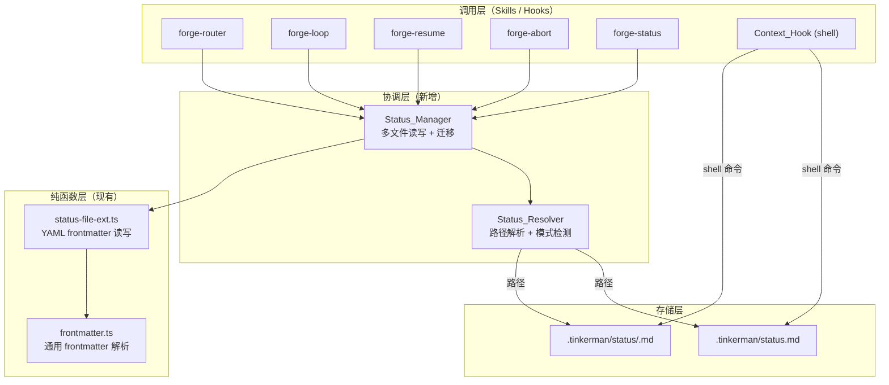
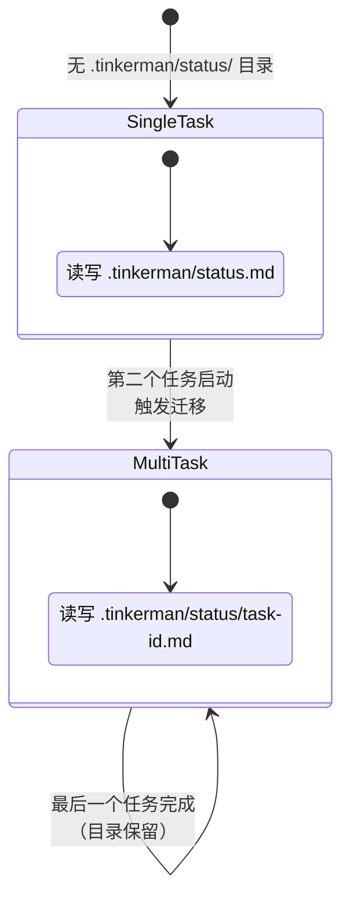

# Design Document: Parallel Status Tracking

## Overview

当前 Forge 的 `.tinkerman/status.md` 是单任务状态快照，无法支持多个 worktree 并行开发。本设计引入多文件状态追踪模式（`.tinkerman/status/<task-id>.md`），使每个并行任务拥有独立的状态文件，同时保持单任务场景下的完全向后兼容。

### 设计目标

1. **并行隔离**：每个任务的状态读写互不干扰
2. **向后兼容**：单任务场景行为不变，无需迁移
3. **透明切换**：Status_Manager 自动检测模式，上层调用者无需感知
4. **最小侵入**：复用现有 YAML frontmatter 格式，不改变字段 schema

### 核心决策

| 决策 | 选择 | 理由 |
|------|------|------|
| 多任务存储方式 | `.tinkerman/status/<task-id>.md` 多文件 | 文件级隔离，无并发写冲突，shell 命令易读取 |
| 模式检测 | 基于 `.tinkerman/status/` 目录是否存在 | 零配置，目录即信号 |
| Task ID 生成 | slugify（小写 + 连字符） | URL-safe、filesystem-safe、人类可读 |
| 迁移时机 | 第二个任务启动时自动迁移 | 延迟迁移，单任务用户零感知 |
| CJK 字符处理 | 移除（不做拼音转写） | 避免引入重量级依赖，alphanumeric 部分足够区分 |

## Architecture

### 分层架构



### 模式切换状态机



## Components and Interfaces

### 1. `slugify(taskName: string): string`

**位置**：`src/status-resolver.ts`（新文件）

纯函数，将任务名称转换为 filesystem-safe 标识符。

```typescript
/**
 * 将任务名称转换为 URL-safe、filesystem-safe 的标识符。
 *
 * 规则：
 * 1. 转小写
 * 2. 移除非 ASCII 字母数字字符（CJK 等 Unicode 字符直接移除）
 * 3. 将空格和特殊字符替换为连字符
 * 4. 折叠连续连字符为单个
 * 5. 去除首尾连字符
 *
 * @throws Error 如果输入为空或不含任何字母数字字符
 */
export function slugify(taskName: string): string;
```

### 2. `StatusResolver`

**位置**：`src/status-resolver.ts`（新文件）

负责根据执行上下文确定状态文件路径。

```typescript
export interface ResolverContext {
  /** 当前任务名称 */
  taskName: string;
  /** .forge 根目录路径 */
  forgeRoot: string;
}

export interface ResolvedStatus {
  /** 状态文件的完整路径 */
  filePath: string;
  /** 当前模式 */
  mode: "single" | "multi";
  /** 任务 ID（slugified） */
  taskId: string;
}

/**
 * 解析状态文件路径。
 *
 * 模式检测逻辑：
 * - 如果 .tinkerman/status/ 目录存在 → multi 模式
 * - 否则 → single 模式
 *
 * 路径解析：
 * - single 模式 → .tinkerman/status.md
 * - multi 模式 → .tinkerman/status/<task-id>.md
 */
export function resolveStatusPath(ctx: ResolverContext): ResolvedStatus;

/**
 * 检测当前是否处于多任务模式。
 * 基于 .tinkerman/status/ 目录是否存在。
 */
export function isMultiTaskMode(forgeRoot: string): boolean;
```

### 3. `StatusManager`

**位置**：`src/status-manager.ts`（新文件）

封装多文件状态管理的高层操作，包括迁移、列举、读写。

```typescript
export interface TaskStatusEntry {
  taskId: string;
  taskName: string;
  phase: string;
  tier?: string;
  updated?: string;
  filePath: string;
}

export interface StatusManagerIO {
  /** 检查文件是否存在 */
  exists: (path: string) => boolean;
  /** 检查目录是否存在 */
  dirExists: (path: string) => boolean;
  /** 读取文件内容 */
  read: (path: string) => string;
  /** 写入文件内容（自动创建父目录） */
  write: (path: string, content: string) => void;
  /** 列举目录下的文件名 */
  listDir: (path: string) => string[];
  /** 移动文件 */
  move: (src: string, dest: string) => void;
  /** 创建目录（递归） */
  mkdirp: (path: string) => void;
}

/**
 * 列举所有活跃任务。
 * 扫描 .tinkerman/status.md 和 .tinkerman/status/*.md，
 * 返回 phase 不为 completed/aborted 的任务列表。
 */
export function listActiveTasks(io: StatusManagerIO, forgeRoot: string): TaskStatusEntry[];

/**
 * 读取指定任务的状态。
 * 优先读取 .tinkerman/status/<task-id>.md，
 * 不存在则回退到 .tinkerman/status.md。
 */
export function readTaskStatus(
  io: StatusManagerIO,
  forgeRoot: string,
  taskName: string,
): string;

/**
 * 写入指定任务的状态。
 * 根据当前模式决定写入路径。
 * 如果是首次进入多任务模式，自动执行迁移。
 */
export function writeTaskStatus(
  io: StatusManagerIO,
  forgeRoot: string,
  taskName: string,
  content: string,
): void;

/**
 * 迁移：将 Legacy_StatusFile 内容迁移到多文件模式。
 * 1. 从 .tinkerman/status.md 读取 current_task
 * 2. slugify 得到 task-id
 * 3. 创建 .tinkerman/status/ 目录
 * 4. 将内容写入 .tinkerman/status/<task-id>.md
 * 5. 清空 .tinkerman/status.md（保留空 frontmatter）
 */
export function migrateToMultiTask(io: StatusManagerIO, forgeRoot: string): void;

/**
 * 归档指定任务的状态文件。
 * 将 .tinkerman/status/<task-id>.md 移动到 .tinkerman/archive/<date>-<task-id>/status.md
 */
export function archiveTaskStatus(
  io: StatusManagerIO,
  forgeRoot: string,
  taskName: string,
): void;

/**
 * 获取最近更新的活跃任务。
 * 用于 Context_Hook 在多任务模式下选择注入哪个任务的上下文。
 */
export function getMostRecentActiveTask(
  io: StatusManagerIO,
  forgeRoot: string,
): TaskStatusEntry | null;
```

### 4. 现有模块适配

#### `sdk-status-helpers.ts` 修改

`StatusFileIO` 接口不变，但 `read`/`write` 回调的实现需要由调用方（`sdk-driver.ts`）通过 `StatusManager` 路由到正确的文件：

```typescript
// sdk-driver.ts 中构造 StatusFileIO 时：
const statusIO: StatusFileIO = {
  read: () => readTaskStatus(managerIO, forgeRoot, currentTaskName),
  write: (content) => writeTaskStatus(managerIO, forgeRoot, currentTaskName, content),
};
```

这样 `sdk-status-helpers.ts` 中的所有函数（`initializeLoopFields`、`clearLoopFieldsOnShutdown` 等）无需修改，它们通过 `StatusFileIO` 接口自动路由到正确的任务文件。

#### `status-file-ext.ts` 无修改

所有纯函数（`extractLoopFields`、`writeLoopFields`、`clearLoopFields`、`updateIterationStatus` 等）操作的是字符串内容，不涉及文件路径，无需修改。

### 5. Hook 脚本适配

`hooks/hooks.json` 中的 shell 命令需要兼容多文件模式：

**UserPromptSubmit hook**（当前）：
```bash
if [ -f .tinkerman/status.md ]; then ...
```

**UserPromptSubmit hook**（修改后）：
```bash
if [ -d .tinkerman/status ]; then
  # 多任务模式：读取最近更新的任务文件
  latest=$(ls -t .tinkerman/status/*.md 2>/dev/null | head -1)
  if [ -n "$latest" ]; then
    echo '=== Forge Context ==='; head -50 .tinkerman/plans/*.md 2>/dev/null
    echo '=== Recent Progress ==='; tail -20 .tinkerman/progress/*.md 2>/dev/null
  fi
elif [ -f .tinkerman/status.md ]; then
  # 单任务模式：保持原有行为
  echo '=== Forge Context ==='; head -50 .tinkerman/plans/*.md 2>/dev/null
  echo '=== Recent Progress ==='; tail -20 .tinkerman/progress/*.md 2>/dev/null
fi
```

**TeammateIdle hook**（当前）：
```bash
phase=$(grep '^phase:' .tinkerman/status.md 2>/dev/null | sed '...')
```

**TeammateIdle hook**（修改后）：
```bash
if [ -d .tinkerman/status ]; then
  latest=$(ls -t .tinkerman/status/*.md 2>/dev/null | head -1)
  phase=$(grep '^phase:' "$latest" 2>/dev/null | sed 's/phase: *"\{0,1\}//;s/"\{0,1\} *$//')
else
  phase=$(grep '^phase:' .tinkerman/status.md 2>/dev/null | sed 's/phase: *"\{0,1\}//;s/"\{0,1\} *$//')
fi
```

**PostToolUse hook**（当前）：
```bash
if [ -f .tinkerman/status.md ]; then echo '📝 ...'; fi
```

**PostToolUse hook**（修改后）：
```bash
if [ -d .tinkerman/status ] || [ -f .tinkerman/status.md ]; then echo '📝 ...'; fi
```

## Data Models

### StatusFile YAML Frontmatter（不变）

```yaml
---
current_task: "为用户 API 添加分页功能"
tier: "standard"
task_type: "backend"
project_phase: "iteration"
phase: "build"
hints: "api-contract-check,backward-compat"
mode: "autonomous"
loop_run_id: "a1b2c3d4-e5f6-7890-abcd-ef1234567890"
loop_iteration: 5
skill_sequence: "plan,build,review,test,ship"
updated: "2025-01-15 14:30"
---
```

字段 schema 完全不变。单文件和多文件模式使用相同的 frontmatter 格式。

### 文件系统布局

**单任务模式**（向后兼容）：
```
.tinkerman/
  status.md              ← Legacy_StatusFile
```

**多任务模式**：
```
.tinkerman/
  status.md              ← 清空或保留为空 frontmatter（迁移后）
  status/
    user-api-pagination.md    ← Task_StatusFile
    order-batch-export.md     ← Task_StatusFile
    auth-system-refactor.md   ← Task_StatusFile
```

### Task_ID 生成规则

| 输入 | 输出 |
|------|------|
| `"为用户 API 添加分页功能"` | `"api"` |
| `"User API Pagination"` | `"user-api-pagination"` |
| `"fix bug #123"` | `"fix-bug-123"` |
| `"重构认证系统 v2.0"` | `"v2-0"` |
| `"  --hello--world--  "` | `"hello-world"` |
| `""` | Error |
| `"你好世界"` | Error（无 alphanumeric 字符） |

## Correctness Properties

*A property is a characteristic or behavior that should hold true across all valid executions of a system — essentially, a formal statement about what the system should do. Properties serve as the bridge between human-readable specifications and machine-verifiable correctness guarantees.*

### Property 1: Slugify output validity

*For any* string containing at least one ASCII alphanumeric character, `slugify` SHALL produce a non-empty string containing only lowercase letters `[a-z]`, digits `[0-9]`, and hyphens `[-]`, with no consecutive hyphens, no leading hyphen, and no trailing hyphen.

**Validates: Requirements 1.1, 10.1, 10.2**

### Property 2: Slugify determinism

*For any* task name string, calling `slugify` twice with the same input SHALL produce identical output.

**Validates: Requirements 1.4**

### Property 3: Slugify error on invalid input

*For any* string that is empty or contains no ASCII alphanumeric characters, `slugify` SHALL throw an error.

**Validates: Requirements 1.5**

### Property 4: Read fallback resolution

*For any* task name, if a task-specific file (`.tinkerman/status/<task-id>.md`) exists, `readTaskStatus` SHALL return its content; if it does not exist but `.tinkerman/status.md` exists, `readTaskStatus` SHALL return the legacy file's content.

**Validates: Requirements 2.2**

### Property 5: Frontmatter round-trip preservation

*For any* valid set of StatusFile frontmatter fields (current_task, tier, phase, hints, mode, loop_run_id, loop_iteration, skill_sequence, updated), writing them to a StatusFile and reading them back SHALL produce values equal to the originals.

**Validates: Requirements 2.3, 8.4**

### Property 6: Active task listing completeness

*For any* set of StatusFiles (one legacy + N task-specific files) with varying phases, `listActiveTasks` SHALL return exactly those tasks whose phase is neither `"completed"` nor `"aborted"`, and no others.

**Validates: Requirements 2.4**

### Property 7: Router multi-task routing

*For any* new task name, when one or more Active_Tasks already exist, `writeTaskStatus` SHALL write to `.tinkerman/status/<task-id>.md` (not `.tinkerman/status.md`).

**Validates: Requirements 3.1**

### Property 8: Loop cleanup isolation

*For any* set of task-specific StatusFiles, clearing Loop fields for one task SHALL leave all other tasks' StatusFile content byte-identical to their state before the operation.

**Validates: Requirements 4.3, 4.4**

### Property 9: Most recent task selection

*For any* set of active task StatusFiles with distinct `updated` timestamps, `getMostRecentActiveTask` SHALL return the task with the latest `updated` value.

**Validates: Requirements 7.2**

### Property 10: Migration data preservation

*For any* valid Legacy_StatusFile content with a non-empty `current_task`, after migration to multi-task mode, the content of `.tinkerman/status/<task-id>.md` SHALL be identical to the original Legacy_StatusFile content.

**Validates: Requirements 8.2**

### Property 11: Abort isolation

*For any* set of active task StatusFiles, archiving one task SHALL leave all other tasks' StatusFile content unchanged.

**Validates: Requirements 9.2**

### Property 12: Task name round-trip via frontmatter

*For any* valid task name containing at least one ASCII alphanumeric character, slugifying the name to get a task-id, writing a StatusFile with `current_task` set to the original name, then reading back the `current_task` field SHALL recover the original task name.

**Validates: Requirements 10.4**

## Error Handling

### 文件系统错误

| 场景 | 处理策略 |
|------|---------|
| `.tinkerman/status/` 目录创建失败 | 回退到单文件模式，log warning |
| Task_StatusFile 写入失败 | log warning，不 crash（graceful degradation） |
| Task_StatusFile 读取失败 | 回退到 Legacy_StatusFile |
| `slugify` 输入无效 | 抛出描述性 Error |
| Legacy_StatusFile 迁移失败 | 保持单文件模式，log warning |

### 并发写入

多个 worktree 写入不同的 Task_StatusFile 时，由于每个任务写入独立文件，不存在写冲突。如果两个 worktree 意外使用相同的 task name（产生相同的 task-id），后写入者会覆盖前者——这是预期行为，因为相同 task name 意味着相同任务。

### Hook 超时

Context_Hook 的 5 秒超时约束通过以下方式保证：
- `ls -t` + `head -1` 选择最近文件的开销 < 100ms
- 单文件 `grep`/`head` 操作与当前行为一致
- 不引入任何网络 I/O 或重量级计算

## Testing Strategy

### 属性测试（Property-Based Testing）

使用 `fast-check` 库，每个属性测试最少 100 次迭代。

| Property | 测试文件 | 生成器 |
|----------|---------|--------|
| P1: Slugify output validity | `test/status-resolver.test.ts` | `fc.string()` filtered to contain ≥1 alphanumeric |
| P2: Slugify determinism | `test/status-resolver.test.ts` | `fc.string()` |
| P3: Slugify error on invalid | `test/status-resolver.test.ts` | `fc.string()` filtered to contain 0 alphanumeric |
| P4: Read fallback | `test/status-manager.test.ts` | `fc.record()` of task names + file existence flags |
| P5: Frontmatter round-trip | `test/status-manager.test.ts` | `fc.record()` of frontmatter field values |
| P6: Active task listing | `test/status-manager.test.ts` | `fc.array()` of `{taskName, phase}` |
| P7: Router multi-task routing | `test/status-manager.test.ts` | `fc.string()` task names + existing active tasks |
| P8: Loop cleanup isolation | `test/status-manager.test.ts` | `fc.array()` of task StatusFile contents |
| P9: Most recent task selection | `test/status-manager.test.ts` | `fc.array()` of `{taskName, updated}` |
| P10: Migration preservation | `test/status-manager.test.ts` | `fc.record()` of valid legacy StatusFile content |
| P11: Abort isolation | `test/status-manager.test.ts` | `fc.array()` of task StatusFile contents |
| P12: Task name round-trip | `test/status-resolver.test.ts` | `fc.string()` filtered to contain ≥1 alphanumeric |

每个属性测试标注格式：
```typescript
// Feature: parallel-status-tracking, Property 1: Slugify output validity
```

### 单元测试（Example-Based）

| 场景 | 测试文件 |
|------|---------|
| 单任务模式路径解析 (1.3) | `test/status-resolver.test.ts` |
| 无活跃任务时 router 写入 legacy (3.2) | `test/status-manager.test.ts` |
| 活跃任务列表显示 (3.3) | `test/status-manager.test.ts` |
| 写入失败 graceful degradation (2.5) | `test/status-manager.test.ts` |
| 单任务 resume 自动恢复 (5.3) | `test/status-manager.test.ts` |
| 单任务 status 显示格式 (6.3) | `test/status-manager.test.ts` |
| Hook 无文件时 clean exit (7.4) | shell 脚本测试 |
| 目录不自动删除 (8.3) | `test/status-manager.test.ts` |
| Pretty_Printer 读取 current_task (10.3) | `test/status-resolver.test.ts` |

### 集成测试

| 场景 | 说明 |
|------|------|
| 完整迁移流程 | 单任务 → 启动第二任务 → 验证迁移 → 两个任务独立读写 |
| Hook 脚本兼容性 | 单任务模式和多任务模式下 hook 输出正确 |
| Loop 全流程隔离 | 两个任务并行 loop，互不干扰 |
