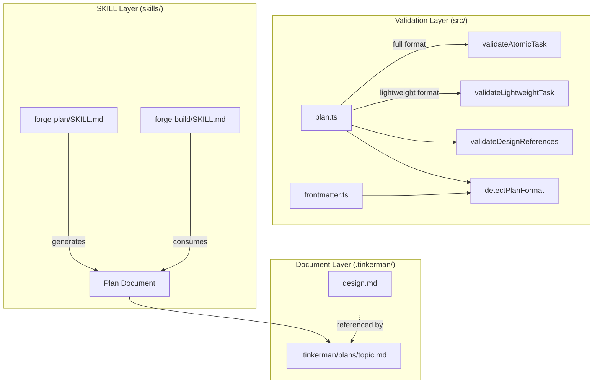
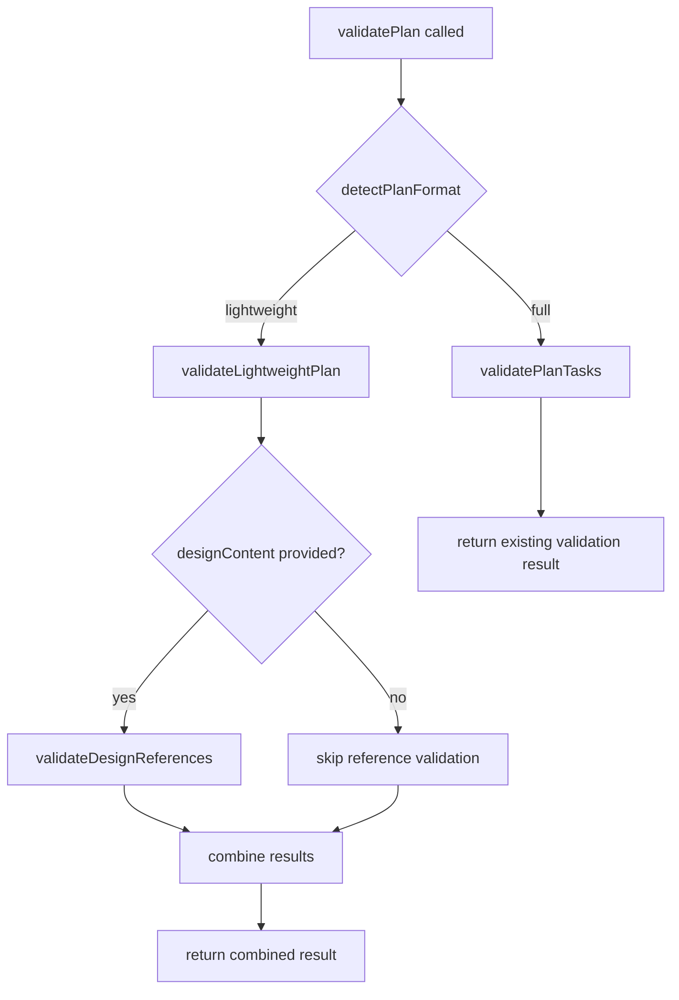

# Design: Plan Document Streamlining

## Overview

This feature redefines the boundary between Spec documents (requirements.md, design.md, tasks.md) and Plan documents (`.tinkerman/plans/<topic>.md`). Currently, each atomic task in a Plan contains full RED/GREEN/REFACTOR code blocks, duplicating much of what design.md already specifies. For large features (10+ requirements, 12+ property tests, 10+ file changes), writing a Plan is itself a massive effort.

The streamlined approach introduces a **Lightweight Task** format where Plans focus on three concerns: **File Mapping**, **Task Dependency Graph**, and **Spec Coverage Matrix**. Instead of embedding full code, each task references specific design.md chapters via **Design References**. The build phase then uses TDD to write the actual code, guided by the design.md context.

**Key design decisions:**

1. **Dual-format support**: A new `format` field in YAML frontmatter (`lightweight` | `full`) determines which validation path to use. This preserves backward compatibility.
2. **Design Reference as first-class concept**: `design.md#<anchor>` links are validated at plan-generation time, catching stale references before build begins.
3. **Validation reuse**: The existing `validateAtomicTask()` / `validatePlanTasks()` functions remain untouched for `full` format. New `validateLightweightTask()` / `validateLightweightPlan()` functions handle the `lightweight` format. A unified `validatePlan()` dispatcher selects the right path based on format.
4. **SKILL.md updates are documentation-only**: forge-plan and forge-build SKILL.md changes define the new workflow for AI agents but don't affect TypeScript validation logic.

## Architecture

The feature touches three layers:



**Data flow:**

1. `forge-plan` reads a locked Spec (including design.md) and generates a Plan document in lightweight format.
2. `plan.ts` validates the Plan — detecting format from frontmatter, then dispatching to the appropriate validator.
3. `forge-build` reads the approved Plan, follows Design References to load relevant design.md sections, and executes TDD.

**Unchanged components:**
- `task-graph.ts` — dependency graph validation and scheduling (already works with task IDs and `dependsOn`)
- `frontmatter.ts` — YAML frontmatter parsing (already supports `extractStringField`)
- Existing `AtomicTask` interface and `full` format validation

## Components and Interfaces

### New Types (src/plan.ts)

```typescript
/** Format discriminator for Plan documents. */
export type PlanFormat = "lightweight" | "full";

/** A lightweight task that references design.md instead of embedding code. */
export interface LightweightTask {
  /** Sequential task number. */
  taskNumber: number;
  /** One-line task title. */
  title: string;
  /** Target file path (relative to project root). */
  filePath: string;
  /** One-sentence description of the behavioral change this task implements. */
  goal: string;
  /** Reference to design.md chapter: "design.md#<anchor>". */
  designReference: string;
  /** Optional: Correctness Property number from design.md (for property test tasks). */
  propertyRef?: number;
  /** Command to verify task completion. */
  verifyCommand: string;
  /** Atomic commit message. */
  commitMessage: string;
  /** Task numbers this task depends on. */
  dependsOn?: number[];
}

/** A Design Reference entry for the index table. */
export interface DesignReferenceEntry {
  /** The anchor: "design.md#<section-anchor>". */
  anchor: string;
  /** One-sentence summary of what the referenced section defines. */
  summary: string;
}

/** Result of validating a Design Reference against actual design.md content. */
export interface DesignReferenceValidation {
  valid: boolean;
  errors: string[];
}
```

### New Validation Functions (src/plan.ts)

```typescript
/**
 * Detect the plan format from YAML frontmatter.
 * Returns "lightweight" or "full". Defaults to "full" when field is missing.
 */
export function detectPlanFormat(frontmatter: string): PlanFormat;

/**
 * Validate a single lightweight task.
 * Checks: required fields non-empty, no forbidden placeholders,
 * Design Reference format validity.
 */
export function validateLightweightTask(
  task: LightweightTask
): { valid: boolean; errors: string[] };

/**
 * Validate all tasks in a lightweight plan.
 * Checks: non-empty task list, all tasks valid, dependencies valid.
 */
export function validateLightweightPlan(
  tasks: LightweightTask[]
): boolean;

/**
 * Validate Design References against actual design.md headings.
 * Extracts markdown headings from design content, converts to anchors,
 * and checks that each reference points to an existing anchor.
 */
export function validateDesignReferences(
  references: string[],
  designContent: string
): DesignReferenceValidation;

/**
 * Extract markdown heading anchors from design.md content.
 * Converts headings to GitHub-style anchors (lowercase, hyphens for spaces,
 * strip special chars).
 */
export function extractHeadingAnchors(markdownContent: string): string[];

/**
 * Unified plan validation dispatcher.
 * Detects format from frontmatter and delegates to the appropriate validator.
 */
export function validatePlan(
  frontmatter: string,
  tasks: AtomicTask[] | LightweightTask[],
  designContent?: string
): { valid: boolean; errors: string[]; format: PlanFormat };
```

### Updated YAML Frontmatter

```yaml
---
topic: "<topic>"
status: "draft" | "approved"
date: "YYYY-MM-DD"
spec_ref: ".tinkerman/specs/<feature>"
format: "lightweight" | "full"    # NEW — defaults to "full" if missing
---
```

### Lightweight Plan Document Structure

```markdown
---
topic: "<topic>"
status: "draft"
date: "YYYY-MM-DD"
spec_ref: ".tinkerman/specs/<feature>"
format: "lightweight"
---

## Objective

<One paragraph describing what this plan implements>

## Design Reference Index

| Anchor | Summary |
|--------|---------|
| `design.md#components-and-interfaces` | Defines LightweightTask interface and validation functions |
| `design.md#data-models` | Defines PlanFormat type and DesignReferenceEntry |

## File Mapping

| File Path | Operation | Description |
|-----------|-----------|-------------|
| `src/plan.ts` | MODIFY | Add LightweightTask validation |
| `test/plan.property.test.ts` | MODIFY | Add property tests for lightweight format |

## Task Breakdown

### Task 1: <Title>

- **Goal**: <One sentence describing the behavioral change>
- **File**: `<file-path>`
- **Design Reference**: `design.md#<anchor>` — <summary>
- **Property**: Property N (if applicable)
- **Depends On**: (none | Task N, Task M)
- **Verify**: `<command>`
- **Commit**: `<commit message>`

## Spec Coverage

| Requirement | Acceptance Criteria | Covering Tasks |
|-------------|-------------------|----------------|
| Req 1.1 | Plan职责限定 | Task 1 |
```

## Data Models

### PlanFormat Detection Logic

```
Input: YAML frontmatter string
Output: PlanFormat ("lightweight" | "full")

1. Extract "format" field using extractStringField(frontmatter, "format")
2. If value is "lightweight" → return "lightweight"
3. Otherwise (missing, "full", or any other value) → return "full"
```

### Design Reference Format

Design References follow the pattern: `design.md#<anchor>`

Where `<anchor>` is a GitHub-style heading anchor:
- Lowercase all characters
- Replace spaces with hyphens
- Strip characters that aren't alphanumeric, hyphens, or underscores

Example: `## Components and Interfaces` → `design.md#components-and-interfaces`

### Heading Anchor Extraction Algorithm

```
Input: Markdown content string
Output: Array of anchor strings

1. Split content by newlines
2. For each line matching /^#{1,6}\s+(.+)$/:
   a. Extract the heading text (group 1)
   b. Convert to lowercase
   c. Replace spaces with hyphens
   d. Remove characters not matching [a-z0-9\-_]
   e. Add to anchors array
3. Return anchors array
```

### Validation Decision Tree




## Correctness Properties

*A property is a characteristic or behavior that should hold true across all valid executions of a system — essentially, a formal statement about what the system should do. Properties serve as the bridge between human-readable specifications and machine-verifiable correctness guarantees.*

The following properties are derived from the acceptance criteria prework analysis. Each property is universally quantified and suitable for property-based testing with fast-check.

### Property 1: LightweightTask validation — valid tasks pass, invalid tasks fail

*For any* LightweightTask with all required fields (taskNumber, title, filePath, goal, designReference, verifyCommand, commitMessage) populated with non-empty, placeholder-free strings, `validateLightweightTask` SHALL return `{ valid: true, errors: [] }`. Conversely, *for any* LightweightTask with at least one empty required field OR a forbidden placeholder in any text field, `validateLightweightTask` SHALL return `{ valid: false }` with a non-empty errors array.

**Validates: Requirements 2.1, 2.3, 2.4, 7.2, 8.1, 8.2**

### Property 2: Heading anchor extraction preserves heading identity

*For any* markdown content containing headings (lines matching `^#{1,6}\s+(.+)$`), `extractHeadingAnchors` SHALL return an array where each anchor is: (a) entirely lowercase, (b) uses hyphens instead of spaces, (c) contains only characters matching `[a-z0-9\-_]`, and (d) the number of anchors equals the number of headings in the content.

**Validates: Requirements 1.4, 6.1**

### Property 3: Design Reference validation — existing anchors pass, missing anchors fail

*For any* design.md content with known headings and *for any* Design Reference string that matches an extracted heading anchor, `validateDesignReferences` SHALL return `{ valid: true }`. Conversely, *for any* Design Reference string that does NOT match any heading anchor in the content, `validateDesignReferences` SHALL return `{ valid: false }` with an error identifying the stale reference.

**Validates: Requirements 6.3, 7.3**

### Property 4: Format detection defaults to "full"

*For any* YAML frontmatter string, `detectPlanFormat` SHALL return `"lightweight"` if and only if the frontmatter contains `format: "lightweight"` (or `format: lightweight`). *For any* frontmatter without a `format` field, or with `format: "full"`, or with any other value, `detectPlanFormat` SHALL return `"full"`.

**Validates: Requirements 9.1, 9.3, 9.4**

### Property 5: Lightweight plan validation — valid plans pass, invalid plans fail

*For any* non-empty array of valid LightweightTasks with valid dependency references (all `dependsOn` entries point to existing task numbers), `validateLightweightPlan` SHALL return `true`. *For any* empty array, or array containing at least one invalid task, or array with a dependency referencing a non-existent task number, `validateLightweightPlan` SHALL return `false`.

**Validates: Requirements 4.1, 4.2**

### Property 6: Placeholder scanning covers all lightweight task text fields

*For any* LightweightTask and *for any* forbidden placeholder string, injecting that placeholder into any text field (title, filePath, goal, designReference, verifyCommand, commitMessage) SHALL cause `validateLightweightTask` to return `{ valid: false }` with an error mentioning "forbidden placeholders".

**Validates: Requirements 7.2**

## Error Handling

### Validation Errors

| Error Condition | Handling | User-Facing Message |
|----------------|----------|-------------------|
| Missing required field in LightweightTask | Return `{ valid: false, errors: ["Missing <field>"] }` | Self-check reports missing field with task number |
| Forbidden placeholder detected | Return `{ valid: false, errors: ["Found forbidden placeholders: ..."] }` | Self-check reports placeholder location |
| Invalid Design Reference format | Return `{ valid: false, errors: ["Invalid Design Reference format: ..."] }` | Self-check reports malformed reference |
| Stale Design Reference (anchor not found) | Return `{ valid: false, errors: ["Design Reference ... not found in design.md"] }` | Self-check reports stale reference with suggestion |
| Circular dependency in task graph | Delegated to existing `task-graph.ts` cycle detection | Self-check reports cycle with involved tasks |
| Empty task list | Return `false` from `validateLightweightPlan` | Self-check reports empty plan |
| Missing design.md when format is lightweight | Skip Design Reference validation, log warning | Plan generation continues without reference validation |

### Backward Compatibility Errors

| Scenario | Behavior |
|----------|----------|
| `format` field missing from frontmatter | Default to `"full"`, use existing `validateAtomicTask` path |
| `format: "full"` with LightweightTask data | Validation fails (type mismatch at runtime) |
| `format: "lightweight"` with AtomicTask data | Validation fails (missing `goal` and `designReference` fields) |

### Graceful Degradation

When `design.md` is not available during validation:
1. `validateDesignReferences` is skipped entirely
2. `validateLightweightTask` still validates all other fields
3. A warning is emitted but validation does not fail
4. The plan can still be approved and used by build phase

## Testing Strategy

### Property-Based Tests (fast-check)

The project uses **fast-check** for property-based testing, following the existing pattern in `test/plan.property.test.ts`.

**Configuration**: Minimum 100 iterations per property test (existing tests use 200).

**Test file**: `test/plan.property.test.ts` (extend existing file)

Each property test must:
- Reference its design document property number
- Use the tag format: **Feature: plan-document-streamlining, Property N: <property_text>**
- Run minimum 100 iterations via `{ numRuns: 200 }`

**Generators needed**:
- `validLightweightTaskArb` — generates LightweightTasks with all required fields populated, no placeholders
- `lightweightTaskMissingFieldArb` — generates LightweightTasks with one random required field empty
- `lightweightTaskWithPlaceholderArb` — generates LightweightTasks with a forbidden placeholder injected
- `markdownWithHeadingsArb` — generates markdown content with random headings
- `validDesignReferenceArb` — generates `design.md#<anchor>` strings matching generated headings
- `staleDesignReferenceArb` — generates `design.md#<anchor>` strings NOT matching any heading
- `frontmatterWithFormatArb` — generates YAML frontmatter with various `format` field values

### Unit Tests (example-based)

- `detectPlanFormat` with explicit "lightweight", "full", missing, and edge-case values
- `validateLightweightTask` with specific valid and invalid task examples
- `validateDesignReferences` with known design.md content and specific references
- `extractHeadingAnchors` with specific markdown content including edge cases (special characters, CJK headings, nested headings)
- `validatePlan` dispatcher routing to correct validator based on format
- Backward compatibility: existing `validateAtomicTask` and `validatePlanTasks` still work unchanged

### Integration Tests

- End-to-end validation of a complete lightweight plan document (parse frontmatter → detect format → validate tasks → validate references)
- Verify that existing full-format plans still validate correctly after code changes
