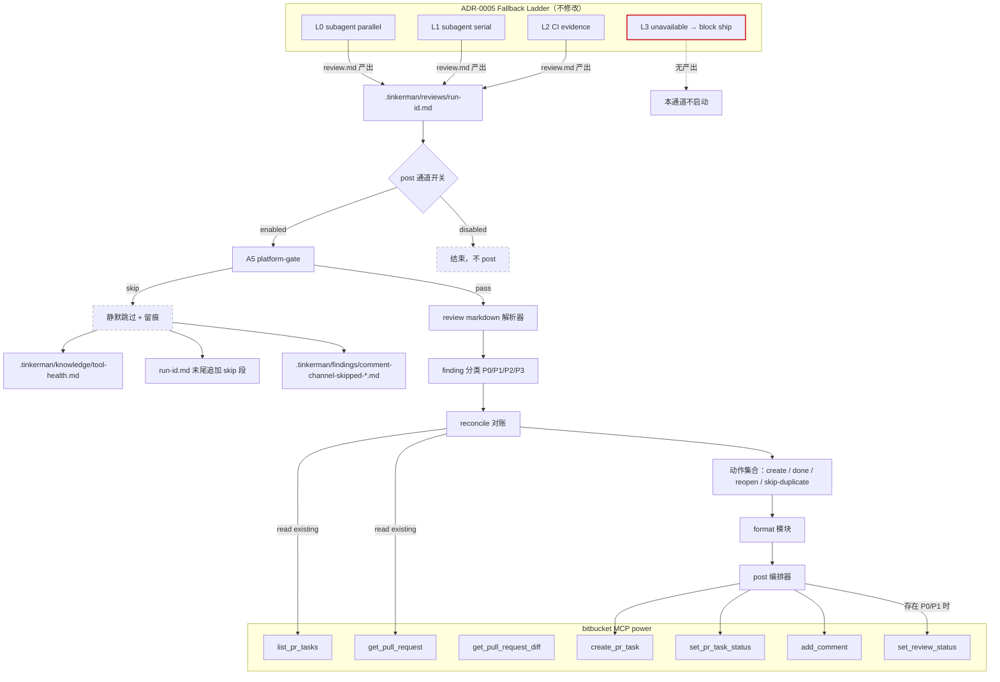
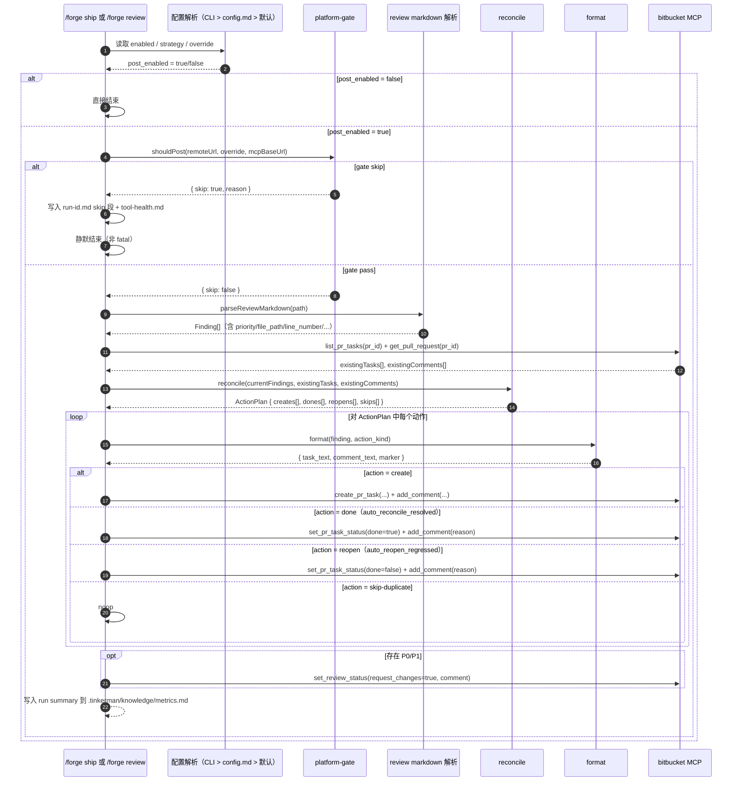

# Design Document: review-comment-bitbucket

> **权威来源**：`.tinkerman/decisions/2026-05-23-review-inline-comment-channel.md`（决策已锁定，4 个开放问题已回答）
> **配套约束**：`.tinkerman/decisions/2026-05-18-review-fallback-ladder.md`（ADR-0005）、`.tinkerman/decisions/2026-05-16-claude-code-uplift-2.1.143.md`、`AGENTS.md`、`.tinkerman/config.md`
> **本文档原则**：只描述"如何实现"，不重复"为什么这样设计"。论证请回到决策记录。

## Overview

本 SKILL 在 `/forge review` 产出 `.tinkerman/reviews/<run-id>.md` 之后，作为**独立的交付层**把 finding 投递到 Bitbucket PR：P0/P1 双层（PR Task + inline comment），P2 单层（仅 inline comment），P3 不投递。整体流程串接在 ADR-0005 fallback ladder 之后，不修改 fallback ladder 自身行为，不影响 ship gate 判定逻辑（ship 仍以 review markdown 为 source of truth）。

实现采用纯函数 + 单一编排入口的结构：`platform-gate` 决定是否启动、`finding-hash` 提供稳定身份、`reconcile` 计算需要执行的动作集合、`format` 把 finding 转成 Bitbucket 文本，`post` 在最外层串联并调用 `bitbucket` MCP power。所有副作用集中在 `post.ts`，其余模块为纯函数以便走 §2.1 TDD 铁律 + property-based testing。本 spec **仅实现 Bitbucket 平台**（决策记录 §3.3 A3），**不实现 P3 投递**（决策记录 §3.1 P3 处理规则）。

本设计文档分两层组织：**High-Level Design**（§Architecture，含系统组件图、关键流程图、双层映射约定）和 **Low-Level Design**（§Components and Interfaces，含每个 lib/ 模块的伪代码 + 接口签名）。其余段按 Kiro spec 规范组织：`## Data Models` 列出共用类型，`## Configuration Schema` 列出配置项，`## Bitbucket MCP 工具调用清单` 列出 MCP 调用契约，`## Correctness Properties` 给出 property-based testing 的形式化性质，`## Testing Strategy` 给出测试组织，`## Error Handling` 给出失败模式，`## Out of Scope` 显式声明非目标，`## Open Questions` 列出 spec lock 前的待确认项。

## Architecture

### High-Level Design：系统组件图（与 ADR-0005 fallback ladder 的关系）



**关键边界**：

- 本 SKILL 不修改 fallback ladder 任何节点，只在其完成后被调用
- `request_changes`（`set_review_status`）只是协作信号，**不替代** ship gate 的 P0/P1 阻断（仍由 review markdown 驱动）
- L3（无 review 产出）时本通道不启动；L0/L1/L2 任一产出 markdown 即可触发

### High-Level Design：关键流程图（A5 平台门禁 → 解析 → 分类 → reconcile → post）



### High-Level Design：Finding → Bitbucket 双层映射

```
P0/P1 finding（必须修复，阻断 ship）
    ├─ create_pr_task("[Forge P0/P1] <one-line summary>" + marker)
    └─ add_comment(file_path, line_number, line_type,
                   comment_text=<详细描述 + suggestion + marker>)
P2 finding（建议修复）
    └─ add_comment（普通 inline comment，无 task）
P3 finding（开发者决定）
    └─ 仅写入 .tinkerman/reviews/<run-id>.md（本 spec 不投递）
存在任何 P0/P1 → set_review_status(pull_request_id, request_changes=true,
                                    comment="Forge review found N P0/P1 findings")
```

策略选项见 `## Configuration Schema`：`p0_p1_strategy ∈ {both, pr-task, inline-only}`、`p2_strategy ∈ {inline, none}`、`p3_strategy ∈ {none}`（本 spec 仅接受 `none`）。

## Components and Interfaces

### Low-Level Design：模块结构

```
skills/forge/lib/review-comment-bitbucket/
├── instructions.md         # SKILL 主文档
├── lib/
│   ├── post.ts             # 主入口：read review markdown → call bitbucket tools
│   ├── platform-gate.ts    # A5：平台前置门禁（远端 URL + override + MCP 同源）
│   ├── finding-hash.ts     # 稳定 hash 计算 + marker 注入/提取
│   ├── reconcile.ts        # 对账（缺失/新增/重复）+ auto-reopen-regressed
│   ├── format.ts           # finding → comment_text / task_text
│   └── types.ts            # 共用类型
└── test/
    ├── platform-gate.test.ts
    ├── finding-hash.test.ts
    ├── reconcile.test.ts
    └── format.test.ts
```

### Component 1: `lib/post.ts`（主入口）

**Purpose**：编排 review markdown → Bitbucket 工具调用。所有副作用集中于此。

**Interface**：

```typescript
async function postReviewToBitbucket(
  reviewMarkdownPath: string,
  pullRequestId: string,
  config: ResolvedConfig,
  ctx: PostContext,
): Promise<PostResult>;

type PostContext = {
  remoteUrl: string | null;
  mcpBaseUrl: string | null;
  mcpConfigured: boolean;
  runId: string;
};

type PostResult =
  | { posted: false; reason: GateSkipReason }
  | { posted: true; plan_summary: PlanSummary; partial_failures?: ToolFailure[] };
```

**伪代码**：

```typescript
async function postReviewToBitbucket(reviewMarkdownPath, pullRequestId, config, ctx) {
  // 1. A5 平台前置门禁
  const gate = checkPlatformGate({
    remoteUrl: ctx.remoteUrl,
    platformOverride: config.platform_override,
    mcpBaseUrl: ctx.mcpBaseUrl,
    mcpConfigured: ctx.mcpConfigured,
  });
  if (gate.skip) {
    await recordSkip(reviewMarkdownPath, gate.reason, ctx);
    return { posted: false, reason: gate.reason };
  }

  // 2. 解析 review markdown → 归一化 Finding[]，过滤 P3
  const findings = await parseReviewMarkdown(reviewMarkdownPath);
  const targets = findings.filter((f) => f.priority !== 'P3');

  // 3. 拉已有 task / comment（marker_hash 提取）
  const [existingTasksRaw, existingCommentsRaw] = await Promise.all([
    bitbucket.list_pr_tasks({ pull_request_id: pullRequestId }),
    bitbucket.get_pull_request({ pull_request_id: pullRequestId }),
  ]);
  const existingTasks = extractForgeTasks(existingTasksRaw, config.comment_marker_prefix);
  const existingComments = extractForgeComments(existingCommentsRaw, config.comment_marker_prefix);

  // 4. reconcile 纯函数 → ActionPlan
  const plan = reconcile({
    currentFindings: targets,
    existingTasks,
    existingComments,
    autoReconcileResolved: config.auto_reconcile_resolved,
    autoReopenRegressed: config.auto_reopen_regressed,
  });

  // 5. 按固定顺序执行：create → reopen → done；动作之间 sleep rate_limit_interval_ms
  const failures = await executePlan(plan, config, pullRequestId, ctx.runId);

  // 6. 存在 P0/P1 → set_review_status(request_changes)
  if (plan.has_p0_p1 && config.request_changes_on_p0_p1) {
    await bitbucket.set_review_status({
      pull_request_id: pullRequestId,
      request_changes: true,
      comment: buildRequestChangesSummary(plan),
    });
  }

  // 7. 累计 metrics（不影响主流程结果）
  await appendRunMetrics(plan, ctx);
  return { posted: true, plan_summary: summarize(plan), partial_failures: failures };
}
```

**Responsibilities**：

- 唯一执行 IO 的模块；其它 lib 文件均为纯函数
- 顺序固定为 create → reopen → done，避免对同一 task 先 done 后又 reopen
- 单条动作失败不中断后续动作（partial success 语义），错误聚合写入 `.tinkerman/findings/comment-channel-error-<date>.md`

### Component 2: `lib/platform-gate.ts`（A5 平台前置门禁，8 行决策矩阵）

**Purpose**：决定本通道在当前仓库是否启动。**8 行决策矩阵每行必须独立可测**（决策记录 §3.3 A5）。

**Interface**：

```typescript
type GateInput = {
  remoteUrl: string | null;        // 来自 git config --get remote.origin.url；可能为 null
  platformOverride: 'auto' | 'bitbucket' | 'none';
  mcpConfigured: boolean;          // bitbucket MCP power 是否已配置
  mcpBaseUrl: string | null;       // BITBUCKET_BASE_URL 环境变量或 MCP 注入值
};

type GateSkipReason =
  | 'platform-disabled-by-config'      // override = none
  | 'platform-not-bitbucket'           // URL 不含 bitbucket. 且 override = auto
  | 'mcp-not-configured'               // override = auto 时 MCP 缺失
  | 'override-but-mcp-missing'         // override = bitbucket 但 MCP 缺失
  | 'mcp-base-url-mismatch';           // remote URL host ≠ BITBUCKET_BASE_URL host

type GateResult = { skip: false } | { skip: true; reason: GateSkipReason };

function checkPlatformGate(input: GateInput): GateResult;
```

**8 行决策矩阵**（来自决策记录 §3.3 A5）：

| # | URL 含 `bitbucket.` | override | MCP 配置 | 同源 | 决策 |
|---|---|---|---|---|---|
| 1 | 是 | auto | 已 | ✓ | ✅ pass |
| 2 | 是 | auto | 已 | ✗ | ⏭ `mcp-base-url-mismatch` |
| 3 | 是 | auto | 未 | — | ⏭ `mcp-not-configured` |
| 4 | 否 | auto | 任意 | — | ⏭ `platform-not-bitbucket` |
| 5 | 任意 | bitbucket | 已 | ✓ | ✅ pass（强制） |
| 6 | 任意 | bitbucket | 已 | ✗ | ⏭ `mcp-base-url-mismatch` |
| 7 | 任意 | bitbucket | 未 | — | ⏭ `override-but-mcp-missing` |
| 8 | 任意 | none | 任意 | — | ⏭ `platform-disabled-by-config` |

**伪代码**：

```typescript
function checkPlatformGate(input: GateInput): GateResult {
  // 第 8 行：override=none 最高优先级
  if (input.platformOverride === 'none') {
    return { skip: true, reason: 'platform-disabled-by-config' };
  }

  // 第 5/6/7 行：override=bitbucket 强制路径
  if (input.platformOverride === 'bitbucket') {
    if (!input.mcpConfigured) return { skip: true, reason: 'override-but-mcp-missing' };
    if (!isSameHost(input.remoteUrl, input.mcpBaseUrl)) {
      return { skip: true, reason: 'mcp-base-url-mismatch' };
    }
    return { skip: false };
  }

  // 第 1/2/3/4 行：override=auto
  if (!isBitbucketUrl(input.remoteUrl)) {
    return { skip: true, reason: 'platform-not-bitbucket' };
  }
  if (!input.mcpConfigured) return { skip: true, reason: 'mcp-not-configured' };
  if (!isSameHost(input.remoteUrl, input.mcpBaseUrl)) {
    return { skip: true, reason: 'mcp-base-url-mismatch' };
  }
  return { skip: false };
}

// helper：URL 含 `bitbucket.` 子域，或 host 与 BITBUCKET_BASE_URL 完全相等（大小写不敏感）
function isBitbucketUrl(url: string | null): boolean { /* ... */ }
// helper：比较两个 URL 的 host（含 port），忽略 protocol 与 path
function isSameHost(a: string | null, b: string | null): boolean { /* ... */ }
```

**Responsibilities**：

- 纯函数：相同 GateInput 必须返回相同 GateResult
- 任何检测失败 → 返回 `{ skip: true, reason }`，**不抛异常**（调用方负责静默跳过 + 留痕）
- `remoteUrl=null` 时按"URL 不含 bitbucket."处理（落入第 4 行）

### Component 3: `lib/finding-hash.ts`（稳定 hash 算法）

**Purpose**：为每个 finding 生成跨 review 轮次稳定的 12 位指纹，作为幂等机制的身份标识。

**Interface + 伪代码**：

```typescript
// hash 输入仅基于 4 个稳定字段，避免 message 文末措辞调整导致 hash 漂移
function computeFindingHash(
  f: Pick<Finding, 'file_path' | 'line_number' | 'finding_type' | 'message'>,
): string {
  const key = [
    f.file_path,
    String(f.line_number),
    f.finding_type,
    f.message.slice(0, 100),
  ].join('\u0000');                           // \u0000 分隔避免字段拼接歧义
  return sha256(key).slice(0, 12);            // 截短到 12 位十六进制
}

// marker 形如 <!-- forge-review:hash=abc123def456 -->
// 同时注入到 task text 末尾和 inline comment 末尾，便于 reconcile 反向识别
function buildMarker(prefix: string, hash: string): string {
  return `<!-- ${prefix}:hash=${hash} -->`;
}

const MARKER_RE = /<!--\s*([\w-]+):hash=([a-f0-9]{12})\s*-->/;
function extractMarker(text: string, prefix: string): string | null {
  const m = text.match(MARKER_RE);
  if (!m || m[1] !== prefix) return null;
  return m[2];
}
```

**Responsibilities**：

- hash 输入只取 `file_path + line_number + finding_type + first_100_chars(message)`，**不含** priority、suggestion、source_layer
- 同一 finding 在不同 review 轮次中、即使 message 文末措辞调整也保持稳定
- 不同 finding（任一稳定字段不同）必然产生不同 hash（在 sha256 截短到 12 位的碰撞概率范围内）
- 输出长度恒为 12，仅含 `[a-f0-9]`

### Component 4: `lib/reconcile.ts`（三种状态对账 + auto-reopen-regressed）

**Purpose**：纯函数计算 ActionPlan。决策记录 §3.3 A2（双方都能关 + auto-reopen 兜底）+ §4.3（缺失/新增/重复）的形式化实现。

**Interface**：

```typescript
type ReconcileInput = {
  currentFindings: Finding[];                 // 本次 review 产出的 P0/P1/P2 finding（P3 已被过滤）
  existingTasks: TaskRecord[];                // 仅含带 forge-review marker 的 task
  existingComments: CommentRecord[];          // 仅含带 forge-review marker 的 comment
  autoReconcileResolved: boolean;             // 缺失时是否自动 done
  autoReopenRegressed: boolean;               // 开发者关了但 finding 仍在时是否 reopen
};

function reconcile(input: ReconcileInput): ActionPlan;
```

**状态机**：

| 当前 finding | 历史 task | 历史 comment | autoReopen | autoDone | 动作 |
|---|---|---|---|---|---|
| 存在 (hash=h) | 不存在 | 不存在 | — | — | `create` |
| 存在 (hash=h) | OPEN | 任意 | — | — | `skip-duplicate` |
| 存在 (hash=h) | RESOLVED | 任意 | true | — | `reopen` |
| 存在 (hash=h) | RESOLVED | 任意 | false | — | `skip-duplicate` |
| 不存在 | OPEN (hash=h) | 任意 | — | true | `done` |
| 不存在 | OPEN (hash=h) | 任意 | — | false | `skip-duplicate`（保留以等待人工） |
| 不存在 | RESOLVED (hash=h) | 任意 | — | — | `skip-duplicate`（已是终态） |

**伪代码**：

```typescript
function reconcile(input: ReconcileInput): ActionPlan {
  const currentByHash = new Map<string, Finding>();
  for (const f of input.currentFindings) currentByHash.set(computeFindingHash(f), f);

  const existingTaskByHash = new Map<string, TaskRecord>();
  for (const t of input.existingTasks) {
    if (t.marker_hash) existingTaskByHash.set(t.marker_hash, t);
  }
  const existingCommentByHash = new Map<string, CommentRecord>();
  for (const c of input.existingComments) {
    if (c.marker_hash) existingCommentByHash.set(c.marker_hash, c);
  }

  const creates: Action[] = [];
  const reopens: Action[] = [];
  const dones: Action[] = [];
  const skips: Action[] = [];

  // 当前存在的 finding：决定 create / reopen / skip
  for (const [hash, finding] of currentByHash) {
    const task = existingTaskByHash.get(hash);
    const comment = existingCommentByHash.get(hash);
    if (!task && !comment) {
      creates.push({ kind: 'create', finding });
    } else if (task && task.status === 'RESOLVED') {
      if (input.autoReopenRegressed) {
        reopens.push({ kind: 'reopen', task_id: task.task_id, comment_id: comment?.comment_id, finding });
      } else {
        skips.push({ kind: 'skip-duplicate', finding_hash: hash });
      }
    } else {
      skips.push({ kind: 'skip-duplicate', finding_hash: hash });
    }
  }

  // 历史存在但当前缺失：决定 done / skip
  for (const [hash, task] of existingTaskByHash) {
    if (currentByHash.has(hash)) continue;
    if (task.status === 'OPEN' && input.autoReconcileResolved) {
      const comment = existingCommentByHash.get(hash);
      dones.push({ kind: 'done', task_id: task.task_id, comment_id: comment?.comment_id, finding_hash: hash });
    } else {
      skips.push({ kind: 'skip-duplicate', finding_hash: hash });
    }
  }

  const has_p0_p1 = input.currentFindings.some((f) => f.priority === 'P0' || f.priority === 'P1');
  return { creates, dones, reopens, skips, has_p0_p1 };
}
```

**Responsibilities**：

- 纯函数：相同输入必须产出相同 ActionPlan
- 输入 `existingTasks` / `existingComments` 已经过 `extractForgeTasks` / `extractForgeComments` 过滤 —— 非 Forge 创建的 task / comment **永远不会**被本函数操作（避免误碰人类讨论）
- 同一 hash 不会重复出现在 creates / dones / reopens 中（互斥性）

### Component 5: `lib/format.ts`（finding → comment_text / task_text）

**Purpose**：把 Finding 渲染成 Bitbucket 文本（含 marker prefix 注入），保证幂等识别。

**Interface + 伪代码**：

```typescript
type FormatOutput = {
  task_text: string;                   // 用于 create_pr_task；P2 时为空字符串
  comment_text: string;                // 用于 add_comment
  marker: string;                      // 用于幂等识别（嵌入到 task_text 与 comment_text 末尾）
  done_comment_text: string;           // 用于 auto-reconcile-resolved 时的关闭说明
  reopen_comment_text: string;         // 用于 auto-reopen-regressed 时的重开说明
};

function formatFinding(finding: Finding, runId: string, prefix: string): FormatOutput {
  const hash = computeFindingHash(finding);
  const marker = buildMarker(prefix, hash);
  const oneLine = truncateOneLine(finding.message, 100);

  // task title 单行 + 文件位置；详细诊断在 comment 中
  const taskTitle =
    finding.priority === 'P0' || finding.priority === 'P1'
      ? `[Forge ${finding.priority}] ${finding.file_path}:${finding.line_number} — ${oneLine}`
      : '';
  const task_text = taskTitle ? `${taskTitle}\n\n${marker}` : '';

  const lines: string[] = [];
  lines.push(`**[Forge ${finding.priority} · ${finding.source_layer}]** ${finding.finding_type}`);
  lines.push('');
  lines.push(finding.message);
  if (finding.suggestion) {
    lines.push('');
    lines.push('```suggestion');
    lines.push(finding.suggestion);
    lines.push('```');
  }
  lines.push('');
  lines.push(`_review run: ${runId}_`);
  lines.push(marker);
  const comment_text = lines.join('\n');

  return {
    task_text,
    comment_text,
    marker,
    done_comment_text: `Forge auto-resolved (no longer present in review ${runId}). ${marker}`,
    reopen_comment_text: `Forge re-opened (still present in review ${runId}). ${marker}`,
  };
}
```

**Responsibilities**：

- `marker` 永远位于 text 末尾，方便 `extractMarker` 用尾部正则提取
- `done_comment_text` / `reopen_comment_text` 文案与决策记录 §3.3 A2 完全一致（"auto-resolved" / "re-opened"）
- task title 始终单行 + 带文件位置；P2 finding 的 `task_text` 必为空字符串

## Data Models

下述类型定义出现在 `lib/types.ts`，是各模块的共用契约。字段命名直接呼应决策记录 §3.1 / §4.3。

```typescript
// finding 是 review markdown 解析后的归一化结构，跨 fallback level 通用
type Priority = 'P0' | 'P1' | 'P2' | 'P3';
type FindingType = string;            // 例如 "spec-check.scope-creep" / "security.injection"
type LineType = 'ADDED' | 'REMOVED' | 'CONTEXT';

interface Finding {
  priority: Priority;
  finding_type: FindingType;          // 评审子类，参与 hash
  file_path: string;                  // 相对仓库根，参与 hash
  line_number: number;                // 1-based，参与 hash
  line_type: LineType;                // 用于 add_comment 的 line_type 入参
  message: string;                    // 完整诊断；前 100 字符参与 hash
  suggestion?: string;                // 可选：committable suggestion 文本
  suggestion_end_line?: number;       // 多行 suggestion 的结束行号
  source_layer: 'spec-check' | 'quality-check' | 'security-check';
}

// PR Task 在 Bitbucket 侧的最小投影；Forge 仅识别带 marker 的 task
interface TaskRecord {
  task_id: string;
  text: string;                       // 含 "[Forge P0]" / "[Forge P1]" 前缀
  status: 'OPEN' | 'RESOLVED';
  marker_hash?: string;               // 从 task text 末尾的 marker 中提取
  parent_comment_id?: string;
}

// inline comment 在 Bitbucket 侧的最小投影
interface CommentRecord {
  comment_id: string;
  file_path: string;
  line_number: number;
  text: string;
  marker_hash?: string;
}

// reconcile 输出的动作集合
type Action =
  | { kind: 'create'; finding: Finding }
  | { kind: 'done'; task_id: string; comment_id?: string; finding_hash: string }
  | { kind: 'reopen'; task_id: string; comment_id?: string; finding: Finding }
  | { kind: 'skip-duplicate'; finding_hash: string };

interface ActionPlan {
  creates: Action[];
  dones: Action[];
  reopens: Action[];
  skips: Action[];
  has_p0_p1: boolean;                 // 用于决定是否调 set_review_status
}

interface ResolvedConfig {
  enabled: boolean;
  platform: 'bitbucket';
  platform_override: 'auto' | 'bitbucket' | 'none';
  p0_p1_strategy: 'both' | 'pr-task' | 'inline-only';
  p2_strategy: 'inline' | 'none';
  p3_strategy: 'none';                // 本 spec 仅接受 'none'，其它值报错
  request_changes_on_p0_p1: boolean;
  auto_reconcile_resolved: boolean;
  auto_reopen_regressed: boolean;
  comment_marker_prefix: string;      // 默认 "forge-review"
  rate_limit_interval_ms: number;     // ≥ 0
}
```

## Configuration Schema

完整移植自决策记录 §5.2，写入 `.tinkerman/config.md`（附属于 `review:` 节）。

```yaml
review:
  comment_channel:
    enabled: false                    # 默认关闭（A4），opt-in
    platform: bitbucket               # A3：暂仅支持 bitbucket
    platform_override: auto           # A5：auto | bitbucket | none
    p0_p1_strategy: both              # both（task + inline，默认）| pr-task | inline-only
    p2_strategy: inline               # inline | none
    p3_strategy: none                 # none（默认；本 spec 不实现 inline 模式）
    request_changes_on_p0_p1: true    # 存在 P0/P1 时调 set_review_status
    auto_reconcile_resolved: true     # A2：缺失 finding 自动 done
    auto_reopen_regressed: true       # A2：开发者已关但 finding 仍在 → 重开
    comment_marker_prefix: "forge-review"
    rate_limit_interval_ms: 100       # 批量 post 之间的最小间隔
```

**优先级解析（A4）**：CLI flag `--post-comments` / `--no-post-comments` > `.tinkerman/config.md` `review.comment_channel.enabled` > 内置默认 `false`。

**字段约束**：

- `p3_strategy` 仅接受 `none`；`inline` 在本 spec 中**视为无效配置并在配置解析阶段报错**（避免误启用未实现路径）
- `platform` 仅接受 `bitbucket`；其它值报错（A3 锁定）
- `platform_override` 必须是三选一字符串
- `rate_limit_interval_ms` 必须 ≥ 0；0 表示不限速
- `comment_marker_prefix` 必须匹配 `[\w-]+`，避免破坏 `MARKER_RE` 提取

## Bitbucket MCP 工具调用清单

所有调用走 `bitbucket` MCP power，签名以已验证的真实工具为准。

| 工具 | 何时调用 | 关键入参 |
|---|---|---|
| `get_pull_request` | reconcile 前；读取已有 active comments | `pull_request_id` |
| `list_pr_tasks` | reconcile 前；读取已有 PR tasks | `pull_request_id` |
| `get_pull_request_diff` | （可选）解析阶段需校正行号时；本 spec 默认不调，由 review markdown 直接给行号 | `pull_request_id` |
| `add_comment` | 每个 finding 的 inline comment；`done` / `reopen` 的说明评论（作为 reply） | `pull_request_id`、`file_path`、`line_number`（或 `code_snippet`）、`line_type`、`comment_text`、`suggestion`、`suggestion_end_line`、`parent_comment_id` |
| `create_pr_task` | P0/P1 finding（按 `p0_p1_strategy=both` 或 `pr-task`） | `pull_request_id`、`text`（含 marker）、`anchor`（关联到 inline comment 时） |
| `set_pr_task_status` | `done`（auto_reconcile_resolved）/ `reopen`（auto_reopen_regressed） | `task_id`、`done: boolean` |
| `set_review_status` | 当 `has_p0_p1 && request_changes_on_p0_p1` | `pull_request_id`、`request_changes: true`、`comment` |

**调用约定**：

- 优先使用 `code_snippet` 自动定位行号（容错性更好）；当 review markdown 已给出准确行号时直接用 `line_number`
- 多行 suggestion 通过 `suggestion` + `suggestion_end_line` 入参传递
- `done` / `reopen` 的说明评论使用 `parent_comment_id` 挂在原 inline comment 之下，形成线程
- 不调用：`delete_pr_task`、`convert_pr_item`（A2 决定保留历史，不删 task）

## Correctness Properties

形式化性质，全部以 fast-check property test 实现。详细测试组织见 `## Testing Strategy`。

> **Note**：本文档遵循 design-first 工作流，requirements.md 将在下一步从本设计派生。下方每条 property 均标注**前向引用**的 `Requirement X.Y` 编号，由 `requirements.md` 生成步骤负责创建相应需求条目以满足这些引用。编号映射约定：
>
> - **Requirement 1.x** → 平台前置门禁（platform-gate）
> - **Requirement 3.x** → 格式化（format）
> - **Requirement 4.x** → 幂等机制（finding-hash）
> - **Requirement 5.x** → 对账（reconcile）

### Property 1: finding-hash 稳定性

`∀ f: computeFindingHash(f) === computeFindingHash(clone(f))` —— 对任意 finding，同输入必同 hash。

**Validates: Requirements 4.1**

### Property 2: finding-hash message 微调免疫

`∀ f, suffix: hash(f) === hash({...f, message: f.message.slice(0,100) + suffix})` —— 第 100 字符之后的修改不影响 hash，避免 review 文末措辞调整导致幂等失效。

**Validates: Requirements 4.2**

### Property 3: finding-hash 稳定字段敏感

`∀ f, f': diff(f, f') ⊆ {file_path, line_number, finding_type, message[0..100]} ∧ f ≠ f' ⇒ hash(f) ≠ hash(f')` —— 任一稳定字段变化必产生不同 hash（在 sha256 截短到 12 位的碰撞概率范围内）。

**Validates: Requirements 4.3**

### Property 4: finding-hash marker 往返

`∀ f: extractMarker(buildMarker(prefix, hash(f)), prefix) === hash(f)` —— marker 注入后必须能反向提取出原 hash。

**Validates: Requirements 4.4**

### Property 5: finding-hash 格式严谨性

hash 长度恒为 12，仅含 `[a-f0-9]`。

**Validates: Requirements 4.5**

### Property 6: reconcile 缺失 finding 必标记 done

当 `autoReconcileResolved=true`，`∀ task ∈ existingTasks (status=OPEN, marker_hash=h, h ∉ currentFindings 的 hash 集合)`：`plan.dones` 必包含 `task_id`。

**Validates: Requirements 5.1**

### Property 7: reconcile 新增 finding 必创建 task

`∀ f ∈ currentFindings, hash(f)=h, h ∉ existingTasks.marker_hash ∧ h ∉ existingComments.marker_hash`：`plan.creates` 必包含该 finding。

**Validates: Requirements 5.2**

### Property 8: reconcile 冲突场景必触发 reopen

当 `autoReopenRegressed=true`，`∀ task ∈ existingTasks (status=RESOLVED, marker_hash=h, h ∈ currentFindings 的 hash 集合)`：`plan.reopens` 必包含 `task_id`。这是决策记录 §3.3 A2 "Forge re-opened (still present in review v<N>)" 的形式化。

**Validates: Requirements 5.3**

### Property 9: reconcile 互斥性

`∀ hash h: h 在 creates / dones / reopens 中至多出现一次`。同一 finding 不可能同时被创建又被关闭。

**Validates: Requirements 5.4**

### Property 10: reconcile autoReconcileResolved=false 时保守

当此 flag 为 false，`plan.dones` 永远为空数组。

**Validates: Requirements 5.5**

### Property 11: reconcile autoReopenRegressed=false 时保守

当此 flag 为 false，`plan.reopens` 永远为空数组；同 hash 的 RESOLVED task 落入 `skips`。

**Validates: Requirements 5.6**

### Property 12: reconcile has_p0_p1 标志正确

`plan.has_p0_p1 === currentFindings.some(f => f.priority ∈ {P0, P1})`。该标志驱动 `set_review_status(request_changes)` 是否触发。

**Validates: Requirements 5.7**

### Property 13: reconcile 不操作非 Forge 资源

输入若已剔除非 Forge marker 的 task / comment，输出动作集合不可能引用未通过过滤的 id（隐式：靠输入契约保证；测试中 mix 注入"非 Forge marker"的 task 验证不被纳入任何动作）。

**Validates: Requirements 5.8**

### Property 14: platform-gate 第 1 行（URL 含 bitbucket. + auto + MCP 已配置 + 同源 → pass）

`∀ url 满足 isBitbucket(url) ∧ host(url)=host(mcp), override=auto, mcpConfigured=true: gate(...) === { skip: false }`。

**Validates: Requirements 1.1**

### Property 15: platform-gate 第 2 行（URL 含 bitbucket. + auto + MCP 已配置 + 不同源 → mcp-base-url-mismatch）

URL 满足 `isBitbucket(url)`、override=auto、mcpConfigured=true、但 `host(url) ≠ host(mcp)` 时，`gate.reason === 'mcp-base-url-mismatch'`。

**Validates: Requirements 1.2**

### Property 16: platform-gate 第 3 行（URL 含 bitbucket. + auto + MCP 未配置 → mcp-not-configured）

URL 满足 `isBitbucket(url)`、override=auto、mcpConfigured=false 时，`gate.reason === 'mcp-not-configured'`。

**Validates: Requirements 1.3**

### Property 17: platform-gate 第 4 行（URL 不含 bitbucket. + auto → platform-not-bitbucket）

`∀ url 不满足 isBitbucket(url), override=auto, 任意 mcpConfigured: gate.reason === 'platform-not-bitbucket'`（不论 MCP 状态）。`remoteUrl=null` 也落入此行。

**Validates: Requirements 1.4**

### Property 18: platform-gate 第 5 行（override=bitbucket + MCP 已配置 + 同源 → pass，强制路径）

`∀ url（含非 bitbucket. URL）, override=bitbucket, mcpConfigured=true, host(url)=host(mcp): gate(...) === { skip: false }`。

**Validates: Requirements 1.5**

### Property 19: platform-gate 第 6 行（override=bitbucket + MCP 已配置 + 不同源 → mcp-base-url-mismatch）

override=bitbucket、mcpConfigured=true 但 host 不等时，`gate.reason === 'mcp-base-url-mismatch'`。

**Validates: Requirements 1.6**

### Property 20: platform-gate 第 7 行（override=bitbucket + MCP 未配置 → override-but-mcp-missing）

override=bitbucket、mcpConfigured=false 时，`gate.reason === 'override-but-mcp-missing'`。

**Validates: Requirements 1.7**

### Property 21: platform-gate 第 8 行（override=none → platform-disabled-by-config，最高优先级）

`∀ 输入: override=none ⇒ gate.reason === 'platform-disabled-by-config'`（覆盖所有其它条件，包括 URL 与 MCP 状态）。

**Validates: Requirements 1.8**

### Property 22: platform-gate URL 大小写无关

URL 大小写不影响检测：`Bitbucket.Org` 与 `bitbucket.org` 等价；`isBitbucketUrl` 与 `isSameHost` 必须 case-insensitive。

**Validates: Requirements 1.9**

### Property 23: platform-gate URL host 比较含 port

URL 含 port（如 `bitbucket.example.com:7990`）时，`isSameHost` 比较必须含 port —— `bitbucket.example.com:7990` 与 `bitbucket.example.com` 不同源。

**Validates: Requirements 1.10**

### Property 24: format marker 在尾部

`∀ finding: format(finding).comment_text.endsWith(marker)`；`task_text` 非空时同样以 marker 结尾。该性质保证 `extractMarker` 用尾部正则提取始终成功。

**Validates: Requirements 3.1**

### Property 25: format P2 不产 task

`∀ finding (priority=P2): format(finding).task_text === ''`。P2 finding 不创建 PR Task，仅产出 inline comment。

**Validates: Requirements 3.2**

### Property 26: format suggestion 块格式

当 `finding.suggestion` 非空，`comment_text` 必须包含三反引号 `suggestion` 包裹块，且块内文本与 `finding.suggestion` 完全相等。

**Validates: Requirements 3.3**

### Property 27: format single-line task title

`format(finding).task_text` 的第一行长度 ≤ N（N 由配置决定，避免 Bitbucket UI 截断）；且第一行不含换行符。

**Validates: Requirements 3.4**

## Testing Strategy

### Unit Testing Approach

按 `AGENTS.md §2.1` TDD 铁律：**测试先于实现**。每个纯函数模块（`platform-gate` / `finding-hash` / `reconcile` / `format`）的测试文件先写，再驱动实现。

### Property-Based Testing Approach

- **Property Test Library**：`fast-check`（项目已有 TypeScript 工具链，零引入成本）
- 性质清单：见 `## Correctness Properties`
- 每条 property 至少独立断言一次；platform-gate 的 8 行决策矩阵必须每行有对应 property
- finding-hash 的"稳定字段敏感"性质允许在统计意义下放过极少数碰撞（fast-check 的 `numRuns` 默认 100，碰撞概率 << 1%）

### Integration Testing Approach

`post.ts` 用 mocked `bitbucket` MCP 工具调用做集成测试：

- 输入 ActionPlan（构造自 fixture），断言：调用了哪些工具、入参顺序、`set_review_status` 仅在 `has_p0_p1` 时调用、调用之间确实 sleep `rate_limit_interval_ms`
- 任意单条工具调用失败：其它动作仍执行，错误聚合写入 findings；返回 `posted: true` + `partial_failures` 数组
- 平台门禁 skip 时：**任何**工具调用都不应发生（强契约，可作为额外 property）

## Error Handling

### 平台门禁 skip（非 fatal）

**Condition**：`checkPlatformGate` 返回 `{ skip: true, reason }`
**Response**：post 流程**静默跳过**，review markdown 仍正常产出
**Recovery**：留痕到三处——

- 同一 review run 的 `.tinkerman/reviews/<run-id>.md` 末尾追加 `## comment_channel: skipped (reason: <code>)` 段
- `.tinkerman/knowledge/tool-health.md` 累积 skip 计数（用于检测配置漂移）
- `.tinkerman/findings/comment-channel-skipped-<date>.md` 记录 `reason`、`remote_url`、`mcp_base_url`

### 工具调用单点失败（partial success）

**Condition**：`add_comment` / `create_pr_task` / `set_pr_task_status` 等 MCP 工具单条调用抛错
**Response**：`executePlan` 捕获错误并继续执行剩余动作；不中断主流程
**Recovery**：失败聚合写入 `.tinkerman/findings/comment-channel-error-<date>.md`，含 finding hash、工具名、错误信息；`PostResult` 返回 `posted: true` + `partial_failures` 数组

### 配置无效

**Condition**：`platform: <not bitbucket>` / `p3_strategy: inline` / `platform_override: <unknown>` / `rate_limit_interval_ms < 0`
**Response**：在配置解析阶段抛错，**阻止** post 流程启动
**Recovery**：错误信息引导用户回到 `.tinkerman/config.md` 修正；不写 fallback 静默路径（无效配置必须暴露）

### review markdown 解析失败

**Condition**：`parseReviewMarkdown` 抛错（schema 不符 / 文件不存在 / finding 字段缺失）
**Response**：post 流程结束，返回 `{ posted: false, reason: '<parse-error-code>' }`
**Recovery**：错误写入 `.tinkerman/findings/comment-channel-error-<date>.md`；ship gate 仍照常根据 review markdown 决定阻断（与本通道解耦）

### MCP 网络超时 / rate limit

**Condition**：MCP 工具调用因 429 / 5xx / 超时失败
**Response**：单条动作走 partial-failure 路径；不全局重试（避免与 `rate_limit_interval_ms` 节流互相放大）
**Recovery**：429 频次写入 `.tinkerman/knowledge/tool-health.md`；下一次 review run 时 reconcile 会自动重试缺失的 create

## Out of Scope（显式声明）

按决策记录 §3.1（P3 处理规则）和 §3.3 A3（平台支持范围）：

- **P3 finding 投递**：本 spec 不实现。P3 仅写入 `.tinkerman/reviews/<run-id>.md`，不创建 PR Task、不创建 inline comment、不影响 `set_review_status`。schema 中保留 `p3_strategy: none` 字段供未来扩展，但**值只能是 `none`**（其它值在配置解析阶段报错）
- **GitHub / GitLab / Gitea 平台支持**：A3 决定锁定 SKILL 命名为 `review-comment-bitbucket`，**不抽象 platform layer**。未来如需 GitHub 支持，应另开独立 SKILL（`review-comment-github`）并复用本 SKILL 的 `finding-hash` / `reconcile` / `format` 纯函数模块
- **Claude Code SDK 内部修改**：本 spec 仅在 Forge 层做。Claude Code 官方 `/code-review --comment` 已锁死 GitHub 工具链且 Bitbucket issue 被 Anthropic 关闭，Forge 不参与上游修复
- **fallback ladder 修改**：ADR-0005 行为不动；本通道作为独立交付层附加在其后
- **ship gate 阻断逻辑修改**：ship gate 仍以 `.tinkerman/reviews/<run-id>.md` 为 source of truth；`set_review_status(request_changes)` 只是协作信号，不替代 ship gate
- **PR Task 删除（`delete_pr_task`）/ comment-task 互转（`convert_pr_item`）**：A2 决定保留历史，因此本 spec 不调用这两个工具
- **review markdown schema 重构**：本 spec 假设 review markdown 已含解析所需字段（priority / file_path / line_number / finding_type / message）。如果实际 markdown 格式不足，由独立 spec 补强，不在此处展开

## Open Questions（spec lock 前需要回答）

以下问题不影响本 design 的整体形态，但落地时需要确认。建议在 `/forge spec` 阶段细化时一并回答。

1. **review markdown 解析契约**：当前 `.tinkerman/reviews/<run-id>.md` 是否已有稳定的 finding schema？若没有，需要定义最小 schema（priority / file_path / line_number / finding_type / message / suggestion?），并在 review SKILL 中保证产出符合该 schema
2. **PR ID 来源**：本通道需要 `pullRequestId` 入参。该值由 `/forge ship` / `/forge review` 调用方注入，还是由 SKILL 自行通过 `git rev-parse` + Bitbucket API 推断？建议由调用方注入以避免 SKILL 持有额外副作用
3. **partial-failure 的 ship 行为**：当 post 流程中某条工具调用失败但其余成功，是否影响 ship？建议**不影响**（与决策记录"review markdown 是 source of truth"一致），但需要在 ship SKILL 中明确该规则
4. **rate_limit_interval_ms 的合理默认**：决策记录给的 100ms 是估算。如有 Bitbucket 实例的实际 rate limit 数据，应据实调整
5. **task title 长度上限**：Bitbucket UI 在 task title 多长时会截断？需要查证后写入 `format.ts` 常量
6. **`code_snippet` vs `line_number` 选择策略**：当 review markdown 已给行号，是否仍偏好 `code_snippet`（更鲁棒但需要 diff 上下文）？建议默认 `line_number`，仅在行号匹配失败时回退到 `code_snippet`
