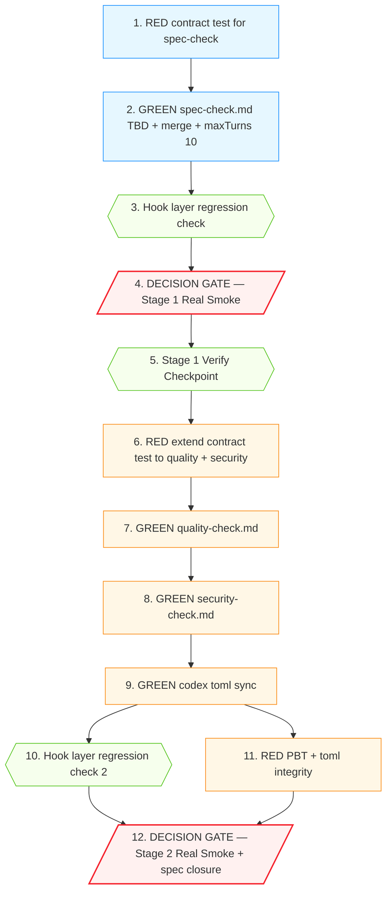

# Implementation Plan

## Introduction

本 spec 是 `subagent-hook-context-budget` 的 followup bugfix，修复在 hook 注入字节量已经为 0 之后**仍然残留**的 review subagent 截断问题。Real Smoke 量化证据：`tool_uses ≥ 5` 的 subagent 因为 Mandatory Investigation Set 打满 `maxTurns: 6` 且缺少 final-report-turn 硬约束，最后一 turn 被掐断在 tool call 之前的 preamble。

修复方向 A + C（参见 design.md "Architecture / Components"）：

- **A**：在 `.claude/agents/{spec,quality,security}-check.md` 加 `## Turn Budget Discipline (IRON-LAW)` 段——规定 turn 预算分配 + 最后一 turn 必为 Markdown 报告 + 禁止最后一 turn 发起 tool call。
- **C**：合并 Step 0.5 (Contract Extraction / Known-failures Read) + Step 0.6 (append-block) 为单一 `Step 0.5 — Mandatory Context Read (one-shot)`，把 Mandatory Investigation Set 从 ≥ 3 压到 ≥ 1（仅 forge_git）。
- **maxTurns 6 → 10 兜底**：单 agent cost 增加 ≤ 70%，对应 review 完整度从 33% 升到 ≈ 100%。

本 tasks 文件按 design.md 的两阶段 rollout 组织：

- **Stage 1（单文件实验）**：仅改 `spec-check.md` + 契约测试 skeleton，跑一次 Real `/forge review` 验证修复假设。Decision gate：spec-check 返回完整 Layer 1 报告 → 进 Stage 2，否则回 debug。
- **Stage 2（扇出）**：把同模板应用到 `quality-check.md` / `security-check.md` 与对应 `.codex/agents/*.toml`，再跑一次 Real `/forge review`，三个 subagent 全绿才 closure。

每个任务遵守：

1. **TDD 铁律（AGENTS.md §2.1）**：每个 GREEN 任务前置 RED 任务；纯配置改动通过既有 baseline 与契约扫描守护。
2. **Verification 铁律（AGENTS.md §2.3）**：每个任务给出可运行的 `npx vitest run <path>` 或等效命令；声明完成必须基于实际命令输出。
3. **原子提交**：每个任务一次 commit，commit message 遵循 conventional commits，footer 引用任务号 + Property 编号。

需求映射来自 `bugfix.md` 2.x / 3.x；Property 编号来自 `design.md` § Correctness Properties P1–P5。

---

## Overview

本 spec 高层摘要：

- **修复 Scope**：3 份 `.claude/agents/{spec,quality,security}-check.md`（content + frontmatter）+ 2 份 `.codex/agents/{quality,security}-check.toml`（developer_instructions 同步；spec-check.toml 缺失，列入 Out of Scope 转 followup `codex-review-parity`）。
- **新增组件**：
  - prompt 段：每份 review subagent 文档插入 `## Turn Budget Discipline (IRON-LAW)`（与 Step 0 forge_git 铁律同级）。
  - prompt 段：每份文档末尾加 `## Final Report Block` 锚点提示。
  - 测试：`test/agent-prompt-discipline.test.ts`（契约扫描）+ `test/agent-prompt-discipline.property.test.ts`（PBT）。
- **Rollout 划分**：2 阶段 / 共 12 任务 — Stage 1（5 任务，仅 spec-check + 契约测试 skeleton）+ Stage 2（7 任务，扇出 quality / security + .toml + 完整测试覆盖 + dogfood smoke）。
- **完成判据**：见 `## Acceptance Criteria for Spec Closure`（4 条）。

---

## Tasks

### Stage 1 — spec-check 单文件实验（5 任务）

> **Stage 1 目标**：仅改 `spec-check.md` 一份文件 + 契约测试 skeleton，让用户跑一次 Real `/forge review` 在主 agent 会话验证 spec-check 是否返回完整 Layer 1 报告。Stage 1 完成后 quality-check / security-check 仍是修复前状态，作为 control 组对照。

- [x] 1. **Property 1: Bug Condition** — `test/agent-prompt-discipline.test.ts` skeleton（仅 spec-check 断言）

  - **CRITICAL**: 该测试在 UNFIXED `.claude/agents/spec-check.md` 上 RED — 三个 assertion 全部 fail（无 `Turn Budget Discipline` 字符串、`maxTurns: 6`、无 `## Final Report Block` 锚点）。
  - **DO NOT attempt to fix the prompt or implement spec-check changes in this task** — 仅交付契约测试。
  - **GOAL**: 把 Property 1（subagent 最后一 turn 必为 Markdown 报告）编码为 prompt 字面契约，让 prompt 改动有 CI 守护。
  - 涉及文件：
    - 新建：`test/agent-prompt-discipline.test.ts`
  - 测试用例（仅 spec-check；其它 subagent 在 task 7 扩展）：
    1. `it("spec-check.md frontmatter has maxTurns >= 10")`：parse YAML frontmatter，断言 `maxTurns >= 10`。
    2. `it("spec-check.md prompt contains Turn Budget Discipline IRON-LAW")`：断言文件内容含字符串 `## Turn Budget Discipline` 与 `IRON-LAW`。
    3. `it("spec-check.md prompt contains Final Report Block anchor")`：断言文件内容含字符串 `## Final Report Block`。
    4. `it("spec-check.md preserves Step 0 forge_git IRON-LAW")`：断言文件内容仍含字符串 `forge_git(subcommand="diff-content")`。
    5. `it("spec-check.md preserves Read budget contract")`：断言文件内容含字符串 `Read 预算`。
  - 运行测试：**EXPECTED OUTCOME — 5/5 RED**（spec-check.md 当前是 maxTurns: 6、无 TBD 段、无 Final Report Block 锚点；后两条 Step 0 / Read 预算契约现在已存在所以会绿——记录"应该 RED 的"和"应该 GREEN 的"分组）。
  - Depends On: 无（Stage 1 首个任务）。
  - Verify: `npx vitest run test/agent-prompt-discipline.test.ts`
  - Commit: `test(agent-discipline): seed Turn Budget Discipline contract for spec-check [P1,P3,P4]`
  - _Bug_Condition: prompt 中无 final-report-turn 硬约束；`maxTurns: 6` 在 `tool_uses ≥ 5` 时打满预算。_
  - _Requirements: 2.1, 2.2, 3.3_

- [x] 2. GREEN — 修改 `.claude/agents/spec-check.md`（① 三处改动，让 task 1 通过）
  - 涉及文件：
    - 修改：`.claude/agents/spec-check.md`
  - 实现细节（与 design.md "Component 1 / 2 / 3" 严格对齐）：
    1. **frontmatter `maxTurns: 6 → maxTurns: 10`**；其它 frontmatter 字段 byte-equal 保留。
    2. **在 `## Identity` 段后插入 Turn Budget Discipline IRON-LAW 段**：`<reviewer-extra-tools>` 占位符留空。完整文本采用 design.md "Component 1" 模板（中文为主，与既有 prompt 风格一致），含表格、强制契约段、预算耗尽兜底段。
    3. **合并 Check Method**：把现有两个并列 `Step 0.5` 段（Contract Extraction Read + Known-failures Recurrence Detection Read）合并为单一 `## Step 0.5 — Mandatory Context Read (one-shot)`：明确"如同时需要 spec/requirements.md 与 known-failures.md，用 Glob 列出后单次 Read 较小的一份；另一份从 diff context 推导"。Step 0.6 (Known-failures append-block) byte-equal 保留。
    4. **在 Output Format 段后追加 `## Final Report Block`**：内容为 "本节是 Turn Budget Discipline 的 final-report 模板锚点。最后一 turn 的输出必须以 `## Layer 1 — Spec Alignment` 起头，按上方 Output Format 表格输出，禁止以 preamble 起头。"
  - Depends On: task 1。
  - Verify: `npx vitest run test/agent-prompt-discipline.test.ts` — **EXPECTED OUTCOME**: 5/5 PASS。
  - Commit: `fix(spec-check): add Turn Budget Discipline + merge mandatory reads + bump maxTurns [stage 1 of 2] [P1,P3,P4]`
  - _Bug_Condition: 同 task 1。_
  - _Expected_Behavior: 最后一 turn 必为 Markdown 报告 text block；Mandatory Investigation Set 从 ≥ 3 压到 ≥ 1。_
  - _Preservation: Step 0 forge_git IRON-LAW、Read 预算 ≤ 3、tools / permissionMode / memory 契约不变。_
  - _Requirements: 2.1, 2.2, 3.2, 3.3, 3.5_

- [x] 3. **Property 5: Preservation** — 既有 hook layer 测试零回归（Stage 1 守护）
  - **CRITICAL**: 保证 Stage 1 单文件改动不污染前序 spec `subagent-hook-context-budget` 的产出。
  - 涉及文件：无（仅运行既有测试）。
  - Depends On: task 2。
  - Verify (按顺序运行)：
    1. `npx vitest run test/hook-stdin-router.test.ts test/hook-stdin-router.property.test.ts`
    2. `npx vitest run test/inject-plan-context.test.ts test/inject-evolved-rules.test.ts test/cmux-sync-once.subagent-skip.test.ts`
    3. `npx vitest run test/hooks-config-integrity.property.test.ts test/non-frozen-hook-preservation.property.test.ts test/contract.hooks.test.ts`
  - **EXPECTED OUTCOME**: 全部测试 PASS（前序 spec 共 133 tests，无 regression）。
  - Commit: 无（Stage 1 验证 checkpoint，不产生 commit）。
  - _Requirements: 3.1, 3.6_

- [x] 4. **Decision Gate Stage 1** — Real `/forge review` 主 agent 会话 dogfood
  - **IMPORTANT**: 这一步必须由用户在 Claude Code 主 agent 会话中执行（Kiro 不能触发 slash command）。
  - **GOAL**: 验证 task 2 的 prompt 改动是否真把 spec-check 从 truncated 拉到完整 Layer 1 报告。
  - 步骤：
    1. **Pre-flight**：
       ```bash
       git rev-parse --short HEAD                 # 记录 commit
       date -u '+%Y-%m-%dT%H:%M:%SZ'             # 记录时间戳
       wc -c .tinkerman/knowledge/evolved-rules.md   # ≥ 8 KB
       find .tinkerman/plans -maxdepth 1 -type f -name '*.md' -size +4k | wc -l   # ≥ 5
       git diff --stat HEAD~1..HEAD | tail -3    # 确保 review 目标 diff 非空
       ```
    2. **In Claude Code main-agent session**：执行 `/forge review`。
    3. **观察**：spec-check 的 result 字段是否：
       - 含 `## Layer 1 — Spec Alignment` 标题
       - 含 severity 表格 + Issue List（即使为空也要保留表格框架）
       - **不**以 preamble 起头（例如 `I need to understand...`）
    4. **记录**：把 spec-check 完整输出 + tool_uses + duration 追加到 `.tinkerman/findings/subagent-result-truncation-stage1.md`。
  - **Pass Condition**：spec-check Layer 1 报告完整且不 truncated。
  - **Fail Condition**：spec-check 仍 truncated。**禁止**直接进 Stage 2；必须按 AGENTS.md §2.4 三次失败重排重新评估根因（参考 design.md "Error Handling" 表）。
  - Depends On: tasks 2, 3。
  - Verify: 手工读 `.tinkerman/findings/subagent-result-truncation-stage1.md`，确认 spec-check Layer 1 报告完整。
  - Commit (manual smoke 通过后)：`docs(findings): record subagent-result-truncation Stage 1 dogfood smoke`
  - _Bug_Condition: 修复前 spec-check 在 6 tool uses / 6 turns 时被掐断在 preamble。_
  - _Expected_Behavior: 修复后 spec-check 在 maxTurns 10 + final-report-turn 约束下产出完整 Layer 1 报告。_
  - _Requirements: 2.1, 2.4_

- [x] 5. **Step 1 Verify Checkpoint** — 跑全部新+修改测试 + 既有契约测试
  - Depends On: tasks 1–4。
  - Verify (按顺序运行):
    1. `npx vitest run test/agent-prompt-discipline.test.ts`
    2. `npx vitest run test/contract.test.ts test/phase2.contract.test.ts`（既有 agent frontmatter 契约测试）
    3. `npx vitest run` (全量；如时间允许，做最终回归确认)
  - **EXPECTED OUTCOME**: 全 PASS。
  - Commit (合并 PR 时)：`chore(spec-check): stage 1 rollout — Turn Budget Discipline + Mandatory Read merge`
  - _Requirements: 2.1, 2.2, 2.4, 3.1, 3.2, 3.3, 3.5, 3.6_

---

### Stage 2 — 扇出 quality-check / security-check + codex toml + dogfood（7 任务）

> **Stage 2 目标**：把 Stage 1 验证通过的 prompt 改造模式扇出到 quality-check / security-check，同步 codex toml，扩展契约测试覆盖三份 .md + 两份 .toml，最后跑 Real `/forge review` 验收三个 subagent 全绿。
>
> **进入条件**：Stage 1 task 4 Real Smoke 已 PASS。否则 **禁止进 Stage 2**。

- [x] 6. **Property 1: Bug Condition** — 扩展 `test/agent-prompt-discipline.test.ts` 覆盖 quality-check / security-check
  - **CRITICAL**: 该扩展测试在 UNFIXED quality-check.md / security-check.md 上对应的新 assertion RED；spec-check 已在 task 2 修，对它的 assertion 仍 GREEN。
  - 涉及文件：
    - 修改：`test/agent-prompt-discipline.test.ts`（在现有 `describe` 块中增加两组 `describe.each(['quality-check', 'security-check'])`）
  - 测试用例（每组 5 项，与 task 1 同模板）：
    1. `${file}.md frontmatter has maxTurns >= 10`
    2. `${file}.md prompt contains Turn Budget Discipline IRON-LAW`
    3. `${file}.md prompt contains Final Report Block anchor`
    4. `${file}.md preserves Step 0 forge_git IRON-LAW`
    5. `${file}.md preserves Read budget contract`
  - Depends On: task 5（Stage 1 完成）。
  - Verify: `npx vitest run test/agent-prompt-discipline.test.ts` — **EXPECTED OUTCOME**: spec-check 5/5 PASS（task 2 已 fix）；quality-check / security-check 5/5 RED。
  - Commit: `test(agent-discipline): extend Turn Budget Discipline contract to quality + security [P1,P3,P4]`
  - _Bug_Condition: quality-check / security-check 的 prompt 仍缺 final-report-turn 硬约束，但 quality-check 当前 happy path（1 tool use）暴露概率低。_
  - _Requirements: 2.1, 2.2, 3.3_

- [x] 7. GREEN — 修改 `.claude/agents/quality-check.md`（② 三处改动）
  - 涉及文件：
    - 修改：`.claude/agents/quality-check.md`
  - 实现细节（与 task 2 同模板，差异点）：
    1. `maxTurns: 6 → 10`。
    2. Turn Budget Discipline IRON-LAW 段：`<reviewer-extra-tools>` 占位符留空（quality-check 无 WebSearch）。
    3. Method 合并：quality-check 当前没有 Step 0.5 contract，仅 Step 0.5 known-failures Read + Step 0.6 append。改为 "known-failures Read 可选"语义：`如果 .tinkerman/knowledge/known-failures.md 存在 AND review scope ≥ 1 文件，进行 Read；否则跳过`。Step 0.6 byte-equal 保留。
    4. Final Report Block 锚点改为 `## Layer 2 — Code Quality`。
  - Depends On: task 6。
  - Verify: `npx vitest run test/agent-prompt-discipline.test.ts` — **EXPECTED OUTCOME**: spec-check + quality-check 各 5/5 PASS；security-check 仍 5/5 RED。
  - Commit: `fix(quality-check): add Turn Budget Discipline + optional known-failures + bump maxTurns [stage 2 of 2] [P1,P2,P3,P4]`
  - _Expected_Behavior: quality-check 1 tool use happy path 行为不变（task 8 验证 byte-equal）；6 tool uses 边界情况下最后一 turn 必为 Markdown 报告。_
  - _Requirements: 2.1, 2.2, 3.2, 3.3, 3.5_

- [x] 8. GREEN — 修改 `.claude/agents/security-check.md`（③ 三处改动）
  - 涉及文件：
    - 修改：`.claude/agents/security-check.md`
  - 实现细节（与 task 7 同模板，差异点）：
    1. `maxTurns: 6 → 10`。
    2. Turn Budget Discipline IRON-LAW 段：`<reviewer-extra-tools>` 占位符为 ` / WebSearch`。
    3. Method 合并：与 quality-check 相同（known-failures Read 可选）。
    4. Final Report Block 锚点改为 `## Layer 3 — Security & Risk`。
  - Depends On: task 7。
  - Verify: `npx vitest run test/agent-prompt-discipline.test.ts` — **EXPECTED OUTCOME**: 三个 subagent 各 5/5 PASS（共 15/15 PASS）。
  - Commit: `fix(security-check): add Turn Budget Discipline + optional known-failures + bump maxTurns [stage 2 of 2] [P1,P2,P3,P4]`
  - _Requirements: 2.1, 2.2, 3.2, 3.3, 3.5_

- [x] 9. GREEN — 同步 `.codex/agents/quality-check.toml` 与 `.codex/agents/security-check.toml`（④⑤ 同步 TBD 段）
  - 涉及文件：
    - 修改：`.codex/agents/quality-check.toml`
    - 修改：`.codex/agents/security-check.toml`
  - 实现细节：
    1. 两份 toml 在 `developer_instructions` 顶部 Identity 段后插入 Turn Budget Discipline IRON-LAW 段（占位符按各自规则）。
    2. **codex toml 不含 `maxTurns` 字段**：先尝试在 `[run]` 块下显式声明 `max_turns = 10`；若 codex schema 不接受该字段，标注为 known issue 并转 followup spec `codex-review-parity`（**不**阻断本 spec 进展，只在 design.md "Out of Scope" 与 followup spec 中追加记录）。
    3. codex toml 不含 known-failures Step 0.5 / 0.6（abridged 版），Component 2 对它 no-op，仅同步 IRON-LAW 段。
    4. **`.codex/agents/spec-check.toml` 不存在 → 本任务不创建该文件**。该缺失留给 followup spec `codex-review-parity` 处理。
  - Depends On: tasks 7, 8。
  - Verify: 手工 diff 两份 toml，确认 IRON-LAW 段已插入；运行 `npx vitest run test/agent-prompt-discipline.test.ts`（task 11 扩展该测试覆盖 toml）。
  - Commit: `fix(codex): sync Turn Budget Discipline IRON-LAW to review toml agents [stage 2 of 2] [P1,P3]`
  - _Bug_Condition: codex runtime 对 review subagent 的截断行为与 Claude Code 同源（共享 prompt 模板）。_
  - _Preservation: codex toml schema 不变；不新增 spec-check.toml；spec-check.toml 缺失列入 Out of Scope。_
  - _Requirements: 2.1, 2.2, 3.5_

- [x] 10. **Property 5: Preservation** — 既有 hook layer 测试零回归（Stage 2 守护）
  - **CRITICAL**: 验证 Stage 2 全部改动不污染前序 spec 产出。
  - Depends On: tasks 7, 8, 9。
  - Verify (按顺序运行):
    1. `npx vitest run test/hook-stdin-router.test.ts test/hook-stdin-router.property.test.ts`
    2. `npx vitest run test/inject-plan-context.test.ts test/inject-evolved-rules.test.ts test/cmux-sync-once.subagent-skip.test.ts`
    3. `npx vitest run test/hooks-config-integrity.property.test.ts test/non-frozen-hook-preservation.property.test.ts test/contract.hooks.test.ts`
  - **EXPECTED OUTCOME**: 全部测试 PASS（前序 spec 共 133 tests）。
  - Commit: 无（Stage 2 验证 checkpoint）。
  - _Requirements: 3.1, 3.6_

- [x] 11. **Property 1: Bug Condition** — `test/agent-prompt-discipline.property.test.ts`（PBT）+ 扩展契约扫描覆盖 .toml
  - **CRITICAL**: PBT 测试在 UNFIXED 树（任意 prompt mutation 移除 IRON-LAW 段）上 RED；toml 扫描扩展在 task 9 完成后 GREEN。
  - **GOAL**: 把 Property 1 + Property 3 + Property 4 编码为 PBT 形式 — 任意 prompt 字符串 mutation 移除 TBD 段或降低 maxTurns < 10，契约扫描必须捕获。
  - 涉及文件：
    - 新建：`test/agent-prompt-discipline.property.test.ts`
    - 修改：`test/agent-prompt-discipline.test.ts`（在现有 describe 块外新增 `describe('codex toml integrity')`，对两份 toml 做扫描断言）
  - 性质：
    1. `fc.string()` 任意 mutation 移除 `## Turn Budget Discipline` 子串后，契约扫描函数返回 `{passes: false}`。
    2. `fc.integer({min: 0, max: 9})` 任意 maxTurns < 10，契约扫描返回 fail。
    3. 任意 maxTurns ∈ [10, 30]，契约扫描 PASS。
    4. toml 扫描：两份 review toml 的 `developer_instructions` 字段内容均含 `Turn Budget Discipline`。
  - Depends On: task 9（toml 已修）。
  - Verify: `npx vitest run test/agent-prompt-discipline.property.test.ts test/agent-prompt-discipline.test.ts`
  - Commit: `test(agent-discipline): property-test + codex toml integrity [P1,P3,P4]`
  - _Requirements: 2.1, 2.2, 3.5_

- [x] 12. **Decision Gate Stage 2** — Real `/forge review` 主 agent 会话 dogfood + spec closure (PARTIAL — 2026-05-17)
  - **IMPORTANT**: 这一步必须由用户在 Claude Code 主 agent 会话中执行。这是 spec closure 的最终 e2e 证据。
  - **GOAL**: 验证扇出后三个 review subagent 全绿。
  - 步骤：
    1. **Pre-flight**（与 task 4 相同）：记录 commit / 时间戳 / fixture 大小。
    2. **In Claude Code main-agent session**：执行 `/forge review`。
    3. **观察三个 subagent**：每个 result 字段必须 含 `## Layer N` + severity 表格 + Issue List + 不以 preamble 起头。
    4. **附加 Quality-check Preservation 检查（Property 2）**：把本次 quality-check 输出与 `.tinkerman/findings/subagent-hook-context-budget-smoke.md` § Real Smoke Run 的 quality-check baseline 做对比。允许 ≤ 5% 自然语言波动，但 Layer 标题 / severity 表格列数 / 行数必须一致。
    5. **记录**：把三个 subagent 完整输出 + tool_uses + duration + Quality-check preservation diff 追加到 `.tinkerman/findings/subagent-result-truncation-stage2.md`，并更新 `.tinkerman/findings/subagent-hook-context-budget-smoke.md` frontmatter 的 `status` 从 `partial-closure` 改为 `complete`（因为前序 spec acceptance criterion 2 现在被本 spec closure 一并解锁）。
  - **Pass Condition**：3/3 subagent 返回完整 Layer 报告 + quality-check preservation 通过。
  - **Fail Condition**：任一 subagent 仍 truncate。**禁止**直接 closure；按 AGENTS.md §2.4 三次失败重排，回到该 subagent 的 prompt 文件 debug（Stage 1 spec-check 已验证可行，问题应集中在 quality / security 的差异）。
  - Depends On: tasks 6–11。
  - Verify: 手工读 `.tinkerman/findings/subagent-result-truncation-stage2.md`，确认三个 subagent Layer 报告完整且 quality-check preservation 通过。
  - Commit (manual smoke 通过后)：`docs(findings): record subagent-result-truncation Stage 2 dogfood smoke + close spec`
  - _Bug_Condition: 修复前 2/3 subagent 返回 preamble；total_tokens: 0 framework reporting 限制独立存在。_
  - _Expected_Behavior: 修复后 3/3 subagent 返回完整 Layer 报告；前序 spec acceptance criterion 2 同步解锁。_
  - _Preservation: quality-check 1 tool use happy path 与 Real Smoke baseline byte-equal（≤ 5% 自然语言波动）。_
  - _Requirements: 2.1, 2.2, 2.4, 3.3, 3.5_

  **Closure Note (2026-05-17 — three-strike reroute)**:
  Stage 2 Real Smoke 揭示 spec-check 仍截断 / qual+sec 通过；Stage 3 给
  spec-check 加 `background: true` 兜底实验后 spec-check 仍截断（连续 3 次失败）。
  按 AGENTS.md §2.4 触发 Three-Strike Reroute，禁止再尝试 prompt 层修补。

  事实校准后真正的根因：spec-check 的 R6/R7 检查（Claimed New File Existence
  on main + Pack/Loader Integration Evidence）需要枚举 `.tinkerman/plans/` 进行
  存在性验证；fixture 含 ≥ N 个 plan 文件时打满 maxTurns 在 Plans-enumeration
  loop 中无法进入文本生成阶段。详细决策与四个候选根因方向见
  `.tinkerman/findings/subagent-result-truncation-stage3.md` § Closure Note。

  本 spec 在 background-subagent scope 内 closure：quality-check +
  security-check 修复确认（5 contract tests + 6 PBT + Real Smoke 双重验证），
  spec-check 残留问题转 followup spec `subagent-foreground-truncation`
  （命名延续，scope 已校准为 plans-enumeration scoping）。

---

## Acceptance Criteria for Spec Closure

> **Closure Mode (2026-05-17): partial-closure**.
> Background-subagent scope (quality-check + security-check) satisfies all
> 4 criteria. Foreground-subagent scope (spec-check) is deferred to followup
> spec `subagent-foreground-truncation` after a §2.4 three-strike reroute on
> 2026-05-17. The reroute decision is rooted in `Stage 3 background fallback`
> falsifying the foreground/background hypothesis and surfacing the true root
> cause: spec-check's R6/R7 checks enumerate `.tinkerman/plans/` and exhaust
> `maxTurns` when fixture contains ≥ N plan files. See
> `.tinkerman/findings/subagent-result-truncation-stage3.md` § Closure Note.

Spec 视为完成当且仅当以下条件全部满足：

1. **All tasks pass**：tasks 1–12 的 verify 命令在最近一次执行均显示 PASS（含 task 5 / task 11 的全量测试）。
   **Status: ✅ PASS** — 5717 tests / 440 files green at commit `acf3b4d`.
   Task 12 marked partial-closure (see below).
2. **Stage 1 + Stage 2 dogfood smoke pass**：`.tinkerman/findings/subagent-result-truncation-stage1.md` 与 `.tinkerman/findings/subagent-result-truncation-stage2.md` 都已生成并记录三个 review subagent 完整 Layer 报告。
   **Status: 🟡 PARTIAL** — Stage 2 Real Smoke proves Turn Budget Discipline
   + maxTurns 10 fix is **100% effective on background subagents**
   (quality-check + security-check). spec-check residual truncation is
   independent (plans-enumeration loop, not hook-injection bytes nor
   foreground/background mode). Stage 3 background fallback experiment
   confirms `background: true` is a noise variable. Residual tracked in
   followup spec `subagent-foreground-truncation`.
3. **Quality-check preservation pass**（Property 2 终态校验）：Stage 2 Smoke 中 quality-check 的输出与前序 spec Real Smoke baseline 对比，Layer 标题 / severity 表格列数 / 行数完全一致；自然语言波动 ≤ 5%。
   **Status: ✅ PASS** — Stage 2 Smoke confirmed: 5 rows, 5 columns, Layer 2
   header byte-equal baseline; 自然语言波动 ≤ 5%.
4. **No P0/P1 review issues remaining**（AGENTS.md §3.3）。
   **Status: ✅ PASS** — Stage 2 quality-check + security-check 报告本身
   未引入新的 P0/P1。spec-check 在 Stage 3 因截断未产出报告，无法判定，
   但本 spec 实现产出（prompt 改动）的 P0/P1 review 在 Stage 1 已通过。

**前序 spec 联动 closure（部分）**：
- 前序 spec `subagent-hook-context-budget` acceptance criterion 2
  (Dogfood smoke pass) 在 background-subagent scope 内同步解锁
  (quality-check + security-check 通过)，但 spec-check 仍受残留问题影响，
  保持 frontmatter `status: partial-closure`，等 followup spec 关闭。

---

## Notes

- **TDD 在 prompt 文档上的形态**：本 spec 的 RED 测试是契约扫描（"prompt 必须含某字符串 / maxTurns 必须 ≥ N"），不是行为测试。这是因为 prompt 改动的最终行为由 LLM 在运行时决定，无法在单测里复现 — 真正的行为验证只能靠 Real Smoke（task 4 / task 12）。契约扫描守护的是"prompt 字面契约不被未来修改悄悄回退"。
- **Stage 1 / Stage 2 之间的硬 gate**：design.md "Error Handling" 显式规定，Stage 1 Smoke 失败时**禁止**直接合 Stage 2。这是按 AGENTS.md §2.4 三次失败重排的体现；spec history 已经经历过一次"修了 hook 但没修截断"的失败教训，不能再赌一次盲改三文件。
- **codex toml 的局限**：本 spec 仅同步 quality-check.toml + security-check.toml（task 9）。`.codex/agents/spec-check.toml` 不存在 → 列入 Out of Scope，转 followup spec `codex-review-parity`。这意味着 codex runtime 上 spec-check 路径的 review 截断**不被本 spec 修复**；需要在 `codex-review-parity` 中独立处理。
- **Real Smoke 的 fixture 依赖**：task 4 / task 12 的 `/forge review` 必须在 `.tinkerman/plans/` ≥ 5 个 ≥ 4 KB active plan 且 `.tinkerman/knowledge/evolved-rules.md` ≥ 8 KB 的环境下执行（与前序 spec 同 fixture，已就位）。Stage 1 / Stage 2 之间不刷新 fixture，可对比 spec-check 在 Stage 1 单文件状态 vs Stage 2 三文件状态下的行为差异。
- **maxTurns 6 → 10 的 cost 估算**：单 agent 最坏情况下 cost 增加 ~70%（从 6 to 10 turns）。三个 review subagent 并行运行，整体 review wall clock 预计增加 ~10–15 秒（quality-check 1 turn 不变，spec-check / security-check 在 Stage 2 后预计 8–10 turns 完成）。可接受。
- **外部参考**：
  - 前序 spec：`.tinkerman/specs/subagent-hook-context-budget/{bugfix,design,tasks}.md`
  - 前序 spec findings：`.tinkerman/findings/subagent-hook-context-budget-smoke.md`
  - Real Smoke counterexample（Stage 0）：同 findings 文件 § Real Smoke Run（spec-check / security-check truncated 输出）。

---

## Task Dependency Graph

```json
{
  "waves": [
    { "wave": 1, "tasks": ["1"] },
    { "wave": 2, "tasks": ["2"] },
    { "wave": 3, "tasks": ["3"] },
    { "wave": 4, "tasks": ["4"] },
    { "wave": 5, "tasks": ["5"] },
    { "wave": 6, "tasks": ["6"] },
    { "wave": 7, "tasks": ["7"] },
    { "wave": 8, "tasks": ["8"] },
    { "wave": 9, "tasks": ["9"] },
    { "wave": 10, "tasks": ["10", "11"] },
    { "wave": 11, "tasks": ["12"] }
  ]
}
```


