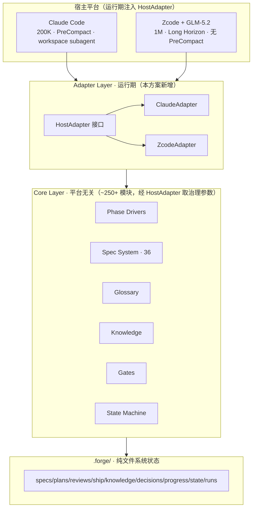
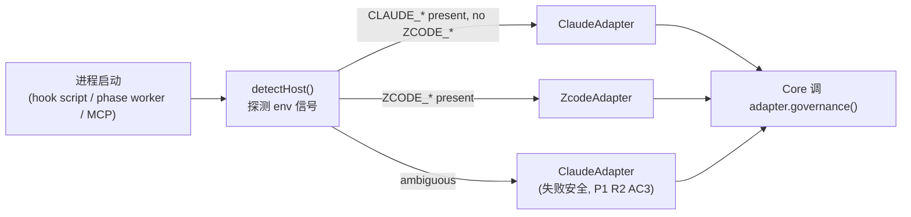
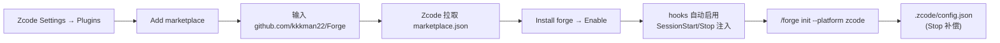
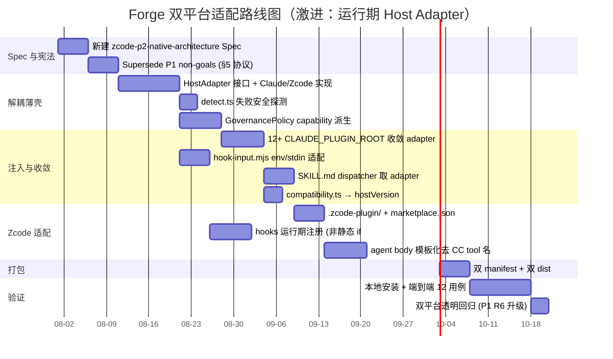

[← 返回索引](./INDEX.md)

# Forge 双平台适配 (Claude Code + Zcode) 与架构精简重构方案

> **文档定位**：本方案是对《Forge×ZCode 结合方案 v2》及 Spec `.forge/specs/zcode-p1-base-integration/` 的**架构级重构提案（激进路线）**。P1 基础接入（已落地）验证了"插件格式兼容"可行；本方案在 P1 之上提出**运行期 Host Adapter 架构 + 模型能力驱动治理**，最大化利用 Zcode + GLM-5.2 原生能力，**显式 supersede P1 Spec 的 non-goals**（"不建 shim / 不动治理逻辑"）。
>
> **方法论**：所有结论基于 (1) Zcode 官方文档（`zcode.z.ai/cn/docs/*` 及 `/en/docs/*`，GLM-5.2 规格 `docs.z.ai/guides/llm/glm-5.2`）实读；(2) Forge 源码逐目录审计（`src/` 369 模块、`scripts/` 84 处 Claude 引用、`hooks/hooks.json` 47 hook 命令、`.claude-plugin/`、`.codex/`、`.opencode/`、`.forge/`）。证据级别 `[DOC]`/`[SRC]`/`[INF]`。

---

## 0. 执行摘要 (TL;DR)

1. **内核已平台无关，但被薄壳裹住。** `src/` ~250+ 模块（plan/review/ship/spec×36/glossary/knowledge/state）零 `@anthropic-ai/*` 运行时依赖。耦合集中在 hooks、`.claude-plugin/`、`SKILL.md` dispatcher、`init.sh`、agent body prose。`[SRC]`
2. **Zcode = Claude Code 文件格式兼容层 + GUI 外壳 + GLM-5.2（1M 上下文/Long Horizon）。** `.claude-plugin/plugin.json`、`CLAUDE_PLUGIN_ROOT`、`commands/*.md`、`SKILL.md`、`hooks/hooks.json` 在 Zcode 下原样识别或等价。`[DOC]`
3. **激进路线：运行期 Host Adapter（非 build-time emitter）。** 一套内核代码，运行期注入 `HostAdapter`（ClaudeAdapter / ZcodeAdapter）。ZcodeAdapter 调用 `modelCapabilities()` 派生治理参数。**显式 supersede P1 "不建 shim" non-goal** —— 由新 Spec `zcode-p2-native-architecture` 正式 supersede，不绕过锁定 Spec（见 §0.1）。
4. **配置开关 vs Strategy vs Capability-driven：选 capability-driven。** 驱动 budget/worker/切片的真实变量是**模型上下文容量**，非平台名。`threshold = f(contextWindow)` 自适应未来任意模型；平台名仅用于结构性差异（hook 事件可用性）。见 §0.2。
5. **治理逻辑可改，铁律不可改。** operational governance（budget/并发/worker/gate 阈值）经 HostAdapter 策略注入，可因平台/模型调整；iron laws（TDD/验证/三振/隔离评审/P0-P1/Knowledge）由宪法 §5.6 锁定 immutable，不在本方案范围。见 §0.3。

### 0.1 对已锁定 P1 Spec 的处置（不可绕过）

P1 Spec `status: locked`，其 non-goals（`requirements.md` "不撤销 v2 结论 / 不建 shim / 不动治理逻辑"）是硬约束。**本激进方案不直接忽略 P1**，而是：

- **新建 Spec** `.forge/specs/zcode-p2-native-architecture/`，frontmatter 显式声明 `supersedes: [zcode-p1-base-integration (non-goals only)]`。
- 走宪法 §5 自演化协议：Propose（本方案）→ Declare（PR 标记）→ Approve（maintainer review）→ Log（ADR）。
- P1 已落地的 R1–R6（工作区配置生成、hook 输出裁剪、三项验证、双平台透明回归）**保留为运行期 shim 的 fallback 安全网**，不回滚。

### 0.2 为什么不用配置开关（三种方案对比）

| 方案 | 机制 | 漂移风险 | 未来自适应 | 评价 |
|------|------|----------|------------|------|
| **A. 配置开关** | `if (isZcode) budget=800K else 100K` 散落各模块 | 高（probe 泄漏每个模块） | 差（Claude 发 1M 要改代码） | ❌ 最差 |
| **B. Strategy 对象** | `ContextBudgetPolicy` 接口 + `ClaudeBudget`/`GlmBudget` 实现 | 中（按平台名分支） | 中（加新平台要加类） | 🟡 更好 |
| **C. Capability-driven** ✅ | `threshold = 0.8 × contextWindow`；`HostAdapter.modelCapabilities()` 探测 | 低（单源派生） | **优**（任意模型自动） | ✅ 最优 |

**选 C 的根本理由**：驱动 budget/worker/切片的**真实变量是模型上下文容量**，平台名只是今天 Claude=200K / GLM-5.2=1M 的巧合代理。当 Claude 发 1M 模型 → C 零代码改动自动放宽；A/B 都要改代码。平台名仅保留用于**结构性差异**（PreCompact 仅 Claude 有、subagent workspace 级仅 Claude 有）—— 这是平台结构属性，非模型属性。

### 0.3 可改 vs 不可改（宪法 §5.6 边界）

| 可改（operational governance，经 HostAdapter 策略注入） | 不可改（iron laws，§5.6 immutable） |
|---|---|
| `context_budget` 阈值 | TDD 铁律 §2.1 |
| `max_parallel_agents` | 验证铁律 §2.3 |
| worker 隔离策略 | 三振 §2.4 |
| `decide_dispatch_mode` | 阶段间不确认 §2.7 |
| gate 阈值（confidence/会话预算） | 隔离评审 §3.1 |
| `reasoning_effort` per phase | P0/P1 阻断 §3.3 |
| context 切片激进程度 | Knowledge §4 |

> 若需在 Zcode 路径弱化 TDD/评审 → 那是**宪法修正**（§5.5 Propose→Declare→Approve→Log），独立流程，本方案不碰。

---

## 1. Zcode 能力梳理与 Forge 源码耦合诊断

### 1.1 Zcode 核心能力矩阵

Zcode 是 Z.ai 的**桌面 GUI 应用（ADE）**，非 CLI。文档**刻意保留 Claude Code 兼容文件名与环境变量**。`[DOC]`

| 维度 | Zcode 原生机制 | Claude Code 对照 | 差异等级 |
|------|----------------|------------------|----------|
| 分发形态 | GUI；无 CLI；Settings → Plugins → Add marketplace | `claude` CLI；`claude plugin install` | 🔴 高 |
| Plugin manifest | `.zcode-plugin/plugin.json`（回退读 `.claude-plugin/`）；`commands/skills/hooks/mcpServers/agents/userConfig/dependencies` | `.claude-plugin/plugin.json` | 🟢 近零 |
| marketplace.json | 顶层 `name/plugins[]/pluginRoot`；`source`: directory/github/git/file/url/npm | `.claude-plugin/marketplace.json` | 🟢 低 |
| Skill | `skills/<name>/SKILL.md`；frontmatter `name/description/when_to_use/license/metadata`；`$` 前缀或 `/` 面板 | `skills/<name>/SKILL.md`；`Skill()` tool | 🟢 低 |
| Command | `commands/*.md`；`description/argument-hint/allowed-tools/model/skills/disable-noninteractive`；`$ARGUMENTS` | 同 | 🟢 近零 |
| 内置命令 | **`/goal`（长任务 set/pause/resume）、`/compact`** | `/clear`/`/context` | 🟡 中（`/goal` 是新能力） |
| Hooks 事件 | `SessionStart/UserPromptSubmit/PreToolUse/`**`PermissionRequest`**`/PostToolUse/`**`PostToolUseFailure`**`/Stop` | 同名 + `PreCompact/PostCompact/Task*/Worktree*/StopFailure/ConfigChange/PermissionDenied/TeammateIdle/SubagentStop` | 🔴 高（**Zcode 无 PreCompact/SubagentStop/Task*/Worktree*/TeammateIdle**；多 PermissionRequest/PostToolUseFailure） |
| Hooks 输入 | **stdin 一行 JSON**：`session_id/transcript_path/cwd/tool_name/tool_input/...` | **env** `TOOL_INPUT`/`TOOL_INPUT_FILE` + stdin | 🟡 中 |
| Hooks 配置 | 插件 `hooks/hooks.json`（自动启用）；工作区 `<repo>/.zcode/config.json` 的 `hooks.events.<Event>`（需 `hooks.enabled:true`） | `.claude/settings.json` 的 `hooks` | 🟡 中 |
| Hooks 输出 | stdout JSON；PreToolUse `permissionDecision`+`updatedInput`；Stop `decision:block`≤3 次；exit 2=block | 类似；exit 2=block | 🟢 低 |
| Subagents | `~/.zcode/agents/<name>.md`（Beta 仅全局级）；`name/color/model/description/tools/system prompt`；Agent tool 并行+后台 | `agents/*.md`（workspace 级可用） | 🟡 中 |
| MCP | `.mcp.json`/manifest `mcpServers`/`.zcode/config.json`；stdio/http/sse；命名空间 `plugin:<plugin>:<server>`；**失败隔离内置** | `.mcp.json`；`MCP_CONNECTION_NONBLOCKING=true` | 🟢 低 |
| Plugin Root env | `ZCODE_PLUGIN_ROOT/DATA/ID`；**兼容注入 `CLAUDE_PLUGIN_ROOT/DATA/CLAUDE_PROJECT_DIR`** | `CLAUDE_PLUGIN_ROOT` 等 | 🟢 近零 |
| userConfig | manifest `userConfig`：`string/number/boolean/directory/file`，`title/description/default/required/sensitive`；`${user_config.<key>}` | 同 | 🟢 近零 |
| **Model** | **GLM-5.2：1M 上下文无损、128K 输出、Long Horizon、`reasoning_effort`、`thinking:enabled/disabled`、原生 tool-calling、结构化输出、MCP 集成、上下文缓存** | Claude（200K） | 🔴 高（**利于 Forge**，见 §3） |

**关键结论**：Zcode 是"Claude Code 插件格式的 GUI 宿主 + 更强模型"。资产可原样加载，工程量集中在 hooks 事件差集、输入机制、**治理参数按模型能力重标定**。

### 1.2 Forge 架构与耦合诊断

#### 1.2.1 分层视图（目标态：运行期 Host Adapter）



#### 1.2.2 耦合点清单（分级 + file:line）

| # | 组件 | 耦合类型 | 严重度 | 关键证据 | 抽象动作 |
|---|------|----------|--------|----------|----------|
| 1 | `hooks/hooks.json` | CC hook schema：15 事件、`matcher`/`if:` DSL、`TOOL_INPUT*`、env block | **H** | `hooks/hooks.json:77-162,314-335,431-435`；35 处 `${CLAUDE_PLUGIN_ROOT:-}` | 运行期 hook 注册器 + 输入适配器 |
| 2 | `scripts/init.sh` | CC bootstrap：写 `.claude/settings.json`、注入 5 env | **H** | 84 处 Claude 引用；`init.sh:1100-1148` | 重写为 HostAdapter-aware installer |
| 3 | `.claude-plugin/*`+`dist-plugin/` | CC marketplace 契约 | **H** | `plugin.json:5` `requiredMinimumVersion`；`forge-plugin-3.9.0.zip` | 双 manifest（`.zcode-plugin/`） |
| 4 | `src/compatibility.ts` | CC 版本 semver 硬门禁 | **H** | `compatibility.ts:46-52` | → HostAdapter.hostVersion()，Zcode 旁路 |
| 5 | `skills/forge/SKILL.md` | CC 原语：dispatcher 内路径解析、worker 概念 | **H** | `SKILL.md:47,53,95` | dispatcher 取 HostAdapter |
| 6 | `src/forge-dispatcher/{path-resolve,audit-log}.ts` | CC plugin env | **M** | `path-resolve.ts:32`；`audit-log.ts:55,58,119` | → HostAdapter.paths() |
| 7 | `src/session-id.ts` | CC session env 链 | **M** | `session-id.ts:7,21,32,55,71,86` | → HostAdapter.sessionId() |
| 8 | Agent 定义（25 md） | body prose 内嵌 Claude tool 名 | **M** | `.codex/agents/forge-review.toml` 同文含 CC 机制 | body 模板化，工具原语经 HostAdapter |
| 9 | `.claude/{rules,agent-memory}/` | CC 专属配置面 | **M** | `.claude/rules/*.md`（8）、`.claude/agent-memory/` | 迁至 `.forge/rules/`，Claude 符号链接 |
| 10 | `.claude/settings.json` | CC project settings | **M** | `autoMode.hard_deny`/`worktree`/`env{}` | 双生成 |
| 11 | `.codex/` port | 部分移植、漂移 | **M** | `.codex/hooks.json` 仅 3 事件、缺 `spec-check.toml` | 重同步 |
| 12 | `@anthropic-ai/claude-agent-sdk` | **仅 type-only** | **L** | `frozen-zone-hook.ts:22`/`sandbox-profile.ts:10` `import type` | 本地类型定义 |
| 13 | `src/mcp/project-root.ts` | CC env（已有 cwd 回退） | **L** | `project-root.ts:19` | → HostAdapter.paths().projectDir() |
| 14 | 内核 `src/`（plan/review/ship/spec×36/glossary/knowledge/state） | **零耦合** | **—** | — | 经 HostAdapter 取治理参数即可 |
| 15 | `forge-context` MCP | 纯 stdio（1 env） | **L** | `src/mcp/server.ts` | 近零 |
| 16 | `.forge/` 状态系统 | 纯文件系统 | **—** | JSON/MD | 零 |

**数字**：`CLAUDE_PLUGIN_ROOT` 168 处；`CLAUDE_PLUGIN_DATA` 40 处；`@anthropic-ai` 运行时导入 0；字面 "Claude Code" scripts/84 skills/33 src/30。

---

## 2. 双平台架构设计：运行期 Host Adapter

### 2.1 核心思想

**一套内核代码 + 运行期注入 HostAdapter**。内核不 `if (isZcode)`，而是向 HostAdapter 要治理参数。HostAdapter 携带两类信息：

- **`modelCapabilities()`**：驱动 operational governance（budget/worker/切片）—— capability-driven，非平台名。
- **`platform` / 结构属性**：驱动结构性差异（hook 事件可用性、subagent 层级、输入机制）—— 平台名在此正当。

### 2.2 HostAdapter 接口（概念，非强制类名）

```ts
// 概念接口 —— 实际类名由实现决定（避免 Spec detectSpecLeak 误判）
interface HostAdapter {
  // —— 结构性属性（平台驱动）——
  readonly platform: "claude-code" | "zcode";
  paths(): { pluginRoot: string; pluginData: string; projectDir: string };
  sessionId(): string | null;
  hostVersion(): { name: string; version: string };           // 替代 compatibility.ts CC 硬门禁
  hookEvents(): ReadonlySet<HookEvent>;                         // Zcode 无 PreCompact/SubagentStop
  hookInputReader(): HookInputReader;                          // env（CC）vs stdin JSON（Zcode）
  subagentTier(): "workspace" | "global-only";                 // CC workspace / Zcode Beta 全局

  // —— 模型能力（capability-driven，治理参数派生源）——
  modelCapabilities(): {
    contextWindow: number;          // CC≈200K, GLM-5.2=1M
    maxOutput: number;              // GLM-5.2=128K
    supportsLongHorizon: boolean;   // GLM-5.2=true
    supportsReasoningEffort: boolean;
    supportsThinkingMode: boolean;
    contextCacheEfficiency: number; // 0-1，影响切片激进度
  };

  // —— 治理策略（由 modelCapabilities 派生，可被 config override）——
  governance(): GovernancePolicy;   // budget/concurrency/worker/dispatch/gate 阈值
}
```

### 2.3 GovernancePolicy：capability-driven 派生（核心创新）

```ts
// 治理参数由模型能力派生，非平台名硬编码
function deriveGovernance(cap: ModelCapabilities, cfg: ForgeConfig): GovernancePolicy {
  const w = cap.contextWindow;
  return {
    // budget = 80% 上下文窗口（留 20% 余量给输出 + 系统开销）
    contextBudget: cfg.contextBudget ?? Math.floor(w * 0.8),

    // 切片触发 = budget 的 90%
    sliceThreshold: Math.floor(w * 0.8 * 0.9),

    // Long Horizon 模型 → worker 隔离可降级（跨任务判断不丢）
    workerIsolation: cap.supportsLongHorizon ? "optional" : "required",

    // 大上下文 + 缓存高效 → 更高并发
    maxParallelAgents: cfg.maxParallelAgents ??
      (w >= 500_000 ? 8 : 6),

    // 大上下文 → decide 更多 inline（减少 fork 开销）
    decideDispatchMode: w >= 500_000 ? "inline-lean" : "auto",

    // reasoning_effort 按阶段（仅支持时）
    reasoningEffort: cap.supportsReasoningEffort ? {
      decide: "max", spec: "max", plan: "high",
      build: "medium", review: "high", ship: "medium",
    } : undefined,

    // gate 阈值不变（铁律边界，§0.3）
  };
}
```

**为什么这是"最优"而非"配置开关"**：
- `contextBudget = 0.8 × contextWindow` —— Claude 200K → 160K；GLM-5.2 1M → 800K；**未来 Claude 1M 自动 800K，零代码改动**。
- `workerIsolation = supportsLongHorizon ? optional : required` —— 驱动变量是"模型能否跨任务保持判断"，非"是不是 Zcode"。
- config override 仍可用（`cfg.contextBudget`），但**默认值由能力派生**，非散落 if/else。

### 2.4 两个 Adapter 实现

| 维度 | ClaudeAdapter | ZcodeAdapter |
|------|---------------|--------------|
| `platform` | `"claude-code"` | `"zcode"` |
| `paths()` | 读 `CLAUDE_PLUGIN_ROOT/DATA/CLAUDE_PROJECT_DIR` | 读 `ZCODE_PLUGIN_ROOT/DATA/ZCODE_PROJECT_DIR`（兼容 `CLAUDE_*` 注入） |
| `sessionId()` | `CLAUDE_CODE_SESSION_ID`/`CLAUDE_SESSION_ID` 链 | `ZCODE_SESSION_ID`（探测） |
| `hostVersion()` | CC semver | Zcode 版本（无 CC 版本门禁） |
| `hookEvents()` | 全集（含 PreCompact/SubagentStop/Task*/Worktree*） | 子集（SessionStart/UserPromptSubmit/PreToolUse/PermissionRequest/PostToolUse/PostToolUseFailure/Stop） |
| `hookInputReader()` | env `TOOL_INPUT_FILE`/`TOOL_INPUT` | stdin JSON `tool_input` |
| `subagentTier()` | workspace 级 | global-only（Beta） |
| `modelCapabilities()` | `{contextWindow:200000, maxOutput:64000, supportsLongHorizon:false, ...}` | `{contextWindow:1000000, maxOutput:128000, supportsLongHorizon:true, supportsReasoningEffort:true, ...}` |

### 2.5 HostAdapter 的注入点（运行期 shim，本方案的核心）



**注入位置**（运行期 shim，非 build-time）：
1. **Hook 脚本**：`scripts/lib/host-adapter.mjs` 在每个 hook 启动时实例化，提供 `paths()`/`hookInputReader()`。**这就是 P1 Spec 禁的"shim"** —— 本方案正式 supersede（§0.1）。
2. **Phase worker**：`src/phase-worker-runtime.ts` 启动时注入，提供 `governance()` 给 plan/review/ship。
3. **MCP server**：`forge-context` 启动时注入，提供 `paths().projectDir()`。
4. **Dispatcher**：`skills/forge/SKILL.md` 的 10 步 chokepoint 改为 `adapter.paths()` 而非直读 `CLAUDE_PLUGIN_ROOT`。

**与 P1 的关系**：P1 的 `scripts/lib/zcode-platform.mjs`（平台探测 + 输出裁剪）是本方案 HostAdapter 的**前身/最小子集**。本方案把它从"探测 + 裁剪"升级为"完整 HostAdapter"，P1 代码作为 fallback 安全网保留。

### 2.6 失败安全（继承 P1 R2 AC3）

`detectHost()` 探测失败（信号都不在）→ 保守返回 `ClaudeAdapter`。宁可 Zcode 侧功能降级，不破坏 Claude 侧行为。这与 P1 一致。

---

## 3. 能力下沉与精简策略（capability-driven）

### 3.1 GLM-5.2 原生能力（`docs.z.ai/guides/llm/glm-5.2`）`[DOC]`

1M 无损上下文 / 128K 输出 / Long Horizon（跨任务保持工程判断）/ `reasoning_effort`+`thinking` / 原生 tool-calling / 结构化输出 / MCP 集成 / 上下文缓存。基准：Terminal-Bench 2.1=81.0（Opus 4.8=85.0），SWE-bench Pro=62.1。

### 3.2 下沉/精简（capability-driven，非平台 if/else）

**核心**：不再 `if (isZcode) 瘦身`，而是 `if (adapter.modelCapabilities().supportsLongHorizon)` 或 `if (contextWindow > 500K)`。Claude 未来发 1M 模型自动获益。

| 模块 | 现状（脚本/ Prompt 硬拼） | 派生条件 | 精简动作 | 风险 |
|------|---------------------------|----------|----------|------|
| `context-budget.ts` 切片 | 自研优先级分类 + 序列化 | `contextWindow >= 500K` | 放宽 `sliceThreshold`（派生自窗口），减少激进切片 | 低 |
| `context-overflow.ts` 防护 | 检测溢出触发 `/clear` | `contextWindow >= 500K` | 阈值派生（`0.9 × budget`），降级触发频率 | 低 |
| `recap.ts` 重建 | git log+sessions+progress 聚合 | `supportsLongHorizon && platform.hasGoal` | 基础层委托 Zcode `/compact`+`/goal`（沿用 `docs/slimming-migration.md` T2 委托模式），保留 Forge 结构化摘要上层 | 中 |
| `track-read-budget.mjs`/`track-tool-duration.mjs` | 每次读取/工具全量累计 | `contextCacheEfficiency > 0.7` | 采样而非全量跟踪 | 低 |
| `phase-worker-runtime.ts` 隔离 | Full/Standard 默认开 worker | `supportsLongHorizon` | `workerIsolation: "optional"`（派生），Full tier 可 inline | 中 |
| MCP `forge-review-context` 截断 | 19 文件 700K→<200K | `contextWindow >= 500K` | 截断阈值派生放宽 | 低 |

> **精简铁律**：所有下沉由 `adapter.governance()` 派生，**Claude 路径因 200K 能力保持原行为**（capability 不变 → governance 不变 → 行为 byte-equal）。双平台透明（P1 R6）自然满足，因驱动变量是能力非平台名。

### 3.3 绝对保留（iron laws，§5.6 immutable）

TDD 铁律 / 验证铁律 / 三振 / 阶段间不确认 / 隔离评审 / P0-P1 阻断 / Knowledge 沉淀 / Frozen Zone / 证据化 verify-accept / Spec 系统。**模型能力无法替代工程纪律**。

### 3.4 差异化优化（GLM-5.2 Prompt/Tool 调优）

| 维度 | 派生条件 | 优化 |
|------|----------|------|
| `reasoning_effort` | `supportsReasoningEffort` | decide/spec=`max`，plan/review=`high`，build/ship=`medium`（`governance().reasoningEffort`） |
| `thinking` mode | `supportsThinkingMode` | Full tier `enabled` |
| skill 加载 | `contextWindow >= 500K` | 更激进 inline，减少 fork |
| context-budget | `contextWindow` | `0.8 × window`（派生） |
| worker 隔离 | `supportsLongHorizon` | `optional` |
| subagent 并发 | `contextWindow` | `>=500K → 8`，否则 6 |

---

## 4. Zcode 安装适配与插件打包规范

### 4.1 目录结构（双 manifest，单一真相源经 HostAdapter）

```
forge/                               # 单一仓库
├── src/                             # 内核（平台无关）+ HostAdapter 注入点
│   ├── host/                        # 【新增】HostAdapter 接口 + Claude/Zcode 实现
│   │   ├── adapter.ts
│   │   ├── claude-adapter.ts
│   │   ├── zcode-adapter.ts
│   │   └── detect.ts
│   └── ...（plan/review/ship/spec/...）
├── scripts/lib/
│   ├── host-adapter.mjs             # 【新增/升级自 zcode-platform.mjs】运行期 shim
│   ├── hook-input.mjs               # 【新增】env ↔ stdin JSON 适配
│   └── plugin-data-path.mjs         # 【已有，P1】
├── skills/forge/SKILL.md            # dispatcher 改取 adapter.paths()
├── agents/                          # 25 subagent（body 模板化）
├── commands/forge.md                # 中立
├── hooks/hooks.json                 # 由 HostAdapter 运行期注册（非静态 if: DSL）
├── .claude-plugin/                  # Claude 产物
│   ├── plugin.json
│   ├── marketplace.json
│   └── bin/{forge-doctor,forge-status,forge-restate}
├── .zcode-plugin/                   # 【新增】Zcode 产物
│   └── plugin.json
├── marketplace.json                 # 【新增】顶层 Zcode marketplace
├── .mcp.json                        # 中立（Zcode 兼容注入 CLAUDE_PLUGIN_ROOT）
└── dist/
    ├── src/                         # 编译后 TS
    └── forge-context.mjs            # 自包含 MCP bundle
```

### 4.2 `.zcode-plugin/plugin.json`

```json
{
  "name": "forge",
  "version": "3.9.0",
  "description": "统一 AI 编码工作流框架 — /forge 单入口、38 子命令、TDD、spec-driven、自动化评审。Claude Code + Zcode 双平台，GLM-5.2 Long Horizon 优化。",
  "author": { "name": "Forge contributors", "url": "https://github.com/kkkman22/Forge" },
  "license": "MIT",
  "homepage": "https://github.com/kkkman22/Forge",
  "keywords": ["workflow", "tdd", "spec-driven", "code-review", "ci", "zcode", "glm-5.2"],
  "commands": "./commands",
  "skills": "./skills",
  "agents": "./agents",
  "hooks": "./hooks/hooks.json",
  "mcpServers": "./.mcp.json",
  "userConfig": {
    "max_parallel_agents": { "type": "number", "title": "Max Parallel Agents", "default": 6, "description": "1-10, GLM-5.2 path defaults 8" },
    "safety_level": { "type": "string", "title": "Safety Level", "default": "1" },
    "context_budget_override": { "type": "number", "title": "Context Budget Override (0=auto-derive)", "default": 0, "description": "0 → capability-driven (0.8×contextWindow)" }
  }
}
```

### 4.3 `marketplace.json`（顶层 Zcode 规范）

```json
{
  "name": "forge-official",
  "description": "Forge 官方市场 — Claude Code + Zcode 双平台统一工作流框架。",
  "pluginRoot": ".",
  "plugins": [
    {
      "name": "forge",
      "source": { "source": "github", "repo": "kkkman22/Forge", "path": ".", "ref": "main" },
      "description": "Unified AI coding workflow framework.",
      "category": "development",
      "tags": ["workflow", "tdd", "zcode", "claude-code", "glm-5.2"]
    }
  ]
}
```

### 4.4 `.mcp.json`

```json
{
  "mcpServers": {
    "forge-context": {
      "command": "node",
      "args": ["${CLAUDE_PLUGIN_ROOT}/dist/forge-context.mjs"],
      "type": "stdio",
      "enabled": true,
      "timeoutMs": 15000
    }
  }
}
```

Zcode 自动命名空间 `plugin:forge:forge-context`；`${CLAUDE_PLUGIN_ROOT}` Zcode 兼容注入（P1 R4 验证 `[DOC]`）；连接非阻塞内置，无需 env。

### 4.5 `.zcode/config.json`（`/forge init --platform zcode` 生成，P1 R1 已落地）

```json
{
  "hooks": {
    "enabled": true,
    "events": {
      "Stop": [
        { "type": "command", "command": "node ${CLAUDE_PLUGIN_ROOT}/scripts/inject-status-summary.mjs 2>/dev/null || true", "timeoutMs": 5000 }
      ]
    }
  }
}
```

Stop 补偿 PreCompact 缺失（P1 design.md）。

### 4.6 一键安装（GUI，无 CLI）



| 项 | 处理 |
|----|------|
| Node.js | Zcode 内置；`.mjs` 零改动（P1 v2 §6.3） |
| `dist/forge-context.mjs` | 自包含 bundle，无需 npm install |
| `CLAUDE_PLUGIN_ROOT/DATA` | Zcode 兼容注入（P1 R4 `[DOC]`） |
| 版本门禁 | `compatibility.ts` → `adapter.hostVersion()`，Zcode 探测旁路 CC 门禁 |
| 本地开发 | `git clone` → `npm install` → `npx tsc` → 本地 marketplace 指向仓库目录 → Zcode Install |

---

## 5. 实施路线图与运行验证

### 5.1 路线图（6 阶段，supersede P1 non-goals）



### 5.2 端到端验证测试用例

| # | 场景 | 验证 | 预期 |
|---|------|------|------|
| V1 | `/forge status` | HostAdapter 注入 + dispatcher | 输出 tier/phase |
| V2 | `/forge 修复 README 拼写` | 三维路由 | Light tier `build→review` |
| V3 | 编辑 `.forge/specs/*.md` | PreToolUse frozen zone | 硬阻断 |
| V4 | 会话启动 | SessionStart evolved-rules 注入 | 首条含规则（P1 R3） |
| V5 | hook 命令 `${CLAUDE_PLUGIN_ROOT}` | Zcode 模板展开 | 非字面、合法路径（P1 R4） |
| V6 | `/forge build` 先写实现 | TDD 铁律 | 阻断（iron law，不可改） |
| V7 | `/forge review` | subagent 并行隔离评审 | 三层独立输出 |
| V8 | P0 finding + `/forge ship` | P0 阻断 | ship 阻断（iron law） |
| V9 | `/forge review` 调 forge-context | stdio MCP | diff 截断生效 |
| V10 | compact 后 | Stop hook 补偿 | 首条带状态 |
| V11 | Full tier 跨多任务 | **GLM-5.2 Long Horizon + capability-driven governance** | budget=800K、worker optional、判断一致 |
| V12 | 同 commit Claude 路径 | 双平台透明 | init 产物（除 `.zcode/`）byte-equal |
| **V13** | **Claude 升 1M 模型模拟** | **capability-driven 自适应** | **budget 自动→800K，零代码改动（A/B 方案做不到）** |

### 5.3 验证命令

```bash
# 单元/回归（CI）
npx vitest run test/zcode-p1-transparency.test.ts
npx vitest run test/agent-load-zcode.test.ts
npx vitest run test/scripts/zcode-platform.test.ts
node scripts/zcode-p1-verify.mjs

# 新增（本方案）
npx vitest run test/host-adapter.test.ts          # HostAdapter 接口
npx vitest run test/governance-derived.test.ts    # capability-driven 派生
npx vitest run test/capability-adaptation.test.ts # V13: 模拟 Claude 1M 自适应

# 真实 Zcode 运行时（手动，快照归档）
# V1-V12 在 Zcode GUI 逐项执行
```

### 5.4 风险与应对

| 风险 | 等级 | 应对 |
|------|------|------|
| 运行期 shim 引入性能/复杂度 | 中 | HostAdapter 单例，启动时实例化一次；探测开销 < 1ms |
| Zcode 版本不注入 `CLAUDE_*` 兼容变量 | 中 | 失败安全 → ClaudeAdapter（P1 R2 AC3）；探测 `ZCODE_*` 优先 |
| Zcode 无 PreCompact → compact 后状态丢 | 中 | Stop hook 补偿（P1 R1）；capability-driven 下 Long Horizon 减轻 |
| capability 探测不准（模型实际窗口 < 声明） | 中 | `governance()` 保守派生（0.8 系数）+ config override 兜底 |
| supersede P1 non-goals 需 maintainer 批准 | 中 | §5 协议 Propose→Approve；P1 代码保留为 fallback |
| `.codex/` port 漂移 | 低 | P2-P3 重同步 |
| Zcode subagent 仅全局级（Beta） | 中 | 25 agent 经插件 `agents` 字段加载（P1 R5 验证） |

---

## 附录 A：Claude Code → Zcode 映射表

| Claude Code | Zcode | 置信度 |
|-------------|-------|--------|
| `claude` CLI | 无 CLI（GUI） | `[DOC]` |
| `.claude-plugin/plugin.json` | `.zcode-plugin/plugin.json`（回退读 `.claude-plugin/`） | `[DOC]` |
| `CLAUDE_PLUGIN_ROOT` | `ZCODE_PLUGIN_ROOT` + 兼容注入 `CLAUDE_PLUGIN_ROOT` | `[DOC]` |
| `.claude-plugin/marketplace.json` | 顶层 `marketplace.json` | `[DOC]` |
| `commands/*.md` | `commands/*.md`（同，增 model/skills） | `[DOC]` |
| `skills/<name>/SKILL.md` | `skills/<name>/SKILL.md`（`$` 前缀） | `[DOC]` |
| `agents/*.md`（workspace） | `~/.zcode/agents/`（global-only Beta） | `[DOC]` |
| hooks SessionStart/UserPromptSubmit/PreToolUse/PostToolUse/Stop | 同名 | `[DOC]` |
| hooks PreCompact/PostCompact/SubagentStop/Task*/Worktree*/TeammateIdle | **无** | `[DOC]` |
| — | PermissionRequest/PostToolUseFailure（新增） | `[DOC]` |
| `$TOOL_INPUT`/`$TOOL_INPUT_FILE` env | stdin JSON `tool_input` | `[DOC]` |
| hook exit 2=block | 同 | `[DOC]` |
| `.mcp.json` | `.mcp.json`/manifest/`.zcode/config.json`；命名空间 `plugin:<name>:<server>` | `[DOC]` |
| `MCP_CONNECTION_NONBLOCKING=true` | 内置行为 | `[DOC]` |
| Claude 200K | GLM-5.2 **1M/128K/Long Horizon** | `[DOC]` |
| `/clear`+resume | `/compact`+`/goal` | `[DOC]` |
| `.claude/settings.json` | `~/.zcode/cli/config.json`+`<repo>/.zcode/config.json` | `[DOC]` |
| `claude plugin install` | GUI: Settings → Plugins | `[DOC]` |

## 附录 B：方案演进对比

| 维度 | v1（配置开关） | **本方案（capability-driven Host Adapter）** |
|------|----------------|----------------------------------------------|
| 抽象机制 | `if(isZcode)` 散落 | 运行期 HostAdapter 单例注入 |
| 治理参数源 | 平台名硬编码 | `modelCapabilities()` 派生 |
| 未来自适应 | 差（改代码） | **优（Claude 1M 零改动）** |
| Spec 关系 | 违反 P1 non-goal | 显式 supersede（§0.1） |
| 治理可改 | 否（不动治理） | **是（operational governance 经策略注入）** |
| 铁律可改 | 否 | 否（§5.6 immutable，需宪法修正） |
| 双平台透明 | byte-equal（配置隔离） | **capability-equal**（能力相同→行为相同，更强保证） |

## 附录 C：证据来源

- **Zcode 文档**：`zcode.z.ai/cn/docs/{welcome,plugin,skill,commands,hooks,subagents,mcp-services}` + `/en/` 镜像
- **GLM-5.2**：`docs.z.ai/guides/llm/glm-5.2`
- **Forge 源码**：`src/`(369)、`hooks/hooks.json`(47)、`.claude-plugin/`、`scripts/init.sh`、`skills/forge/SKILL.md`、`src/forge-dispatcher/`
- **Spec**：`.forge/specs/zcode-p1-base-integration/{requirements,design,tasks}.md` + 3 evidence
- **既有**：`docs/slimming-migration.md`（T2 委托）、`.codex/` port
